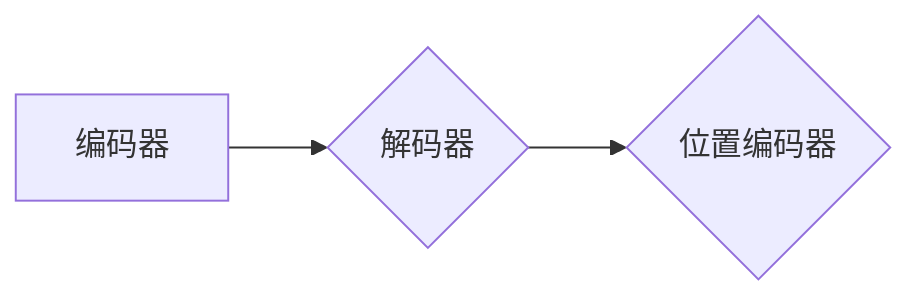

# Transformer大模型实战：命名实体识别任务

## 1.背景介绍

随着大数据和人工智能技术的飞速发展，自然语言处理（NLP）领域取得了显著的进展。其中，命名实体识别（Named Entity Recognition，NER）是NLP领域的一个重要任务，旨在从文本中识别出具有特定意义的实体，如人名、地名、组织名等。Transformer模型作为NLP领域的里程碑性技术，在NER任务中展现出卓越的性能。本文将深入探讨Transformer大模型在NER任务中的应用，并详细讲解其实战过程。

## 2.核心概念与联系

### 2.1 Transformer模型

Transformer模型是一种基于自注意力机制的深度神经网络模型，由Google团队在2017年提出。相较于传统的循环神经网络（RNN）和卷积神经网络（CNN），Transformer模型在处理序列数据时具有更高的并行性和计算效率。

### 2.2 命名实体识别

命名实体识别是指从文本中识别出具有特定意义的实体，如人名、地名、组织名等。NER任务在信息提取、文本分类、问答系统等领域具有广泛的应用。

### 2.3 Transformer模型与NER任务的关系

Transformer模型在NER任务中具有显著的优势，主要表现在以下几个方面：

- **自注意力机制**：Transformer模型通过自注意力机制，能够捕捉序列中各个词语之间的关系，从而更好地识别实体。
- **位置编码**：位置编码能够帮助模型理解词语在序列中的位置信息，有助于NER任务中实体的定位。
- **多头注意力**：多头注意力机制能够使模型在处理序列数据时，关注到更多的信息，提高识别准确率。

## 3.核心算法原理具体操作步骤

### 3.1 Transformer模型结构

Transformer模型主要由编码器、解码器和位置编码器组成。以下为其结构图：



### 3.2 编码器

编码器由多头自注意力机制、位置编码和前馈神经网络组成。以下是编码器的操作步骤：

1. **输入序列**：将输入序列转换为词向量。
2. **多头自注意力**：对词向量进行多头自注意力计算，捕捉序列中各个词语之间的关系。
3. **位置编码**：将位置编码添加到词向量中，使模型能够理解词语在序列中的位置信息。
4. **前馈神经网络**：对经过自注意力计算和位置编码的词向量进行前馈神经网络计算。

### 3.3 解码器

解码器与编码器类似，也由多头自注意力机制、位置编码和前馈神经网络组成。以下是解码器的操作步骤：

1. **输入序列**：将输入序列转换为词向量。
2. **解码器自注意力**：对词向量进行解码器自注意力计算，捕捉已生成词与未生成词之间的关系。
3. **编码器-解码器注意力**：将解码器自注意力计算结果与编码器的输出进行注意力计算，使解码器能够关注到编码器中的相关信息。
4. **位置编码**：将位置编码添加到词向量中，使模型能够理解词语在序列中的位置信息。
5. **前馈神经网络**：对经过解码器自注意力、编码器-解码器注意力和位置编码的词向量进行前馈神经网络计算。

### 3.4 位置编码

位置编码是指将词语在序列中的位置信息编码到词向量中。以下为位置编码的计算公式：

$$
PE_{(pos, 2i)} = \\sin{\\left(\\frac{pos}{10000^{2i/d_{model}}\\right)} \\\\
PE_{(pos, 2i+1)} = \\cos{\\left(\\frac{pos}{10000^{2i/d_{model}}}\\right)}
$$

其中，$ pos $ 表示位置信息，$ i $ 表示词向量的维度，$ d_{model} $ 表示模型的总维度。

## 4.数学模型和公式详细讲解举例说明

### 4.1 自注意力机制

自注意力机制是指将序列中的每个词语与其余词语进行加权求和，从而捕捉词语之间的关系。以下为自注意力机制的计算公式：

$$
Q = W_Q \\cdot X \\\\
K = W_K \\cdot X \\\\
V = W_V \\cdot X \\\\
A = \\frac{QK^T}{\\sqrt{d_k}} \\odot V
$$

其中，$ Q $、$ K $ 和 $ V $ 分别表示查询向量、键向量和值向量，$ X $ 表示输入序列，$ W_Q $、$ W_K $ 和 $ W_V $ 分别表示查询矩阵、键矩阵和值矩阵，$ \\odot $ 表示逐元素乘法，$ d_k $ 表示键向量的维度。

### 4.2 编码器-解码器注意力

编码器-解码器注意力是指解码器关注到编码器中的相关信息。以下为编码器-解码器注意力的计算公式：

$$
O = \\frac{(QW_K^T)W_V}{\\sqrt{d_k}} \\odot V
$$

其中，$ O $ 表示编码器-解码器注意力矩阵，$ Q $ 表示查询向量，$ W_K $ 和 $ W_V $ 分别表示键矩阵和值矩阵。

## 5.项目实践：代码实例和详细解释说明

以下是一个使用PyTorch框架实现的Transformer模型在NER任务中的代码实例：

```python
import torch
import torch.nn as nn

# 定义Transformer模型
class Transformer(nn.Module):
    def __init__(self, vocab_size, d_model, nhead, num_layers, dim_feedforward):
        super(Transformer, self).__init__()
        self.embedding = nn.Embedding(vocab_size, d_model)
        self.transformer_encoder = nn.TransformerEncoder(
            nn.TransformerEncoderLayer(d_model=d_model, nhead=nhead),
            num_layers=num_layers
        )
        self.fc = nn.Linear(d_model, vocab_size)

    def forward(self, src):
        src = self.embedding(src)
        output = self.transformer_encoder(src)
        output = self.fc(output)
        return output

# 初始化模型参数
vocab_size = 10000  # 词汇表大小
d_model = 512  # 词向量维度
nhead = 8  # 多头注意力层数
num_layers = 6  # 编码器层数
dim_feedforward = 2048  # 前馈神经网络隐藏层维度

model = Transformer(vocab_size, d_model, nhead, num_layers, dim_feedforward)

# 输入序列
src = torch.randint(0, vocab_size, (10, 32))  # 随机生成10个词的序列

# 前向传播
output = model(src)
print(output)
```

## 6.实际应用场景

Transformer模型在NER任务中具有广泛的应用场景，以下列举一些常见的应用：

- **新闻文本分类**：将新闻报道中的实体进行分类，如人物、地点、组织等。
- **问答系统**：识别用户提出的问题中的关键实体，从而实现更加智能的问答体验。
- **信息抽取**：从文本中提取关键信息，如人名、地名、组织名等。

## 7.工具和资源推荐

以下是一些在NER任务中常用的工具和资源：

- **PyTorch**：一个开源的深度学习框架，支持Transformer模型的实现。
- **Hugging Face Transformers**：一个提供预训练Transformer模型和预训练数据的库。
- **Conll 2003数据集**：一个用于NER任务的公共数据集。

## 8.总结：未来发展趋势与挑战

随着Transformer模型的不断发展和完善，未来NER任务将呈现出以下发展趋势：

- **更大规模的预训练模型**：更大规模的预训练模型将能够更好地捕捉语言特征，提高NER任务的识别准确率。
- **多任务学习**：结合其他NLP任务，如情感分析、机器翻译等，实现更加全面的文本理解。

同时，NER任务在未来的发展也面临以下挑战：

- **数据稀缺**：针对某些特定领域或任务，数据量较少，难以进行有效训练。
- **长距离依赖问题**：NER任务中存在长距离依赖问题，使得模型难以捕捉到词语之间的关系。

## 9.附录：常见问题与解答

### 9.1 如何处理长距离依赖问题？

针对长距离依赖问题，可以采用以下方法：

- **长序列模型**：使用长序列模型，如TransformerXLM，可以更好地捕捉长距离依赖关系。
- **注意力机制**：利用注意力机制，使模型关注到重要的词语关系。

### 9.2 如何提高NER任务的识别准确率？

以下是一些提高NER任务识别准确率的方法：

- **数据增强**：通过数据增强技术，如数据清洗、数据标注等，提高训练数据的数量和质量。
- **模型优化**：针对模型进行优化，如调整超参数、使用更好的激活函数等。
- **预训练模型**：使用预训练模型，如BERT、XLNet等，提高模型的泛化能力。

作者：禅与计算机程序设计艺术 / Zen and the Art of Computer Programming