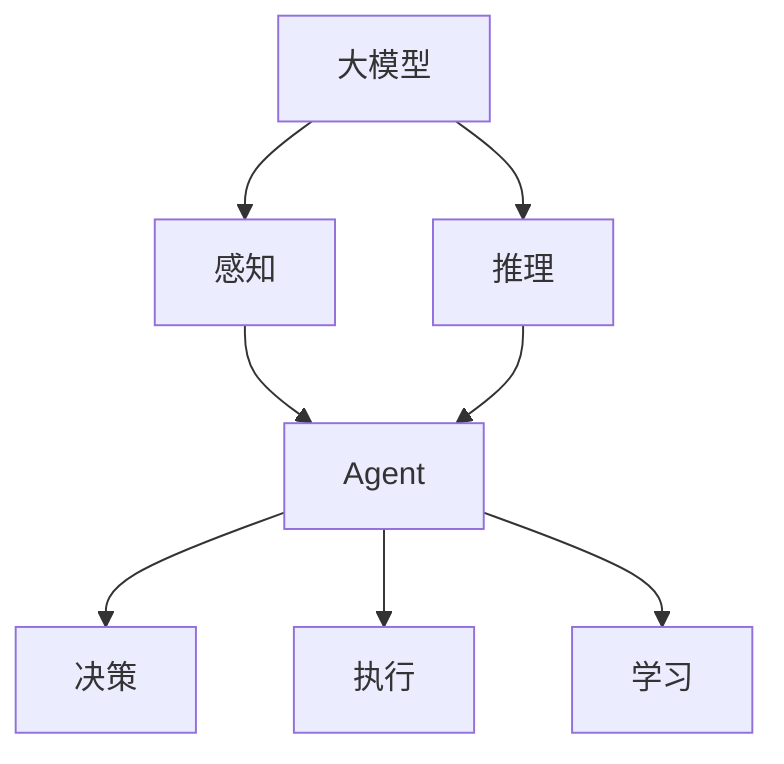
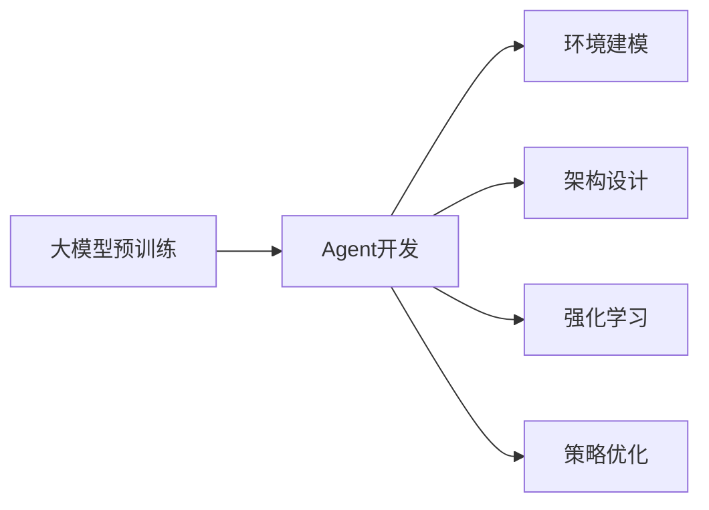

# 【大模型应用开发 动手做AI Agent】大模型就是Agent的大脑

## 1. 背景介绍
### 1.1 人工智能发展历程
#### 1.1.1 早期人工智能
#### 1.1.2 机器学习时代  
#### 1.1.3 深度学习时代
### 1.2 大模型的兴起
#### 1.2.1 大模型概念的提出
#### 1.2.2 大模型的发展现状
#### 1.2.3 大模型的应用前景
### 1.3 Agent的概念与发展
#### 1.3.1 Agent的定义
#### 1.3.2 Agent的发展历程
#### 1.3.3 Agent在人工智能中的地位

## 2. 核心概念与联系
### 2.1 大模型
#### 2.1.1 大模型的定义
大模型（Large Language Model，LLM）是一种基于深度学习的自然语言处理模型，通过在海量文本数据上进行预训练，学习语言的统计规律和语义表示，从而具备强大的语言理解和生成能力。与传统的自然语言处理模型相比，大模型的参数量更多，训练数据更加海量，因此能够捕捉更加细粒度和复杂的语言特征。

#### 2.1.2 大模型的特点
- 参数量巨大：动辄上亿、数十亿甚至上千亿的参数量，赋予了大模型强大的表达能力。
- 训练数据海量：在互联网规模的文本数据上进行预训练，学习语言的统计规律和语义表示。  
- 泛化能力强：可以适应各种不同的自然语言处理任务，展现出良好的泛化能力。
- 知识储备丰富：通过预训练吸收了海量文本数据中蕴含的知识，具备广泛的常识性知识。

#### 2.1.3 大模型的应用
- 自然语言理解：如文本分类、情感分析、命名实体识别等。
- 自然语言生成：如对话生成、文本摘要、写作助手等。
- 知识问答：回答开放领域的问题，展现出强大的知识储备和语言理解能力。
- 代码生成：根据自然语言描述生成对应的代码片段。

### 2.2 Agent
#### 2.2.1 Agent的定义
Agent是一种能够感知环境并做出自主行为的实体，其目标是最大化某种累积奖励或效用函数。在人工智能领域，Agent通常指代具备感知、推理、决策和执行能力的智能体，能够根据环境的反馈不断学习和优化自身的策略。

#### 2.2.2 Agent的组成要素
- 感知（Perception）：通过传感器接收环境中的信息，构建对世界的认知。
- 推理（Reasoning）：根据感知到的信息和已有知识，推断环境的状态和变化规律。
- 决策（Decision Making）：根据当前状态和目标，选择最优的行动策略。
- 执行（Execution）：根据决策结果采取相应的行动，对环境产生影响。
- 学习（Learning）：根据环境的反馈不断优化自身的感知、推理、决策和执行能力。

#### 2.2.3 Agent的分类
- 反应型Agent：根据当前感知做出决策，不考虑历史信息，如简单的反射式Agent。
- 模型型Agent：根据内部环境模型做出决策，能够预测和规划，如基于搜索和规划的Agent。
- 目标型Agent：根据预定义的目标函数做出决策，追求长期利益最大化，如强化学习Agent。
- 效用型Agent：根据效用函数评估状态和行为的价值，权衡不同目标，追求效用最大化。

### 2.3 大模型与Agent的关系
大模型为Agent的构建提供了重要的基础能力，尤其是在感知和推理层面。

在感知方面，大模型可以作为Agent的语言理解模块，将自然语言输入转化为结构化的语义表示，帮助Agent理解用户意图和环境信息。同时，大模型还可以作为知识库，为Agent提供丰富的背景知识，增强其认知和推理能力。

在推理方面，大模型可以作为Agent的核心大脑，基于海量知识和强大的语言理解能力，对环境信息进行分析和推断，预测环境的变化趋势，为决策提供依据。大模型还可以与其他推理引擎相结合，如因果推理、逻辑推理等，进一步增强Agent的推理能力。

总的来说，大模型为Agent的感知和推理赋能，使其能够更好地理解环境、积累知识、进行分析预测，是构建高级智能Agent的关键组件。大模型与Agent的结合，有望催生出更加智能、通用、强大的AI系统，在各个领域发挥重要作用。

## 3. 核心算法原理具体操作步骤
### 3.1 大模型的预训练
#### 3.1.1 数据准备
- 收集海量高质量的无标注文本数据，如网页、书籍、百科全书等。
- 对文本数据进行清洗和预处理，如去除HTML标签、特殊字符、重复内容等。
- 使用Tokenizer将文本转换为数值化的Token序列，常用的Tokenizer有BPE、WordPiece等。

#### 3.1.2 模型构建
- 选择合适的模型架构，如Transformer、GPT、BERT等。
- 根据任务需求和计算资源配置模型参数，如层数、隐藏单元数、注意力头数等。
- 初始化模型参数，常用的初始化方法有Xavier初始化、Kaiming初始化等。

#### 3.1.3 预训练任务设计
- 设计合适的预训练任务，如语言模型任务、Masked Language Model任务、Next Sentence Prediction任务等。
- 定义损失函数，如交叉熵损失、对比损失等。
- 选择合适的优化算法，如Adam、AdamW等。

#### 3.1.4 模型训练
- 将预处理后的文本数据按照预训练任务的要求进行组织和标注。
- 使用分布式训练框架（如TensorFlow、PyTorch）在多个GPU或TPU上并行训练模型。
- 监控训练过程中的损失函数、准确率等指标，根据需要调整超参数或终止训练。

### 3.2 基于大模型的Agent开发
#### 3.2.1 环境建模
- 定义Agent所处的环境，包括状态空间、动作空间、转移概率、奖励函数等。
- 选择合适的环境表示方法，如离散状态表示、连续状态表示等。
- 设计合理的奖励函数，引导Agent朝着期望的方向优化策略。

#### 3.2.2 Agent架构设计
- 选择合适的Agent架构，如基于价值函数的架构、基于策略梯度的架构、Actor-Critic架构等。
- 将预训练好的大模型嵌入到Agent架构中，作为其感知和推理模块。
- 设计Agent的决策模块，根据感知信息和推理结果生成动作。

#### 3.2.3 强化学习训练
- 使用强化学习算法训练Agent，如Q-Learning、SARSA、PPO等。
- 定义状态-动作值函数或策略函数，使用神经网络（如MLP、LSTM）进行参数化。
- 通过与环境的交互收集经验数据，并使用经验回放（Experience Replay）的方式进行训练。

#### 3.2.4 策略优化与迭代
- 评估Agent在环境中的表现，计算累积奖励、成功率等指标。
- 分析Agent的行为策略，发现可改进的地方，如探索与利用的平衡、稳定性、泛化能力等。
- 根据评估结果和分析，对Agent的架构、超参数进行调整和优化，不断迭代改进Agent的性能。

## 4. 数学模型和公式详细讲解举例说明
### 4.1 Transformer模型
Transformer是大模型常用的基础架构，其核心是自注意力机制（Self-Attention）和前馈神经网络（Feed-Forward Network）。

#### 4.1.1 自注意力机制
自注意力机制允许模型在处理当前词时关注输入序列中的任意位置，捕捉词与词之间的长距离依赖关系。给定输入序列$X=(x_1,x_2,...,x_n)$，自注意力的计算过程如下：

1. 将输入序列X通过三个线性变换得到Query矩阵Q、Key矩阵K和Value矩阵V：

$$
Q=XW^Q, K=XW^K, V=XW^V
$$

其中$W^Q, W^K, W^V$是可学习的参数矩阵。

2. 计算Query和Key的点积注意力分数，并除以$\sqrt{d_k}$（$d_k$为Key的维度）以缩放注意力分数：

$$
A=\text{softmax}(\frac{QK^T}{\sqrt{d_k}})
$$

3. 将注意力分数A与Value矩阵V相乘，得到加权求和的输出表示：

$$
\text{Attention}(Q,K,V)=AV
$$

通过自注意力机制，模型可以学习到输入序列中不同位置之间的相关性，捕捉全局的上下文信息。

#### 4.1.2 前馈神经网络
在自注意力之后，Transformer使用前馈神经网络对特征进行非线性变换，增强模型的表达能力。前馈神经网络由两个线性变换和一个ReLU激活函数组成：

$$
\text{FFN}(x)=\max(0, xW_1+b_1)W_2+b_2
$$

其中$W_1, b_1, W_2, b_2$是可学习的参数。

通过堆叠多个自注意力层和前馈神经网络层，Transformer能够建模复杂的语言特征和语义关系，成为大模型的基础架构。

### 4.2 强化学习算法
强化学习是一种通过与环境交互学习最优策略的机器学习范式，常用于训练智能Agent。以下介绍几种常见的强化学习算法。

#### 4.2.1 Q-Learning
Q-Learning是一种基于价值函数的无模型强化学习算法，通过迭代更新状态-动作值函数$Q(s,a)$来学习最优策略。给定状态$s$和动作$a$，Q函数的更新公式如下：

$$
Q(s,a)\leftarrow Q(s,a)+\alpha[r+\gamma\max_{a'}Q(s',a')-Q(s,a)]
$$

其中$\alpha$是学习率，$\gamma$是折扣因子，$r$是奖励，$s'$是下一个状态。

#### 4.2.2 SARSA
SARSA（State-Action-Reward-State-Action）与Q-Learning类似，也是基于价值函数的算法。不同之处在于，SARSA使用实际采取的下一个动作$a'$来更新Q函数，而不是使用最优动作：

$$
Q(s,a)\leftarrow Q(s,a)+\alpha[r+\gamma Q(s',a')-Q(s,a)]
$$

其中$a'$是在状态$s'$下根据当前策略选择的动作。

#### 4.2.3 策略梯度
策略梯度是一类直接优化策略函数$\pi_\theta(a|s)$的强化学习算法，其中$\theta$是策略函数的参数。策略梯度的目标是最大化期望累积奖励：

$$
J(\theta)=\mathbb{E}_{\tau\sim p_\theta(\tau)}[R(\tau)]
$$

其中$\tau$是一条轨迹（状态-动作序列），$p_\theta(\tau)$是在策略$\pi_\theta$下生成轨迹$\tau$的概率，$R(\tau)$是轨迹的累积奖励。

策略梯度通过梯度上升来更新策略函数的参数：

$$
\theta\leftarrow\theta+\alpha\nabla_\theta J(\theta)
$$

其中$\nabla_\theta J(\theta)$是目标函数对参数$\theta$的梯度。

常见的策略梯度算法包括REINFORCE、Actor-Critic等。

通过数学模型和优化算法，强化学习为训练