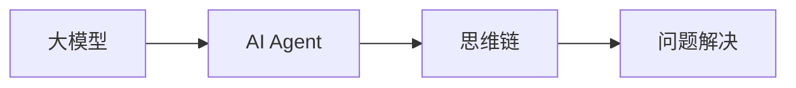
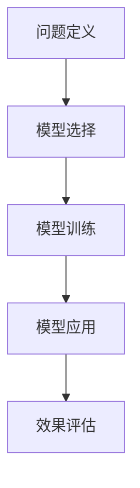

## 1.背景介绍

在人工智能的发展历程中，大模型的应用开发已经成为了一个重要的研究方向。大模型，如GPT-3、BERT等，通过大量数据训练，能够实现更加准确和灵活的任务处理。然而，如何有效地利用这些大模型，将其应用到实际的问题解决中，成为了一个值得探讨的问题。本文将以“动手做AI Agent”为主题，探讨大模型的应用开发的思维链。

## 2.核心概念与联系

在讨论大模型的应用开发之前，我们首先需要理解几个核心的概念：

- **大模型**：大模型通常指的是参数数量巨大的深度学习模型，如GPT-3、BERT等。这些模型通过大量数据训练，能够学习到丰富的知识和规律。

- **AI Agent**：AI Agent是一种能够感知环境并采取行动以达成目标的实体。在大模型的应用开发中，我们的目标就是构建一个能够有效利用大模型的AI Agent。

- **思维链**：思维链是指解决问题的思考过程。在大模型的应用开发中，我们需要构建一个清晰的思维链，以指导我们如何利用大模型解决问题。

这三个概念之间的联系是：我们通过构建思维链，指导AI Agent如何有效利用大模型，以解决实际问题。



## 3.核心算法原理具体操作步骤

在大模型的应用开发中，我们需要遵循一定的操作步骤，以确保AI Agent能够有效利用大模型。以下是一个基本的操作步骤：

1. **问题定义**：首先，我们需要明确我们要解决的问题是什么。这一步是整个应用开发过程的基础。

2. **模型选择**：根据问题的特性，我们选择合适的大模型。例如，对于自然语言处理的问题，我们可以选择GPT-3或BERT。

3. **模型训练**：我们利用大量数据对大模型进行训练。这一步是构建AI Agent的关键，因为只有通过训练，AI Agent才能学习到如何解决问题。

4. **模型应用**：训练完成后，我们将大模型应用到实际问题中。这一步需要我们构建一个清晰的思维链，指导AI Agent如何利用大模型。

5. **效果评估**：最后，我们需要评估AI Agent的效果。这一步可以帮助我们了解AI Agent的表现，以便于我们进行进一步优化。



## 4.数学模型和公式详细讲解举例说明

在大模型的训练过程中，我们通常会使用到一些数学模型和公式。以下是一个简单的例子：

假设我们的大模型是一个深度神经网络，其参数为$\theta$。我们的目标是找到一组参数$\theta^*$，使得在训练集上的损失函数$J(\theta)$最小。这可以表示为以下的优化问题：

$$
\theta^* = \arg\min_{\theta} J(\theta)
$$

其中，$J(\theta)$通常是一个非凸函数，我们需要使用梯度下降法等优化算法来求解。

## 5.项目实践：代码实例和详细解释说明

在实际的项目实践中，我们可以使用Python等编程语言，结合深度学习框架，如TensorFlow或PyTorch，来实现大模型的应用开发。以下是一个简单的例子：

```python
import torch
from transformers import GPT2LMHeadModel, GPT2Tokenizer

tokenizer = GPT2Tokenizer.from_pretrained("gpt2")
model = GPT2LMHeadModel.from_pretrained("gpt2")

input_text = "Hello, world!"
input_ids = tokenizer.encode(input_text, return_tensors="pt")

output = model.generate(input_ids, max_length=50, num_return_sequences=5)

for i, output_ids in enumerate(output):
    print(f"Generated text {i+1}: {tokenizer.decode(output_ids)}")
```

这段代码首先加载了预训练的GPT-2模型和对应的分词器。然后，它将输入文本转换为模型可以接受的格式，最后利用模型生成了5个续写结果。

## 6.实际应用场景

大模型的应用开发可以广泛应用于各种场景，例如：

- **自然语言处理**：大模型可以用于文本分类、情感分析、文本生成等任务。

- **图像处理**：大模型可以用于图像分类、物体检测、图像生成等任务。

- **推荐系统**：大模型可以用于用户行为预测，帮助构建更精准的推荐系统。

## 7.工具和资源推荐

在大模型的应用开发中，以下工具和资源可能会有所帮助：

- **深度学习框架**：如TensorFlow、PyTorch等。

- **预训练模型库**：如Hugging Face的Transformers库。

- **计算资源**：如Google的Colab，提供免费的GPU资源。

## 8.总结：未来发展趋势与挑战

随着人工智能的发展，大模型的应用开发将会越来越重要。然而，这也带来了一些挑战，例如模型的解释性、训练的资源消耗等。我们需要不断探索，以解决这些挑战，推动大模型的应用开发向前发展。

## 9.附录：常见问题与解答

1. **问**：大模型的训练需要多少数据？
   
   **答**：这取决于模型的复杂度和任务的难度。一般来说，大模型需要大量的数据进行训练。

2. **问**：如何评估AI Agent的效果？
   
   **答**：这取决于具体的任务。一般来说，我们可以通过准确率、召回率等指标来评估AI Agent的效果。

作者：禅与计算机程序设计艺术 / Zen and the Art of Computer Programming