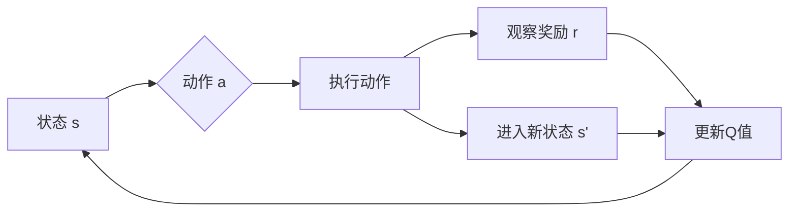

# 一切皆是映射：AI Q-learning在网络安全中的实践

## 1. 背景介绍
### 1.1 网络安全面临的挑战
#### 1.1.1 攻击手段日益复杂化
#### 1.1.2 传统防御方法难以应对
#### 1.1.3 AI技术在网安领域大有可为

### 1.2 强化学习与Q-learning
#### 1.2.1 强化学习的定义与特点  
#### 1.2.2 Q-learning算法原理
#### 1.2.3 Q-learning的优势

### 1.3 Q-learning在网络安全中的应用前景
#### 1.3.1 智能化入侵检测
#### 1.3.2 自适应安全策略
#### 1.3.3 对抗性攻防对弈

## 2. 核心概念与联系
### 2.1 MDP与Q-learning
#### 2.1.1 马尔可夫决策过程(MDP)
#### 2.1.2 MDP与Q-learning的关系
#### 2.1.3 Q-learning求解MDP

### 2.2 Q-learning中的关键概念
#### 2.2.1 状态(State)
#### 2.2.2 动作(Action)
#### 2.2.3 奖励(Reward)
#### 2.2.4 Q值(Q-Value)
#### 2.2.5 策略(Policy)

### 2.3 Q-learning在网安场景下的映射
#### 2.3.1 状态映射
#### 2.3.2 动作映射 
#### 2.3.3 奖励函数设计

## 3. 核心算法原理与操作步骤
### 3.1 Q-learning算法流程
#### 3.1.1 初始化Q表
#### 3.1.2 状态-动作选择
#### 3.1.3 执行动作并观察奖励
#### 3.1.4 更新Q值
#### 3.1.5 重复迭代直至收敛

### 3.2 Q-learning的改进与变种
#### 3.2.1 Double Q-learning
#### 3.2.2 Dueling Q-network
#### 3.2.3 Deep Q-learning(DQN)

### 3.3 Q-learning算法的伪代码

## 4. 数学模型与公式详解
### 4.1 MDP的数学定义
#### 4.1.1 状态转移概率矩阵
#### 4.1.2 奖励函数
#### 4.1.3 折扣因子

### 4.2 Bellman最优方程
#### 4.2.1 状态值函数
#### 4.2.2 动作值函数(Q函数)
#### 4.2.3 Bellman最优方程的矩阵形式

### 4.3 Q-learning的数学推导
#### 4.3.1 Q值更新公式
$$Q(s_t,a_t) \leftarrow Q(s_t,a_t)+\alpha[r_{t+1}+\gamma \max _{a}Q(s_{t+1},a)-Q(s_t,a_t)]$$
#### 4.3.2 收敛性证明
#### 4.3.3 Q-learning的优化目标函数

## 5. 项目实践：代码实例与详解
### 5.1 基于OpenAI Gym的Q-learning实现
#### 5.1.1 环境构建
#### 5.1.2 Q表初始化
#### 5.1.3 训练循环
#### 5.1.4 测试评估

### 5.2 DQN在网络入侵检测中的应用
#### 5.2.1 数据集预处理
#### 5.2.2 DQN模型构建
#### 5.2.3 训练过程与结果分析
#### 5.2.4 与传统方法对比

### 5.3 Q-learning在网络攻防博弈中的实践
#### 5.3.1 攻防场景构建 
#### 5.3.2 多智能体Q-learning框架
#### 5.3.3 实验结果与分析

## 6. 实际应用场景
### 6.1 智能化防火墙
#### 6.1.1 自适应策略生成
#### 6.1.2 异常行为检测

### 6.2 网络威胁情报分析
#### 6.2.1 恶意域名检测
#### 6.2.2 APT攻击溯源

### 6.3 工控系统安全防护
#### 6.3.1 设备异常检测
#### 6.3.2 攻击预警与响应

## 7. 工具与资源推荐
### 7.1 强化学习平台
#### 7.1.1 OpenAI Gym
#### 7.1.2 DeepMind Lab
#### 7.1.3 Unity ML-Agents

### 7.2 主流深度强化学习框架
#### 7.2.1 TensorFlow
#### 7.2.2 PyTorch
#### 7.2.3 Keras-RL

### 7.3 网络安全数据集
#### 7.3.1 KDD99
#### 7.3.2 NSL-KDD 
#### 7.3.3 UNSW-NB15
#### 7.3.4 CICIDS2017

## 8. 总结：未来发展与挑战
### 8.1 Q-learning在网安领域的优势
#### 8.1.1 自适应与智能化
#### 8.1.2 策略优化与博弈能力
#### 8.1.3 可解释性与可视化

### 8.2 面临的挑战
#### 8.2.1 算法稳定性与鲁棒性
#### 8.2.2 样本效率与训练成本
#### 8.2.3 安全与隐私问题

### 8.3 未来研究方向
#### 8.3.1 多智能体协同
#### 8.3.2 迁移学习与元学习
#### 8.3.3 人机交互式学习

## 9. 附录：常见问题解答
### 9.1 Q-learning能否处理连续状态空间？
### 9.2 Q-learning收敛速度慢如何优化？
### 9.3 如何设计奖励函数以加速训练？
### 9.4 Q-learning能否应用于在线学习？
### 9.5 Q-learning与深度学习结合有哪些改进？

Q-learning算法作为一种强化学习方法，通过不断试错和环境交互，学习最优策略以完成给定任务。在网络安全领域，我们可以将各种攻防场景抽象为马尔可夫决策过程(MDP)，利用Q-learning寻找最佳的防御策略。

首先，我们需要明确MDP的核心要素，包括状态、动作、转移概率和奖励函数。以入侵检测为例，状态可以是系统的当前安全状态，动作可以是各种防御措施，奖励函数则根据采取动作后系统安全性的提升或损失来设计。Q-learning的目标是学习一个最优的状态-动作值函数(Q函数)，使得在每个状态下选择Q值最大的动作，就能获得长期累积奖励的最大化。

Q-learning的核心是价值迭代，通过不断更新Q表来逼近最优Q函数。Q值更新公式如下：

$$Q(s_t,a_t) \leftarrow Q(s_t,a_t)+\alpha[r_{t+1}+\gamma \max _{a}Q(s_{t+1},a)-Q(s_t,a_t)]$$

其中，$s_t$和$a_t$分别表示当前状态和动作，$r_{t+1}$为执行动作后获得的即时奖励，$\alpha$为学习率，$\gamma$为折扣因子。该公式的直观解释是，Q值应该等于即时奖励与下一状态最大Q值的折扣和。通过反复迭代，Q表最终收敛于最优值函数。

在实践中，我们通常将Q-learning与深度学习相结合，用深度神经网络拟合Q函数，以处理高维状态空间。以DQN在入侵检测中的应用为例，首先对原始网络流量数据进行预处理，提取出特征向量作为状态表示。然后搭建DQN模型，输入状态输出各种防御动作的Q值。在训练过程中，采用经验回放和目标网络等技巧，提升样本利用效率和训练稳定性。模型训练完成后，就可以实时检测流量并根据Q值选择最优防御策略。

除了入侵检测，Q-learning还可以应用于智能化防火墙、威胁情报分析、工控安全等场景。例如在防火墙中，可以根据网络环境和攻击特征动态调整访问控制策略；在威胁情报分析中，可以建立多维度的威胁指标，通过Q-learning发现潜在的关联性和攻击链路；在工控系统中，可以将各种设备参数和异常事件作为状态表示，通过Q-learning学习最佳的异常检测和安全防护策略。

尽管Q-learning在网安领域已经展现出广阔的应用前景，但仍然面临不少挑战。首先是算法本身的局限性，如难以处理非平稳环境、样本效率低下、探索与利用难以平衡等；其次是网络安全场景的特殊性，攻防环境复杂多变，状态和行为空间极大，奖励函数难以设计。此外，强化学习的安全性和可解释性也备受质疑，这对于安全关键领域而言尤为重要。

未来，Q-learning在网安领域的研究方向包括多智能体协同、迁移学习、人机交互等。通过多个智能体的分工与合作，可以实现更全面的安全防护；利用迁移学习，可以将一个场景学到的知识迁移到相似场景，加速学习进程；引入人机交互，可以充分发挥人的领域知识和AI的计算能力，实现更智能、更可控的网络安全。

总之，Q-learning是AI赋能网络安全的一把利器。将其与专家知识、数据分析等方法相结合，必将进一步拓展网络安全的研究边界，为建设智能、动态、自适应的安全防御体系贡献力量。让我们携手探索Q-learning在网安领域的更多可能，共同守护网络世界的和谐安全。

作者：禅与计算机程序设计艺术 / Zen and the Art of Computer Programming