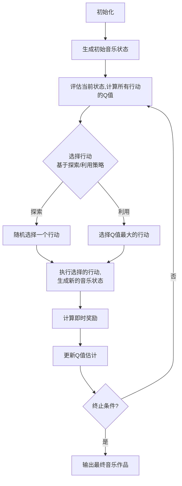

# 一切皆是映射：AI Q-learning在音乐制作中的应用

## 1. 背景介绍

### 1.1 音乐创作的挑战

音乐创作是一个富有挑战性的过程,需要将抽象的情感和想法转化为具体的音符、和弦、节奏等音乐元素。传统的音乐创作方式往往依赖于作曲家的天赋、经验和直觉,这使得创作过程充满了不确定性和主观性。随着人工智能技术的不断发展,越来越多的作曲家开始探索利用人工智能算法来辅助或自动化音乐创作过程。

### 1.2 强化学习在音乐创作中的应用

强化学习(Reinforcement Learning)是机器学习的一个重要分支,它通过与环境的互动来学习如何采取最优策略以最大化预期回报。近年来,强化学习在音乐创作领域展现出了巨大的潜力。其中,Q-learning是一种常用的强化学习算法,它可以帮助智能体学习在给定状态下采取何种行动才能获得最大的长期回报。

### 1.3 Q-learning在音乐创作中的优势

将Q-learning应用于音乐创作,可以将音乐元素(如音符、和弦、节奏等)视为智能体的行为,而音乐结构和规则则构成了环境。通过设计合理的奖励函数,Q-learning算法可以学习到如何组合音乐元素以创作出令人赏心悦目的音乐作品。相比传统的音乐创作方式,Q-learning带来了以下优势:

1. 客观性:Q-learning算法基于数学模型和规则,能够客观地评估音乐质量,减少主观偏差。
2. 探索性:Q-learning可以探索更多的音乐可能性,有助于发现新颖的音乐风格和表达方式。
3. 可解释性:Q-learning的决策过程可以被解释和分析,有助于理解音乐创作的本质。
4. 高效性:一旦训练完成,Q-learning可以快速生成大量的音乐作品,提高了创作效率。

## 2. 核心概念与联系

### 2.1 Q-learning算法

Q-learning是一种基于时间差分(Temporal Difference)的强化学习算法,它通过不断尝试和学习来估计在给定状态下采取某个行动的长期回报值(Q值)。Q-learning算法的核心思想是:智能体通过与环境交互,不断更新Q值估计,直到收敛到最优策略。

Q-learning算法的基本流程如下:

1. 初始化Q值表格,所有Q值初始化为0或随机值。
2. 对于每个时间步:
   a. 根据当前状态,选择一个行动(基于探索/利用策略)。
   b. 执行选择的行动,观察到新的状态和即时奖励。
   c. 根据新状态和奖励,更新相应的Q值估计。
3. 重复步骤2,直到Q值收敛或达到终止条件。

Q-learning算法的数学表达式如下:

$$Q(s_t, a_t) \leftarrow Q(s_t, a_t) + \alpha \big[r_t + \gamma \max_a Q(s_{t+1}, a) - Q(s_t, a_t)\big]$$

其中:
- $Q(s_t, a_t)$表示在状态$s_t$下采取行动$a_t$的Q值估计
- $\alpha$是学习率,控制新信息对Q值估计的影响程度
- $r_t$是在时间步$t$获得的即时奖励
- $\gamma$是折现因子,控制未来奖励对当前Q值估计的影响程度
- $\max_a Q(s_{t+1}, a)$是在新状态$s_{t+1}$下所有可能行动的最大Q值估计

### 2.2 音乐与Q-learning的映射

将Q-learning应用于音乐创作,需要将音乐元素映射为强化学习中的状态、行动和奖励:

- **状态(State)**: 描述当前音乐的状态,可以包括已生成的音符序列、和弦进行、节奏型等信息。
- **行动(Action)**: 表示智能体可以采取的行动,如添加新的音符、改变和弦、调整节奏等。
- **奖励(Reward)**: 定义了音乐质量的评价标准,可以是音乐理论规则、人工标注的分数,或者基于人类偏好学习的奖励模型。

通过合理设计状态、行动和奖励的映射关系,Q-learning算法就可以学习到如何组合音乐元素以创作出高质量的音乐作品。

### 2.3 探索与利用策略

在Q-learning算法中,探索与利用策略(Exploration-Exploitation Trade-off)是一个关键问题。探索是指尝试新的行动以发现潜在的更优策略,而利用是指基于当前已学习的Q值估计选择最优行动。过多探索可能导致浪费时间,而过多利用则可能陷入局部最优解。

常用的探索与利用策略包括:

1. $\epsilon$-贪婪策略($\epsilon$-greedy):以$\epsilon$的概率随机选择行动(探索),以$1-\epsilon$的概率选择当前Q值最大的行动(利用)。
2. 软max策略(Softmax):根据Q值的softmax分布选择行动,Q值越大的行动被选择的概率越高。
3. 上限置信区间策略(Upper Confidence Bound):结合Q值估计和置信区间,选择潜在回报最高的行动。

合理设计探索与利用策略,可以在探索新的音乐可能性和利用已学习的知识之间取得平衡,从而提高Q-learning在音乐创作中的效果。

## 3. 核心算法原理具体操作步骤

### 3.1 Q-learning算法在音乐创作中的应用流程

将Q-learning算法应用于音乐创作,其基本流程如下:

上述流程的具体步骤如下:

1. **初始化**: 初始化Q值表格,所有Q值初始化为0或随机值。定义状态、行动和奖励的映射关系。
2. **生成初始音乐状态**: 根据音乐创作的需求,生成一个初始的音乐状态,如空白乐谱或种子音乐片段。
3. **评估当前状态,计算所有行动的Q值**: 对于当前音乐状态,计算所有可能行动(如添加音符、改变和弦等)的Q值估计。
4. **选择行动**: 根据探索/利用策略,选择一个行动。可以是随机选择一个行动(探索),或者选择当前Q值最大的行动(利用)。
5. **执行选择的行动,生成新的音乐状态**: 执行选择的行动,生成新的音乐状态。
6. **计算即时奖励**: 根据奖励函数,计算执行该行动后获得的即时奖励。
7. **更新Q值估计**: 根据Q-learning算法的更新规则,更新相应的Q值估计。
8. **终止条件判断**: 判断是否达到终止条件,如最大迭代次数、Q值收敛或满足音乐创作的要求。如果满足终止条件,则输出最终的音乐作品;否则,返回步骤3,继续迭代。

通过不断地与音乐环境交互、学习和更新Q值估计,Q-learning算法最终可以converge到一个近似最优的策略,生成高质量的音乐作品。

### 3.2 Q-learning算法的关键要素

实现Q-learning算法在音乐创作中的应用,需要注意以下几个关键要素:

1. **状态表示**: 合理定义音乐状态的表示方式,包括已生成的音符序列、和弦进行、节奏型等信息,以及如何将这些信息编码为算法可处理的形式。
2. **行动空间**: 确定智能体可以采取的行动集合,如添加音符、改变和弦、调整节奏等,并将其映射为算法可识别的形式。
3. **奖励函数**: 设计合理的奖励函数,用于评估音乐质量。奖励函数可以基于音乐理论规则、人工标注分数,或者利用监督学习训练出的奖励模型。
4. **探索/利用策略**: 选择合适的探索/利用策略,在探索新的音乐可能性和利用已学习的知识之间取得平衡。
5. **超参数调优**: 调整Q-learning算法的超参数,如学习率、折现因子等,以提高算法的收敛速度和性能。
6. **终止条件**: 设置合理的终止条件,如最大迭代次数、Q值收敛阈值或满足音乐创作的特定要求。

通过对上述要素的合理设计和调优,可以提高Q-learning算法在音乐创作中的效果和质量。

## 4. 数学模型和公式详细讲解举例说明

### 4.1 Q-learning算法的数学模型

Q-learning算法的核心是通过不断更新Q值估计,最终converge到一个近似最优的策略。Q值的更新规则如下:

$$Q(s_t, a_t) \leftarrow Q(s_t, a_t) + \alpha \big[r_t + \gamma \max_a Q(s_{t+1}, a) - Q(s_t, a_t)\big]$$

其中:

- $Q(s_t, a_t)$表示在状态$s_t$下采取行动$a_t$的Q值估计。
- $\alpha$是学习率,控制新信息对Q值估计的影响程度,通常取值范围为$(0, 1]$。
- $r_t$是在时间步$t$获得的即时奖励。
- $\gamma$是折现因子,控制未来奖励对当前Q值估计的影响程度,通常取值范围为$[0, 1)$。
- $\max_a Q(s_{t+1}, a)$是在新状态$s_{t+1}$下所有可能行动的最大Q值估计,表示在新状态下可获得的最大预期未来回报。

该更新规则可以分解为两部分:

1. $r_t$表示执行行动$a_t$后获得的即时奖励。
2. $\gamma \max_a Q(s_{t+1}, a)$表示在新状态$s_{t+1}$下,按照最优策略可获得的预期未来回报的折现值。

通过不断更新Q值估计,Q-learning算法逐步学习到在每个状态下采取何种行动可以获得最大的长期回报,从而converge到一个近似最优的策略。

### 4.2 Q-learning算法在音乐创作中的数学模型

将Q-learning算法应用于音乐创作,需要将音乐元素映射为状态、行动和奖励。假设我们将音乐状态表示为一个长度为$n$的音符序列$s_t = (x_1, x_2, \dots, x_n)$,其中$x_i$表示第$i$个音符。行动空间包括添加新音符、改变和弦、调整节奏等操作,记为$\mathcal{A}$。奖励函数$R(s_t, a_t)$用于评估在状态$s_t$下执行行动$a_t$后的音乐质量。

在这种设置下,Q-learning算法的更新规则可以表示为:

$$Q(s_t, a_t) \leftarrow Q(s_t, a_t) + \alpha \big[R(s_t, a_t) + \gamma \max_{a \in \mathcal{A}} Q(s_{t+1}, a) - Q(s_t, a_t)\big]$$

其中:

- $s_t$是当前的音乐状态,表示为一个音符序列。
- $a_t$是在状态$s_t$下执行的行动,如添加新音符、改变和弦等。
- $R(s_t, a_t)$是奖励函数,用于评估执行行动$a_t$后的音乐质量。
- $s_{t+1}$是执行行动$a_t$后生成的新的音乐状态。
- $\max_{a \in \mathcal{A}} Q(