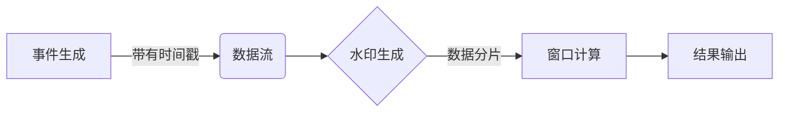

# 事件时间 原理与代码实例讲解

## 1. 背景介绍
在现代软件开发中，事件时间（Event Time）是一个核心概念，尤其在处理实时数据流和复杂事件处理（Complex Event Processing, CEP）时，它扮演着至关重要的角色。事件时间是指事件实际发生的时间，与系统处理该事件的时间（处理时间）可能不同。理解和正确处理事件时间对于保证数据处理的准确性和效率至关重要。

## 2. 核心概念与联系
事件时间与处理时间的区别是数据流处理领域的基石。事件时间是数据生成的时间戳，而处理时间是数据被处理系统观察到的时间。这两者的不一致性可能导致数据乱序、延迟处理等问题。理解这两种时间的概念及其联系，是设计高效数据处理系统的前提。

## 3. 核心算法原理具体操作步骤
事件时间处理的核心算法包括水印（Watermarks）生成和窗口（Windowing）计算。水印是一种机制，用于指示在某个时间点之前的所有数据都已经到达，这样就可以处理这些数据。窗口则是将数据分割成可管理的片段进行处理的方法。



## 4. 数学模型和公式详细讲解举例说明
事件时间处理的数学模型涉及到时间戳的生成和水印的计算。例如，水印可以使用以下公式计算：

$$ W(t) = min\{T(e) | e \in E, T(e) > t\} - \delta $$

其中，$W(t)$ 是在处理时间 $t$ 的水印，$T(e)$ 是事件 $e$ 的时间戳，$E$ 是事件集合，$\delta$ 是延迟容忍度。通过调整 $\delta$，可以控制系统对乱序事件的容忍程度。

## 5. 项目实践：代码实例和详细解释说明
以Apache Flink为例，以下是一个处理事件时间的代码片段：

```java
DataStream<Event> stream = ... // 输入数据流
stream
    .assignTimestampsAndWatermarks(
        WatermarkStrategy
            .<Event>forBoundedOutOfOrderness(Duration.ofSeconds(5))
            .withTimestampAssigner((event, timestamp) -> event.getTimestamp())
    )
    .window(TumblingEventTimeWindows.of(Time.seconds(10)))
    .aggregate(new AggregateFunction<...>)
    .sinkTo(...); // 输出
```

这段代码首先为数据流分配时间戳和水印，允许最多5秒的乱序。然后，它定义了一个每10秒滚动的时间窗口，并对窗口内的数据进行聚合处理。

## 6. 实际应用场景
事件时间处理在多个领域都有广泛应用，如金融市场分析、物联网数据处理、实时广告投放等。在这些场景中，准确的时间处理能够保证数据分析的准确性和实时性。

## 7. 工具和资源推荐
除了Apache Flink，还有如Apache Kafka Streams、Google Cloud Dataflow等工具也支持事件时间处理。这些工具提供了丰富的文档和社区支持，可以帮助开发者更好地实现事件时间处理。

## 8. 总结：未来发展趋势与挑战
事件时间处理技术正在不断进步，未来的发展趋势包括更高的处理效率、更强的容错能力和更智能的水印策略。同时，随着数据量的增加和处理需求的提高，如何在保证准确性的同时提高系统的扩展性和性能，将是一个持续的挑战。

## 9. 附录：常见问题与解答
Q1: 事件时间和处理时间的不一致性会导致哪些问题？
A1: 可能导致数据乱序、延迟处理、结果不准确等问题。

Q2: 如何处理乱序到达的事件？
A2: 可以通过引入水印机制和适当的窗口计算策略来处理乱序事件。

Q3: 水印的延迟容忍度应该如何设置？
A3: 延迟容忍度的设置取决于具体应用场景和数据特性，需要根据实际情况进行调整。

作者：禅与计算机程序设计艺术 / Zen and the Art of Computer Programming