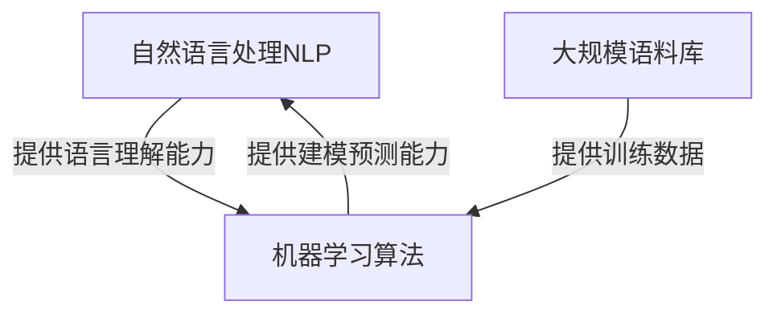

# 互联网技术架构中的自然语言处理与机器学习

## 1.背景介绍

### 1.1 互联网技术的发展

随着互联网技术的不断发展,网络应用程序和在线服务已经无处不在,深深融入到我们的日常生活中。无论是搜索引擎、社交媒体、电子商务网站,还是智能助手和聊天机器人,它们都离不开自然语言处理(NLP)和机器学习(ML)技术的支持。

自然语言处理旨在使计算机能够理解和处理人类语言,而机器学习则是使计算机能够从数据中自动学习和提高性能。两者的结合为互联网技术架构带来了革命性的变化,使得人机交互更加自然、智能,并能够提供更加个性化和高效的服务。

### 1.2 NLP和ML在互联网中的应用

在互联网技术架构中,自然语言处理和机器学习的应用广泛且日益增长。以下是一些典型的应用场景:

- 搜索引擎:通过NLP技术理解用户查询意图,结合ML算法对网页内容进行排名,为用户提供更加相关的搜索结果。
- 社交媒体:利用NLP分析用户发布的内容,ML算法个性化推荐感兴趣的信息。
- 电子商务:NLP技术帮助理解用户需求,ML算法为用户推荐个性化的商品。
- 智能助手和聊天机器人:NLP技术实现人机对话交互,ML算法持续优化对话质量。
- 内容审核:NLP结合ML算法对文本、图像、视频等内容进行审核,识别不当内容。
- 广告投放:NLP和ML算法根据用户画像和行为数据,精准投放个性化广告。

## 2.核心概念与联系 

### 2.1 自然语言处理(NLP)

自然语言处理(Natural Language Processing, NLP)是一门研究计算机处理人类语言的技术,旨在使计算机能够"理解"和"生成"自然语言。NLP技术包括以下几个主要任务:

- 语音识别(Speech Recognition):将语音信号转换为文本。
- 语义分析(Semantic Analysis):理解语句的含义和上下文关系。
- 自然语言生成(Natural Language Generation):根据某些输入,生成自然语言文本。
- 机器翻译(Machine Translation):将一种语言翻译成另一种语言。
- 问答系统(Question Answering):回答人类提出的自然语言问题。

NLP技术通过语言模型、语义分析、知识图谱等方法,赋予计算机理解和生成自然语言的能力,是实现人机自然交互的关键。

### 2.2 机器学习(ML)

机器学习(Machine Learning, ML)是一门研究如何构建能从数据中自动分析获得规律,并利用规律对未知数据进行预测的算法理论。机器学习算法主要分为以下几类:

- 监督学习(Supervised Learning):从标注好的训练数据中学习,用于分类和回归任务。
- 无监督学习(Unsupervised Learning):从未标注的数据中自动发现数据内在的模式和规律。
- 强化学习(Reinforcement Learning):通过与环境的交互,学习如何选择能获得最大回报的行为策略。
- 深度学习(Deep Learning):基于神经网络模型,对输入数据进行自动特征提取和模式识别。

机器学习算法能够从大量数据中自动发现规律和模式,并对未知数据进行预测,是实现智能系统的核心技术。

### 2.3 NLP与ML的关系

自然语言处理和机器学习在互联网技术架构中存在紧密的联系:

- NLP任务通常需要机器学习算法从大量语料库中学习语言模型、知识库等,提高语义理解和生成能力。
- 机器学习算法需要NLP技术对非结构化的自然语言数据进行预处理,提取特征,转换为算法可以处理的形式。
- 许多NLP任务可以转化为机器学习中的分类、序列标注等问题,通过训练模型来完成。
- 深度学习作为机器学习的一个分支,在NLP领域取得了突破性进展,如Transformer模型在机器翻译等任务中的卓越表现。

总的来说,NLP为机器学习算法提供了处理自然语言数据的能力,而机器学习算法为NLP任务提供了强大的建模和预测能力,两者相互促进、相辅相成。

## 3.核心算法原理具体操作步骤

### 3.1 语言模型

语言模型是NLP中一个重要的基础模块,旨在捕捉语言的统计规律。给定一个文本序列,语言模型的目标是估计该序列的概率,即:

$$P(w_1, w_2, ..., w_n) = \prod_{i=1}^n P(w_i|w_1, ..., w_{i-1})$$

其中$w_i$表示序列中的第i个词。由于直接估计上式是非常困难的,通常采用N-gram模型,利用有限的历史信息来近似估计:

$$P(w_i|w_1, ..., w_{i-1}) \approx P(w_i|w_{i-N+1}, ..., w_{i-1})$$

这里N是N-gram的长度,通常取2(双gram)或3(三gram)。

语言模型可以通过统计大量语料库中的词频和共现概率来训练得到。训练步骤如下:

1. **语料预处理**:对训练语料进行分词、去除停用词等预处理。
2. **构建词典**:统计语料中出现的所有词,构建词典。
3. **计算N-gram概率**:遍历语料,统计N-gram词序列及其出现次数,根据次数计算概率估计。
4. **平滑处理**:由于数据稀疏,对概率估计进行平滑处理,避免概率值为0。
5. **模型评估**:在开发/测试集上评估模型的困惑度(Perplexity)等指标。

训练得到的语言模型可用于多种NLP任务,如机器翻译、语音识别、文本生成等,为这些任务提供语言的先验知识。

### 3.2 词向量

词向量(Word Embedding)是将词映射到连续的向量空间中的一种技术,使语义相似的词在向量空间中彼此靠近。它是深度学习在NLP领域取得突破性进展的重要基础。

常见的词向量训练方法有Word2Vec、GloVe等,以Word2Vec的CBOW模型为例,其原理和训练步骤如下:

1. **模型输入**:给定一个中心词$w_t$及其上下文窗口$[w_{t-c},...,w_{t-1},w_{t+1},...,w_{t+c}]$,目标是最大化中心词被正确预测的条件概率。
2. **嵌入层**:将每个词$w_i$映射为一个固定长度的向量表示$v_i$,作为词嵌入模型的参数。
3. **上下文向量**:将上下文词向量$v_{t-c},...,v_{t-1},v_{t+1},...,v_{t+c}$求和作为上下文向量$\vec{x}$。
4. **预测层**:将上下文向量$\vec{x}$与每个词向量$v_i$做内积,得到未经归一化的对数概率值$u_i=\vec{x}^T v_i$。
5. **概率计算**:对$u_i$进行归一化,得到中心词为$w_i$的概率$y_i=\frac{e^{u_i}}{\sum_j e^{u_j}}$。
6. **损失函数**:以交叉熵损失函数为目标,最小化$-\log y_{w_t}$,即最大化中心词被正确预测的概率。
7. **模型训练**:在大规模语料库上使用梯度下降等优化算法,迭代训练词嵌入向量。

训练得到的词向量能够很好地刻画词与词之间的语义关系,被广泛应用于各种NLP任务中,如文本分类、机器翻译、问答系统等。

### 3.3 注意力机制

注意力机制(Attention Mechanism)是深度学习在NLP领域的一个重大突破,它赋予模型有选择性地关注输入数据的不同部分的能力,从而提高了模型的性能。

以机器翻译任务为例,注意力机制的工作原理如下:

1. **编码器**:将源语言句子$X=(x_1,x_2,...,x_n)$输入到编码器(如RNN或Transformer),得到对应的隐藏状态序列$H=(h_1,h_2,...,h_n)$。
2. **注意力计算**:在每个解码时间步$t$,计算目标词$y_t$与每个源语言隐藏状态$h_i$的注意力权重$\alpha_{t,i}$,权重之和为1。
   $$\alpha_{t,i} = \frac{\exp(e_{t,i})}{\sum_{j=1}^n \exp(e_{t,j})}$$
   其中$e_{t,i}$是注意力能量函数,可以是多种形式,如加性注意力、点积注意力等。
3. **上下文向量**:将注意力权重与源语言隐藏状态加权求和,得到当前时间步的上下文向量$c_t$。
   $$c_t = \sum_{i=1}^n \alpha_{t,i}h_i$$
4. **解码器**:将上下文向量$c_t$与解码器(如RNN)的隐藏状态结合,预测当前时间步的目标词$y_t$。
5. **损失函数**:以最大化目标序列概率(或最小化交叉熵损失)为目标,在训练数据上训练模型参数。

注意力机制使模型能够根据不同的上下文自适应地为输入数据赋予不同的权重,捕捉输入和输出之间的长距离依赖关系,从而显著提高了模型的性能。这种机制在机器翻译、阅读理解、图像描述等众多任务中都取得了卓越的效果。

## 4.数学模型和公式详细讲解举例说明

### 4.1 N-gram语言模型

N-gram语言模型是统计语言模型的一种常用形式,它基于马尔可夫假设,即一个词的概率只与前面N-1个词相关。形式化地,N-gram模型定义了一个序列的概率为:

$$P(w_1, w_2, ..., w_T) = \prod_{t=1}^T P(w_t | w_{t-N+1}, ..., w_{t-1})$$

其中$w_t$表示序列中的第$t$个词,$N$是N-gram的长度。

为了估计上式中的条件概率,我们可以使用最大似然估计(Maximum Likelihood Estimation, MLE):

$$P(w_t | w_{t-N+1}, ..., w_{t-1}) = \frac{C(w_{t-N+1}, ..., w_t)}{C(w_{t-N+1}, ..., w_{t-1})}$$

这里$C(w_{t-N+1}, ..., w_t)$表示语料库中$(w_{t-N+1}, ..., w_t)$这个N-gram序列出现的次数,$C(w_{t-N+1}, ..., w_{t-1})$表示$(w_{t-N+1}, ..., w_{t-1})$这个较短序列出现的次数。

例如,在一个语料库中,我们有以下N-gram计数:

- $C(\text{我}, \text{爱}, \text{编程}) = 50$
- $C(\text{我}, \text{爱}) = 100$

根据上式,我们可以估计:

$$P(\text{编程} | \text{我}, \text{爱}) = \frac{50}{100} = 0.5$$

然而,由于数据的稀疏性,可能会出现在训练数据中从未出现过的N-gram序列,导致分母为0的情况。为了解决这个问题,我们需要对概率估计进行平滑处理,常用的平滑方法有加法平滑(Add-one Smoothing)、回退平滑(Backoff Smoothing)等。

尽管N-gram模型简单直观,但它存在一些缺陷,如难以捕捉长距离依赖关系、无法利用词与词之间的语义信息等。因此,现代NLP系统更多地采用基于神经网络的语言模型,如LSTM、Transformer等。

### 4.2 Word2Vec词向量

Word2Vec是一种高效的词向