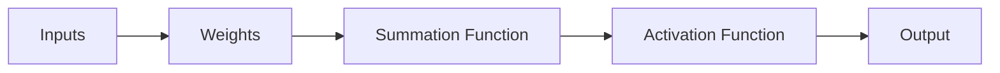
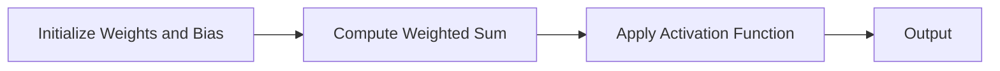

## 1. 背景介绍

在人工智能的发展历程中，人工神经元（Artificial Neuron）扮演了重要的角色。人工神经元是模拟生物神经元的工作方式，构成了人工神经网络的基本组成单元。它们的设计和应用，对于理解和实现人工智能的发展起到了关键作用。

在本文中，我们将深入讨论人工神经元的工作原理，包括它们的核心概念、操作步骤、数学模型和公式，以及实际应用场景。我们还将展示一些具体的代码示例，并提供相关的工具和资源推荐。最后，我们将讨论人工神经元的未来发展趋势和挑战。

## 2. 核心概念与联系

人工神经元的基本概念源自生物神经元。在生物神经元中，神经元接收来自其他神经元的信号，这些信号经过处理后，再传递给其他神经元。人工神经元的工作方式也类似，它接收输入，通过激活函数处理，然后产生输出。



在人工神经元中，每个输入都有一个相关的权重，这个权重决定了这个输入的重要性。所有的输入和权重都会被汇总到一个求和函数中，然后通过激活函数处理，产生输出。

## 3. 核心算法原理具体操作步骤

人工神经元的工作步骤可以分为以下几步：

1. **初始化权重和偏置**：权重和偏置是神经元的参数，它们在开始时通常被初始化为随机值。
2. **计算加权和**：每个输入乘以其对应的权重，然后加上偏置，得到加权和。
3. **应用激活函数**：将加权和输入到激活函数中，得到神经元的输出。



## 4. 数学模型和公式详细讲解举例说明

人工神经元的工作过程可以用数学公式来表示。设输入为$x_1, x_2, ..., x_n$，权重为$w_1, w_2, ..., w_n$，偏置为$b$，激活函数为$f$，那么神经元的输出$y$可以表示为：

$$
y = f(\sum_{i=1}^{n} w_i x_i + b)
$$

例如，对于一个有两个输入$x_1, x_2$的神经元，权重为$w_1, w_2$，偏置为$b$，如果我们选择sigmoid函数作为激活函数，那么神经元的输出$y$可以表示为：

$$
y = \frac{1}{1 + e^{-(w_1 x_1 + w_2 x_2 + b)}}
$$

## 5. 项目实践：代码实例和详细解释说明

以下是一个使用Python实现的简单的人工神经元示例：

```python
import numpy as np

# sigmoid function
def sigmoid(x):
    return 1 / (1 + np.exp(-x))

# inputs
x = np.array([0.5, 0.1, -0.2])
# weights
w = np.array([0.6, -0.4, 0.2])
# bias
b = 0.1

# weighted sum
z = np.dot(w, x) + b

# output
y = sigmoid(z)

print(y)
```

这个示例中，我们定义了一个sigmoid函数，然后定义了输入、权重和偏置，计算了加权和，并将其输入到sigmoid函数中，得到输出。

## 6. 实际应用场景

人工神经元被广泛应用于各种人工神经网络中，如深度学习、卷积神经网络、循环神经网络等。它们在图像识别、语音识别、自然语言处理、推荐系统等领域发挥了重要作用。

## 7. 工具和资源推荐

- **Python**：Python是一种广泛用于人工智能和机器学习的编程语言，它有许多库和框架，如NumPy、SciPy、Pandas、Matplotlib、TensorFlow、Keras等，可以用来实现和训练人工神经元和神经网络。
- **TensorFlow**：TensorFlow是一个强大的开源库，可以用来创建和训练各种神经网络。
- **Keras**：Keras是一个基于Python的深度学习框架，它提供了一种简单而快速的方式来创建神经网络。

## 8. 总结：未来发展趋势与挑战

人工神经元作为人工智能的基础组成部分，其发展趋势和挑战主要与人工智能的发展趋势和挑战相一致。随着计算能力的提高和大数据的发展，人工神经元和神经网络的应用将更加广泛。同时，如何设计更有效的神经元模型，如何优化神经元的训练过程，如何理解和解释神经元和神经网络的内部工作机制，都是未来需要面临的挑战。

## 9. 附录：常见问题与解答

**Q1：为什么要使用激活函数？**

A1：激活函数的主要作用是引入非线性因素，使得神经网络可以拟合复杂的非线性模型。如果没有激活函数，无论神经网络有多少层，其输出都是输入的线性组合，这大大限制了神经网络的表达能力。

**Q2：如何选择激活函数？**

A2：选择激活函数主要取决于问题的性质。例如，对于二分类问题，通常选择sigmoid函数或者tanh函数；对于多分类问题，通常选择softmax函数；对于回归问题，通常选择线性函数或者ReLU函数。

**Q3：如何确定神经元的权重和偏置？**

A3：神经元的权重和偏置通常通过训练数据来学习得到。常用的方法包括梯度下降法、随机梯度下降法、牛顿法、拟牛顿法等。

作者：禅与计算机程序设计艺术 / Zen and the Art of Computer Programming