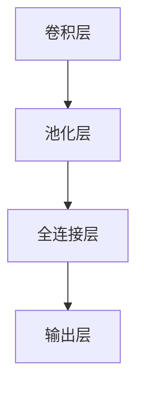

## 1. 背景介绍
在当今数字化时代，数据量呈爆炸式增长，对数据处理和分析的需求也日益增加。作为人工智能领域的重要分支，机器学习和深度学习技术在解决这些问题时发挥着关键作用。其中，卷积神经网络（Convolutional Neural Network，CNN）作为深度学习的一种重要架构，在图像识别、语音识别、自然语言处理等领域取得了显著的成果。本文将以基于卷积的 MNIST 分类模型为例，从零开始介绍大模型的开发与微调过程。

## 2. 核心概念与联系
在深入探讨具体的技术细节之前，我们有必要先了解一些核心概念和它们之间的联系。

**2.1 卷积层**：卷积层是卷积神经网络的基本构建块。它通过对输入数据进行卷积操作，提取出数据中的特征。卷积操作可以看作是一种局部连接和权重共享的机制，使得模型能够学习到数据中的空间关系。

**2.2 池化层**：池化层用于对卷积层的输出进行下采样，减少数据的维度，同时提高模型的鲁棒性。常见的池化操作包括最大池化和平均池化。

**2.3 全连接层**：全连接层将池化层或卷积层的输出连接到一个或多个全连接层，用于对数据进行分类或回归预测。

**2.4 激活函数**：激活函数为神经网络引入了非线性，使得模型能够学习到更加复杂的模式。常见的激活函数包括 ReLU、Sigmoid 和 Tanh 等。

**2.5 损失函数与优化器**：损失函数用于衡量模型的预测误差，优化器则用于根据损失函数的梯度来更新模型的参数，以提高模型的性能。

这些核心概念相互关联，共同构成了卷积神经网络的基本框架。卷积层和池化层用于提取数据的特征，全连接层用于对特征进行分类或预测，激活函数和损失函数则为模型引入了非线性和优化机制。

## 3. 核心算法原理具体操作步骤
接下来，我们将详细介绍基于卷积的 MNIST 分类模型的核心算法原理和具体操作步骤。

**3.1 数据准备**：首先，我们需要准备 MNIST 数据集，这是一个包含手写数字图像的经典数据集。我们可以使用 Python 的`TensorFlow`和`Keras`库来加载和预处理 MNIST 数据集。

**3.2 构建卷积神经网络**：接下来，我们使用`TensorFlow`和`Keras`库构建卷积神经网络模型。模型由卷积层、池化层和全连接层组成，具体结构如下：

- 卷积层：使用`Conv2D`层来构建卷积层，设置卷积核大小为 3x3，激活函数为 ReLU。
- 池化层：使用`MaxPooling2D`层来构建池化层，池化窗口大小为 2x2。
- 全连接层：使用`Dense`层来构建全连接层，神经元数量为 128，激活函数为 ReLU。
- 输出层：使用`Dense`层来构建输出层，神经元数量为 10，激活函数为 Softmax。

**3.3 编译模型**：在构建好模型后，我们需要编译模型，设置损失函数、优化器和评估指标。

**3.4 训练模型**：最后，我们可以使用训练数据来训练模型。在训练过程中，我们可以监控训练损失和验证损失的变化，以及模型在验证集上的准确率。

## 4. 数学模型和公式详细讲解举例说明
在这一部分，我们将详细讲解卷积神经网络中的数学模型和公式，并通过举例说明来帮助读者更好地理解。

**4.1 卷积层**：卷积层的主要作用是对输入数据进行卷积操作，提取出数据中的特征。卷积操作可以看作是一种局部连接和权重共享的机制，使得模型能够学习到数据中的空间关系。卷积层的数学模型可以表示为：

其中，$x$表示输入数据，$w$表示卷积核，$b$表示偏置，$f$表示激活函数。卷积核的大小为$k\times k$，通常$k$取 3 或 5。激活函数通常使用 ReLU 函数，其数学表达式为：

ReLU 函数的优点是能够快速计算，并且在深度学习中被广泛应用。

**4.2 池化层**：池化层用于对卷积层的输出进行下采样，减少数据的维度，同时提高模型的鲁棒性。常见的池化操作包括最大池化和平均池化。最大池化的数学模型可以表示为：

其中，$x$表示输入数据，$k$表示池化窗口的大小，$f$表示池化函数。池化函数通常使用最大池化函数，其数学表达式为：

平均池化的数学模型可以表示为：

其中，$x$表示输入数据，$k$表示池化窗口的大小，$f$表示池化函数。池化函数通常使用平均池化函数，其数学表达式为：

**4.3 全连接层**：全连接层将池化层或卷积层的输出连接到一个或多个全连接层，用于对数据进行分类或回归预测。全连接层的数学模型可以表示为：

其中，$x$表示输入数据，$w$表示权重，$b$表示偏置，$f$表示激活函数。激活函数通常使用 ReLU 函数，其数学表达式为：

ReLU 函数的优点是能够快速计算，并且在深度学习中被广泛应用。

## 5. 项目实践：代码实例和详细解释说明
在这一部分，我们将通过一个实际的项目实践来展示如何使用卷积神经网络进行 MNIST 数字分类任务。我们将使用 Python 的`TensorFlow`和`Keras`库来实现卷积神经网络，并使用 MNIST 数据集进行训练和测试。

**5.1 数据准备**：首先，我们需要准备 MNIST 数据集，这是一个包含手写数字图像的经典数据集。我们可以使用 Python 的`TensorFlow`和`Keras`库来加载和预处理 MNIST 数据集。

**5.2 构建卷积神经网络**：接下来，我们使用`TensorFlow`和`Keras`库构建卷积神经网络模型。模型由卷积层、池化层和全连接层组成，具体结构如下：

- 卷积层：使用`Conv2D`层来构建卷积层，设置卷积核大小为 3x3，激活函数为 ReLU。
- 池化层：使用`MaxPooling2D`层来构建池化层，池化窗口大小为 2x2。
- 全连接层：使用`Dense`层来构建全连接层，神经元数量为 128，激活函数为 ReLU。
- 输出层：使用`Dense`层来构建输出层，神经元数量为 10，激活函数为 Softmax。

**5.3 编译模型**：在构建好模型后，我们需要编译模型，设置损失函数、优化器和评估指标。

**5.4 训练模型**：最后，我们可以使用训练数据来训练模型。在训练过程中，我们可以监控训练损失和验证损失的变化，以及模型在验证集上的准确率。

**5.5 测试模型**：在训练完成后，我们可以使用测试数据来测试模型的性能。我们可以计算模型在测试集上的准确率，并与其他模型进行比较。

## 6. 实际应用场景
卷积神经网络在实际应用中有广泛的应用场景，以下是一些常见的应用场景：

**6.1 图像识别**：卷积神经网络可以用于图像分类、目标检测、图像分割等任务。例如，在安防领域，可以使用卷积神经网络来识别监控视频中的人脸、车牌等目标。

**6.2 语音识别**：卷积神经网络可以用于语音识别任务。例如，在智能手机上，可以使用卷积神经网络来识别语音指令。

**6.3 自然语言处理**：卷积神经网络可以用于自然语言处理任务，如文本分类、情感分析、机器翻译等。例如，在社交媒体上，可以使用卷积神经网络来分析用户的情感倾向。

**6.4 医疗影像分析**：卷积神经网络可以用于医疗影像分析任务，如医学图像分割、疾病诊断等。例如，在医学影像诊断中，可以使用卷积神经网络来辅助医生诊断疾病。

## 7. 工具和资源推荐
在开发卷积神经网络时，我们可以使用以下工具和资源：

**7.1 深度学习框架**：深度学习框架是开发卷积神经网络的重要工具，如 TensorFlow、PyTorch、Caffe 等。这些框架提供了丰富的函数库和工具，方便我们构建和训练卷积神经网络。

**7.2 MNIST 数据集**：MNIST 数据集是一个经典的手写数字数据集，包含了 60000 个训练样本和 10000 个测试样本。我们可以使用 MNIST 数据集来训练和测试卷积神经网络。

**7.3 其他数据集**：除了 MNIST 数据集，还有许多其他的数据集可以用于训练卷积神经网络，如 CIFAR-10、ImageNet 等。

**7.4 计算资源**：卷积神经网络的训练需要大量的计算资源，如 GPU 等。我们可以使用云计算平台或自己搭建计算集群来提供计算资源。

## 8. 总结：未来发展趋势与挑战
卷积神经网络在过去几年中取得了巨大的成功，并在许多领域得到了广泛的应用。然而，卷积神经网络仍然面临着一些挑战，如计算资源需求高、模型解释性差等。未来，卷积神经网络的发展趋势可能包括以下几个方面：

**8.1 更高的精度和效率**：随着计算能力的不断提高，卷积神经网络的精度和效率也将不断提高。未来的卷积神经网络可能会使用更先进的算法和技术，如量子计算、深度学习压缩等，以提高模型的性能。

**8.2 更强的泛化能力**：卷积神经网络的泛化能力仍然有限，未来的研究可能会致力于提高模型的泛化能力，使其能够更好地处理新的数据和任务。

**8.3 更好的可解释性**：卷积神经网络的可解释性仍然是一个挑战，未来的研究可能会致力于开发更具可解释性的卷积神经网络模型，使其能够更好地理解和解释决策过程。

**8.4 多模态融合**：卷积神经网络通常只能处理单一模态的数据，如图像、语音等。未来的研究可能会致力于将卷积神经网络与其他模态的数据融合，以提高模型的性能和泛化能力。

## 9. 附录：常见问题与解答
在开发卷积神经网络时，可能会遇到一些常见问题，以下是一些常见问题的解答：

**9.1 如何选择卷积核大小？**：卷积核大小的选择取决于数据的特点和任务的需求。一般来说，较小的卷积核可以提取更细节的特征，而较大的卷积核可以提取更全局的特征。在实际应用中，通常需要根据数据的特点和任务的需求进行实验和调整。

**9.2 如何选择池化层？**：池化层的选择取决于数据的特点和任务的需求。一般来说，最大池化可以更好地保留特征的位置信息，而平均池化可以更好地保留特征的强度信息。在实际应用中，通常需要根据数据的特点和任务的需求进行实验和调整。

**9.3 如何选择激活函数？**：激活函数的选择取决于数据的特点和任务的需求。一般来说，ReLU 函数可以更好地处理非负数据，而 Sigmoid 和 Tanh 函数可以更好地处理概率分布数据。在实际应用中，通常需要根据数据的特点和任务的需求进行实验和调整。

**9.4 如何避免过拟合？**：过拟合是卷积神经网络中常见的问题，可以通过以下方法来避免：
- 增加数据量：增加更多的训练数据可以提高模型的泛化能力。
- 正则化：使用正则化方法，如 L1 和 L2 正则化，可以防止模型过拟合。
- 早停法：在训练过程中，根据验证集的性能提前停止训练，可以避免过拟合。
- 随机初始化：在训练之前，对模型的参数进行随机初始化，可以避免模型过拟合。

**9.5 如何提高模型的性能？**：提高模型的性能可以通过以下方法来实现：
- 增加网络深度和宽度：增加网络的深度和宽度可以提高模型的表达能力。
- 使用更好的激活函数：使用更适合数据的激活函数可以提高模型的性能。
- 使用更先进的训练算法：使用更先进的训练算法，如随机梯度下降、Adagrad、Adadelta 等，可以提高模型的性能。
- 使用数据增强：使用数据增强技术，如翻转、旋转、缩放等，可以增加数据的多样性，提高模型的性能。

**9.6 如何将卷积神经网络应用于实际问题？**：将卷积神经网络应用于实际问题需要以下步骤：
- 数据准备：收集和整理数据，并进行预处理，如归一化、标准化等。
- 模型选择：根据问题的特点和数据的特点选择合适的卷积神经网络模型。
- 训练模型：使用训练数据对模型进行训练，并根据需要进行调整和优化。
- 测试模型：使用测试数据对模型进行测试，并根据测试结果进行评估和改进。
- 部署模型：将训练好的模型部署到实际应用中，并进行监控和维护。

以上是一些常见问题的解答，希望对读者有所帮助。