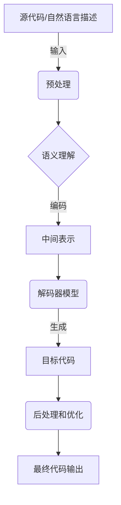

# 代码生成 (Code Generation)

## 1.背景介绍

代码生成是一种自动化技术,旨在根据某种输入(如模型、规范或领域特定语言)生成源代码。这种技术可以提高开发效率,减少手工编码过程中的错误,并促进代码的一致性和可维护性。代码生成在软件工程领域有着广泛的应用,包括模型驱动开发(Model-Driven Development,MDD)、领域特定语言(Domain-Specific Languages,DSLs)和低代码/无代码开发平台等。

随着人工智能和机器学习技术的快速发展,代码生成进入了一个新的阶段。传统的代码生成主要依赖于模板和规则,而现代代码生成则更多地利用了大型语言模型和深度学习技术,能够基于自然语言描述或少量示例代码生成复杂的目标代码。这种新型代码生成方法显著提高了开发效率,降低了编程门槛,为软件开发带来了革命性的变化。

## 2.核心概念与联系

### 2.1 代码生成的核心概念

1. **源(Source)**: 代码生成过程的输入,可以是模型、规范、领域特定语言或自然语言描述等。

2. **目标(Target)**: 代码生成过程的输出,即生成的源代码。

3. **转换(Transformation)**: 将源转换为目标的过程,可以是基于模板、规则或机器学习模型的转换。

4. **模板(Template)**: 用于定义目标代码结构和生成规则的模板文件。

5. **语法分析(Parsing)**: 将源输入解析为内部表示形式(如抽象语法树)的过程。

6. **代码生成引擎(Code Generation Engine)**: 执行转换过程的核心组件。

7. **优化(Optimization)**: 对生成的目标代码进行优化,如代码重构、性能优化等。

### 2.2 代码生成与相关技术的联系

1. **模型驱动开发(MDD)**: 代码生成是MDD的核心技术,可以从模型自动生成应用程序代码。

2. **领域特定语言(DSL)**: DSL提供了特定领域的抽象语法,代码生成可以将DSL转换为可执行代码。

3. **低代码/无代码开发平台**: 这些平台通常包含可视化建模工具和代码生成引擎,允许用户构建应用程序而无需手动编写大量代码。

4. **编译器**: 编译器将高级编程语言源代码转换为机器可执行代码,可视为一种特殊的代码生成技术。

5. **解释器**: 解释器动态执行源代码,而不是生成目标代码,但其工作原理与代码生成有一定相似之处。

6. **人工智能和机器学习**: 现代代码生成技术越来越多地采用了人工智能和机器学习模型,如大型语言模型、序列到序列模型等。

## 3.核心算法原理具体操作步骤

现代代码生成系统通常采用基于机器学习的方法,其核心算法原理和操作步骤如下:



1. **预处理**:对源代码或自然语言描述进行标记化(Tokenization)、词条化(Lemmatization)等预处理操作,将其转换为模型可以理解的形式。

2. **语义理解**:使用编码器模型(如Transformer编码器)对预处理后的输入进行语义理解,捕获其中的上下文信息和语义关系,并将其编码为中间表示形式(如向量表示)。

3. **解码器模型**:使用解码器模型(如Transformer解码器)基于编码后的中间表示生成目标代码的token序列。解码器模型通常采用序列到序列(Seq2Seq)的方式,每次生成一个token,直到生成完整的目标代码。

4. **后处理和优化**:对生成的目标代码进行后续处理,如格式化、重构、类型推断等,以提高代码质量和可读性。还可以进行代码优化,如死码消除、常量折叠等。

上述过程中,编码器和解码器模型通常采用基于Transformer的大型语言模型,如GPT、CodeBERT等,这些模型经过在大量代码数据上的预训练,能够很好地捕获编程语言的语义和结构信息。在微调(Fine-tuning)阶段,这些模型会在特定的代码生成任务上进行进一步训练,以提高生成质量。

值得注意的是,上述算法原理描述了基于机器学习的代码生成系统的典型流程,实际系统可能会有一些变体和优化,如采用不同的模型架构、引入注意力机制、结合规则系统等。

## 4.数学模型和公式详细讲解举例说明

在代码生成系统中,常用的数学模型包括:

1. **Seq2Seq模型**:序列到序列(Sequence-to-Sequence)模型是代码生成中最常用的模型之一。它将代码生成任务视为一个序列转换问题,即将源代码或自然语言描述(源序列)转换为目标代码(目标序列)。Seq2Seq模型由编码器(Encoder)和解码器(Decoder)两部分组成。

   编码器将源序列编码为中间表示(通常是向量表示),解码器则根据该中间表示生成目标序列。常用的Seq2Seq模型包括:

   - **RNN Seq2Seq**: 基于循环神经网络(RNN)的Seq2Seq模型,如使用LSTM或GRU作为编码器和解码器。
   - **Transformer Seq2Seq**: 基于Transformer架构的Seq2Seq模型,如谷歌的Transformer模型。

   Seq2Seq模型的数学形式化表示如下:

   给定源序列 $X = (x_1, x_2, \dots, x_n)$ 和目标序列 $Y = (y_1, y_2, \dots, y_m)$,我们希望学习一个模型 $P(Y|X)$ 来最大化目标序列的条件概率:

   $$\begin{aligned}
   P(Y|X) &= \prod_{t=1}^m P(y_t|y_{<t}, X) \\
          &= \prod_{t=1}^m P(y_t|y_{<t}, c)
   \end{aligned}$$

   其中 $c$ 是编码器对源序列 $X$ 的编码,表示源序列的中间表示。解码器根据 $c$ 和已生成的部分序列 $y_{<t}$ 预测下一个token $y_t$。

2. **注意力机制(Attention Mechanism)**: 注意力机制是序列模型(如Seq2Seq模型)中的一个关键组件,它允许模型在生成每个目标token时,动态地关注源序列中的不同部分,从而捕获长距离依赖关系。

   设 $q_t$ 为解码器在时间步 $t$ 的查询向量(Query), $K = (k_1, k_2, \dots, k_n)$ 为源序列的键值对(Key-Value pairs),注意力分数 $\alpha_{t,i}$ 表示解码器对源序列第 $i$ 个位置的注意力权重,可以通过以下公式计算:

   $$\alpha_{t,i} = \frac{\exp(e_{t,i})}{\sum_{j=1}^n \exp(e_{t,j})}$$

   其中 $e_{t,i} = f(q_t, k_i)$ 是一个评分函数,常用的有点积评分 $e_{t,i} = q_t^\top k_i$ 和多头注意力评分。

   然后,注意力向量 $a_t$ 可以通过对源序列的值向量 $V = (v_1, v_2, \dots, v_n)$ 进行加权求和得到:

   $$a_t = \sum_{i=1}^n \alpha_{t,i} v_i$$

   注意力向量 $a_t$ 可以被送入解码器,用于预测下一个token。

3. **掩码语言模型(Masked Language Model, MLM)**: 掩码语言模型是自监督学习中常用的预训练任务,它通过随机掩码部分输入token,然后让模型预测被掩码的token,从而学习到编程语言的语义和结构信息。

   设 $X = (x_1, x_2, \dots, x_n)$ 为原始序列, $\hat{X}$ 为掩码后的序列,其中某些位置被替换为特殊的掩码token [MASK]。模型的目标是最大化掩码位置的条件概率:

   $$\mathcal{L}_{MLM} = -\mathbb{E}_{X} \left[ \sum_{i \in \text{masked}} \log P(x_i | \hat{X}) \right]$$

   通过预训练掩码语言模型,模型可以学习到编程语言的上下文信息和语义关系,为后续的代码生成任务提供有力的语言理解能力。

以上是代码生成系统中常用的一些数学模型和公式,实际应用中还可能涉及到其他模型和技术,如生成式对抗网络(GAN)、序列到序列模型的改进版本(如Copy机制、Coverage机制等)、结合规则系统等。数学模型和公式为代码生成系统提供了理论基础和技术支撑,是实现高质量代码生成的关键所在。

## 5.项目实践:代码实例和详细解释说明

为了更好地理解代码生成的实践应用,我们将使用Python和HuggingFace的Transformers库,构建一个简单的代码生成系统。该系统能够根据给定的自然语言描述,生成对应的Python代码片段。

### 5.1 数据准备

我们将使用HuggingFace提供的`datasets`库来加载和预处理数据。这里我们使用的是`dataset`库中的`code_x_glue_cc_defect_detection`数据集,它包含了大量的自然语言描述和对应的Python代码片段。

```python
from datasets import load_dataset

dataset = load_dataset("code_x_glue_cc_defect_detection")
```

我们将数据集分为训练集和测试集:

```python
train_data = dataset["train"]
test_data = dataset["test"]
```

### 5.2 数据预处理

接下来,我们需要对数据进行预处理,将自然语言描述和Python代码片段拼接成一个序列,并添加特殊的开始和结束标记。

```python
from transformers import AutoTokenizer

tokenizer = AutoTokenizer.from_pretrained("microsoft/CodeXGLUE-base-code-defect-detection")

def preprocess_data(examples):
    inputs = ["<python> " + example["text"] + " <code_sep> " + example["code"] for example in examples]
    model_inputs = tokenizer(inputs, max_length=1024, truncation=True, padding="max_length")
    return model_inputs

train_data = train_data.map(preprocess_data, batched=True, remove_columns=["text", "code"])
test_data = test_data.map(preprocess_data, batched=True, remove_columns=["text", "code"])
```

### 5.3 模型初始化和训练

我们将使用HuggingFace提供的预训练模型`microsoft/CodeXGLUE-base-code-defect-detection`作为基础模型,并在我们的代码生成任务上进行微调。

```python
from transformers import AutoModelForCausalLM, TrainingArguments, Trainer

model = AutoModelForCausalLM.from_pretrained("microsoft/CodeXGLUE-base-code-defect-detection")

training_args = TrainingArguments(
    output_dir="./code-generation-model",
    evaluation_strategy="epoch",
    learning_rate=2e-5,
    per_device_train_batch_size=8,
    per_device_eval_batch_size=8,
    num_train_epochs=3,
    weight_decay=0.01,
)

trainer = Trainer(
    model=model,
    args=training_args,
    train_dataset=train_data,
    eval_dataset=test_data,
)

trainer.train()
```

在训练过程中,模型将学习从自然语言描述生成对应的Python代码片段。

### 5.4 代码生成

训练完成后,我们可以使用训练好的模型来生成代码。

```python
from transformers import pipeline

generator = pipeline("text-generation", model="./code-generation-model")

prompt = "Write a Python function to calculate the factorial of a given number."

output = generator(prompt, max_length=1024, do_sample=True, top_k=50, top_p=0.95, num_return_sequences=1)[0]["generated_text"]

print(output)
```

上述代码将根据给定的自然语言描述`"Write a Python function to calculate the factorial of a given number."`生成对应的Python代码。`generator`函数的