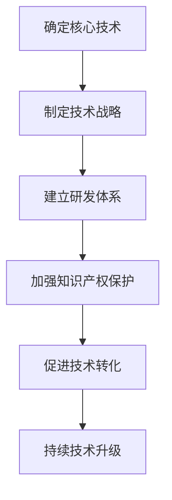

# 公司整体核心技术管理方案

## 1.背景介绍

在当今快节奏的商业环境中,技术是推动公司发展的核心动力。有效管理核心技术资产对于保持竞争优势至关重要。本文将探讨公司如何制定全面的核心技术管理方案,涵盖技术战略制定、研发管理、知识产权保护等多个维度,助力企业实现可持续创新。

## 2.核心概念与联系

### 2.1 核心技术

核心技术指对公司的生存和发展具有决定性作用的技术,是公司的核心竞争力所在。它们通常具有以下特征:

- 技术先进性和创新性
- 掌握难度大
- 对产品或服务的贡献度高
- 对行业发展具有引领作用

### 2.2 技术管理

技术管理是指对技术活动的计划、组织、指导、控制和协调,以实现技术目标。它贯穿了技术全生命周期,包括技术战略制定、研发管理、知识产权保护等环节。

### 2.3 核心技术管理

核心技术管理是指对公司核心技术资产的系统化管理,旨在最大限度发挥核心技术的价值,维护公司的核心竞争力。它是技术管理的重中之重。

## 3.核心算法原理具体操作步骤

制定核心技术管理方案需要遵循一定的原理和步骤,具体如下:



### 3.1 确定核心技术

第一步是明确公司的核心技术。可以从公司的产品或服务出发,分析其中的关键技术,并根据上述核心技术特征进行甄别。同时要结合行业发展趋势,预判未来的核心技术方向。

### 3.2 制定技术战略

在确定核心技术的基础上,需要制定明确的技术战略,作为公司技术发展的指导方针。技术战略应与公司的总体发展战略相一致,并体现技术创新的方向和重点。

### 3.3 建立研发体系

健全的研发体系是核心技术管理的基石。公司需要建立高效的研发流程,配备专业的研发团队,为核心技术的持续创新提供有力支撑。同时要加强研发过程管理,确保研发质量和效率。

### 3.4 加强知识产权保护

知识产权是核心技术的重要载体。公司应高度重视知识产权的申请、维护和运用,构建知识产权保护体系。这包括专利布局、商业秘密管理、版权登记等多个方面。

### 3.5 促进技术转化

核心技术的价值在于转化为实际产品或服务。公司需要建立高效的技术转化机制,将研发成果快速转化为生产力,提高核心技术的转化率和效率。

### 3.6 持续技术升级

技术发展日新月异,公司必须时刻关注行业前沿动态,持续升级核心技术。这需要建立技术预警机制,主动布局新兴技术领域,保持技术领先优势。

## 4.数学模型和公式详细讲解举例说明

在核心技术管理中,我们可以借助一些数学模型和公式来量化和优化管理过程。以下是一些典型案例:

### 4.1 技术价值评估模型

我们可以使用多属性决策模型来评估核心技术的价值,为技术选择和投资决策提供依据。假设考虑 $n$ 个技术选项 $\{T_1,T_2,...,T_n\}$,每个选项在 $m$ 个属性 $\{C_1,C_2,...,C_m\}$ 上有不同的表现,则技术 $T_i$ 的综合价值 $V(T_i)$ 可表示为:

$$V(T_i)=\sum_{j=1}^m w_j v_{ij}$$

其中 $w_j$ 表示属性 $C_j$ 的权重, $v_{ij}$ 表示技术 $T_i$ 在属性 $C_j$ 上的评分。通过确定合理的属性权重和评分机制,我们可以对备选技术进行定量比较和排序。

### 4.2 研发投资组合优化模型

研发投资是有限的,我们需要在多个技术项目中进行合理分配,以最大化投资收益。设有 $n$ 个技术项目 $\{P_1,P_2,...,P_n\}$,每个项目的预期收益为 $R_i$,投资成本为 $C_i$,风险系数为 $\lambda_i$,则在给定总投资额度 $B$ 的情况下,投资组合的期望收益 $E$ 可表示为:

$$\max E=\sum_{i=1}^n x_iR_i-\lambda_i\sum_{i=1}^nx_iC_i$$
$$\text{s.t.} \sum_{i=1}^n x_iC_i\leq B, x_i\in\{0,1\}$$

其中 $x_i$ 为0-1决策变量,表示是否投资项目 $P_i$。通过求解该优化问题,我们可以得到最优的投资组合方案。

### 4.3 专利引用网络分析

专利是核心技术的重要体现,分析专利引用网络有助于把握技术发展趋势。设有 $n$ 个专利 $\{P_1,P_2,...,P_n\}$,其中 $P_i$ 引用了 $k_i$ 个其他专利,被 $l_i$ 个其他专利引用,则可以定义专利 $P_i$ 的重要性指标 $I(P_i)$ 为:

$$I(P_i)=\alpha\frac{k_i}{\sum_jk_j}+(1-\alpha)\frac{l_i}{\sum_jl_j}$$

其中 $\alpha$ 为调节参数,用于平衡出度和入度的权重。通过计算每个专利的重要性指标,并结合引用关系网络的拓扑结构,我们可以识别出关键技术路线和热点领域。

上述仅为部分示例,在实际应用中可以根据具体需求构建更加复杂的数学模型,以指导核心技术的管理和决策。

## 5.项目实践:代码实例和详细解释说明

为了更好地理解和应用上述数学模型,我们提供了一些Python代码实例,供读者参考和实践。

### 5.1 技术价值评估模型实现

```python
import numpy as np

# 技术选项
technologies = ['A', 'B', 'C', 'D']
# 评估属性
criteria = ['创新性', '技术难度', '市场潜力', '成本效益']

# 属性权重
weights = np.array([0.3, 0.2, 0.3, 0.2])

# 技术评分矩阵
scores = np.array([[8, 6, 9, 7],
                   [7, 8, 6, 8],
                   [9, 7, 8, 6],
                   [6, 9, 7, 7]])

# 计算综合价值
values = np.sum(weights * scores, axis=1)

# 输出结果
for tech, value in zip(technologies, values):
    print(f'技术 {tech} 的综合价值为: {value:.2f}')
```

上述代码实现了一个简单的技术价值评估模型。首先定义了技术选项和评估属性,然后设置了属性权重和技术评分矩阵。通过将权重与评分相乘并求和,我们可以得到每个技术的综合价值。最后,代码输出了每个技术的综合价值评分。

### 5.2 研发投资组合优化模型实现

```python
from pulp import LpProblem, LpMaximize, LpVariable, lpSum

# 创建问题实例
prob = LpProblem("研发投资组合优化", LpMaximize)

# 项目信息
projects = ['A', 'B', 'C', 'D', 'E']
revenues = [80, 60, 100, 70, 90]
costs = [50, 40, 70, 60, 80]
risks = [0.2, 0.3, 0.1, 0.4, 0.2]
budget = 200

# 定义决策变量
x = LpVariable.dicts("选择", projects, cat="Binary")

# 定义目标函数
prob += lpSum(revenues[i] * x[i] - risks[i] * costs[i] * x[i] for i in projects)

# 添加约束条件
prob += lpSum(costs[i] * x[i] for i in projects) <= budget

# 求解问题
prob.solve()

# 输出结果
print("最优投资组合:")
for i in projects:
    if x[i].value() == 1:
        print(f"项目 {i}")
print(f"预期收益: {prob.objective.value():.2f}")
```

这段代码使用了PuLP库来求解研发投资组合优化问题。首先定义了项目信息,包括预期收益、成本和风险系数,以及总投资额度。然后创建了0-1决策变量,表示是否投资每个项目。目标函数旨在最大化投资组合的预期收益,同时考虑了风险因素。约束条件限制了总投资成本不超过预算。

通过求解该优化问题,代码输出了最优投资组合中包含的项目,以及对应的预期收益值。用户可以根据实际情况调整输入参数,以得到最佳的投资决策。

### 5.3 专利引用网络分析实现

```python
import networkx as nx
import matplotlib.pyplot as plt

# 创建专利网络
G = nx.DiGraph()

# 添加专利节点
patents = ['A', 'B', 'C', 'D', 'E', 'F', 'G', 'H']
for patent in patents:
    G.add_node(patent)

# 添加引用关系
G.add_edges_from([('A', 'B'), ('B', 'C'), ('C', 'D'), ('D', 'E'),
                  ('E', 'F'), ('F', 'G'), ('G', 'H'), ('H', 'A')])

# 计算专利重要性指标
alpha = 0.5
importance = nx.pagerank(G, alpha=alpha)

# 可视化网络
pos = nx.spring_layout(G)
nx.draw(G, pos, with_labels=True, node_color='lightblue', edge_color='gray')
plt.show()

# 输出重要性指标
print("专利重要性指标:")
for patent, score in importance.items():
    print(f"{patent}: {score:.3f}")
```

该代码使用NetworkX库对专利引用网络进行建模和分析。首先创建了一个有向图对象,并添加了专利节点和引用关系边。然后使用PageRank算法计算了每个专利的重要性指标,其中alpha参数用于调节出度和入度的权重。

接下来,代码使用NetworkX的可视化功能绘制了专利引用网络图,以直观展示专利之间的引用关系。最后,输出了每个专利的重要性指标值。

通过分析专利引用网络,我们可以发现关键技术路线和热点领域,从而为技术战略制定和研发投入提供依据。

以上代码实例旨在帮助读者更好地理解和应用数学模型,实现高效的核心技术管理。读者可以根据实际需求对代码进行修改和扩展。

## 6.实际应用场景

核心技术管理方案在各行业都有广泛的应用,以下是一些典型场景:

### 6.1 制造业

制造业企业的核心竞争力通常来自于先进的生产技术和工艺。因此,对核心技术的管理尤为重要。以汽车行业为例,整车企业需要对动力总成、车身结构、智能网联等核心技术进行统筹规划,确保技术领先;同时加强与零部件供应商的技术合作,实现协同创新。

### 6.2 信息技术行业

在信息技术行业,软硬件技术是核心资产。公司需要建立完善的技术管理体系,包括技术路线图制定、研发流程优化、知识产权战略布局等。同时要注重开源技术的吸收和贡献,促进技术生态的健康发展。

### 6.3 生物医药行业

生物医药行业的核心技术包括新药研发、生物制剂技术、精准医疗等。企业需要加大研发投入,保持技术创新活力;同时加强知识产权保护,防止核心技术外泄。在研发过程中,还要注重临床前期和临床试验的规范管理,确保技术转化的质量和安全性。

### 6.4 新兴技术领域

在人工智能、量子计