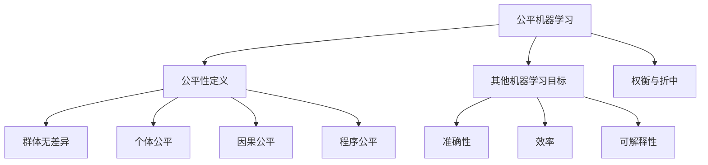

# 公平机器学习的未来展望:技术创新与社会责任

## 1.背景介绍

### 1.1 机器学习的发展与影响

在过去的几十年里,机器学习技术取得了长足的进步,并被广泛应用于各个领域,从金融预测到医疗诊断,从自动驾驶到社交媒体推荐等。机器学习算法通过从大量数据中发现模式和规律,能够自动完成诸多复杂任务,大大提高了效率和准确性。

然而,由于训练数据和算法本身的偏差,机器学习系统也可能产生不公平的结果,对某些群体产生歧视性影响。这种算法偏差不仅违背了公平正义的原则,也可能导致严重的社会后果。

### 1.2 公平机器学习的重要性

公平机器学习(Fair Machine Learning)旨在解决机器学习系统中存在的偏差和歧视问题,确保算法的决策过程是公平和无偏的。这不仅是一个技术挑战,也是一个社会责任。随着机器学习系统在越来越多的领域中发挥作用,确保其公平性变得至关重要。

在招聘、贷款审批、刑事司法等领域,机器学习算法的决策可能会对个人的生活产生深远影响。如果这些决策存在偏差,那么将会加剧社会不平等,损害弱势群体的权益。因此,我们有责任确保这些系统是公平和无偏的。

## 2.核心概念与联系

### 2.1 公平性定义

在讨论公平机器学习之前,我们首先需要定义"公平性"的概念。公平性是一个复杂的概念,不同的背景和场景下可能有不同的定义。在机器学习领域,常见的公平性定义包括:

1. **群体无差异(Group Fairness)**: 不同人口统计群体(如性别、种族等)在模型预测结果上应该没有显著差异。

2. **个体公平(Individual Fairness)**: 对于相似的个体,模型应该给出相似的预测结果。

3. **因果公平(Causal Fairness)**: 模型的预测不应该受到与任务无关的敏感属性(如性别、种族等)的影响。

4. **程序公平(Procedural Fairness)**: 决策过程本身应该是公平的,不应该存在任何歧视性的步骤或规则。

这些定义各有侧重,在实践中需要根据具体场景和需求来选择合适的公平性定义。

### 2.2 公平性与其他机器学习目标的权衡

在追求公平性的同时,我们也需要考虑机器学习系统的其他目标,如准确性、效率和可解释性等。这些目标之间往往存在权衡关系,需要进行适当的平衡。例如,提高公平性可能会导致模型准确性的下降,或者增加模型复杂度,影响可解释性。

因此,在设计公平机器学习算法时,我们需要权衡不同目标之间的关系,寻找最佳的折中点。这需要对具体应用场景有深入的理解,并与相关利益相关者(如决策者、受影响群体等)进行充分的沟通和讨论。



## 3.核心算法原理具体操作步骤

实现公平机器学习的核心算法原理主要包括以下几个步骤:

### 3.1 数据预处理

由于训练数据中可能存在偏差和噪声,因此需要进行数据预处理,以减少这些不利影响。常见的预处理方法包括:

1. **数据审计**: 检查数据集中是否存在潜在的偏差和噪声,并进行适当的处理。

2. **数据重新采样**: 通过过采样或欠采样等方法,调整数据集中不同群体的比例,以减少数据不平衡带来的影响。

3. **数据变换**: 对数据进行适当的变换,如特征缩放、编码等,以减少不相关特征对模型的影响。

4. **数据匿名化**: 对敏感属性(如性别、种族等)进行匿名化处理,以减少这些属性对模型的影响。

### 3.2 算法设计

在算法设计阶段,需要将公平性作为一个显式目标纳入优化过程。常见的公平机器学习算法包括:

1. **约束优化算法**: 在传统机器学习算法的基础上,增加公平性约束,使得模型在优化准确性的同时,也满足一定的公平性要求。

2. **正则化算法**: 在损失函数中加入公平性正则项,使得模型在优化过程中同时考虑准确性和公平性。

3. **预测后校正算法**: 首先训练一个传统的机器学习模型,然后对其预测结果进行校正,以满足公平性要求。

4. **基于表示学习的算法**: 通过学习公平的数据表示,从而减少敏感属性对模型的影响,实现公平性。

这些算法各有优缺点,需要根据具体场景和需求进行选择和调整。

### 3.3 评估与诊断

在训练和部署公平机器学习模型之前,需要进行全面的评估和诊断,以确保模型满足预期的公平性要求。常见的评估方法包括:

1. **统计测试**: 使用统计学方法(如卡方检验、t检验等)检测模型预测结果在不同群体之间是否存在显著差异。

2. **公平性指标**: 计算一系列公平性指标(如统计率差异、等价机会等),量化模型的公平性水平。

3. **模型解释**: 使用可解释性技术(如SHAP、LIME等)解释模型的决策过程,诊断潜在的偏差来源。

4. **人工审计**: 邀请相关领域的专家和利益相关者,对模型的公平性进行人工审计和评估。

评估和诊断的结果可以用于优化和调整模型,直至满足预期的公平性要求。

## 4.数学模型和公式详细讲解举例说明

### 4.1 统计率差异(Statistical Parity Difference)

统计率差异是一种常用的公平性指标,用于衡量不同群体在模型预测结果上的差异程度。对于二元分类任务,统计率差异可以定义为:

$$\text{SPD} = P(Y=1|A=0) - P(Y=1|A=1)$$

其中,Y是模型的预测结果(0或1),A是敏感属性(如性别,种族等),取值0或1。SPD的绝对值越小,表示模型在不同群体之间的预测结果差异越小,公平性越高。

例如,在一个贷款审批系统中,如果SPD接近于0,则表示不同性别的申请人获得贷款批准的概率相近,模型在性别上是公平的。

### 4.2 等价机会(Equal Opportunity)

等价机会是另一种常用的公平性指标,它要求对于同一个结果(如获得贷款批准),不同群体应该具有相同的真正率(True Positive Rate)。对于二元分类任务,等价机会可以定义为:

$$\text{EO} = P(Y=1|A=0,Y^*=1) - P(Y=1|A=1,Y^*=1)$$

其中,Y是模型的预测结果,Y*是真实结果,A是敏感属性。EO的绝对值越小,表示不同群体在获得正确预测的机会上的差异越小,模型越公平。

在贷款审批系统的例子中,如果EO接近于0,则表示对于那些真实应该获得贷款批准的申请人,不同性别群体获得正确预测的机会相近,模型在这种情况下是公平的。

### 4.3 因果公平

除了基于统计学的公平性指标,我们还可以从因果推理的角度来定义公平性。在这种情况下,我们希望模型的预测不受与任务无关的敏感属性的影响,即:

$$P(Y|X,A=0) = P(Y|X,A=1)$$

其中,Y是模型的预测结果,X是与任务相关的特征,A是敏感属性。这种定义要求在给定相同的特征X时,不同的敏感属性A不应该对预测结果产生影响。

为了实现因果公平,我们可以使用基于表示学习的算法,学习一种公平的数据表示,从而减少敏感属性对模型的影响。另一种方法是使用因果建模技术,显式地建模特征、敏感属性和预测结果之间的因果关系,并在此基础上进行公平优化。

### 4.4 正则化算法

正则化算法是实现公平机器学习的一种常用方法。它在传统的机器学习损失函数中加入公平性正则项,使得模型在优化过程中同时考虑准确性和公平性。

假设我们有一个二元分类任务,使用逻辑回归模型,传统的损失函数为:

$$\mathcal{L}(w) = -\sum_{i=1}^{n}\left[y_i\log\sigma(w^Tx_i) + (1-y_i)\log(1-\sigma(w^Tx_i))\right]$$

其中,w是模型参数,x_i是第i个样本的特征向量,y_i是对应的标签(0或1),σ是sigmoid函数。

为了实现公平性,我们可以在损失函数中加入统计率差异(SPD)的正则项:

$$\mathcal{L}_{\text{fair}}(w) = \mathcal{L}(w) + \lambda\left|P(Y=1|A=0) - P(Y=1|A=1)\right|$$

其中,λ是正则化系数,用于控制准确性和公平性之间的权衡。通过优化这个新的损失函数,我们可以得到一个在准确性和公平性之间达到平衡的模型。

类似地,我们也可以使用其他公平性指标(如等价机会、因果公平等)作为正则项,从而优化不同的公平性目标。

## 5.项目实践:代码实例和详细解释说明

为了更好地理解公平机器学习的实现,我们将以一个贷款审批系统为例,使用Python中的机器学习库(如scikit-learn、Aequitas等)实现一个公平的逻辑回归模型。

### 5.1 数据准备

首先,我们需要准备一个包含敏感属性(如性别)的贷款申请数据集。在这个例子中,我们将使用UCI机器学习库中的"Adult"数据集,它包含了人口统计信息和收入水平等特征。我们将把"收入大于50K"作为正例标签,并将"性别"作为敏感属性。

```python
from aequitas.datasets import load_adult
from aequitas.preprocessing import PreparedData

# 加载数据集
adult_data = load_adult()

# 准备数据
adult_data = PreparedData(
    adult_data,
    label_names=['income'],
    protected='sex',
    favorable_labels=['>=50K'],
    unfavorable_labels=['<50K']
)

X_train, y_train, X_test, y_test = adult_data.split([0.7, 0.3])
```

### 5.2 训练公平模型

接下来,我们将使用scikit-learn库中的逻辑回归模型,并结合Aequitas库提供的公平性约束,训练一个公平的分类器。

```python
from aequitas.fairness import Fairness
from aequitas.group import Group
from aequitas.bias import Bias
from sklearn.linear_model import LogisticRegression

# 定义公平性指标和约束
fairness = Fairness(
    Group(adult_data.protected),
    Bias(adult_data.labels, adult_data.protected)
)

# 训练公平模型
fair_model = LogisticRegression(solver='liblinear')
fair_model.fit(
    X_train,
    y_train,
    fairness=fairness,
    constraints={
        'Statistical Parity Difference': 0.05,
        'Equal Opportunity Difference': 0.05
    }
)
```

在上面的代码中,我们首先定义了公平性指标(统计率差异和等价机会),然后在训练逻辑回归模型时,添加了这些指标的约束。具体来说,我们要求统计率差异和等价机会差异的绝对值不超过0.05,以确保模型在不同性别群体之间具有一定程度