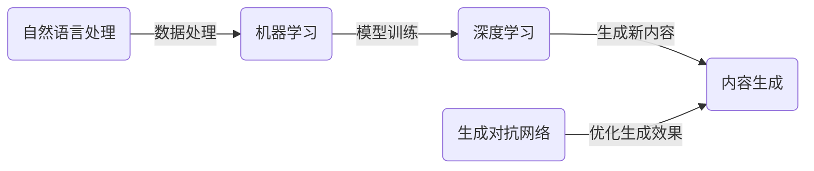

## 1. 背景介绍

内容生成技术在当今信息爆炸的时代扮演着越来越重要的角色。从自动撰写新闻报道到生成个性化的社交媒体内容，再到开发交互式游戏中的虚拟世界，内容生成的应用几乎遍布每一个数字化的角落。随着机器学习和人工智能的快速发展，内容生成不仅仅局限于简单的模板填充，它已经能够创造出前所未有的创意和深度。

## 2. 核心概念与联系

内容生成涉及多个核心概念，包括自然语言处理（NLP）、机器学习（ML）、深度学习（DL）、生成对抗网络（GAN）等。这些技术相互联系，共同构成了内容生成的基础框架。



## 3. 核心算法原理具体操作步骤

内容生成的核心算法原理可以分为以下几个步骤：

1. 数据收集与预处理：获取大量的文本数据，并进行清洗、标注等预处理工作。
2. 特征提取：使用NLP技术提取文本数据的关键特征。
3. 模型选择与训练：选择合适的机器学习模型，并用预处理后的数据进行训练。
4. 内容生成：利用训练好的模型生成新的内容。
5. 优化与迭代：通过用户反馈和生成对抗网络等技术对生成内容进行优化。

## 4. 数学模型和公式详细讲解举例说明

内容生成中常用的数学模型包括循环神经网络（RNN）、长短期记忆网络（LSTM）和Transformer等。以LSTM为例，其基本公式如下：

$$
\begin{align*}
f_t &= \sigma(W_f \cdot [h_{t-1}, x_t] + b_f) \\
i_t &= \sigma(W_i \cdot [h_{t-1}, x_t] + b_i) \\
\tilde{C}_t &= \tanh(W_C \cdot [h_{t-1}, x_t] + b_C) \\
C_t &= f_t * C_{t-1} + i_t * \tilde{C}_t \\
o_t &= \sigma(W_o \cdot [h_{t-1}, x_t] + b_o) \\
h_t &= o_t * \tanh(C_t)
\end{align*}
$$

其中，$f_t$、$i_t$、$o_t$分别是遗忘门、输入门和输出门的激活向量，$\tilde{C}_t$是候选细胞状态，$C_t$是细胞状态，$h_t$是输出向量，$\sigma$是sigmoid函数，$W$和$b$是模型参数。

## 5. 项目实践：代码实例和详细解释说明

以Python语言和TensorFlow框架为例，以下是一个简单的LSTM内容生成模型的代码实例：

```python
import tensorflow as tf

# 构建模型
model = tf.keras.Sequential([
    tf.keras.layers.Embedding(input_dim=vocab_size, output_dim=embedding_dim),
    tf.keras.layers.LSTM(units=rnn_units),
    tf.keras.layers.Dense(vocab_size)
])

# 编译模型
model.compile(optimizer='adam', loss=tf.keras.losses.SparseCategoricalCrossentropy(from_logits=True))

# 训练模型
model.fit(dataset, epochs=epochs)
```

在这个例子中，我们首先使用`Embedding`层将输入的文本转换为密集的向量表示，然后通过`LSTM`层来处理序列数据，最后通过`Dense`层生成预测的下一个词的概率分布。

## 6. 实际应用场景

内容生成技术在多个领域都有广泛的应用，例如：

- 新闻自动撰写
- 聊天机器人
- 个性化推荐系统
- 游戏开发中的故事情节生成

## 7. 工具和资源推荐

- TensorFlow和PyTorch：两个主流的深度学习框架。
- GPT-3和BERT：先进的预训练语言模型。
- Hugging Face Transformers：提供多种预训练模型的库。

## 8. 总结：未来发展趋势与挑战

内容生成技术的未来发展趋势包括更加智能化、个性化和创造性。同时，它也面临着诸如内容的真实性、生成效率和模型的可解释性等挑战。

## 9. 附录：常见问题与解答

Q1: 内容生成技术是否会取代人类创作者？
A1: 尽管内容生成技术在不断进步，但它更多的是作为人类创作者的辅助工具，而不是替代品。

Q2: 如何评估生成内容的质量？
A2: 可以通过多种方式评估，包括人工评审、用户反馈和自动评估指标（如BLEU、ROUGE等）。

作者：禅与计算机程序设计艺术 / Zen and the Art of Computer Programming