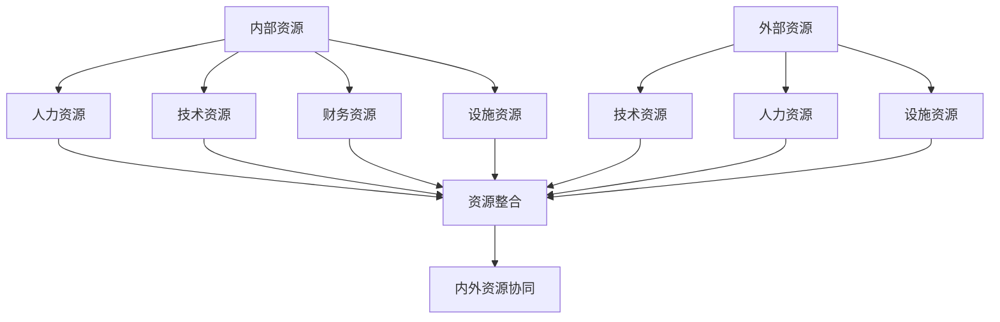
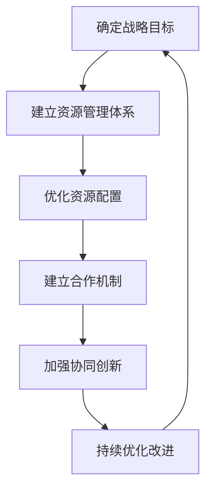

# 协调内部和外部资源，推动公司在科技领域的对外合作与交流

## 1.背景介绍

### 1.1 科技创新的重要性

在当今快节奏的商业环境中,科技创新已成为企业保持竞争优势和实现可持续发展的关键驱动力。科技的飞速发展不仅为企业带来了新的机遇,也带来了新的挑战。企业必须紧跟时代潮流,与时俱进,不断推陈出新,才能在激烈的市场竞争中立于不败之地。

### 1.2 内外资源整合的必要性 

然而,任何一家企业都不可能独自拥有所有的资源和技术。要实现持续创新,企业必须善于协调内部资源,同时积极寻求外部合作,整合内外资源,形成合力。只有这样,企业才能最大限度地发挥自身优势,补足短板,抓住机遇,应对挑战。

## 2.核心概念与联系

### 2.1 内部资源

内部资源是指企业自身拥有的各种资源,包括人力资源、技术资源、财务资源、设施资源等。协调好内部资源,是企业开展对外合作与交流的基础。

#### 2.1.1 人力资源

人力资源是企业最宝贵的资源。企业需要拥有一支高素质的研发团队,包括具备创新思维的科学家、工程师和技术人员,他们是企业技术创新的中流砥柱。同时,企业还需要专业的管理人员,负责制定战略规划、资源分配等工作。

#### 2.1.2 技术资源

技术资源包括企业掌握的专利技术、自主知识产权、研发设备等。企业必须在某些领域拥有核心技术,形成自身的技术壁垒,这是开展对外合作的基础和保障。

#### 2.1.3 财务资源

财务资源为企业的运营和发展提供资金支持。企业需要合理分配财务资源,保证研发投入,同时也要为对外合作预留足够的资金。

#### 2.1.4 设施资源

设施资源包括实验室、生产车间等硬件设施。先进的设施有利于提高研发效率,增强企业的创新能力。

### 2.2 外部资源

外部资源是指企业之外的各种资源,包括其他企业、科研机构、高校等单位拥有的资源。企业需要通过对外合作与交流,整合利用外部资源,弥补自身的不足。

#### 2.2.1 技术资源

其他企业、科研机构拥有的先进技术是宝贵的外部资源。通过技术合作、技术转让等方式,企业可以获取所需的技术资源,缩短自主研发的周期。

#### 2.2.2 人力资源

高校、研究所等单位拥有大量高素质的科研人才,这些人力资源可以通过项目合作、技术咨询等方式为企业提供智力支持。

#### 2.2.3 设施资源  

一些大型科研机构、高校拥有先进的实验设备和仪器,企业可以寻求合作使用这些设施资源,降低研发成本。

### 2.3 内外资源协同

内部资源和外部资源并非孤立存在,需要通过有效的协调机制实现内外资源的融合,形成1+1>2的协同效应。企业要建立科学的资源整合体系,充分利用内外资源,最大限度地发挥各种资源的作用。



## 3.核心算法原理具体操作步骤

协调内外资源,推动企业在科技领域的对外合作与交流,需要遵循一定的原理和步骤,具体如下:

### 3.1 确定战略目标

首先,企业需要明确自身的战略目标,确定需要发展的重点领域和方向。根据目标,分析内部资源的优势和不足,评估所需的外部资源,从而制定合理的资源协调方案。

### 3.2 建立资源管理体系

企业需要建立科学的资源管理体系,对内部资源进行系统梳理,全面掌握现有资源的情况。同时,要建立外部资源数据库,动态跟踪潜在合作对象的信息。

### 3.3 优化资源配置

根据战略目标和资源情况,合理配置内部资源,集中力量办大事。对于缺乏的资源,要积极寻求外部合作,获取所需资源。在资源配置过程中,要注重效率和成本控制。

### 3.4 建立合作机制

企业需要建立灵活高效的合作机制,畅通内外部沟通渠道。要制定明确的合作原则和流程,规范合作行为。同时,要重视合作关系的维护和管理,促进长期稳定的合作。

### 3.5 加强协同创新

内外资源的整合是为了实现协同创新。企业要营造良好的创新氛围,鼓励员工勇于创新。要建立创新激励机制,调动内外部人员的积极性。同时,要加强内外部的技术交流,促进知识共享和创意碰撞。

### 3.6 持续优化改进

资源协调是一个动态过程,需要持续优化和改进。企业要定期评估资源利用效率,发现问题并及时改正。要密切关注技术发展趋势,适时调整资源配置策略,保持领先优势。



## 4.数学模型和公式详细讲解举例说明

在资源协调过程中,可以借助一些数学模型和公式,对资源配置进行优化和决策支持。

### 4.1 资源配置优化模型

资源配置优化是一个典型的线性规划问题,可以用数学模型来描述和求解。假设企业有 $m$ 种资源,需要完成 $n$ 个项目,每个项目需要消耗不同数量的各种资源。我们用 $x_j$ 表示第 $j$ 个项目的重要程度,用 $c_{ij}$ 表示完成第 $j$ 个项目需要消耗的第 $i$ 种资源的数量,用 $b_i$ 表示第 $i$ 种资源的总量。则资源配置优化模型可以表示为:

$$
\max \sum_{j=1}^{n}x_j \\
\text{s.t.} \sum_{j=1}^{n}c_{ij}x_j \leq b_i, \quad i=1,2,\ldots,m \\
x_j \geq 0, \quad j=1,2,\ldots,n
$$

这是一个线性规划问题,可以使用单纯形法等算法求解。求解结果给出了每个项目的重要程度,从而指导资源的优化配置。

### 4.2 合作收益模型

在进行对外合作时,企业需要评估合作的收益和成本,以确定是否值得合作。我们可以建立合作收益模型,用数学公式来描述。

设企业与外部单位合作开发一项新技术,预计可以创造收益 $R$。企业需要投入资金 $C_1$,外部单位投入资金 $C_2$,双方的资金投入总和为 $C=C_1+C_2$。我们假设收益 $R$ 与投入成本 $C$ 满足如下关系:

$$
R=a(C-b)^2+c
$$

其中 $a,b,c$ 是常数,反映了收益与成本之间的非线性关系。企业的净收益为 $R-C_1$,外部单位的净收益为 $R-C_2$。通过求解这个模型,可以确定企业和外部单位的最优投入水平,使双方的净收益都达到最大。

上述只是资源协调过程中可以使用的两个简单数学模型,实际情况可能会更加复杂,需要建立更加精细的模型。但总的思路是一致的,即通过数学建模,对资源配置和合作决策进行量化分析和优化。

## 5.项目实践:代码实例和详细解释说明

为了更好地理解资源协调的原理和方法,我们来看一个实际的项目案例。某科技公司准备开发一款新的人工智能产品,需要协调内外部资源进行研发和推广。我们使用 Python 编程语言,通过代码实现对资源的模拟和优化配置。

### 5.1 项目概况

该人工智能产品需要以下主要资源:

- 人力资源:算法工程师、数据分析师、产品经理等
- 技术资源:深度学习框架、自然语言处理技术等
- 硬件资源:GPU服务器、存储设备等
- 财务资源:研发经费、推广费用等

公司内部拥有一定的人力、技术和硬件资源,但数量有限。因此需要与高校、科研机构等外部单位开展合作,获取所需资源。

### 5.2 数据准备

我们首先定义一些模拟数据,包括公司内部现有的各种资源,以及外部可获取的资源信息。

```python
# 内部资源
internal_resources = {
    '算法工程师': 10,
    '数据分析师': 5,
    '产品经理': 3,
    '深度学习框架': 2,
    'NLP技术': 1,
    'GPU服务器': 20,
    '存储设备': 50,
    '研发经费': 500  # 单位:万元
}

# 外部资源
external_resources = [
    {'名称': '大学A', '算法工程师': 8, '数据分析师': 6, 'NLP技术': 2, '研发经费': 300},
    {'名称': '科研院B', '深度学习框架': 3, 'GPU服务器': 50, '存储设备': 100, '研发经费': 400},
    {'名称': '公司C', 'NLP技术': 4, '推广费用': 800}
]
```

### 5.3 资源需求计算

根据产品的研发和推广需求,我们估算所需的各种资源数量。

```python
resource_requirements = {
    '算法工程师': 15,
    '数据分析师': 10,
    '产品经理': 5,
    '深度学习框架': 3,
    'NLP技术': 3,
    'GPU服务器': 40,
    '存储设备': 80,
    '研发经费': 800,
    '推广费用': 1000
}
```

### 5.4 资源缺口分析

通过比较内部资源和需求,计算出资源缺口,从而确定需要从外部获取的资源数量。

```python
resource_gap = {k: resource_requirements[k] - internal_resources.get(k, 0) for k in resource_requirements}
print('资源缺口:', resource_gap)
```

输出结果:

```
资源缺口: {'算法工程师': 5, '数据分析师': 5, '产品经理': 2, '深度学习框架': 1, 'NLP技术': 2, 'GPU服务器': 20, '存储设备': 30, '研发经费': 300, '推广费用': 1000}
```

### 5.5 合作对象选择

根据资源缺口情况,从外部资源列表中选择合适的合作对象,使得可获取的资源数量满足需求。

```python
selected_partners = []
for partner in external_resources:
    remaining_gap = resource_gap.copy()
    for resource, amount in partner.items():
        if resource != '名称':
            if resource in remaining_gap:
                remaining_gap[resource] = max(0, remaining_gap[resource] - amount)
    if all(value <= 0 for value in remaining_gap.values()):
        selected_partners.append(partner['名称'])

print('选择的合作对象:', selected_partners)
```

输出结果:

```
选择的合作对象: ['大学A', '科研院B', '公司C']
```

根据输出结果,公司需要与大学A、科研院B和公司C三个外部单位建立合作关系,以获取所需的全部资源。

### 5.6 资源优化配置

在获取了内外部资源之后,我们可以使用线性规划模