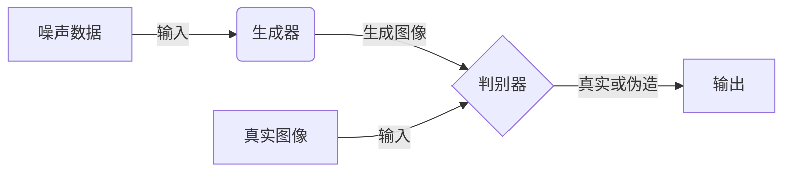
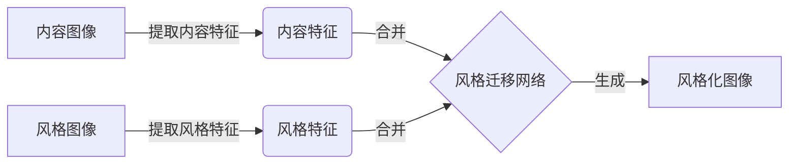
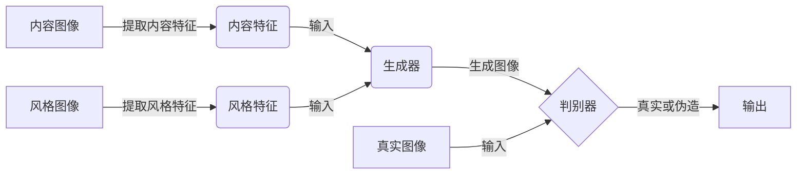

# 基于生成对抗网络的图像风格迁移在虚拟现实中的应用

## 1. 背景介绍

### 1.1 虚拟现实技术概述

虚拟现实(Virtual Reality, VR)是一种通过计算机模拟产生的一种人机交互环境,能够使用户沉浸在其中,并与虚拟世界进行自然交互。近年来,随着硬件设备的不断进步和算法技术的快速发展,VR技术已广泛应用于游戏、影视、教育、医疗等多个领域。

### 1.2 图像风格迁移的重要性

在虚拟现实应用中,视觉效果对用户体验至关重要。然而,传统的图像渲染方式通常难以满足真实感和艺术表现力的需求。图像风格迁移技术可以将一种艺术风格迁移到另一种图像上,赋予图像独特的视觉效果,从而提升虚拟环境的真实感和艺术表现力。

### 1.3 生成对抗网络在图像风格迁移中的作用

生成对抗网络(Generative Adversarial Networks, GANs)是一种基于深度学习的生成模型,由生成网络和判别网络组成。生成网络负责生成新的图像数据,而判别网络则判断生成的图像是否真实。两个网络相互对抗,最终使生成网络能够生成高质量的图像。GANs在图像风格迁移领域展现出了巨大的潜力,能够实现令人赞叹的视觉效果。

## 2. 核心概念与联系

### 2.1 生成对抗网络(GANs)

生成对抗网络由两个网络组成:生成器(Generator)和判别器(Discriminator)。生成器从噪声数据中生成新的图像样本,而判别器则判断生成的图像是真实的还是伪造的。两个网络相互对抗,生成器试图欺骗判别器,而判别器则试图区分真实和伪造的图像。



### 2.2 图像风格迁移

图像风格迁移是指将一种艺术风格应用到另一种图像上的过程。通过深度学习技术,可以提取图像的内容特征和风格特征,然后将目标风格特征迁移到内容图像上,生成具有特定风格的新图像。



### 2.3 GANs在图像风格迁移中的应用

将GANs应用于图像风格迁移,可以实现更加自然和逼真的风格迁移效果。生成器负责将内容图像和风格图像的特征融合,生成风格化图像;而判别器则判断生成的图像是否真实自然。通过不断训练,生成器可以学习到如何生成高质量的风格化图像。



## 3. 核心算法原理具体操作步骤

### 3.1 预处理数据

1. 收集内容图像和风格图像数据集
2. 对图像进行归一化和缩放处理,确保输入数据在相同的尺度范围内

### 3.2 提取图像特征

1. 使用预训练的卷积神经网络(如VGG-19)提取内容图像和风格图像的特征
2. 内容特征通常来自网络的较浅层,用于捕获图像的内容信息
3. 风格特征通常来自网络的较深层,用于捕获图像的纹理和风格信息

### 3.3 构建生成对抗网络

1. 构建生成器网络,输入为内容特征、风格特征和噪声向量,输出为风格化图像
2. 构建判别器网络,输入为真实图像或生成的风格化图像,输出为真实或伪造的概率

### 3.4 对抗训练

1. 初始化生成器和判别器的权重
2. 对判别器进行训练,使其能够区分真实图像和生成的风格化图像
3. 对生成器进行训练,目标是生成能够欺骗判别器的风格化图像
4. 重复第2步和第3步,直到生成器和判别器达到平衡

### 3.5 生成风格化图像

1. 使用训练好的生成器网络
2. 输入内容图像特征、风格图像特征和噪声向量
3. 生成器输出风格化图像

## 4. 数学模型和公式详细讲解举例说明

### 4.1 内容损失

内容损失用于保持生成图像的内容信息与原始内容图像相似。它是生成图像特征与内容图像特征之间的均方误差:

$$L_{content}(G) = \frac{1}{2} \sum_{i,j} (F_{ij}^{content} - F_{ij}^G)^2$$

其中 $F^{content}$ 是内容图像的特征图, $F^G$ 是生成图像的特征图, $i$ 和 $j$ 分别表示特征图的高度和宽度。

### 4.2 风格损失

风格损失用于匹配生成图像的风格与目标风格图像相似。它是基于格拉姆矩阵(Gram Matrix)计算的,格拉姆矩阵能够捕获特征之间的相关性,反映了图像的风格信息。

$$G^l_{ij} = \sum_k F_{ik}^l F_{jk}^l$$

其中 $G^l$ 是第 $l$ 层特征图的格拉姆矩阵, $F_{ik}^l$ 和 $F_{jk}^l$ 分别表示第 $l$ 层特征图的第 $i$ 个和第 $j$ 个特征向量。

风格损失定义为:

$$L_{style}(G, S) = \sum_l w_l E_l$$

$$E_l = \frac{1}{4N_l^2M_l^2} \sum_{i,j} (G_{ij}^l - S_{ij}^l)^2$$

其中 $G^l$ 和 $S^l$ 分别是生成图像和风格图像在第 $l$ 层的格拉姆矩阵, $N_l$ 和 $M_l$ 分别是第 $l$ 层特征图的高度和宽度, $w_l$ 是第 $l$ 层的权重。

### 4.3 总体损失函数

生成对抗网络的总体损失函数是内容损失、风格损失和对抗损失的加权和:

$$L_{total}(G, D) = \alpha L_{content}(G) + \beta L_{style}(G, S) + \gamma L_{adv}(G, D)$$

其中 $\alpha$、$\beta$ 和 $\gamma$ 分别是内容损失、风格损失和对抗损失的权重系数, $L_{adv}$ 是对抗损失,用于判别器和生成器的对抗训练。

在训练过程中,生成器 $G$ 试图最小化总体损失函数,而判别器 $D$ 则试图最大化对抗损失,以区分真实图像和生成图像。

## 5. 项目实践: 代码实例和详细解释说明

以下是使用PyTorch实现基于生成对抗网络的图像风格迁移的代码示例,包括数据加载、模型定义、训练过程和生成风格化图像等部分。

### 5.1 导入必要的库

```python
import torch
import torch.nn as nn
import torchvision.transforms as transforms
import torchvision.models as models
from PIL import Image
import matplotlib.pyplot as plt
```

### 5.2 定义模型

#### 5.2.1 内容损失和风格损失

```python
class ContentLoss(nn.Module):
    def __init__(self, target):
        super(ContentLoss, self).__init__()
        self.target = target.detach()

    def forward(self, input):
        self.loss = nn.functional.mse_loss(input, self.target)
        return input

def gram_matrix(input):
    batch_size, channels, height, width = input.size()
    features = input.view(batch_size, channels, height * width)
    gram = torch.bmm(features, features.transpose(1, 2))
    return gram.div(batch_size * channels * height * width)

class StyleLoss(nn.Module):
    def __init__(self, target_feature):
        super(StyleLoss, self).__init__()
        self.target = gram_matrix(target_feature).detach()

    def forward(self, input):
        G = gram_matrix(input)
        self.loss = nn.functional.mse_loss(G, self.target)
        return input
```

#### 5.2.2 生成器和判别器

```python
class Generator(nn.Module):
    def __init__(self):
        super(Generator, self).__init__()
        # 定义生成器网络结构

    def forward(self, content, style, noise):
        # 生成风格化图像

class Discriminator(nn.Module):
    def __init__(self):
        super(Discriminator, self).__init__()
        # 定义判别器网络结构

    def forward(self, img):
        # 判断图像是真实还是伪造
```

### 5.3 加载数据和预训练模型

```python
# 加载内容图像和风格图像
content_img = Image.open("content.jpg")
style_img = Image.open("style.jpg")

# 预处理图像
transform = transforms.Compose([
    transforms.ToTensor(),
    transforms.Normalize(mean=[0.485, 0.456, 0.406], std=[0.229, 0.224, 0.225])
])

content_tensor = transform(content_img).unsqueeze(0)
style_tensor = transform(style_img).unsqueeze(0)

# 加载预训练的VGG-19模型
vgg = models.vgg19(pretrained=True).features

# 获取内容特征和风格特征
content_features = vgg(content_tensor).relu4_2
style_features = [vgg(style_tensor)[i] for i in range(35)]
```

### 5.4 训练过程

```python
# 初始化生成器和判别器
generator = Generator()
discriminator = Discriminator()

# 定义损失函数和优化器
content_loss = ContentLoss(content_features)
style_losses = [StyleLoss(sf) for sf in style_features]
adversarial_loss = nn.BCELoss()

g_optimizer = torch.optim.Adam(generator.parameters(), lr=0.001)
d_optimizer = torch.optim.Adam(discriminator.parameters(), lr=0.001)

# 训练循环
for epoch in range(num_epochs):
    # 训练判别器
    for i in range(d_iter):
        # 计算对抗损失并更新判别器

    # 训练生成器
    for i in range(g_iter):
        # 计算内容损失、风格损失和对抗损失
        # 更新生成器
```

### 5.5 生成风格化图像

```python
# 生成风格化图像
with torch.no_grad():
    noise = torch.randn(1, noise_dim)
    stylized_img = generator(content_tensor, style_tensor, noise)

# 展示结果
plt.figure(figsize=(12, 4))
plt.subplot(1, 3, 1)
plt.imshow(content_img)
plt.title("Content Image")

plt.subplot(1, 3, 2)
plt.imshow(style_img)
plt.title("Style Image")

plt.subplot(1, 3, 3)
plt.imshow(stylized_img.squeeze().permute(1, 2, 0))
plt.title("Stylized Image")
plt.show()
```

上述代码实现了基于生成对抗网络的图像风格迁移。首先定义了内容损失、风格损失、生成器和判别器网络。然后加载内容图像和风格图像,并提取相应的特征。在训练过程中,通过交替优化生成器和判别器,使生成器能够生成具有目标风格且保留内容信息的风格化图像。最后,使用训练好的生成器生成风格化图像并展示结果。

## 6. 实际应用场景

基于生成对抗网络的图像风格迁移技术在虚拟现实领域有着广泛的应用前景:

1. **游戏和娱乐**: 在游戏和虚拟现实体验中,可以实时将不同的艺术风格应用于游戏场景和角色,为用户带来独特的视觉体验。

2. **虚拟旅游**: 通过风格迁移技术