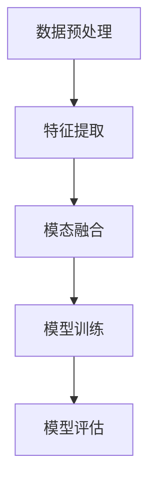

# 多模态大模型：技术原理与实战 多模态大模型在金融领域中的应用

## 1.背景介绍

在人工智能领域，多模态大模型（Multimodal Large Models, MLMs）正逐渐成为研究和应用的热点。多模态大模型通过整合不同类型的数据（如文本、图像、音频等），能够更全面地理解和处理复杂的任务。金融领域作为数据密集型行业，天然适合多模态大模型的应用。本文将深入探讨多模态大模型的技术原理、核心算法、数学模型，并结合实际项目实例，展示其在金融领域中的应用。

## 2.核心概念与联系

### 2.1 多模态数据

多模态数据指的是来自不同来源和类型的数据，如文本、图像、音频、视频等。在金融领域，多模态数据可以包括新闻文本、股票价格图表、财务报表、社交媒体评论等。

### 2.2 大模型

大模型通常指的是参数量巨大的深度学习模型，如GPT-3、BERT等。这些模型通过大规模数据训练，具备强大的特征提取和模式识别能力。

### 2.3 多模态大模型

多模态大模型结合了多模态数据和大模型的优势，能够同时处理和理解多种类型的数据，从而在复杂任务中表现出色。

### 2.4 联系

多模态大模型通过整合不同模态的数据，能够提供更全面的分析和预测能力。例如，在金融领域，结合新闻文本和股票价格图表，可以更准确地预测市场走势。

## 3.核心算法原理具体操作步骤

### 3.1 数据预处理

数据预处理是多模态大模型的基础步骤。不同模态的数据需要进行不同的预处理操作，如文本的分词、图像的归一化、音频的特征提取等。

### 3.2 特征提取

特征提取是将原始数据转换为模型可以处理的特征向量。对于文本数据，可以使用BERT等预训练模型进行特征提取；对于图像数据，可以使用ResNet等卷积神经网络。

### 3.3 模态融合

模态融合是多模态大模型的核心步骤。常见的模态融合方法包括早期融合、晚期融合和中期融合。早期融合将不同模态的数据在输入层进行融合；晚期融合在输出层进行融合；中期融合则在中间层进行融合。

### 3.4 模型训练

模型训练是多模态大模型的关键步骤。通过大规模数据训练，模型能够学习到不同模态数据之间的关联和模式。

### 3.5 模型评估

模型评估是验证多模态大模型性能的重要步骤。常见的评估指标包括准确率、召回率、F1值等。



## 4.数学模型和公式详细讲解举例说明

### 4.1 特征提取

假设我们有文本数据 $T$ 和图像数据 $I$，分别使用预训练模型 $f_T$ 和 $f_I$ 进行特征提取：

$$
\mathbf{h}_T = f_T(T)
$$

$$
\mathbf{h}_I = f_I(I)
$$

### 4.2 模态融合

对于早期融合，可以将特征向量进行拼接：

$$
\mathbf{h}_{fusion} = [\mathbf{h}_T; \mathbf{h}_I]
$$

对于晚期融合，可以将不同模态的数据分别通过全连接层，然后进行加权平均：

$$
\mathbf{h}_{fusion} = \alpha \cdot \mathbf{h}_T + \beta \cdot \mathbf{h}_I
$$

其中，$\alpha$ 和 $\beta$ 是权重参数。

### 4.3 模型训练

假设我们使用交叉熵损失函数进行模型训练：

$$
L = -\sum_{i=1}^{N} y_i \log(\hat{y}_i)
$$

其中，$y_i$ 是真实标签，$\hat{y}_i$ 是预测概率。

## 5.项目实践：代码实例和详细解释说明

### 5.1 数据预处理

```python
import pandas as pd
from transformers import BertTokenizer

# 加载文本数据
text_data = pd.read_csv('news.csv')
tokenizer = BertTokenizer.from_pretrained('bert-base-uncased')

# 文本分词
text_data['tokens'] = text_data['text'].apply(lambda x: tokenizer.encode(x, add_special_tokens=True))
```

### 5.2 特征提取

```python
from transformers import BertModel
import torch

# 加载预训练BERT模型
model = BertModel.from_pretrained('bert-base-uncased')

# 特征提取
def extract_features(tokens):
    inputs = torch.tensor(tokens).unsqueeze(0)
    with torch.no_grad():
        outputs = model(inputs)
    return outputs.last_hidden_state.mean(dim=1).squeeze().numpy()

text_data['features'] = text_data['tokens'].apply(extract_features)
```

### 5.3 模态融合

```python
import numpy as np

# 加载图像特征
image_features = np.load('image_features.npy')

# 模态融合
fused_features = np.concatenate([text_data['features'].values, image_features], axis=1)
```

### 5.4 模型训练

```python
from sklearn.model_selection import train_test_split
from sklearn.ensemble import RandomForestClassifier
from sklearn.metrics import accuracy_score

# 划分训练集和测试集
X_train, X_test, y_train, y_test = train_test_split(fused_features, labels, test_size=0.2, random_state=42)

# 训练随机森林模型
clf = RandomForestClassifier(n_estimators=100)
clf.fit(X_train, y_train)

# 模型评估
y_pred = clf.predict(X_test)
accuracy = accuracy_score(y_test, y_pred)
print(f'Accuracy: {accuracy}')
```

## 6.实际应用场景

### 6.1 股票价格预测

通过结合新闻文本和历史股票价格图表，多模态大模型可以更准确地预测股票价格走势。

### 6.2 风险管理

通过整合财务报表、市场新闻和社交媒体评论，多模态大模型可以更全面地评估企业的风险状况。

### 6.3 客户行为分析

通过结合客户的交易记录、社交媒体活动和客户服务记录，多模态大模型可以更准确地分析客户行为，提供个性化的金融服务。

## 7.工具和资源推荐

### 7.1 工具

- **Transformers**：用于文本特征提取的预训练模型库。
- **OpenCV**：用于图像处理和特征提取的开源库。
- **Scikit-learn**：用于模型训练和评估的机器学习库。

### 7.2 资源

- **Kaggle**：提供丰富的金融数据集和竞赛。
- **ArXiv**：提供最新的多模态大模型研究论文。

## 8.总结：未来发展趋势与挑战

多模态大模型在金融领域展现了巨大的潜力，但也面临一些挑战。首先，多模态数据的获取和预处理是一个复杂的过程，需要大量的计算资源和时间。其次，多模态大模型的训练和调优也需要高水平的技术和经验。未来，随着计算资源的提升和算法的改进，多模态大模型在金融领域的应用将更加广泛和深入。

## 9.附录：常见问题与解答

### 9.1 多模态大模型的优势是什么？

多模态大模型能够整合不同类型的数据，提供更全面的分析和预测能力。

### 9.2 如何选择合适的模态融合方法？

选择