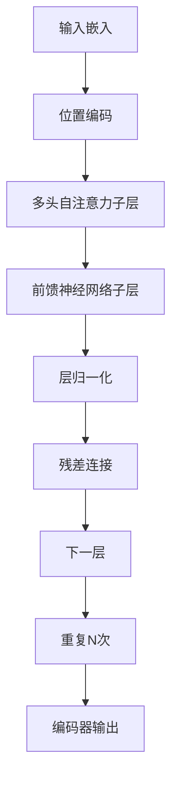
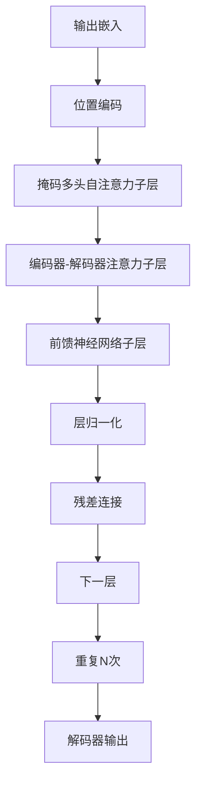

# 大规模语言模型从理论到实践 实践思考

## 1.背景介绍

### 1.1 人工智能的发展历程

人工智能(Artificial Intelligence, AI)是当代科技发展的热点领域之一,自20世纪50年代诞生以来,已经经历了几个重要的发展阶段。早期的人工智能系统主要采用符号主义方法,基于逻辑规则和知识库进行推理。20世纪80年代,机器学习和神经网络技术的兴起,使得人工智能系统能够从数据中自动学习模式,这推动了人工智能的发展。

### 1.2 深度学习的兴起

21世纪初,深度学习(Deep Learning)技术的出现,标志着人工智能进入了一个新的里程碑式的发展阶段。深度学习是机器学习的一种方法,它通过对数据进行表征学习,捕捉数据的高阶抽象特征,从而实现对复杂问题的建模和预测。

### 1.3 大规模语言模型的崛起

随着计算能力和数据量的不断增长,大规模语言模型(Large Language Model, LLM)应运而生。这些模型通过在海量文本数据上进行预训练,学习到了丰富的语言知识和上下文信息,展现出了惊人的自然语言理解和生成能力。

代表性的大规模语言模型有GPT(Generative Pre-trained Transformer)系列、BERT(Bidirectional Encoder Representations from Transformers)、XLNet、RoBERTa等。它们在自然语言处理的各种任务中表现出色,推动了人工智能在语言领域的飞速发展。

## 2.核心概念与联系  

### 2.1 自然语言处理(NLP)

自然语言处理(Natural Language Processing, NLP)是人工智能的一个重要分支,旨在使计算机能够理解和生成人类语言。它涉及多个子领域,包括语音识别、语义理解、对话系统、机器翻译、文本生成等。

### 2.2 表示学习(Representation Learning)

表示学习是深度学习的核心思想之一,旨在自动从原始数据中学习出有效的特征表示。在自然语言处理领域,表示学习的目标是将文本映射到一个连续的向量空间中,使得语义相似的文本具有相近的向量表示。

### 2.3 transformer模型

Transformer是一种全新的深度学习模型架构,它完全基于注意力机制(Attention Mechanism)来捕捉输入序列中元素之间的依赖关系。与传统的循环神经网络(RNN)相比,Transformer具有更好的并行计算能力,更容易捕捉长距离依赖关系,因此在自然语言处理任务中表现出色。

大规模语言模型通常采用Transformer作为基础架构,并在大规模语料库上进行预训练,学习通用的语言表示。这种预训练策略使得模型能够捕捉到丰富的语义和上下文信息,从而在下游任务中表现出惊人的泛化能力。

### 2.4 自注意力机制(Self-Attention)

自注意力机制是Transformer模型的核心组件。它通过计算输入序列中每个元素与其他元素之间的相关性分数,从而捕捉它们之间的依赖关系。与RNN不同,自注意力机制不需要按顺序处理序列,而是可以并行计算每个位置的注意力权重,从而提高了计算效率。

### 2.5 预训练与微调(Pre-training and Fine-tuning)

大规模语言模型通常采用两阶段的训练策略:预训练(Pre-training)和微调(Fine-tuning)。

在预训练阶段,模型在海量无标注语料库上进行自监督学习,学习通用的语言表示。常见的预训练目标包括掩码语言模型(Masked Language Modeling)和下一句预测(Next Sentence Prediction)等。

在微调阶段,将预训练模型的参数作为初始值,在特定任务的标注数据上进行进一步的监督微调,使模型适应特定的下游任务。这种策略可以有效地利用预训练模型学习到的通用知识,并将其迁移到目标任务上,大大提高了模型的性能和泛化能力。

## 3.核心算法原理具体操作步骤

大规模语言模型的核心算法原理主要包括以下几个方面:

### 3.1 transformer模型架构

transformer模型由编码器(Encoder)和解码器(Decoder)两部分组成,它们都是由多个相同的层堆叠而成。每一层都包含一个多头自注意力子层(Multi-Head Self-Attention Sublayer)和一个前馈神经网络子层(Feed-Forward Neural Network Sublayer)。

1. **编码器(Encoder)**

编码器的作用是将输入序列映射到一个连续的表示空间中。具体操作步骤如下:

a) 将输入序列转换为嵌入向量表示。
b) 添加位置编码,使模型能够捕捉序列的位置信息。
c) 通过多头自注意力子层捕捉输入序列中元素之间的依赖关系。
d) 通过前馈神经网络子层进一步提取特征。
e) 进行层归一化和残差连接,以保持梯度稳定性。
f) 重复上述操作N次,构建深层编码器。

2. **解码器(Decoder)**

解码器的作用是根据编码器的输出和输入序列生成目标序列。具体操作步骤如下:

a) 将输出序列转换为嵌入向量表示。
b) 添加位置编码。
c) 通过掩码多头自注意力子层捕捉已生成序列中元素之间的依赖关系。
d) 通过编码器-解码器注意力子层关注输入序列的相关部分。
e) 通过前馈神经网络子层进一步提取特征。
f) 进行层归一化和残差连接。
g) 重复上述操作N次,构建深层解码器。
h) 生成最终的输出序列。

### 3.2 自注意力机制(Self-Attention)

自注意力机制是transformer模型的核心组件,它通过计算输入序列中每个元素与其他元素之间的相关性分数,从而捕捉它们之间的依赖关系。具体操作步骤如下:

1. **计算注意力分数**

给定一个输入序列$X = (x_1, x_2, \dots, x_n)$,我们需要计算每个元素$x_i$与其他元素$x_j$之间的注意力分数$e_{ij}$。这通常由三个向量:查询向量(Query)$q_i$、键向量(Key)$k_j$和值向量(Value)$v_j$来计算,具体公式如下:

$$e_{ij} = \frac{q_i^T k_j}{\sqrt{d_k}}$$

其中$d_k$是缩放因子,用于防止点积过大导致的梯度不稳定问题。

2. **计算注意力权重**

通过对注意力分数进行softmax操作,我们可以得到注意力权重$\alpha_{ij}$:

$$\alpha_{ij} = \frac{exp(e_{ij})}{\sum_{k=1}^n exp(e_{ik})}$$

注意力权重$\alpha_{ij}$表示元素$x_i$对元素$x_j$的注意力程度。

3. **计算加权和**

最后,我们可以通过将值向量$v_j$加权求和,得到元素$x_i$的输出表示$y_i$:

$$y_i = \sum_{j=1}^n \alpha_{ij}v_j$$

上述过程被称为"缩放点积注意力"(Scaled Dot-Product Attention)。为了进一步提高模型的表现,transformer还引入了"多头注意力"(Multi-Head Attention)机制,它将注意力过程独立运行多次,然后将结果拼接起来,从而允许模型从不同的表示子空间中捕捉不同的依赖关系。

### 3.3 预训练策略

大规模语言模型通常采用自监督的预训练策略,在海量无标注语料库上学习通用的语言表示。常见的预训练目标包括:

1. **掩码语言模型(Masked Language Modeling, MLM)**

在输入序列中随机掩码一部分单词,模型需要根据上下文预测被掩码的单词。这种策略可以使模型学习到双向的语义和上下文信息。

2. **下一句预测(Next Sentence Prediction, NSP)** 

给定两个句子A和B,模型需要预测B是否为A的下一句。这种策略可以使模型捕捉到句子之间的关系和连贯性。

3. **因果语言模型(Causal Language Modeling, CLM)**

模型根据前面的上下文预测下一个单词,这种策略类似于传统的语言模型,但通过transformer架构可以更好地捕捉长距离依赖关系。

在预训练阶段,模型通过最小化上述目标函数的损失,不断调整参数,从而学习到通用的语言表示。

### 3.4 微调策略

在完成预训练后,我们可以将预训练模型的参数作为初始值,在特定任务的标注数据上进行进一步的监督微调,使模型适应特定的下游任务。常见的微调策略包括:

1. **全模型微调**

将整个预训练模型的参数作为初始值,在目标任务的数据上进行端到端的微调。这种策略可以充分利用预训练模型学习到的知识,但计算代价较高。

2. **前馈层微调**

只微调预训练模型的前馈神经网络层,而保持其他层(如自注意力层)的参数不变。这种策略计算代价较低,但可能无法充分利用预训练知识。

3. **预训练层微调**

在全模型微调的基础上,对预训练模型的部分层(如自注意力层)进行冻结,只微调其他层的参数。这种策略可以在计算代价和利用预训练知识之间取得平衡。

4. **辅助损失微调**

除了目标任务的损失函数外,还引入预训练目标(如MLM、NSP)的辅助损失函数,以保留预训练模型学习到的知识。

5. **层次微调**

分阶段进行微调,先在较低层次上进行微调,然后逐步提高层次,最后对整个模型进行微调。这种策略可以更好地利用预训练知识并避免灾难性遗忘。

微调策略的选择取决于具体任务的需求、数据量和计算资源等因素。合理的微调策略可以有效地将预训练模型的知识迁移到目标任务上,提高模型的性能和泛化能力。

## 4.数学模型和公式详细讲解举例说明

在大规模语言模型中,数学模型和公式扮演着重要的角色,它们为模型的核心算法提供了理论基础和计算框架。以下是一些关键的数学模型和公式,以及它们在实际应用中的详细讲解和举例说明。

### 4.1 注意力机制(Attention Mechanism)

注意力机制是transformer模型的核心组件,它允许模型在处理输入序列时,动态地关注与当前任务相关的部分,从而提高模型的性能和效率。

在注意力机制中,我们需要计算查询向量(Query)$q$与键向量(Key)$k$之间的相似性分数,作为注意力权重。常用的相似性度量函数是缩放点积(Scaled Dot-Product):

$$\text{Attention}(q, k, v) = \text{softmax}\left(\frac{qk^T}{\sqrt{d_k}}\right)v$$

其中$d_k$是键向量的维度,用于缩放点积,防止过大的值导致softmax函数的梯度较小。$v$表示值向量(Value),注意力机制的输出是值向量的加权和。

为了捕捉不同的子