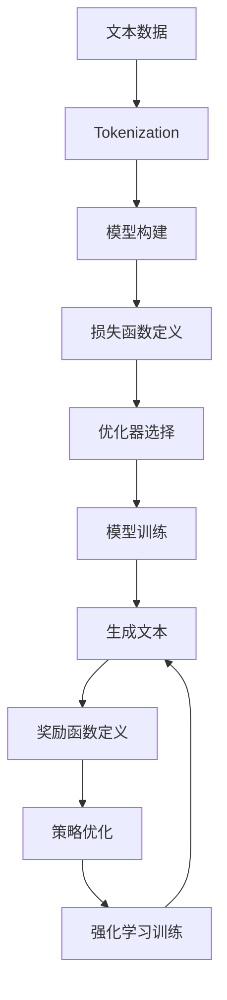

# 大语言模型原理与工程实践：Token-level 强化建模

## 1.背景介绍

在自然语言处理（NLP）领域，大语言模型（Large Language Models, LLMs）已经成为了研究和应用的热点。自从OpenAI发布了GPT系列模型以来，LLMs在生成文本、翻译、问答等任务中表现出了卓越的能力。大语言模型的核心在于其对语言的深度理解和生成能力，而这种能力的基础是对Token-level的精细建模。

Token-level建模是指在语言模型中，将文本分解为最小的语义单位（Token），并对这些Token进行建模和预测。通过对Token的精细建模，语言模型能够更准确地捕捉语言的语法和语义信息，从而生成更加自然和连贯的文本。

本文将深入探讨Token-level强化建模的原理与工程实践，帮助读者理解其核心概念、算法原理、数学模型、实际应用场景以及未来的发展趋势。

## 2.核心概念与联系

### 2.1 Token的定义

Token是语言模型中的基本单位，可以是一个字符、一个词或一个子词。Tokenization是将文本分解为Token的过程。常见的Tokenization方法包括字符级、词级和子词级Tokenization。

### 2.2 Token-level建模

Token-level建模是指在语言模型中，对每个Token进行独立的建模和预测。通过对Token的精细建模，语言模型能够更好地捕捉语言的细节和上下文信息。

### 2.3 强化学习

强化学习（Reinforcement Learning, RL）是一种机器学习方法，通过与环境的交互来学习最优策略。在Token-level建模中，强化学习可以用于优化语言模型的生成质量和连贯性。

### 2.4 Token-level强化建模

Token-level强化建模是将强化学习应用于Token-level建模，通过奖励机制来优化语言模型的生成过程。通过这种方法，模型能够更好地生成符合语法和语义的文本。

## 3.核心算法原理具体操作步骤

### 3.1 Tokenization

Tokenization是Token-level建模的第一步。常见的Tokenization方法包括：

- 字符级Tokenization：将文本分解为单个字符。
- 词级Tokenization：将文本分解为单个词。
- 子词级Tokenization：将文本分解为子词单元，如BPE（Byte Pair Encoding）和WordPiece。

### 3.2 模型训练

在Token-level建模中，常用的模型包括RNN、LSTM、GRU和Transformer。模型训练的步骤如下：

1. 数据预处理：对文本数据进行Tokenization和编码。
2. 模型构建：选择合适的模型架构，如Transformer。
3. 损失函数：定义损失函数，如交叉熵损失。
4. 优化器：选择优化器，如Adam。
5. 训练：使用训练数据进行模型训练。

### 3.3 强化学习优化

在Token-level建模中，强化学习可以用于优化模型的生成质量。具体步骤如下：

1. 定义奖励函数：根据生成文本的质量定义奖励函数。
2. 策略优化：使用强化学习算法（如PPO）优化生成策略。
3. 训练：通过与环境的交互，迭代优化模型。

以下是Token-level强化建模的Mermaid流程图：



## 4.数学模型和公式详细讲解举例说明

### 4.1 语言模型的数学表示

语言模型的目标是估计给定上下文的下一个Token的概率。假设给定一个Token序列 $x_1, x_2, ..., x_T$，语言模型的目标是最大化以下概率：

$$
P(x_1, x_2, ..., x_T) = \prod_{t=1}^{T} P(x_t | x_1, x_2, ..., x_{t-1})
$$

### 4.2 损失函数

在训练语言模型时，常用的损失函数是交叉熵损失。对于一个Token序列 $x_1, x_2, ..., x_T$，交叉熵损失定义为：

$$
L = -\sum_{t=1}^{T} \log P(x_t | x_1, x_2, ..., x_{t-1})
$$

### 4.3 强化学习中的奖励函数

在Token-level强化建模中，奖励函数用于评估生成文本的质量。假设生成的文本为 $y_1, y_2, ..., y_T$，奖励函数 $R$ 可以定义为：

$$
R(y_1, y_2, ..., y_T) = \sum_{t=1}^{T} r(y_t)
$$

其中，$r(y_t)$ 是在时间步 $t$ 的奖励值。

### 4.4 策略优化

在强化学习中，策略优化的目标是最大化期望奖励。假设策略为 $\pi$，期望奖励定义为：

$$
J(\pi) = \mathbb{E}_{\pi}[R(y_1, y_2, ..., y_T)]
$$

策略优化的目标是找到最优策略 $\pi^*$，使得期望奖励最大化：

$$
\pi^* = \arg\max_{\pi} J(\pi)
$$

## 5.项目实践：代码实例和详细解释说明

### 5.1 数据预处理

首先，我们需要对文本数据进行Tokenization和编码。以下是一个简单的示例代码：

```python
from transformers import BertTokenizer

# 加载预训练的BERT tokenizer
tokenizer = BertTokenizer.from_pretrained('bert-base-uncased')

# 对文本进行Tokenization
text = "Hello, how are you?"
tokens = tokenizer.tokenize(text)
print(tokens)

# 将Token转换为ID
token_ids = tokenizer.convert_tokens_to_ids(tokens)
print(token_ids)
```

### 5.2 模型构建

接下来，我们构建一个简单的Transformer模型：

```python
from transformers import BertModel

# 加载预训练的BERT模型
model = BertModel.from_pretrained('bert-base-uncased')

# 输入Token ID
input_ids = torch.tensor([token_ids])

# 获取模型输出
outputs = model(input_ids)
last_hidden_states = outputs.last_hidden_state
print(last_hidden_states)
```

### 5.3 强化学习优化

在强化学习优化中，我们使用PPO算法来优化生成策略。以下是一个简单的示例代码：

```python
import torch
import torch.nn as nn
import torch.optim as optim
from transformers import GPT2LMHeadModel, GPT2Tokenizer

# 加载预训练的GPT-2模型和tokenizer
model = GPT2LMHeadModel.from_pretrained('gpt2')
tokenizer = GPT2Tokenizer.from_pretrained('gpt2')

# 定义奖励函数
def reward_function(text):
    # 简单的奖励函数示例
    return len(text.split())

# 定义策略优化器
optimizer = optim.Adam(model.parameters(), lr=1e-5)

# 强化学习训练
for epoch in range(num_epochs):
    # 生成文本
    input_ids = tokenizer.encode("Hello, how are you?", return_tensors='pt')
    outputs = model.generate(input_ids, max_length=50)
    generated_text = tokenizer.decode(outputs[0], skip_special_tokens=True)
    
    # 计算奖励
    reward = reward_function(generated_text)
    
    # 计算损失
    loss = -reward
    
    # 反向传播和优化
    optimizer.zero_grad()
    loss.backward()
    optimizer.step()
    
    print(f"Epoch {epoch}, Loss: {loss.item()}, Generated Text: {generated_text}")
```

## 6.实际应用场景

### 6.1 文本生成

Token-level强化建模在文本生成任务中表现出色。通过对Token的精细建模和强化学习优化，模型能够生成更加自然和连贯的文本。

### 6.2 机器翻译

在机器翻译任务中，Token-level强化建模可以提高翻译的准确性和流畅性。通过对源语言和目标语言的Token进行建模，模型能够更好地捕捉语言之间的对应关系。

### 6.3 问答系统

Token-level强化建模在问答系统中也有广泛应用。通过对问题和答案的Token进行建模，模型能够更准确地理解问题并生成合适的答案。

## 7.工具和资源推荐

### 7.1 工具

- **Transformers**：由Hugging Face提供的开源库，支持多种预训练语言模型，如BERT、GPT-2等。
- **TensorFlow**：谷歌开发的开源机器学习框架，支持深度学习和强化学习。
- **PyTorch**：Facebook开发的开源深度学习框架，广泛应用于NLP和计算机视觉领域。

### 7.2 资源

- **论文**：阅读相关领域的最新研究论文，如《Attention is All You Need》、《BERT: Pre-training of Deep Bidirectional Transformers for Language Understanding》等。
- **书籍**：推荐阅读《深度学习》、《自然语言处理入门》等书籍，深入理解NLP和深度学习的基本原理。
- **在线课程**：Coursera、edX等平台提供了丰富的NLP和深度学习课程，可以帮助读者系统学习相关知识。

## 8.总结：未来发展趋势与挑战

### 8.1 未来发展趋势

- **更大规模的模型**：随着计算能力的提升，未来的大语言模型将会更加庞大，能够捕捉更多的语言细节和上下文信息。
- **多模态学习**：未来的语言模型将不仅限于文本，还会结合图像、音频等多种模态，提升模型的综合理解能力。
- **自监督学习**：自监督学习将成为未来语言模型训练的重要方法，通过利用大量无标签数据，提升模型的泛化能力。

### 8.2 挑战

- **计算资源**：训练大规模语言模型需要大量的计算资源和存储空间，如何高效利用资源是一个重要挑战。
- **数据隐私**：在使用大规模数据进行训练时，如何保护用户隐私和数据安全是一个亟待解决的问题。
- **模型解释性**：大语言模型的复杂性使得其内部机制难以解释，如何提升模型的可解释性是一个重要研究方向。

## 9.附录：常见问题与解答

### 9.1 什么是Token-level建模？

Token-level建模是指在语言模型中，将文本分解为最小的语义单位（Token），并对这些Token进行建模和预测。

### 9.2 强化学习在Token-level建模中的作用是什么？

强化学习在Token-level建模中用于优化模型的生成质量和连贯性。通过奖励机制，模型能够更好地生成符合语法和语义的文本。

### 9.3 如何选择合适的Tokenization方法？

选择合适的Tokenization方法取决于具体的任务和数据。字符级Tokenization适用于细粒度的文本分析，词级Tokenization适用于大多数NLP任务，子词级Tokenization适用于处理未登录词和多语言文本。

### 9.4 如何定义奖励函数？

奖励函数的定义取决于具体的任务目标。可以根据生成文本的质量、连贯性、语法正确性等因素定义奖励函数。

### 9.5 强化学习训练的难点是什么？

强化学习训练的难点在于奖励信号的稀疏性和高方差。需要设计合适的奖励函数和优化算法，才能有效地训练