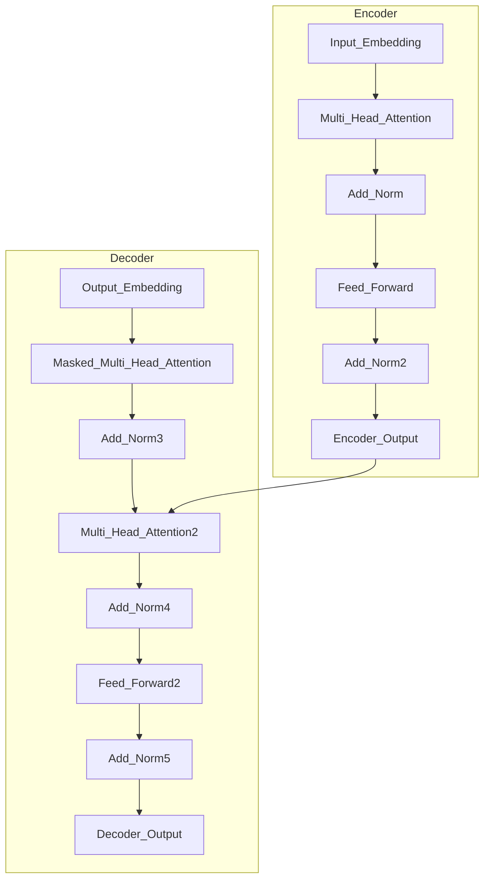

# 大语言模型原理与工程实践：工具设计

## 1.背景介绍

在当今数字时代,大型语言模型(Large Language Models, LLMs)已经成为人工智能领域最具影响力和应用前景的技术之一。LLMs是一种基于深度学习的自然语言处理模型,能够从海量文本数据中学习语言模式和语义关系,从而生成看似人类编写的自然语言输出。

LLMs的核心优势在于其通用性和可扩展性。与传统的规则化或统计方法不同,LLMs可以通过大规模预训练来学习各种任务所需的语言知识,并通过微调(fine-tuning)等技术将这些知识迁移到特定的下游任务中。这种通用学习范式使LLMs在广泛的自然语言处理任务中表现出色,包括机器翻译、文本生成、问答系统、语义分析等。

随着模型规模和训练数据的不断扩大,LLMs的性能也在不断提升。代表性的LLMs包括GPT-3、PaLM、Chinchilla、Bloom等,其参数规模已经超过数十亿,训练语料覆盖了互联网上海量的文本数据。这些模型展现出令人惊叹的语言生成能力,能够输出看似人类水平的文本,在某些特定场景下甚至超越了人类专家。

然而,LLMs的发展也面临着诸多挑战。首先是训练和推理成本的高昂,需要大量的计算资源和能源消耗。其次是模型的可解释性和可控性问题,大规模的黑盒模型容易出现意料之外的行为,存在潜在的安全隐患。此外,模型的公平性、伦理性以及对于知识产权的侵犯等问题,也需要在LLMs的开发和应用中受到高度重视。

为了充分发挥LLMs的潜力,同时规避其中的风险,我们需要在模型的基础理论、训练算法、工程实践等多个层面进行创新和优化。本文将围绕LLMs的核心原理和工程实践展开深入探讨,旨在为读者提供全面的理解和实用的指导。

## 2.核心概念与联系

### 2.1 自然语言处理基础

自然语言处理(Natural Language Processing, NLP)是人工智能领域的一个重要分支,旨在使计算机能够理解和生成人类可理解的自然语言。NLP涉及多个子领域,包括语言模型、机器翻译、文本分类、信息抽取、问答系统等。

传统的NLP系统通常采用规则化或统计学习的方法,需要大量的人工特征工程和领域知识。而近年来,基于深度学习的神经网络模型在NLP任务中取得了革命性的进展,极大地提高了系统的性能和通用性。

### 2.2 神经网络语言模型

神经网络语言模型(Neural Network Language Model, NNLM)是NLP领域中一种基于深度学习的语言模型,它能够从大规模语料中自动学习语言的统计规律。相比于传统的n-gram语言模型,NNLM具有更强的表达能力和泛化性能。

NNLM的核心思想是将词语表示为低维的密集向量(Word Embedding),并使用神经网络来建模语言的序列特性。常见的NNLM架构包括前馈神经网络语言模型、循环神经网络语言模型(RNN-LM)和transformer语言模型等。

### 2.3 transformer与自注意力机制

transformer是一种全新的基于自注意力机制(Self-Attention)的神经网络架构,它在2017年被提出并应用于机器翻译任务,取得了卓越的成绩。transformer完全抛弃了传统的循环神经网络和卷积神经网络结构,而是通过自注意力机制直接对输入序列进行建模。

自注意力机制的核心思想是允许每个位置的输出与输入序列的其他位置相关联,从而捕获远程依赖关系。与RNN相比,transformer架构具有更好的并行性,可以有效利用现代硬件(如GPU和TPU)的并行计算能力。此外,transformer还引入了位置编码(Positional Encoding)的概念,赋予序列元素位置信息。

### 2.4 大型语言模型(LLMs)

大型语言模型(Large Language Model, LLM)是指基于transformer架构,通过自监督学习方式在大规模文本语料上进行预训练的巨大神经网络模型。这种预训练方式使得LLM能够从海量的自然语言数据中学习通用的语言知识,并将这些知识迁移到各种下游NLP任务中。

LLM的核心优势在于其通用性和可扩展性。通过不断增加模型规模和训练数据量,LLM的性能可以持续提升。目前,一些顶尖的LLM如GPT-3、PaLM、Chinchilla等,其参数规模已经达到数十亿,展现出接近或超越人类的语言生成能力。

LLM的应用场景非常广泛,包括但不限于机器翻译、文本生成、问答系统、语义分析等。同时,LLM也可以作为基础模型,通过针对性的微调(fine-tuning)来适配各种特定的下游任务。

## 3.核心算法原理具体操作步骤

### 3.1 transformer模型架构

transformer模型的核心架构由编码器(Encoder)和解码器(Decoder)两个子模块组成。编码器的作用是将输入序列映射为一系列连续的表示向量,而解码器则根据这些表示向量生成输出序列。

1. **编码器(Encoder)**
    - 输入嵌入(Input Embedding)：将输入序列的每个token映射为一个连续的向量表示。
    - 多头自注意力(Multi-Head Attention)：计算当前token与输入序列中其他token的注意力权重,捕获序列内的依赖关系。
    - 残差连接(Add & Norm)：将注意力输出与输入相加,并进行层归一化(Layer Normalization),以保持梯度稳定性。
    - 前馈网络(Feed Forward)：对每个位置的表示应用两层全连接网络,进行非线性变换。
    - 堆叠多层(Stacking)：编码器由多个相同的子层堆叠而成,每层的输出作为下一层的输入。

2. **解码器(Decoder)**
    - 输出嵌入(Output Embedding)：将要生成的输出序列映射为连续向量表示。
    - 掩码多头自注意力(Masked Multi-Head Attention)：计算当前位置与输出序列之前位置的注意力,防止获取未来信息。
    - 多头注意力(Multi-Head Attention)：计算当前位置与编码器输出序列的注意力,融合输入序列的信息。
    - 前馈网络(Feed Forward)：与编码器类似,对每个位置的表示应用两层全连接网络。
    - 堆叠多层(Stacking)：解码器也由多个相同的子层堆叠而成。

编码器和解码器的输出向量序列将被进一步处理,生成最终的输出序列。在不同的任务中,transformer的具体结构可能有所变化,但基本架构保持不变。

### 3.2 自注意力机制

自注意力机制是transformer模型的核心部分,它允许每个位置的输出与输入序列的所有位置相关联,从而捕获远程依赖关系。自注意力的计算过程如下:

1. **计算注意力分数(Attention Scores)**

对于每个查询向量(Query)和键向量(Key)的组合,计算它们的点积,得到未缩放的注意力分数:

$$
\text{Attention}(Q, K, V) = \text{softmax}\left(\frac{QK^T}{\sqrt{d_k}}\right)V
$$

其中 $Q$ 表示查询向量, $K$ 表示键向量, $V$ 表示值向量, $d_k$ 是缩放因子,用于防止点积的方差过大导致梯度不稳定。

2. **多头注意力(Multi-Head Attention)**

为了捕获不同的子空间信息,transformer采用了多头注意力机制。具体做法是将查询/键/值向量线性投影到不同的子空间,分别计算注意力,最后将所有头的注意力输出拼接起来:

$$
\begin{aligned}
\text{MultiHead}(Q, K, V) &= \text{Concat}(\text{head}_1, \ldots, \text{head}_h)W^O\\
\text{where}\  \text{head}_i &= \text{Attention}(QW_i^Q, KW_i^K, VW_i^V)
\end{aligned}
$$

其中 $W_i^Q$、$W_i^K$、$W_i^V$ 和 $W^O$ 是可学习的线性投影参数。

3. **缩放点积注意力(Scaled Dot-Product Attention)**

在实际计算中,transformer采用了缩放点积注意力(Scaled Dot-Product Attention)的变体,具体计算公式如下:

$$
\text{Attention}(Q, K, V) = \text{softmax}\left(\frac{QK^T}{\sqrt{d_k}}\right)V
$$

其中 $\sqrt{d_k}$ 是缩放因子,用于防止点积的方差过大导致梯度不稳定。

自注意力机制赋予了transformer强大的建模能力,使其能够有效地捕获输入序列中的长程依赖关系,这是传统的循环神经网络和卷积神经网络所无法企及的。

### 3.3 位置编码

由于transformer模型完全抛弃了序列的递归结构,因此需要一种额外的机制来为序列中的每个元素编码位置信息。transformer采用了位置编码(Positional Encoding)的方法,将位置信息直接编码到输入的嵌入向量中。

位置编码向量是一个维度与嵌入向量相同的向量,其中奇数维度使用正弦函数编码位置,偶数维度使用余弦函数编码位置,具体公式如下:

$$
\begin{aligned}
PE_{(pos, 2i)} &= \sin\left(pos / 10000^{2i / d_{\text{model}}}\right)\\
PE_{(pos, 2i+1)} &= \cos\left(pos / 10000^{2i / d_{\text{model}}}\right)
\end{aligned}
$$

其中 $pos$ 表示token的位置索引, $i$ 表示维度索引, $d_{\text{model}}$ 是模型的嵌入维度。

通过对位置进行不同的正弦和余弦编码,位置编码向量能够唯一地表示序列中每个位置的相对位置和绝对位置信息。在模型的输入层,位置编码向量将直接与token的嵌入向量相加,从而将位置信息融入到模型的表示中。

### 3.4 transformer模型训练

transformer模型通常采用自监督学习的方式进行预训练,目标是最大化语言模型的概率,即给定上文,预测下一个token的条件概率。常见的预训练目标包括:

1. **掩码语言模型(Masked Language Modeling, MLM)**

在输入序列中随机掩码部分token,模型的目标是预测这些被掩码的token。MLM是BERT等模型采用的预训练目标。

2. **因果语言模型(Causal Language Modeling, CLM)** 

模型根据之前的上文,预测下一个token。CLM是GPT等模型采用的预训练目标。

3. **次新词预测(Next Sentence Prediction, NSP)**

给定两个句子,模型需要预测它们是否为连续的句子对。NSP是BERT采用的辅助预训练目标。

4. **序列到序列(Sequence-to-Sequence)**

模型需要根据输入序列生成相应的输出序列,常用于机器翻译等任务。

在预训练阶段,transformer模型会在大规模的文本语料上进行训练,学习通用的语言知识。预训练完成后,可以将模型应用到各种下游任务中,通过微调(fine-tuning)的方式进一步优化模型参数,使其适应特定的任