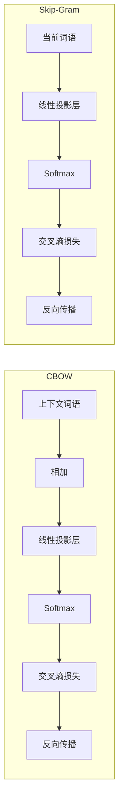
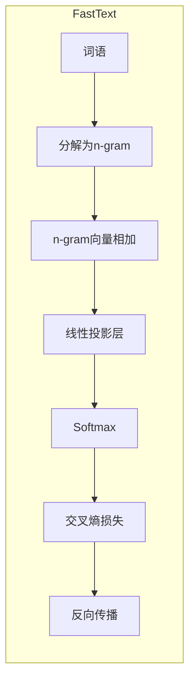
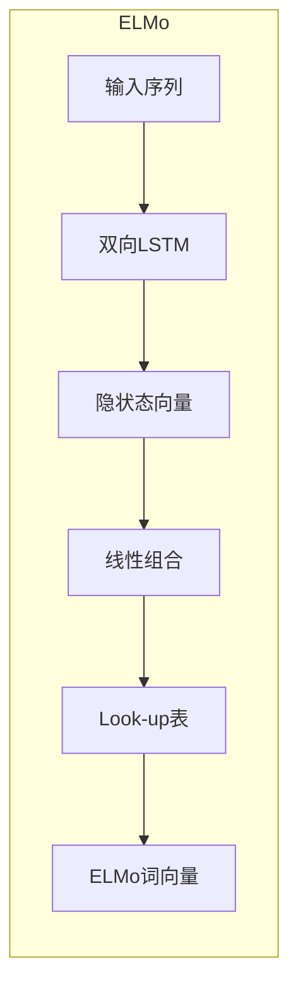
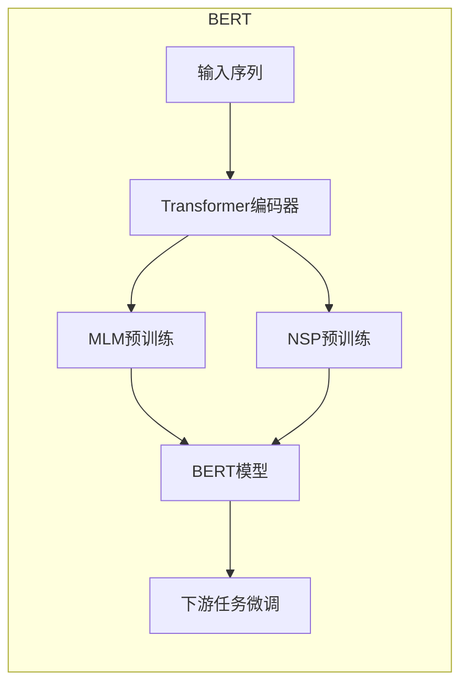

# 大语言模型原理与工程实践：词表示技术

## 1.背景介绍

随着深度学习技术的不断发展和计算能力的提升,大型语言模型(Large Language Model, LLM)已经成为自然语言处理领域的主流技术。LLM通过在大规模语料库上进行预训练,学习到丰富的语言知识,并可以通过微调等方式应用到下游任务中,取得了令人瞩目的成绩。

词表示(Word Representation)作为LLM的基础组成部分,对模型的性能有着至关重要的影响。传统的one-hot编码方式由于维度灾难和语义缺失等问题,已经无法满足现代LLM的需求。因此,研究高质量的词表示技术对于提升LLM的性能至关重要。

本文将系统地介绍当前主流的词表示技术,包括Word2Vec、GloVe、FastText、ELMo、BERT等,并深入探讨它们的原理、优缺点和应用场景。同时,我们还将分享一些工程实践中的技巧和经验,帮助读者更好地理解和应用这些技术。

## 2.核心概念与联系

### 2.1 词表示的作用

词表示技术的目标是将词语映射到一个连续的向量空间中,使得语义相似的词语在该向量空间中的距离也相近。高质量的词向量表示不仅能够捕捉词语的语义信息,还能够体现词语之间的关系,为下游的自然语言处理任务提供有价值的输入特征。

### 2.2 词表示技术的分类

根据训练方式的不同,词表示技术可以分为以下几类:

1. **基于统计的方法**,如Word2Vec、GloVe等,通过在大规模语料库上进行统计分析,学习词语的共现信息,从而获得词向量表示。
2. **基于语言模型的方法**,如ELMo、BERT等,通过预训练语言模型的方式,学习上下文信息,从而获得动态的词向量表示。
3. **基于知识库的方法**,利用已有的知识库(如WordNet等)构建词向量表示。
4. **基于子词的方法**,如FastText等,通过将词语分解为字符级或子词级的n-gram,从而学习子词的表示,进而组合得到词向量表示。

这些方法各有优缺点,在不同的应用场景下表现也不尽相同。我们将在后续章节中详细介绍它们的原理和特点。

## 3.核心算法原理具体操作步骤

### 3.1 Word2Vec

Word2Vec是一种高效的词向量训练算法,由Google的Tomas Mikolov等人于2013年提出。它包含两种模型:连续词袋模型(CBOW)和Skip-Gram模型。

#### 3.1.1 CBOW模型

CBOW模型的目标是根据上下文词语预测当前词语。具体来说,给定一个上下文窗口大小 $C$,对于任意一个词语 $w_t$,我们使用它周围的 $2C$ 个词语 $(w_{t-C}, \dots, w_{t-1}, w_{t+1}, \dots, w_{t+C})$ 作为输入,预测 $w_t$ 的概率:

$$P(w_t | w_{t-C}, \dots, w_{t-1}, w_{t+1}, \dots, w_{t+C})$$

该模型的训练过程如下:

1. 将上下文词语的one-hot向量相加,得到上下文向量 $x$。
2. 将上下文向量 $x$ 通过一个线性投影层,得到投影向量 $z = W^Tx + b$。
3. 将投影向量 $z$ 通过softmax函数,得到所有词语的概率分布 $\hat{y} = \text{softmax}(z)$。
4. 将预测概率 $\hat{y}$ 与真实标签 $y$ (目标词语的one-hot向量)计算交叉熵损失,并通过反向传播更新模型参数。

经过训练,我们可以得到词语的embedding向量,即投影层的权重矩阵 $W$。

#### 3.1.2 Skip-Gram模型

Skip-Gram模型的目标是根据当前词语预测上下文词语。具体来说,给定一个上下文窗口大小 $C$,对于任意一个词语 $w_t$,我们使用 $w_t$ 作为输入,预测它周围的 $2C$ 个词语 $(w_{t-C}, \dots, w_{t-1}, w_{t+1}, \dots, w_{t+C})$ 的概率:

$$\prod_{j=0, j\neq t}^{n} P(w_{j} | w_{t})$$

其训练过程与CBOW模型类似,只是输入和输出的角色互换。

Word2Vec的优点是训练速度快,计算效率高,能够很好地捕捉词语的语义信息。但它也存在一些缺陷,如无法处理词语的多义性、无法捕捉词语的位置信息等。

### 3.2 GloVe

GloVe(Global Vectors for Word Representation)是斯坦福大学于2014年提出的一种基于统计信息的词向量表示方法。它的核心思想是利用词语的全局统计信息(如词频、共现信息等)来训练词向量,使得词向量之间的点积能够恰好等于它们在语料库中的共现概率的对数值。

具体来说,GloVe模型定义了一个加权最小二乘函数:

$$J = \sum_{i,j=1}^{V} f(X_{ij})(w_i^Tw_j + b_i + b_j - \log X_{ij})^2$$

其中, $X_{ij}$ 表示词语 $i$ 和 $j$ 在语料库中的共现次数, $f(X_{ij})$ 是一个权重函数(通常使用 $\min(1, (X_{ij}/x_{\max})^\alpha)$), $w_i$ 和 $w_j$ 分别表示词语 $i$ 和 $j$ 的词向量, $b_i$ 和 $b_j$ 是对应的偏置项。

GloVe的训练过程是通过梯度下降法优化上述目标函数,从而学习到词向量 $w_i$ 和偏置项 $b_i$。

GloVe的优点是能够很好地捕捉词语的语义和句法信息,并且训练过程高效。但它也存在一些缺陷,如无法处理词语的多义性、无法捕捉词语的位置信息等。

### 3.3 FastText

FastText是Facebook于2016年提出的一种基于子词的词向量表示方法。它的核心思想是将每个词语分解为字符级或子词级的n-gram,并将词语的向量表示为其所有n-gram向量的加权和。

具体来说,对于一个词语 $w$,我们将其分解为一系列的n-gram $g_1, g_2, \dots, g_G$,则该词语的向量表示为:

$$v_w = \sum_{g=1}^{G} z_gv_g$$

其中, $v_g$ 表示n-gram $g$ 的向量表示, $z_g$ 是对应的权重系数。

FastText的训练过程与Word2Vec类似,只是输入不再是词语的one-hot向量,而是词语对应的n-gram的向量之和。

FastText的优点是能够很好地处理词语的形态变化和未见词语,并且训练速度快、计算效率高。但它也存在一些缺陷,如无法很好地捕捉词语的语义信息、无法处理词语的多义性等。

### 3.4 ELMo

ELMo(Embeddings from Language Models)是一种基于语言模型的词向量表示方法,由AI2于2018年提出。它的核心思想是利用双向语言模型(Bidirectional Language Model, BiLM)在大规模语料库上进行预训练,从而学习到上下文相关的动态词向量表示。

具体来说,ELMo使用一个双向LSTM作为语言模型的编码器,对于每个词语 $w_t$,我们可以得到其在前向和后向语言模型中的隐状态向量 $\overrightarrow{h}_{t}^{LM}$ 和 $\overleftarrow{h}_{t}^{LM}$,将它们拼接得到该词语的上下文相关的表示 $h_t^{LM} = [\overrightarrow{h}_{t}^{LM}; \overleftarrow{h}_{t}^{LM}]$。

为了获得更加通用的词向量表示,ELMo将语言模型的隐状态向量 $h_t^{LM}$ 与一个词级的Look-up表 $R_k$ 进行线性组合:

$$ELMo_k(w_t) = E(w_t) + \sum_{j=1}^{L} s_j^{task}h_t^{j}$$

其中, $E(w_t)$ 是词语 $w_t$ 在Look-up表 $R_k$ 中的词向量, $h_t^{j}$ 是语言模型第 $j$ 层的隐状态向量, $s_j^{task}$ 是对应的权重系数,通过在下游任务上进行监督微调得到。

ELMo的优点是能够捕捉词语的上下文语义信息,并且具有很强的泛化能力。但它也存在一些缺陷,如计算开销较大、无法很好地处理长距离依赖等。

### 3.5 BERT

BERT(Bidirectional Encoder Representations from Transformers)是一种基于Transformer编码器的预训练语言模型,由Google于2018年提出。它的核心思想是利用Masked Language Model(MLM)和Next Sentence Prediction(NSP)两个预训练任务,在大规模语料库上进行预训练,从而学习到上下文相关的动态词向量表示。

具体来说,BERT的预训练过程包括以下两个任务:

1. **Masked Language Model (MLM)**: 在输入序列中随机掩蔽一些词语,模型需要根据上下文预测这些被掩蔽的词语。
2. **Next Sentence Prediction (NSP)**: 给定两个句子 $A$ 和 $B$,模型需要预测 $B$ 是否为 $A$ 的下一个句子。

通过上述预训练任务,BERT能够学习到丰富的上下文语义信息,并且能够很好地捕捉长距离依赖关系。

在下游任务中,我们可以将BERT的输出作为词向量表示,或者在BERT的基础上进行微调,以适应特定的任务。

BERT的优点是能够捕捉丰富的上下文语义信息,并且具有很强的泛化能力。但它也存在一些缺陷,如计算开销较大、对长序列的处理能力有限等。

## 4.数学模型和公式详细讲解举例说明

在介绍了主流的词表示技术之后,我们将详细讲解其中涉及的一些数学模型和公式,并结合实例进行说明。

### 4.1 Word2Vec中的Softmax函数

在Word2Vec的CBOW和Skip-Gram模型中,我们需要使用Softmax函数将投影向量 $z$ 映射到一个概率分布 $\hat{y}$ 上,其公式如下:

$$\hat{y}_j = \frac{e^{z_j}}{\sum_{k=1}^{V}e^{z_k}}$$

其中, $V$ 表示词表的大小,