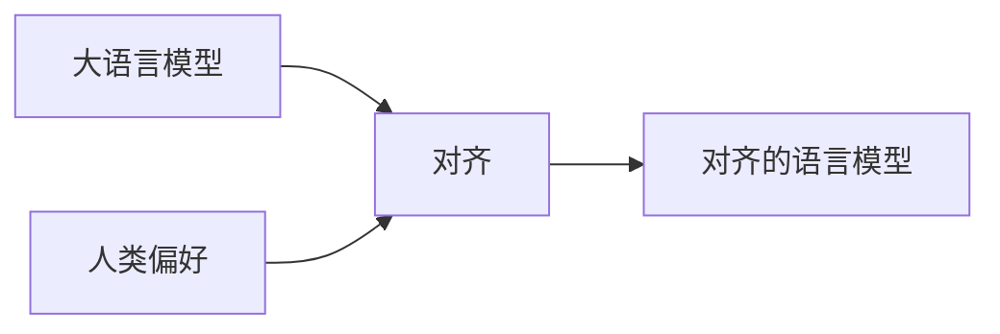

# 大语言模型原理基础与前沿 对齐语言模型与人类偏好

## 1. 背景介绍

### 1.1 大语言模型的发展历程
#### 1.1.1 早期的语言模型
#### 1.1.2 神经网络语言模型的兴起  
#### 1.1.3 Transformer模型的突破

### 1.2 大语言模型面临的挑战
#### 1.2.1 模型泛化能力不足
#### 1.2.2 模型输出可控性差
#### 1.2.3 模型伦理与安全问题

### 1.3 对齐人类偏好的必要性
#### 1.3.1 提高模型实用性
#### 1.3.2 规避潜在风险
#### 1.3.3 实现人机协作

## 2. 核心概念与联系

### 2.1 大语言模型
#### 2.1.1 定义与特点
#### 2.1.2 训练方法
#### 2.1.3 应用场景

### 2.2 人类偏好
#### 2.2.1 偏好的定义
#### 2.2.2 偏好的表示方法
#### 2.2.3 偏好的获取途径

### 2.3 对齐
#### 2.3.1 对齐的概念
#### 2.3.2 对齐的目标
#### 2.3.3 对齐的方法



## 3. 核心算法原理具体操作步骤

### 3.1 基于强化学习的对齐方法
#### 3.1.1 策略梯度算法
#### 3.1.2 近端策略优化算法
#### 3.1.3 逆强化学习算法

### 3.2 基于监督学习的对齐方法 
#### 3.2.1 偏好数据的构建
#### 3.2.2 损失函数的设计
#### 3.2.3 模型微调过程

### 3.3 混合学习范式
#### 3.3.1 强化学习与监督学习的结合
#### 3.3.2 多任务学习框架
#### 3.3.3 迁移学习策略

## 4. 数学模型和公式详细讲解举例说明

### 4.1 马尔可夫决策过程
#### 4.1.1 状态、动作、转移概率和奖励的定义
$$ S, A, P, R $$
#### 4.1.2 策略与价值函数
$$ \pi(a|s), V^{\pi}(s), Q^{\pi}(s,a) $$  
#### 4.1.3 贝尔曼方程
$$ V^{\pi}(s) = \sum_{a} \pi(a|s) \sum_{s',r} p(s',r|s,a)[r + \gamma V^{\pi}(s')] $$

### 4.2 策略梯度定理
#### 4.2.1 目标函数
$$ J(\theta) = \mathbb{E}_{\tau \sim p_{\theta}(\tau)}[R(\tau)] $$
#### 4.2.2 策略梯度
$$ \nabla_{\theta} J(\theta) = \mathbb{E}_{\tau \sim p_{\theta}(\tau)} [\sum_{t=0}^{T} \nabla_{\theta} \log \pi_{\theta}(a_t|s_t) Q^{\pi_{\theta}}(s_t, a_t)] $$
#### 4.2.3 随机策略梯度算法
$$ \theta \leftarrow \theta + \alpha \nabla_{\theta} J(\theta) $$

### 4.3 最大熵逆强化学习
#### 4.3.1 最大熵原理
$$ \mathop{\arg\max}_{\pi} H(\pi) = \mathop{\arg\max}_{\pi} (-\sum_{s,a} \pi(a|s) \log \pi(a|s)) $$
#### 4.3.2 奖励函数参数化
$$ R_{\theta}(s,a) = \theta^T \phi(s,a) $$
#### 4.3.3 学习目标
$$ \mathop{\max}_{\theta} \sum_{(s,a) \in D} \log \pi_{\theta}(a|s) $$

## 5. 项目实践：代码实例和详细解释说明

### 5.1 环境搭建
#### 5.1.1 安装必要的库
```bash
pip install torch transformers gymnasium
```
#### 5.1.2 定义环境接口
```python
import gymnasium as gym

class MyEnv(gym.Env): 
    def __init__(self):
        ...
    
    def step(self, action):
        ...
        
    def reset(self):
        ...
```

### 5.2 模型实现
#### 5.2.1 语言模型
```python
from transformers import GPT2LMHeadModel, GPT2Tokenizer

model = GPT2LMHeadModel.from_pretrained('gpt2')
tokenizer = GPT2Tokenizer.from_pretrained('gpt2')
```
#### 5.2.2 对齐模型
```python
class AlignedModel(nn.Module):
    def __init__(self, lm_model):
        ...
        
    def forward(self, state, action):
        ...
        
    def get_action(self, state):
        ...
```

### 5.3 训练流程
#### 5.3.1 加载人类偏好数据
```python
preferences = load_preferences(path)
```
#### 5.3.2 定义损失函数
```python 
def compute_loss(model, state, action, preference):
    ...
```
#### 5.3.3 模型微调
```python
def fine_tune(model, preferences, num_epochs):
    for epoch in range(num_epochs):
        for state, action, preference in preferences:
            loss = compute_loss(model, state, action, preference)
            loss.backward()
            optimizer.step()
```

## 6. 实际应用场景

### 6.1 智能对话系统
#### 6.1.1 个性化对话生成
#### 6.1.2 对话策略优化
#### 6.1.3 上下文感知能力

### 6.2 内容生成与推荐
#### 6.2.1 个性化内容生成
#### 6.2.2 用户偏好建模
#### 6.2.3 推荐系统优化

### 6.3 辅助决策支持
#### 6.3.1 偏好驱动的决策
#### 6.3.2 人机协作决策
#### 6.3.3 偏好学习与迁移

## 7. 工具和资源推荐

### 7.1 开源框架
#### 7.1.1 Hugging Face Transformers
#### 7.1.2 OpenAI Gym
#### 7.1.3 Stable Baselines3

### 7.2 预训练模型
#### 7.2.1 GPT系列模型
#### 7.2.2 BERT系列模型
#### 7.2.3 T5系列模型

### 7.3 数据集
#### 7.3.1 人类偏好数据集
#### 7.3.2 对话数据集
#### 7.3.3 推荐数据集

## 8. 总结：未来发展趋势与挑战

### 8.1 个性化与定制化
#### 8.1.1 模型适应不同用户
#### 8.1.2 在线学习用户偏好
#### 8.1.3 跨领域偏好迁移

### 8.2 人机协同
#### 8.2.1 主动学习人类反馈
#### 8.2.2 交互式偏好引导
#### 8.2.3 协作式任务完成

### 8.3 伦理与安全
#### 8.3.1 偏好数据的隐私保护
#### 8.3.2 模型输出的伦理约束
#### 8.3.3 对抗性偏好的鲁棒处理

## 9. 附录：常见问题与解答

### 9.1 如何获取高质量的人类偏好数据？
偏好数据的获取可以通过用户交互、反馈收集、行为记录等方式进行。需要注重数据的代表性、多样性和隐私保护。可以采用主动学习等策略提高数据效率。

### 9.2 对齐过程中如何平衡通用性与个性化？
通用性与个性化是一对矛盾。可以考虑先在大规模语料上进行预训练，再在特定领域或个人数据上进行微调。在对齐过程中，可以设置通用性和个性化的权重，实现动态平衡。

### 9.3 对齐模型能否迁移到新的领域或任务？
对齐模型学习到的是一种偏好适配能力，具有一定的泛化性。可以利用元学习、迁移学习等技术，将对齐模型迁移到新的领域或任务中。但需要注意不同领域间偏好分布的差异性。

作者：禅与计算机程序设计艺术 / Zen and the Art of Computer Programming