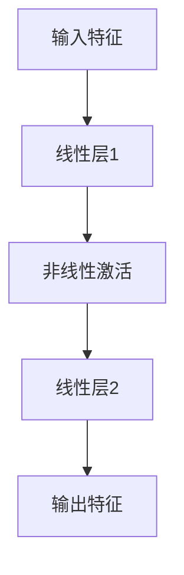
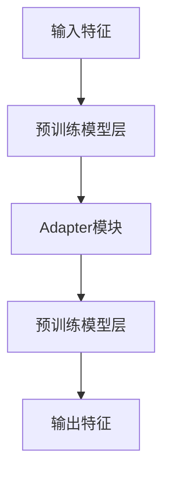

# 大语言模型应用指南：Adapter高效微调

## 1.背景介绍

在自然语言处理（NLP）领域，大语言模型（如GPT-3、BERT等）已经展示了其强大的能力。然而，这些模型通常需要大量的计算资源和数据来进行训练和微调。为了在特定任务中高效地利用这些模型，研究人员提出了多种微调方法，其中Adapter微调方法因其高效性和灵活性而备受关注。

Adapter是一种轻量级的微调方法，通过在预训练模型的各层之间插入小型的适配器模块来实现特定任务的微调。这种方法不仅减少了微调所需的计算资源，还能在多个任务之间共享预训练模型，从而提高了模型的通用性和可扩展性。

## 2.核心概念与联系

### 2.1 大语言模型

大语言模型是通过在大规模文本数据上进行预训练的深度学习模型，能够生成和理解自然语言。常见的大语言模型包括GPT系列、BERT、T5等。

### 2.2 微调

微调是指在预训练模型的基础上，通过在特定任务数据集上进行进一步训练，使模型能够更好地适应特定任务。传统的微调方法通常需要对整个模型进行训练，计算资源消耗较大。

### 2.3 Adapter

Adapter是一种轻量级的微调方法，通过在预训练模型的各层之间插入小型的适配器模块来实现特定任务的微调。适配器模块通常包含少量的参数，因此微调时只需训练这些模块，大大减少了计算资源的消耗。

### 2.4 核心联系

Adapter微调方法通过在预训练模型中插入适配器模块，实现了高效的微调。这种方法不仅保留了预训练模型的强大能力，还能在多个任务之间共享预训练模型，从而提高了模型的通用性和可扩展性。

## 3.核心算法原理具体操作步骤

### 3.1 Adapter模块设计

Adapter模块通常由两个线性层和一个非线性激活函数组成。第一个线性层将输入的高维特征降维，非线性激活函数引入非线性变换，第二个线性层将特征升维回原始维度。



### 3.2 插入Adapter模块

在预训练模型的每一层之间插入Adapter模块，使得输入特征经过Adapter模块的变换后再传递给下一层。



### 3.3 微调过程

在微调过程中，只需训练Adapter模块的参数，而预训练模型的参数保持不变。这大大减少了微调所需的计算资源。

### 3.4 具体操作步骤

1. **加载预训练模型**：加载预训练的大语言模型。
2. **设计Adapter模块**：设计适合特定任务的Adapter模块。
3. **插入Adapter模块**：在预训练模型的各层之间插入Adapter模块。
4. **微调模型**：在特定任务数据集上微调模型，只训练Adapter模块的参数。
5. **评估模型**：在验证集上评估微调后的模型性能。

## 4.数学模型和公式详细讲解举例说明

### 4.1 Adapter模块数学表示

设输入特征为 $X \in \mathbb{R}^{d}$，Adapter模块的降维矩阵为 $W_1 \in \mathbb{R}^{d \times d'}$，升维矩阵为 $W_2 \in \mathbb{R}^{d' \times d}$，非线性激活函数为 $f$，则Adapter模块的输出特征 $Y$ 表示为：

$$
Y = W_2 f(W_1 X)
$$

### 4.2 微调过程数学表示

设预训练模型的参数为 $\theta$，Adapter模块的参数为 $\phi$，特定任务的损失函数为 $L$，则微调过程的目标是最小化损失函数 $L$，即：

$$
\min_{\phi} L(\theta, \phi)
$$

在微调过程中，预训练模型的参数 $\theta$ 保持不变，只需优化Adapter模块的参数 $\phi$。

### 4.3 举例说明

假设我们有一个预训练的BERT模型，用于情感分析任务。我们设计一个Adapter模块，将输入特征的维度从768降到64，再升回768。具体步骤如下：

1. **加载预训练模型**：加载预训练的BERT模型。
2. **设计Adapter模块**：降维矩阵 $W_1 \in \mathbb{R}^{768 \times 64}$，升维矩阵 $W_2 \in \mathbb{R}^{64 \times 768}$，非线性激活函数为ReLU。
3. **插入Adapter模块**：在BERT模型的每一层之间插入Adapter模块。
4. **微调模型**：在情感分析数据集上微调模型，只训练Adapter模块的参数。
5. **评估模型**：在验证集上评估微调后的模型性能。

## 5.项目实践：代码实例和详细解释说明

### 5.1 环境准备

首先，确保你已经安装了必要的库，如Transformers和PyTorch。

```bash
pip install transformers torch
```

### 5.2 加载预训练模型

使用Transformers库加载预训练的BERT模型。

```python
from transformers import BertModel

# 加载预训练的BERT模型
model = BertModel.from_pretrained('bert-base-uncased')
```

### 5.3 设计Adapter模块

定义一个简单的Adapter模块。

```python
import torch.nn as nn

class Adapter(nn.Module):
    def __init__(self, input_dim, bottleneck_dim):
        super(Adapter, self).__init__()
        self.down_proj = nn.Linear(input_dim, bottleneck_dim)
        self.activation = nn.ReLU()
        self.up_proj = nn.Linear(bottleneck_dim, input_dim)

    def forward(self, x):
        x = self.down_proj(x)
        x = self.activation(x)
        x = self.up_proj(x)
        return x
```

### 5.4 插入Adapter模块

在BERT模型的每一层之间插入Adapter模块。

```python
class BertWithAdapters(nn.Module):
    def __init__(self, bert_model, adapter_dim):
        super(BertWithAdapters, self).__init__()
        self.bert = bert_model
        self.adapters = nn.ModuleList([Adapter(768, adapter_dim) for _ in range(12)])

    def forward(self, input_ids, attention_mask):
        outputs = self.bert(input_ids, attention_mask=attention_mask)
        hidden_states = outputs.last_hidden_state
        for i, adapter in enumerate(self.adapters):
            hidden_states = adapter(hidden_states)
        return hidden_states

# 创建带有Adapter的BERT模型
adapter_dim = 64
model_with_adapters = BertWithAdapters(model, adapter_dim)
```

### 5.5 微调模型

在情感分析数据集上微调模型。

```python
from transformers import AdamW, get_linear_schedule_with_warmup
from torch.utils.data import DataLoader, Dataset

# 定义数据集
class SentimentDataset(Dataset):
    def __init__(self, texts, labels, tokenizer, max_len):
        self.texts = texts
        self.labels = labels
        self.tokenizer = tokenizer
        self.max_len = max_len

    def __len__(self):
        return len(self.texts)

    def __getitem__(self, idx):
        text = self.texts[idx]
        label = self.labels[idx]
        encoding = self.tokenizer.encode_plus(
            text,
            add_special_tokens=True,
            max_length=self.max_len,
            return_token_type_ids=False,
            padding='max_length',
            truncation=True,
            return_attention_mask=True,
            return_tensors='pt',
        )
        return {
            'input_ids': encoding['input_ids'].flatten(),
            'attention_mask': encoding['attention_mask'].flatten(),
            'label': torch.tensor(label, dtype=torch.long)
        }

# 加载数据集
tokenizer = BertTokenizer.from_pretrained('bert-base-uncased')
train_dataset = SentimentDataset(train_texts, train_labels, tokenizer, max_len=128)
train_loader = DataLoader(train_dataset, batch_size=32, shuffle=True)

# 定义优化器和学习率调度器
optimizer = AdamW(model_with_adapters.parameters(), lr=2e-5)
total_steps = len(train_loader) * num_epochs
scheduler = get_linear_schedule_with_warmup(optimizer, num_warmup_steps