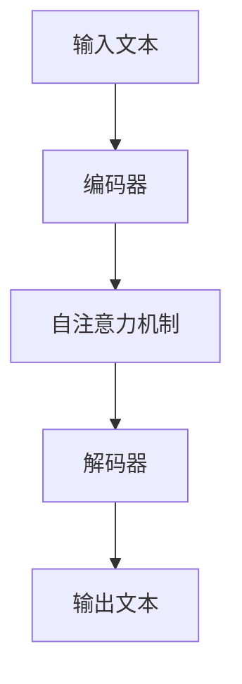

# 大语言模型应用指南：Completion交互格式

## 1.背景介绍

大语言模型（Large Language Models, LLMs）近年来在自然语言处理（NLP）领域取得了显著的进展。它们不仅在生成文本、翻译、问答等任务中表现出色，还在各种应用场景中展现了强大的潜力。Completion交互格式是大语言模型的一种重要应用形式，能够根据用户输入生成相应的文本输出。本文将深入探讨Completion交互格式的核心概念、算法原理、数学模型、实际应用及未来发展趋势。

## 2.核心概念与联系

### 2.1 大语言模型简介

大语言模型是基于深度学习技术训练的模型，能够理解和生成自然语言文本。典型的大语言模型包括GPT（Generative Pre-trained Transformer）系列、BERT（Bidirectional Encoder Representations from Transformers）等。

### 2.2 Completion交互格式

Completion交互格式是指用户输入一段文本，模型根据输入生成相应的补全文本。这种交互形式广泛应用于自动写作、代码补全、对话系统等领域。

### 2.3 语言模型与Completion的关系

语言模型通过学习大量文本数据中的语言模式，能够预测下一个词或句子，从而实现文本补全。Completion交互格式正是基于这种预测能力，生成符合上下文的文本。

## 3.核心算法原理具体操作步骤

### 3.1 预训练与微调

大语言模型通常采用预训练和微调两阶段训练策略。预训练阶段，模型在大规模文本数据上进行无监督学习，捕捉语言的基本模式。微调阶段，模型在特定任务数据上进行有监督学习，提升特定任务的性能。

### 3.2 Transformer架构

Transformer是大语言模型的核心架构，采用自注意力机制（Self-Attention）来捕捉文本中的长距离依赖关系。其基本结构包括编码器（Encoder）和解码器（Decoder）。



### 3.3 自注意力机制

自注意力机制通过计算输入序列中每个词与其他词的相关性，生成加权表示，从而捕捉长距离依赖关系。其计算公式如下：

$$
\text{Attention}(Q, K, V) = \text{softmax}\left(\frac{QK^T}{\sqrt{d_k}}\right)V
$$

其中，$Q$、$K$、$V$分别表示查询、键和值矩阵，$d_k$表示键的维度。

### 3.4 生成过程

在Completion交互格式中，生成过程通常采用自回归方式，即逐步生成下一个词，直到生成结束标志或达到最大长度。

## 4.数学模型和公式详细讲解举例说明

### 4.1 语言模型的概率分布

语言模型通过最大化训练数据的似然函数来学习文本的概率分布。给定输入序列 $x_1, x_2, \ldots, x_n$，模型的目标是最大化以下概率：

$$
P(x_1, x_2, \ldots, x_n) = \prod_{i=1}^{n} P(x_i | x_1, x_2, \ldots, x_{i-1})
$$

### 4.2 交叉熵损失函数

在训练过程中，常用的损失函数是交叉熵损失函数，其定义如下：

$$
L = -\frac{1}{N} \sum_{i=1}^{N} \sum_{j=1}^{V} y_{ij} \log(\hat{y}_{ij})
$$

其中，$N$表示样本数量，$V$表示词汇表大小，$y_{ij}$表示第$i$个样本中第$j$个词的真实标签，$\hat{y}_{ij}$表示模型预测的概率。

### 4.3 示例说明

假设输入序列为 "The cat is on the" ，模型需要预测下一个词。通过计算每个词的概率分布，模型可能生成 "mat" 作为下一个词，从而形成完整句子 "The cat is on the mat"。

## 5.项目实践：代码实例和详细解释说明

### 5.1 环境配置

首先，确保安装了必要的库，如transformers和torch。

```bash
pip install transformers torch
```

### 5.2 加载预训练模型

使用transformers库加载预训练的大语言模型。

```python
from transformers import GPT2LMHeadModel, GPT2Tokenizer

model_name = 'gpt2'
model = GPT2LMHeadModel.from_pretrained(model_name)
tokenizer = GPT2Tokenizer.from_pretrained(model_name)
```

### 5.3 文本生成

编写代码实现文本生成功能。

```python
def generate_text(prompt, max_length=50):
    inputs = tokenizer.encode(prompt, return_tensors='pt')
    outputs = model.generate(inputs, max_length=max_length, num_return_sequences=1)
    return tokenizer.decode(outputs[0], skip_special_tokens=True)

prompt = "The cat is on the"
generated_text = generate_text(prompt)
print(generated_text)
```

### 5.4 代码解释

上述代码首先加载预训练的GPT-2模型和对应的分词器，然后定义了一个文本生成函数。该函数接收用户输入的提示文本，生成相应的补全文本。

## 6.实际应用场景

### 6.1 自动写作

大语言模型可以用于自动写作，如新闻报道、小说创作等。通过提供开头部分，模型能够生成连贯的后续内容。

### 6.2 代码补全

在编程环境中，Completion交互格式可以用于代码补全，提升编程效率。例如，用户输入部分代码，模型自动补全剩余部分。

### 6.3 对话系统

在对话系统中，Completion交互格式可以用于生成自然的对话回复，提升用户体验。例如，用户提出问题，模型生成相应的回答。

### 6.4 翻译与摘要

大语言模型还可以用于文本翻译和摘要生成，通过Completion交互格式实现高质量的翻译和摘要。

## 7.工具和资源推荐

### 7.1 开源库

- [Transformers](https://github.com/huggingface/transformers): 提供多种预训练大语言模型及其应用接口。
- [TensorFlow](https://www.tensorflow.org/): 深度学习框架，支持大语言模型的训练和推理。
- [PyTorch](https://pytorch.org/): 另一种流行的深度学习框架，广泛用于大语言模型的研究和应用。

### 7.2 数据集

- [OpenAI GPT-3](https://beta.openai.com/): 提供大规模预训练模型及其API接口。
- [Google BERT](https://github.com/google-research/bert): 提供预训练的BERT模型及其应用示例。

### 7.3 在线资源

- [Hugging Face Model Hub](https://huggingface.co/models): 提供多种预训练模型及其应用示例。
- [Kaggle](https://www.kaggle.com/): 提供丰富的数据集和竞赛，适合大语言模型的研究和应用。

## 8.总结：未来发展趋势与挑战

### 8.1 未来发展趋势

大语言模型在未来将继续发展，可能会出现更大规模、更高性能的模型。同时，模型的应用场景也将不断扩展，如医疗、法律、教育等领域。

### 8.2 挑战与解决方案

尽管大语言模型取得了显著进展，但仍面临一些挑战，如计算资源消耗大、生成文本质量不稳定等。未来的研究将致力于优化模型结构、提升生成质量、降低计算成本。

## 9.附录：常见问题与解答

### 9.1 如何选择合适的大语言模型？

选择大语言模型时，应考虑任务需求、计算资源和模型性能。对于一般任务，GPT-2或BERT等预训练模型通常足够；对于高性能需求，可以选择GPT-3等更大规模的模型。

### 9.2 如何提升生成文本的质量？

提升生成文本质量的方法包括：微调模型、使用更大规模的预训练模型、调整生成参数（如温度、最大长度等）。

### 9.3 如何应对大语言模型的计算资源消耗？

应对计算资源消耗的方法包括：使用分布式训练、模型压缩技术（如量化、剪枝等）、选择合适的硬件（如GPU、TPU等）。

---

作者：禅与计算机程序设计艺术 / Zen and the Art of Computer Programming