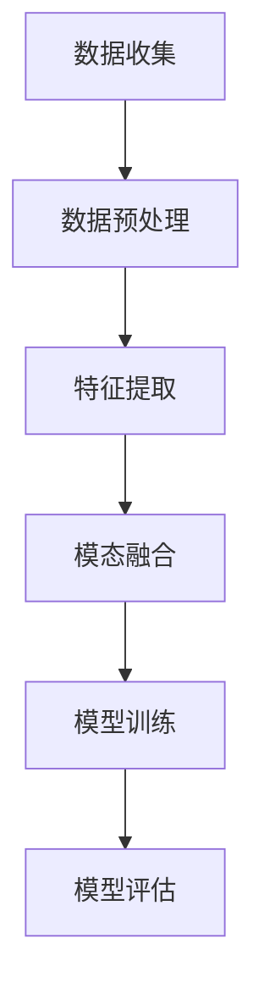

# 大语言模型应用指南：什么是多模态

## 1.背景介绍

在人工智能领域，特别是自然语言处理（NLP）和计算机视觉（CV）领域，近年来出现了一个重要的趋势：多模态学习。多模态学习指的是利用多种类型的数据（如文本、图像、音频等）来训练和应用模型。这种方法不仅能够提高模型的性能，还能使其在更多实际应用场景中发挥作用。

多模态学习的兴起得益于大语言模型（如GPT-3、BERT等）和深度学习技术的快速发展。这些模型通过处理大量的文本数据，已经在许多NLP任务中取得了显著的成果。然而，单一模态的数据往往无法全面反映现实世界的复杂性，因此多模态学习应运而生。

## 2.核心概念与联系

### 2.1 多模态数据

多模态数据是指包含多种类型信息的数据集。例如，一个多模态数据集可能同时包含文本、图像和音频信息。每种模态的数据都提供了不同的视角和信息，这些信息可以互补，从而提高模型的理解和预测能力。

### 2.2 多模态学习

多模态学习是指利用多种模态的数据来训练模型的方法。其核心思想是通过融合不同模态的数据，提升模型的性能和泛化能力。多模态学习可以分为以下几种类型：

- **早期融合**：在模型训练之前，将不同模态的数据进行融合。
- **中期融合**：在模型的中间层进行模态数据的融合。
- **晚期融合**：在模型的输出层进行模态数据的融合。

### 2.3 大语言模型与多模态学习的联系

大语言模型（如GPT-3）主要处理文本数据，但其架构和训练方法可以扩展到多模态学习中。例如，OpenAI的CLIP模型就是一个典型的多模态模型，它同时处理文本和图像数据，通过对比学习来理解和生成多模态信息。

## 3.核心算法原理具体操作步骤

### 3.1 数据预处理

在多模态学习中，数据预处理是一个关键步骤。不同模态的数据需要进行不同的预处理操作。例如，文本数据需要进行分词、去停用词等操作，而图像数据则需要进行归一化、裁剪等操作。

### 3.2 特征提取

特征提取是多模态学习的核心步骤之一。不同模态的数据需要通过不同的特征提取方法来提取有用的信息。例如，文本数据可以通过词嵌入（如Word2Vec、BERT）来提取特征，而图像数据则可以通过卷积神经网络（CNN）来提取特征。

### 3.3 模态融合

模态融合是指将不同模态的数据特征进行融合的过程。常见的模态融合方法包括：

- **拼接**：将不同模态的特征向量进行拼接。
- **加权平均**：对不同模态的特征向量进行加权平均。
- **注意力机制**：通过注意力机制来选择和融合不同模态的特征。

### 3.4 模型训练

在完成数据预处理、特征提取和模态融合之后，就可以进行模型训练了。常见的多模态模型包括多模态Transformer、CLIP等。这些模型通过处理多模态数据，能够在多个任务中取得优异的表现。

以下是一个多模态学习的Mermaid流程图：



## 4.数学模型和公式详细讲解举例说明

### 4.1 词嵌入

词嵌入是文本数据特征提取的常用方法。其核心思想是将词语映射到一个高维向量空间中，使得相似词语的向量距离较近。常见的词嵌入方法包括Word2Vec、GloVe和BERT。

例如，Word2Vec的Skip-gram模型的目标是最大化以下目标函数：

$$
\frac{1}{T} \sum_{t=1}^{T} \sum_{-c \leq j \leq c, j \neq 0} \log P(w_{t+j} | w_t)
$$

其中，$T$ 是文本中的词语总数，$c$ 是上下文窗口的大小，$w_t$ 是当前词语，$w_{t+j}$ 是上下文词语。

### 4.2 卷积神经网络（CNN）

卷积神经网络是图像数据特征提取的常用方法。其核心思想是通过卷积操作来提取图像的局部特征。一个典型的卷积层的输出可以表示为：

$$
y_{i,j,k} = \sum_{m,n} x_{i+m,j+n} \cdot w_{m,n,k} + b_k
$$

其中，$x$ 是输入图像，$w$ 是卷积核，$b$ 是偏置，$y$ 是输出特征图。

### 4.3 注意力机制

注意力机制是模态融合的常用方法。其核心思想是通过计算不同模态特征的加权平均来进行融合。一个典型的注意力机制可以表示为：

$$
\text{Attention}(Q, K, V) = \text{softmax}\left(\frac{QK^T}{\sqrt{d_k}}\right) V
$$

其中，$Q$ 是查询矩阵，$K$ 是键矩阵，$V$ 是值矩阵，$d_k$ 是键矩阵的维度。

## 5.项目实践：代码实例和详细解释说明

### 5.1 数据预处理

以下是一个简单的多模态数据预处理示例，包含文本和图像数据的预处理：

```python
import numpy as np
from sklearn.feature_extraction.text import CountVectorizer
from keras.preprocessing.image import img_to_array, load_img

# 文本数据预处理
texts = ["这是一个示例文本", "多模态学习很有趣"]
vectorizer = CountVectorizer()
text_features = vectorizer.fit_transform(texts).toarray()

# 图像数据预处理
image_path = "example.jpg"
image = load_img(image_path, target_size=(224, 224))
image_features = img_to_array(image) / 255.0

print("文本特征：", text_features)
print("图像特征：", image_features.shape)
```

### 5.2 特征提取

以下是一个使用预训练BERT模型进行文本特征提取的示例：

```python
from transformers import BertTokenizer, BertModel
import torch

tokenizer = BertTokenizer.from_pretrained('bert-base-uncased')
model = BertModel.from_pretrained('bert-base-uncased')

text = "This is an example text"
inputs = tokenizer(text, return_tensors='pt')
outputs = model(**inputs)

text_features = outputs.last_hidden_state
print("文本特征：", text_features.shape)
```

### 5.3 模态融合

以下是一个简单的模态融合示例，使用拼接方法：

```python
# 假设 text_features 和 image_features 已经提取
fused_features = np.concatenate((text_features.flatten(), image_features.flatten()), axis=0)
print("融合特征：", fused_features.shape)
```

### 5.4 模型训练

以下是一个简单的多模态模型训练示例，使用PyTorch框架：

```python
import torch.nn as nn
import torch.optim as optim

class MultiModalModel(nn.Module):
    def __init__(self, text_dim, image_dim, hidden_dim, output_dim):
        super(MultiModalModel, self).__init__()
        self.fc1 = nn.Linear(text_dim + image_dim, hidden_dim)
        self.fc2 = nn.Linear(hidden_dim, output_dim)

    def forward(self, x):
        x = torch.relu(self.fc1(x))
        x = self.fc2(x)
        return x

# 假设 fused_features 和 labels 已经准备好
model = MultiModalModel(text_dim=768, image_dim=150528, hidden_dim=512, output_dim=10)
criterion = nn.CrossEntropyLoss()
optimizer = optim.Adam(model.parameters(), lr=0.001)

# 训练循环
for epoch in range(10):
    optimizer.zero_grad()
    outputs = model(torch.tensor(fused_features, dtype=torch.float32))
    loss = criterion(outputs, torch.tensor(labels, dtype=torch.long))
    loss.backward()
    optimizer.step()
    print(f"Epoch {epoch+1}, Loss: {loss.item()}")
```

## 6.实际应用场景

### 6.1 图像字幕生成

图像字幕生成是一个典型的多模态应用场景。通过结合图像和文本数据，模型可以生成描述图像内容的字幕。例如，微软的CaptionBot就是一个成功的图像字幕生成系统。

### 6.2 视觉问答

视觉问答（Visual Question Answering, VQA）是另一个重要的多模态应用场景。VQA系统通过结合图像和文本数据，能够回答关于图像内容的问题。例如，VQA Challenge是一个著名的视觉问答竞赛。

### 6.3 多模态情感分析

多模态情感分析通过结合文本、图像和音频数据，能够更准确地识别用户的情感状态。例如，在社交媒体分析中，多模态情感分析可以帮助企业更好地了解用户的情感反馈。

## 7.工具和资源推荐

### 7.1 工具

- **Transformers**：由Hugging Face提供的预训练模型库，支持多种NLP任务。
- **OpenCV**：一个开源的计算机视觉库，支持图像处理和特征提取。
- **PyTorch**：一个流行的深度学习框架，支持多模态模型的构建和训练。

### 7.2 资源

- **ImageNet**：一个大型图像数据集，常用于图像分类和特征提取。
- **COCO**：一个多模态数据集，包含图像和对应的字幕信息。
- **VQA Dataset**：一个视觉问答数据集，包含图像和对应的问题-答案对。

## 