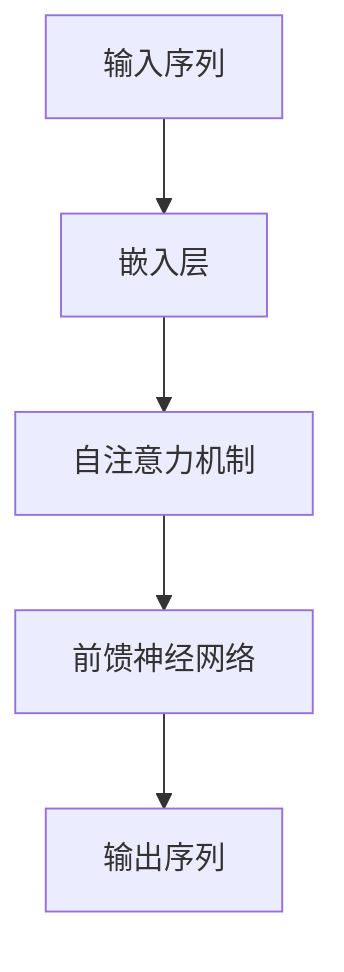

# 大语言模型应用指南：智能的可计算性

## 1.背景介绍

在过去的十年中，人工智能（AI）和机器学习（ML）技术取得了飞速的发展。特别是大语言模型（Large Language Models, LLMs），如OpenAI的GPT系列和Google的BERT，已经在自然语言处理（NLP）领域引起了广泛关注。这些模型不仅在学术界取得了显著的成果，还在工业界得到了广泛应用，从自动化客服到内容生成，LLMs正在改变我们的工作和生活方式。

### 1.1 大语言模型的定义

大语言模型是基于深度学习技术，特别是变换器（Transformer）架构，训练出来的能够理解和生成自然语言的模型。它们通过大量的文本数据进行训练，能够捕捉语言中的复杂模式和语义关系。

### 1.2 发展历程

大语言模型的发展可以追溯到早期的统计语言模型和神经网络语言模型。随着计算能力和数据量的增加，特别是Transformer架构的引入，LLMs的性能得到了显著提升。以下是一些关键的里程碑：

- **2017年**：Transformer架构的提出
- **2018年**：BERT模型的发布
- **2020年**：GPT-3模型的发布

### 1.3 重要性和应用前景

大语言模型在多个领域展现了巨大的潜力，包括但不限于：

- **自动化客服**：通过自然语言理解和生成，提供高效的客户服务。
- **内容生成**：自动生成高质量的文本内容，如新闻报道、技术文档等。
- **翻译和摘要**：提供高质量的机器翻译和文本摘要服务。

## 2.核心概念与联系

在深入探讨大语言模型的应用之前，我们需要理解一些核心概念和它们之间的联系。

### 2.1 变换器架构

变换器（Transformer）是大语言模型的基础架构。它通过自注意力机制（Self-Attention Mechanism）来捕捉输入序列中的长距离依赖关系。



### 2.2 自注意力机制

自注意力机制允许模型在处理每个词时，关注输入序列中的其他词，从而捕捉长距离依赖关系。其核心公式为：

$$
\text{Attention}(Q, K, V) = \text{softmax}\left(\frac{QK^T}{\sqrt{d_k}}\right)V
$$

其中，$Q$、$K$、$V$分别表示查询、键和值矩阵，$d_k$是键的维度。

### 2.3 预训练和微调

大语言模型通常采用预训练和微调的策略。预训练阶段，模型在大规模无监督数据上进行训练；微调阶段，模型在特定任务的有监督数据上进行训练。

### 2.4 生成与理解

大语言模型既可以用于生成任务（如文本生成），也可以用于理解任务（如文本分类）。这两类任务的核心区别在于输出的形式：生成任务输出连续的文本，而理解任务输出离散的标签。

## 3.核心算法原理具体操作步骤

在这一部分，我们将详细介绍大语言模型的核心算法原理和具体操作步骤。

### 3.1 数据预处理

数据预处理是大语言模型训练的第一步。它包括文本清洗、分词、嵌入等步骤。

#### 3.1.1 文本清洗

文本清洗包括去除噪声字符、标点符号、停用词等。

#### 3.1.2 分词

分词是将文本分解为单词或子词的过程。常用的分词方法包括BPE（Byte Pair Encoding）和WordPiece。

#### 3.1.3 嵌入

嵌入是将分词后的文本转换为向量表示。常用的嵌入方法包括Word2Vec、GloVe和BERT嵌入。

### 3.2 模型训练

模型训练是大语言模型的核心步骤。它包括前向传播、损失计算和反向传播。

#### 3.2.1 前向传播

前向传播是将输入数据通过模型，计算输出的过程。

#### 3.2.2 损失计算

损失计算是评估模型输出与真实标签之间差异的过程。常用的损失函数包括交叉熵损失和均方误差。

#### 3.2.3 反向传播

反向传播是通过计算梯度，更新模型参数的过程。

### 3.3 模型评估

模型评估是衡量模型性能的过程。常用的评估指标包括准确率、精确率、召回率和F1分数。

## 4.数学模型和公式详细讲解举例说明

在这一部分，我们将详细讲解大语言模型的数学模型和公式，并通过具体例子进行说明。

### 4.1 变换器的数学模型

变换器的核心是自注意力机制和前馈神经网络。其数学模型可以表示为：

$$
\text{Transformer}(X) = \text{FFN}(\text{SelfAttention}(X))
$$

其中，$X$表示输入序列，$\text{SelfAttention}$表示自注意力机制，$\text{FFN}$表示前馈神经网络。

### 4.2 自注意力机制的数学公式

自注意力机制的核心公式为：

$$
\text{Attention}(Q, K, V) = \text{softmax}\left(\frac{QK^T}{\sqrt{d_k}}\right)V
$$

其中，$Q$、$K$、$V$分别表示查询、键和值矩阵，$d_k$是键的维度。

### 4.3 前馈神经网络的数学公式

前馈神经网络的核心公式为：

$$
\text{FFN}(x) = \text{ReLU}(xW_1 + b_1)W_2 + b_2
$$

其中，$x$表示输入向量，$W_1$、$W_2$表示权重矩阵，$b_1$、$b_2$表示偏置向量。

### 4.4 示例说明

假设我们有一个输入序列 $X = [x_1, x_2, x_3]$，通过自注意力机制和前馈神经网络，我们可以计算输出序列 $Y = [y_1, y_2, y_3]$。具体步骤如下：

1. 计算查询、键和值矩阵：$Q = XW_Q$，$K = XW_K$，$V = XW_V$
2. 计算注意力权重：$A = \text{softmax}\left(\frac{QK^T}{\sqrt{d_k}}\right)$
3. 计算注意力输出：$O = AV$
4. 通过前馈神经网络计算最终输出：$Y = \text{FFN}(O)$

## 5.项目实践：代码实例和详细解释说明

在这一部分，我们将通过一个具体的项目实例，展示如何使用大语言模型进行文本生成任务。

### 5.1 项目简介

我们将使用GPT-3模型进行文本生成任务。具体来说，我们将输入一个文本提示，模型将生成相应的文本内容。

### 5.2 环境配置

首先，我们需要配置开发环境。以下是所需的库和工具：

- Python 3.8+
- OpenAI API
- Jupyter Notebook

### 5.3 代码实例

以下是一个简单的代码实例，展示如何使用GPT-3进行文本生成：

```python
import openai

# 设置API密钥
openai.api_key = 'your-api-key'

# 定义文本提示
prompt = "在未来的十年中，人工智能将如何改变我们的生活？"

# 调用GPT-3 API进行文本生成
response = openai.Completion.create(
    engine="davinci-codex",
    prompt=prompt,
    max_tokens=150
)

# 输出生成的文本
print(response.choices[0].text.strip())
```

### 5.4 详细解释

1. **设置API密钥**：首先，我们需要设置OpenAI API的密钥，以便访问GPT-3模型。
2. **定义文本提示**：我们定义了一个文本提示，作为输入给模型。
3. **调用GPT-3 API**：我们使用OpenAI的Completion.create方法，调用GPT-3模型进行文本生成。
4. **输出生成的文本**：最后，我们输出模型生成的文本内容。

## 6.实际应用场景

大语言模型在多个实际应用场景中展现了巨大的潜力。以下是一些典型的应用场景：

### 6.1 自动化客服

大语言模型可以用于自动化客服，通过自然语言理解和生成，提供高效的客户服务。例如，使用GPT-3模型，可以自动回答客户的常见问题，减少人工客服的工作量。

### 6.2 内容生成

大语言模型可以用于自动生成高质量的文本内容，如新闻报道、技术文档等。例如，使用GPT-3模型，可以自动生成技术博客文章，节省人力成本。

### 6.3 翻译和摘要

大语言模型可以用于提供高质量的机器翻译和文本摘要服务。例如，使用BERT模型，可以自动将英文文档翻译成中文，或者生成文档的