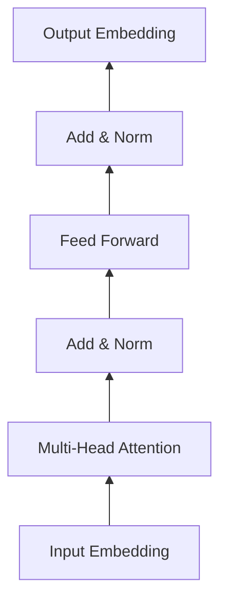

# 大语言模型应用指南：网页实时浏览

## 1. 背景介绍

### 1.1 大语言模型的崛起
近年来,随着深度学习技术的飞速发展,大语言模型(Large Language Model,LLM)在自然语言处理(NLP)领域取得了突破性进展。从GPT系列到BERT,再到最新的ChatGPT,大语言模型展现出了惊人的语言理解和生成能力,引发了学术界和工业界的广泛关注。

### 1.2 大语言模型的应用潜力
大语言模型强大的语义理解和语言生成能力,为许多实际应用场景带来了新的可能性。其中,将大语言模型应用于网页实时浏览,有望极大地提升用户的上网体验,为信息检索、内容生成等任务提供智能化支持。

### 1.3 本文的目的和结构
本文旨在探讨如何将大语言模型应用于网页实时浏览,为读者提供一份全面的技术指南。全文分为9个部分:背景介绍,核心概念与联系,核心算法原理,数学模型和公式,项目实践,实际应用场景,工具和资源推荐,未来发展趋势与挑战,以及常见问题解答。通过对这些内容的深入阐述,帮助读者掌握大语言模型在网页浏览中的应用要点。

## 2. 核心概念与联系

### 2.1 大语言模型
大语言模型是一类基于深度学习的语言模型,通过在海量文本数据上进行预训练,学习到丰富的语言知识和语义表示。典型的大语言模型包括GPT系列、BERT、T5等。它们通常采用Transformer等注意力机制的神经网络结构,具有强大的语言理解和生成能力。

### 2.2 网页实时浏览
网页实时浏览是指用户通过浏览器访问和浏览网页内容的过程。在这个过程中,浏览器需要解析HTML、CSS、JavaScript等网页元素,并将其渲染成可视化的页面呈现给用户。同时,用户可以通过点击链接、填写表单、搜索关键词等交互行为与网页进行互动。

### 2.3 大语言模型与网页浏览的结合
将大语言模型应用于网页实时浏览,可以从多个方面增强用户的浏览体验:

1. 智能搜索:利用大语言模型对用户输入的搜索词进行语义理解,提供更加精准和个性化的搜索结果。
2. 内容生成:通过大语言模型自动生成高质量的网页内容,如新闻摘要、产品描述等,减轻人工编辑的工作量。  
3. 交互式问答:基于大语言模型构建智能客服系统,实时解答用户在浏览网页时的各种疑问。
4. 个性化推荐:根据用户的浏览历史和兴趣偏好,利用大语言模型推荐相关的网页内容。

通过将大语言模型与网页浏览深度结合,可以带来更加智能、高效、个性化的用户体验。

## 3. 核心算法原理具体操作步骤

### 3.1 大语言模型的预训练
大语言模型的预训练通常分为以下几个步骤:

1. 构建海量文本语料库,包括网页、书籍、新闻等各种类型的文本数据。
2. 对文本数据进行清洗、标准化等预处理操作,转换为模型可接受的格式。
3. 选择合适的神经网络结构,如Transformer、GPT等,设计模型的架构。
4. 使用无监督的预训练任务,如语言模型、掩码语言模型等,在大规模语料上训练模型。
5. 通过梯度下降等优化算法不断更新模型参数,使其学习到语言的统计规律和语义表示。
6. 在验证集上评估模型性能,调整超参数,进行多轮迭代训练,直到模型收敛。

经过预训练,大语言模型掌握了丰富的语言知识,具备了强大的语言理解和生成能力。

### 3.2 基于大语言模型的网页内容生成
利用预训练好的大语言模型,可以自动生成高质量的网页内容。具体步骤如下:

1. 确定生成内容的主题、风格、长度等属性,作为模型的输入条件。
2. 将输入条件转换为模型可接受的格式,如token序列、特殊标记等。
3. 将格式化的输入传递给大语言模型,让模型基于输入生成连贯、流畅的文本内容。
4. 对生成的内容进行后处理,如去除重复、矫正语法错误、调整格式等。
5. 将生成的内容填充到网页的相应位置,与其他元素进行整合,形成完整的网页。

通过大语言模型的内容生成能力,可以自动创作出大量高质量的网页内容,提高内容生产效率。

### 3.3 基于大语言模型的智能搜索与问答
大语言模型可以用于增强网页的搜索和问答功能,提供更加智能的用户交互体验。具体步骤如下:

1. 用户输入搜索词或问题,系统将其转换为模型可处理的格式。
2. 将用户输入传递给预训练好的大语言模型,让模型对输入进行语义理解和匹配。
3. 模型根据语义相似度,从网页内容库中检索出与用户输入最相关的内容片段。
4. 对检索出的内容进行排序、过滤,选取置信度最高的结果作为搜索或问答的输出。
5. 将输出结果呈现给用户,提供友好的交互界面,允许用户进一步浏览或提问。

基于大语言模型的智能搜索和问答,可以准确理解用户的意图,提供更加精准、人性化的服务。

## 4. 数学模型和公式详细讲解举例说明

### 4.1 Transformer 模型
Transformer 是大语言模型的核心组件之一,其结构如下图所示:



Transformer 的核心是自注意力机制(Self-Attention),可以捕捉序列内部的长距离依赖关系。对于输入序列 $X=(x_1,\ldots,x_n)$,自注意力的计算过程为:

$$
\begin{aligned}
Q &= XW^Q \\
K &= XW^K \\
V &= XW^V \\
\text{Attention}(Q,K,V) &= \text{softmax}(\frac{QK^T}{\sqrt{d_k}})V
\end{aligned}
$$

其中,$Q$,$K$,$V$ 分别为查询、键、值矩阵,$W^Q$,$W^K$,$W^V$ 为可学习的参数矩阵。自注意力通过查询和键的相似度计算序列内部的关联性,并根据值进行加权求和,得到新的表示。

多头注意力(Multi-Head Attention)通过并行计算多个自注意力,增强模型的表达能力:

$$
\begin{aligned}
\text{MultiHead}(Q,K,V) &= \text{Concat}(\text{head}_1,\ldots,\text{head}_h)W^O \\
\text{head}_i &= \text{Attention}(QW_i^Q,KW_i^K,VW_i^V)
\end{aligned}
$$

其中,$W_i^Q$,$W_i^K$,$W_i^V$,$W^O$ 为可学习的参数矩阵。

除了多头注意力,Transformer 还包括残差连接(Residual Connection)、层归一化(Layer Normalization)和前馈神经网络(Feed Forward Network)等组件,共同构成了强大的序列建模能力。

### 4.2 GPT 模型
GPT(Generative Pre-trained Transformer)是基于 Transformer 解码器结构的语言模型,其数学形式为:

$$
p(x) = \prod_{i=1}^n p(x_i|x_{<i})
$$

其中,$x=(x_1,\ldots,x_n)$ 为输入序列,$p(x_i|x_{<i})$ 表示在给定前 $i-1$ 个 token 的条件下,第 $i$ 个 token 的条件概率。

GPT 通过最大化似然函数来训练模型参数 $\theta$:

$$
\mathcal{L}(\theta) = \sum_{i=1}^n \log p_\theta(x_i|x_{<i})
$$

在预训练阶段,GPT 在大规模无标注语料上进行自回归学习,掌握了语言的统计规律和生成能力。在应用阶段,可以利用 GPT 进行文本生成、对话响应等任务。

### 4.3 BERT 模型
BERT(Bidirectional Encoder Representations from Transformers)是基于 Transformer 编码器结构的语言模型,引入了掩码语言模型(Masked Language Model,MLM)和句子连贯性判别(Next Sentence Prediction,NSP)两个预训练任务。

在 MLM 任务中,BERT 随机掩盖一部分 token,并让模型预测被掩盖的 token:

$$
\mathcal{L}_{\text{MLM}}(\theta) = -\sum_{i=1}^n m_i \log p_\theta(x_i|x_{\backslash i})
$$

其中,$m_i$ 为掩码指示变量,$x_{\backslash i}$ 表示去掉第 $i$ 个 token 的输入序列。

在 NSP 任务中,BERT 判断两个句子是否前后相连:

$$
\mathcal{L}_{\text{NSP}}(\theta) = -\log p_\theta(y|s_1,s_2)
$$

其中,$y$ 为两个句子是否相连的标签,$s_1$,$s_2$ 为两个句子。

BERT 在预训练阶段联合优化 MLM 和 NSP 两个任务,得到了双向的上下文表示。在应用阶段,可以利用 BERT 进行各种下游 NLP 任务,如文本分类、命名实体识别、问答等。

## 5. 项目实践：代码实例和详细解释说明

下面以 PyTorch 为例,展示如何使用预训练的 GPT 模型进行文本生成。

```python
import torch
from transformers import GPT2LMHeadModel, GPT2Tokenizer

# 加载预训练的GPT-2模型和tokenizer
model = GPT2LMHeadModel.from_pretrained('gpt2')
tokenizer = GPT2Tokenizer.from_pretrained('gpt2')

# 设置生成参数
max_length = 100  # 生成文本的最大长度
num_return_sequences = 3  # 生成文本的数量
temperature = 0.7  # 控制生成文本的多样性,值越大生成的文本越随机

# 输入文本
prompt = "The future of artificial intelligence is"

# 对输入文本进行编码
input_ids = tokenizer.encode(prompt, return_tensors='pt')

# 使用GPT-2模型生成文本
output = model.generate(
    input_ids, 
    max_length=max_length, 
    num_return_sequences=num_return_sequences, 
    temperature=temperature
)

# 解码生成的文本
generated_texts = []
for i in range(num_return_sequences):
    generated_text = tokenizer.decode(output[i], skip_special_tokens=True)
    generated_texts.append(generated_text)

# 打印生成的文本
for i, text in enumerate(generated_texts):
    print(f"Generated text {i+1}: {text}")
```

代码解释:

1. 首先加载预训练的 GPT-2 模型和对应的 tokenizer。
2. 设置生成参数,包括生成文本的最大长度、生成文本的数量和控制生成文本多样性的 temperature 参数。
3. 输入一个文本作为生成的起始prompt。
4. 使用 tokenizer 对输入文本进行编码,转换为模型可接受的格式。
5. 调用 GPT-2 模型的 generate 方法,根据输入文本生成指定数量和长度的文本。
6. 使用 tokenizer 解码生成的文本,去除特殊标记,得到可读的文本。
7. 打印生成的文本结果。

通过调用预训练的 GPT 模型,可以方便地实现文本生成功能。根据实际需求,可以调整生成参数,控制生成文本的长度、数量和风格。

类似地,可以使用 BERT 等其他预训练模型,完成文本分类、命名实体识别等下游任务。这里不再赘述。

## 6. 实际应用场景

大语言模型在网页实时浏览中有广泛的应