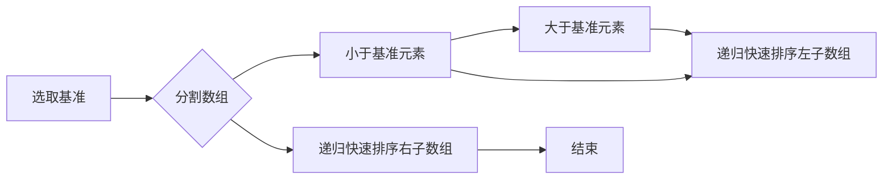
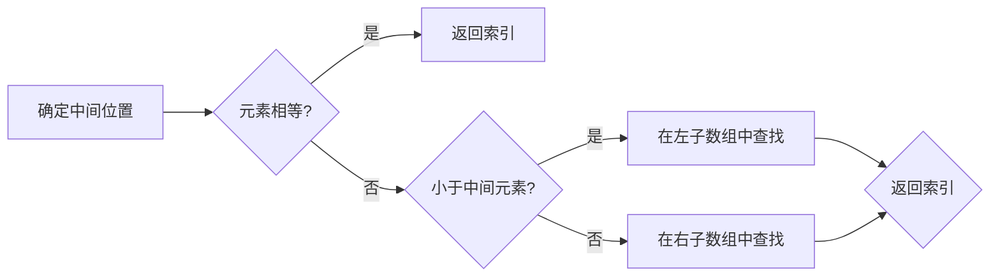

# 如何深刻理解计算机原理，具备良好的数据结构和算法基础

## 1. 背景介绍

计算机科学是现代科技的核心，而理解计算机原理，掌握数据结构和算法是计算机科学的基础。随着信息技术的飞速发展，计算机技术在各个领域的应用日益广泛，对计算机原理、数据结构和算法的理解和掌握变得越来越重要。本文旨在深入浅出地讲解计算机原理，探讨数据结构和算法的关系，帮助读者构建扎实的数据结构和算法基础。

## 2. 核心概念与联系

### 2.1 计算机原理

计算机原理是指计算机硬件和软件的工作原理。主要包括以下几个方面：

* **硬件组成**：CPU、内存、硬盘、主板、显卡等硬件组成部分及其功能。
* **软件组成**：操作系统、编译器、数据库等软件组成部分及其功能。
* **工作流程**：输入、处理、输出等计算机基本工作流程。

### 2.2 数据结构

数据结构是组织和管理数据的方式。主要包括以下几个方面：

* **线性结构**：数组、链表、栈、队列等。
* **非线性结构**：树、图、散列表等。
* **数据结构特点**：存储方式、插入、删除、查找等操作的性能。

### 2.3 算法

算法是指解决问题的步骤和方法。主要包括以下几个方面：

* **算法类型**：排序、查找、动态规划等。
* **算法性能**：时间复杂度和空间复杂度。
* **算法设计思想**：贪心算法、分治算法、回溯算法等。

数据结构、算法和计算机原理三者之间紧密相连：

* 计算机原理提供了硬件和软件平台，是数据结构和算法实现的基础。
* 数据结构为算法提供了操作对象，是算法性能优化的关键。
* 算法实现了数据结构的操作，是解决实际问题的核心。

## 3. 核心算法原理具体操作步骤

### 3.1 排序算法

#### 3.1.1 快速排序

快速排序的基本思想是分而治之，通过一趟排序将待排序的记录分割成独立的两部分，其中一部分记录的关键字均比另一部分的关键字小，则可分别对这两部分记录继续进行排序，以达到整个序列有序。

**操作步骤**：

1. 从数组中选取一个元素作为基准元素（pivot）。
2. 将小于基准元素的元素放到其左侧，大于基准元素的元素放到其右侧。
3. 递归地对左右两侧的子数组进行快速排序。

**Mermaid 流程图**：



### 3.2 查找算法

#### 3.2.1 二分查找

二分查找是一种在有序数组中查找特定元素的搜索算法。其基本思想是将待查找元素与数组中间的元素进行比较，如果相等则返回索引，否则根据比较结果缩小查找范围。

**操作步骤**：

1. 首先确定数组的中间位置。
2. 如果中间位置的元素与待查找元素相等，返回索引。
3. 如果待查找元素小于中间位置的元素，则在左子数组中继续查找。
4. 如果待查找元素大于中间位置的元素，则在右子数组中继续查找。
5. 重复步骤 1-4，直到找到目标元素或查找范围为空。

**Mermaid 流程图**：



## 4. 数学模型和公式详细讲解举例说明

### 4.1 时间复杂度

时间复杂度是衡量算法执行时间的一个重要指标。它描述了一个算法执行时间随输入规模增长的变化趋势。

**常用的时间复杂度表示**：

* O(1)：常数时间复杂度，执行时间不随输入规模变化。
* O(n)：线性时间复杂度，执行时间与输入规模成正比。
* O(n^2)：平方时间复杂度，执行时间与输入规模的平方成正比。
* O(logn)：对数时间复杂度，执行时间与输入规模的以2为底的对数成正比。

**例子**：

假设有一个线性查找算法，其时间复杂度为O(n)。如果数组中有1000个元素，查找一个元素的平均比较次数为1000/2=500次。

### 4.2 空间复杂度

空间复杂度是衡量算法空间消耗的一个重要指标。它描述了一个算法执行过程中占用空间随输入规模增长的变化趋势。

**常用空间复杂度表示**：

* O(1)：常数空间复杂度，占用空间不随输入规模变化。
* O(n)：线性空间复杂度，占用空间与输入规模成正比。

**例子**：

假设有一个排序算法，其空间复杂度为O(n)。如果输入数组有1000个元素，则该排序算法需要额外占用1000个空间。

## 5. 项目实践：代码实例和详细解释说明

### 5.1 快速排序算法实现

以下是一个快速排序算法的Python实现：

```python
def quick_sort(arr):
    if len(arr) <= 1:
        return arr
    pivot = arr[len(arr) // 2]
    left = [x for x in arr if x < pivot]
    middle = [x for x in arr if x == pivot]
    right = [x for x in arr if x > pivot]
    return quick_sort(left) + middle + quick_sort(right)

# 测试
arr = [3, 6, 8, 10, 1, 2, 1]
result = quick_sort(arr)
print(result)
```

**解释说明**：

1. 定义了一个快速排序函数`quick_sort`，接收一个数组`arr`作为参数。
2. 判断数组长度，如果小于等于1，则直接返回原数组。
3. 选择数组中间位置的元素作为基准元素`pivot`。
4. 使用列表推导式分别获取小于、等于和大于基准元素的元素，并存储到左子数组`left`、中间数组`middle`和右子数组`right`中。
5. 递归地对左子数组和右子数组进行快速排序，然后将三个子数组合并，返回排序后的数组。

### 5.2 二分查找算法实现

以下是一个二分查找算法的Python实现：

```python
def binary_search(arr, target):
    left, right = 0, len(arr) - 1
    while left <= right:
        mid = (left + right) // 2
        if arr[mid] == target:
            return mid
        elif arr[mid] < target:
            left = mid + 1
        else:
            right = mid - 1
    return -1

# 测试
arr = [1, 2, 3, 4, 5, 6, 7, 8, 9, 10]
target = 5
result = binary_search(arr, target)
print(result)
```

**解释说明**：

1. 定义了一个二分查找函数`binary_search`，接收一个已排序数组`arr`和一个目标元素`target`作为参数。
2. 初始化左右边界索引`left`和`right`。
3. 使用while循环不断调整左右边界，直到找到目标元素或左右边界交叉。
4. 判断中间位置元素与目标元素的关系，并更新左右边界。
5. 如果找到目标元素，返回其索引；否则返回-1。

## 6. 实际应用场景

### 6.1 排序算法

* **数据库查询**：快速排序、归并排序等排序算法在数据库查询中用于对数据进行排序，提高查询效率。
* **算法竞赛**：排序算法在算法竞赛中应用广泛，例如线性排序算法、堆排序等。

### 6.2 查找算法

* **搜索引擎**：二分查找算法在搜索引擎中用于快速查找关键词，提高搜索效率。
* **数据挖掘**：查找算法在数据挖掘中用于快速找到具有特定特征的数据，例如KNN算法。

## 7. 工具和资源推荐

### 7.1 工具

* **Python**：Python语言具有简洁易读的特点，适合学习计算机原理、数据结构和算法。
* **LeetCode**：LeetCode是一个在线编程平台，提供大量算法题库和社区交流。
* **Codeforces**：Codeforces是一个国际编程竞赛平台，提供丰富的算法题目和竞赛。

### 7.2 资源

* 《算法导论》：是一本经典的算法教材，全面介绍了算法理论和实践。
* 《数据结构与算法分析》：一本实用的数据结构和算法教材，适合初学者和进阶者。
* 《算法图解》：一本深入浅出的算法入门书籍，适合初学者和进阶者。

## 8. 总结：未来发展趋势与挑战

### 8.1 未来发展趋势

* **算法优化**：随着大数据、人工智能等领域的快速发展，算法优化将成为未来研究的热点。
* **算法可视化**：算法可视化有助于理解算法原理和性能，提高算法教学质量。
* **算法工程化**：将算法应用于实际项目中，解决实际问题。

### 8.2 挑战

* **算法复杂度**：降低算法时间复杂度和空间复杂度，提高算法性能。
* **算法安全性**：保证算法的鲁棒性和安全性，防止恶意攻击。
* **算法可解释性**：提高算法的可解释性，帮助用户理解算法的决策过程。

## 9. 附录：常见问题与解答

### 9.1 问题1：如何选择合适的排序算法？

**解答**：选择合适的排序算法需要考虑以下因素：

* **数据规模**：对于小规模数据，可以选择冒泡排序、插入排序等简单算法；对于大规模数据，可以选择快速排序、归并排序等高效算法。
* **数据特点**：如果数据已经部分排序，可以使用插入排序；如果数据量很大，可以使用归并排序。
* **性能要求**：根据实际需求选择时间复杂度、空间复杂度合适的排序算法。

### 9.2 问题2：如何理解时间复杂度和空间复杂度？

**解答**：

* **时间复杂度**：描述算法执行时间随输入规模增长的变化趋势。时间复杂度越高，算法运行速度越慢。
* **空间复杂度**：描述算法执行过程中占用空间随输入规模增长的变化趋势。空间复杂度越高，算法内存消耗越大。

### 9.3 问题3：如何提高算法性能？

**解答**：

* **优化算法设计**：选择合适的数据结构和算法，提高算法效率。
* **算法优化**：对现有算法进行改进，降低时间复杂度和空间复杂度。
* **并行计算**：利用多核处理器等硬件资源，提高算法并行性。

作者：禅与计算机程序设计艺术 / Zen and the Art of Computer Programming