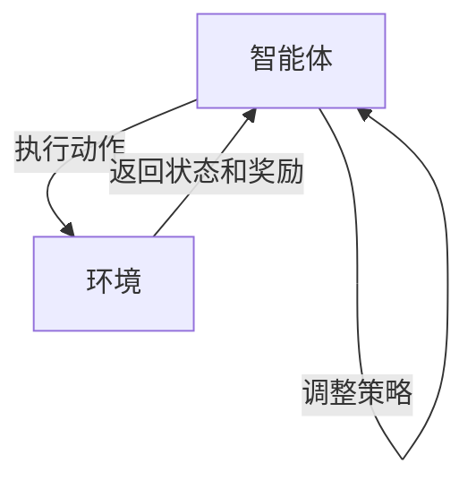

## 1.背景介绍

强化学习作为人工智能的一个重要分支，近年来受到了广泛的关注和研究。从AlphaGo击败围棋世界冠军，到无人驾驶汽车的自主导航，强化学习在许多领域都展示了其强大的能力。然而，对于许多初学者来说，强化学习的原理和实践仍然是一个挑战。本文旨在通过深入浅出的方式，对强化学习的基本概念、核心算法以及实战应用进行详细的讲解。

## 2.核心概念与联系

强化学习的核心概念包括环境(Environment)、智能体(Agent)、状态(State)、动作(Action)、奖励(Reward)和策略(Policy)。智能体在环境中通过执行动作，观察环境的反馈(状态和奖励)，并根据这些反馈调整自己的行为(策略)，以期在长期内获得最大的累积奖励。

## 3.核心算法原理具体操作步骤

强化学习的核心算法包括值迭代(Value Iteration)、策略迭代(Policy Iteration)、Q学习(Q-Learning)和深度Q网络(DQN)等。这些算法的共同目标是找到一个最优策略，使得智能体能够在环境中获得最大的累积奖励。

以Q学习为例，其基本操作步骤如下：

1. 初始化Q表
2. 对于每一回合游戏：
   1. 选择并执行动作
   2. 观察新的状态和奖励
   3. 更新Q表
   4. 更新当前状态

## 4.数学模型和公式详细讲解举例说明

Q学习的核心是Q函数，其定义为$Q(s,a)$，表示在状态$s$下执行动作$a$所能获得的期望累积奖励。Q函数的更新公式如下：

$$Q(s,a) \leftarrow Q(s,a) + \alpha [r + \gamma \max_{a'} Q(s',a') - Q(s,a)]$$

其中，$\alpha$是学习率，$\gamma$是折扣因子，$r$是奖励，$s'$是新的状态，$a'$是新状态下的最优动作。

## 5.项目实践：代码实例和详细解释说明

这部分我们将通过一个简单的迷宫游戏来具体展示Q学习的实现过程。首先，我们需要定义环境、智能体以及他们的交互方式。然后，我们初始化Q表并开始游戏的回合。在每一回合中，智能体根据当前状态和Q表选择动作，执行动作后观察新的状态和奖励，然后根据上面的公式更新Q表。

## 6.实际应用场景

强化学习在许多实际场景中都有应用，例如游戏AI、无人驾驶、机器人控制、资源管理等。其中，AlphaGo就是通过深度强化学习技术，成功击败了围棋世界冠军。

## 7.工具和资源推荐

对于强化学习的学习和研究，我推荐以下工具和资源：

- OpenAI Gym：一个提供各种环境的强化学习工具包，可以用来测试和比较强化学习算法。
- TensorFlow和PyTorch：两个强大的深度学习框架，可以用来实现深度强化学习算法。
- "强化学习"一书：由强化学习领域的权威人士Richard S. Sutton和Andrew G. Barto所著，是学习强化学习的经典教材。

## 8.总结：未来发展趋势与挑战

强化学习的研究正在快速进展，未来有许多值得期待的发展趋势，例如模型自由强化学习、多智能体强化学习、元强化学习等。同时，强化学习也面临许多挑战，例如样本效率低、稳定性差、泛化能力弱等问题。

## 9.附录：常见问题与解答

这部分列出了一些强化学习学习过程中的常见问题和解答，希望对读者有所帮助。

作者：禅与计算机程序设计艺术 / Zen and the Art of Computer Programming