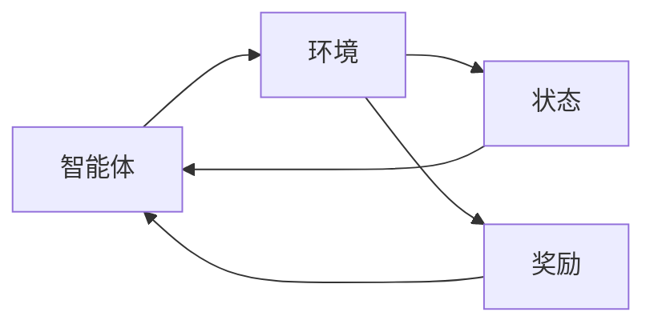

## 1.背景介绍

强化学习是机器学习的一个重要分支，它主要关注如何基于环境反馈来优化决策。它的核心思想是：智能体在与环境的交互过程中，通过尝试不同的行为策略，学习到使得长期累积奖励最大化的策略。这种学习方式在许多领域都有广泛的应用，包括游戏、机器人、推荐系统等。

## 2.核心概念与联系

强化学习的核心概念包括智能体、环境、状态、动作、奖励和策略等。智能体通过在环境中采取动作，从而改变自身的状态，并根据环境的反馈（奖励）来调整自己的行为策略。这个过程可以用以下的Mermaid流程图来表示：



在这个过程中，智能体的目标是找到一种策略，使得在长期内获得的奖励最大。

## 3.核心算法原理具体操作步骤

强化学习的核心算法包括值迭代、策略迭代、Q学习、Sarsa、DQN等。这些算法的主要思想是通过迭代更新状态值函数或者动作值函数，从而找到最优策略。以值迭代为例，其主要步骤如下：

1. 初始化状态值函数为任意值，通常为0；
2. 对于每一个状态，更新其值为在该状态下所有可能动作的期望回报的最大值；
3. 重复第2步，直到状态值函数收敛。

## 4.数学模型和公式详细讲解举例说明

在强化学习中，我们通常使用马尔科夫决策过程（MDP）来建模。一个MDP由一个状态集合$S$、一个动作集合$A$、一个奖励函数$R$和一个状态转移概率函数$P$组成。在每一个时间步$t$，智能体在状态$s_t$下选择动作$a_t$，然后获得奖励$r_{t+1}$并转移到新的状态$s_{t+1}$。这个过程可以用以下的公式来表示：

$$
s_{t+1} \sim P(\cdot|s_t, a_t), \quad r_{t+1} = R(s_t, a_t, s_{t+1})
$$

在强化学习中，我们的目标是找到一个策略$\pi$，使得从任何初始状态$s_0$出发，按照策略$\pi$行动产生的总奖励期望最大，即：

$$
\pi^* = \arg\max_\pi E\left[\sum_{t=0}^\infty \gamma^t r_{t+1} | s_0, \pi\right]
$$

其中$\gamma \in [0,1]$是折扣因子，用来平衡即时奖励和未来奖励。

## 5.项目实践：代码实例和详细解释说明

下面我们通过一个简单的例子来说明如何使用Python的强化学习库Gym来实现值迭代算法。我们选择的环境是FrozenLake，这是一个4x4的冰面格子，智能体的目标是从起点（左上角）移动到目标点（右下角）。

首先，我们需要安装Gym库：

```python
pip install gym
```

然后，我们可以使用以下的代码来实现值迭代算法：

```python
import gym
import numpy as np

# 创建环境
env = gym.make('FrozenLake-v0')

# 初始化状态值函数
V = np.zeros(env.observation_space.n)

while True:
    # 复制一份当前的状态值函数
    V_old = np.copy(V)
    
    # 更新每一个状态的值
    for s in range(env.observation_space.n):
        q_sa = [sum([p * (r + gamma * V_old[s_]) for p, s_, r, _ in env.P[s][a]]) for a in range(env.action_space.n)] 
        V[s] = max(q_sa)
    
    # 如果状态值函数的变化小于阈值，则停止迭代
    if (np.sum(np.fabs(V_old - V)) <= 1e-10):
        break
```

在这段代码中，我们首先创建了FrozenLake环境，然后初始化了状态值函数。在每一轮迭代中，我们更新每一个状态的值为在该状态下所有可能动作的期望回报的最大值。当状态值函数的变化小于一个很小的阈值时，我们停止迭代。

## 6.实际应用场景

强化学习在许多领域都有广泛的应用。例如，在游戏领域，Google的AlphaGo就是通过强化学习来学习围棋策略，并最终战胜了世界冠军李世石。在机器人领域，强化学习可以用来训练机器人进行各种复杂的任务，例如行走、跑步、跳跃、搬运物品等。在推荐系统领域，强化学习可以用来优化推荐策略，以最大化用户的长期满意度。

## 7.工具和资源推荐

对于想要学习和研究强化学习的读者，我推荐以下的工具和资源：

- Gym: 这是一个由OpenAI开发的强化学习环境库，包含了许多预定义的环境，例如FrozenLake、CartPole、MountainCar等。

- TensorFlow和PyTorch: 这两个都是非常流行的深度学习库，可以用来实现各种强化学习算法。

- "Reinforcement Learning: An Introduction"：这是一本由Richard S. Sutton和Andrew G. Barto编写的强化学习的经典教材，详细介绍了强化学习的基本概念和算法。

## 8.总结：未来发展趋势与挑战

尽管强化学习已经在许多领域取得了显著的成功，但是仍然面临着许多挑战，例如样本效率低、需要大量的计算资源、难以处理部分可观察的环境等。在未来，我们期待通过引入更多的先验知识、发展新的学习算法、利用更强大的计算资源等方式来解决这些问题。

## 9.附录：常见问题与解答

Q: 强化学习和监督学习有什么区别？
A: 监督学习是通过学习输入和输出的对应关系来进行预测，而强化学习是通过学习在环境中的行为策略来最大化奖励。

Q: 强化学习能否用于解决所有的问题？
A: 并非所有的问题都适合用强化学习来解决。强化学习适合于那些需要通过交互来学习最优行为策略的问题。

Q: 强化学习需要大量的数据吗？
A: 是的，强化学习通常需要大量的交互数据来学习最优策略。这是因为强化学习需要通过尝试不同的行为策略来发现最优策略。

作者：禅与计算机程序设计艺术 / Zen and the Art of Computer Programming