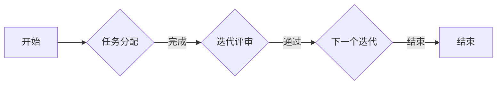
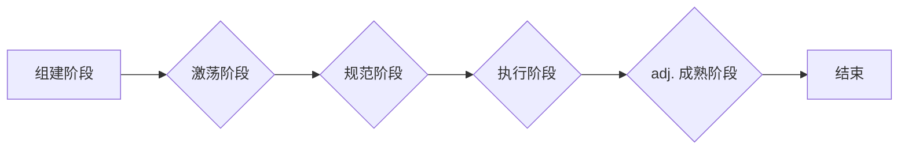

# 怎样培养出色的领导和管理能力

## 1. 背景介绍

在当今这个快速发展的信息技术时代，领导和管理能力已经成为企业成功的关键。特别是在IT行业，领导者和管理者不仅要具备深厚的专业知识，还要具备出色的领导力和管理技巧。本文将深入探讨如何培养出色的领导和管理能力，旨在帮助IT从业者提升个人竞争力。

## 2. 核心概念与联系

### 2.1 领导力的定义

领导力是指影响和激励他人，以实现共同目标的能力。在IT领域，领导力不仅体现在技术层面，更体现在团队管理和项目协调等方面。

### 2.2 管理的定义

管理是指对资源进行有效配置和优化，以实现既定目标的过程。在IT行业，管理包括项目管理、团队管理、知识管理等多个方面。

### 2.3 领导力与管理的联系

领导力是管理的基础，而管理则是领导力的具体体现。一个优秀的领导者在具备技术能力的同时，还需具备良好的管理能力，才能在IT行业中脱颖而出。

## 3. 核心算法原理具体操作步骤

### 3.1 领导力的培养

#### 3.1.1 自我认知

首先，领导者需要明确自己的价值观、优势和劣势，以便更好地发挥个人优势，弥补不足。

#### 3.1.2 沟通能力

沟通能力是领导力的核心。领导者需要学会倾听、表达和协调，以确保团队高效协作。

#### 3.1.3 激励团队

领导者要善于发现团队成员的潜力，激发其积极性，共同实现目标。

### 3.2 管理能力的培养

#### 3.2.1 项目管理

项目管理是IT行业管理的重要组成部分。领导者需要掌握项目管理的方法、工具和技巧，以确保项目按时、按质完成。

#### 3.2.2 团队管理

团队管理是管理者需要关注的核心问题。管理者要善于发现团队成员的需求，营造良好的团队氛围，提高团队整体执行力。

#### 3.2.3 知识管理

知识管理是指对知识进行收集、整理、共享和应用的过程。管理者需要培养团队成员的知识管理意识，提高团队整体素质。

## 4. 数学模型和公式详细讲解举例说明

### 4.1 领导力模型

#### 4.1.1 领导风格

领导风格是指领导者对团队成员的影响方式。根据赫塞和布兰查德的领导风格理论，可将领导风格分为四种：指令型、支持型、参与型和授权型。

#### 4.1.2 领导力公式

领导力 = 影响力 × 影响范围

### 4.2 管理模型

#### 4.2.1 项目管理模型

项目管理模型主要指敏捷开发模型，如Scrum和Kanban。以下为Scrum模型的Mermaid流程图：



#### 4.2.2 团队管理模型

团队管理模型主要指团队建设模型，如Tuckman团队成熟模型。以下为Tuckman团队成熟模型的Mermaid流程图：



## 5. 项目实践：代码实例和详细解释说明

### 5.1 领导力实践

以下是一个领导力实践的例子：

```java
public class Leader {
    private List<String> subordinates = new ArrayList<>();

    public void addSubordinate(String subordinate) {
        subordinates.add(subordinate);
    }

    public void assignTask(String task) {
        for (String subordinate : subordinates) {
            System.out.println(\"Assigning task to \" + subordinate);
        }
    }
}
```

### 5.2 管理能力实践

以下是一个管理能力实践的例子：

```java
public class Manager {
    private List<String> tasks = new ArrayList<>();

    public void addTask(String task) {
        tasks.add(task);
    }

    public void assignTask(String task) {
        if (tasks.contains(task)) {
            System.out.println(\"Task already assigned: \" + task);
        } else {
            tasks.add(task);
            System.out.println(\"Task assigned: \" + task);
        }
    }
}
```

## 6. 实际应用场景

### 6.1 企业内部培训

企业内部培训可以帮助员工提升领导和管理能力，如举办领导力培训、项目管理培训等。

### 6.2 在线学习平台

在线学习平台提供了丰富的领导和管理课程，如Coursera、Udemy等。

### 6.3 专业书籍

专业书籍可以帮助读者深入理解领导和管理理论，如《管理的实践》、《团队的力量》等。

## 7. 工具和资源推荐

### 7.1 工具推荐

- 项目管理工具：Jira、Trello、Asana
- 团队协作工具：Slack、Microsoft Teams
- 知识管理工具：Confluence、Trove

### 7.2 资源推荐

- 领导力课程：Coursera、Udemy
- 项目管理课程：PMP认证、敏捷开发认证
- 团队管理课程：Tuckman团队成熟模型、团队建设课程

## 8. 总结：未来发展趋势与挑战

### 8.1 未来发展趋势

随着人工智能、大数据等技术的发展，未来IT行业对领导和管理能力的要求将越来越高。领导者和管理者需要具备跨学科、跨领域的知识，以应对未来的挑战。

### 8.2 面临的挑战

- 持续学习：新技术、新理念不断涌现，领导者和管理者需要持续学习，以保持竞争力。
- 团队协作：跨文化、跨地域的团队协作将越来越普遍，领导者和管理者需要具备良好的沟通和协调能力。
- 人才短缺：优秀的人才将成为企业竞争的关键，领导者和管理者需要善于发现和培养人才。

## 9. 附录：常见问题与解答

### 9.1 什么是中国式领导？

中国式领导强调集体主义、人际关系和人情世故。在IT行业中，领导者需要结合中国传统文化和现代管理理念，灵活运用领导力。

### 9.2 如何在团队中建立信任？

建立信任需要领导者具备真诚、公平和透明的品质，同时关注团队成员的感受，尊重其意见。

### 9.3 如何处理冲突？

处理冲突需要领导者具备冷静、客观和公正的态度，善于倾听各方意见，寻找共赢的解决方案。

作者：禅与计算机程序设计艺术 / Zen and the Art of Computer Programming