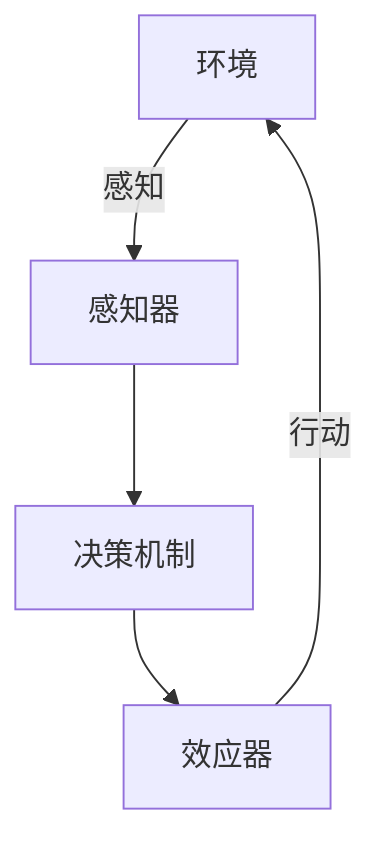

# 智能体 (Agent)

## 1.背景介绍

在计算机科学和人工智能领域，智能体（Agent）是一个至关重要的概念。智能体可以被定义为一个能够感知其环境并采取行动以实现某些目标的实体。智能体的应用范围非常广泛，从简单的自动化任务到复杂的决策系统，智能体在各个领域都发挥着重要作用。

智能体的研究始于20世纪50年代，随着计算机技术的发展，智能体的概念和应用也不断演进。早期的智能体主要用于解决特定问题，如路径规划和游戏对弈。随着人工智能技术的进步，智能体的能力和应用范围大大扩展，涵盖了机器人、自动驾驶、智能家居、金融分析等多个领域。

## 2.核心概念与联系

### 2.1 智能体的定义

智能体是一个能够感知环境并采取行动的实体。智能体的基本结构包括感知器、效应器和决策机制。感知器用于获取环境信息，效应器用于执行动作，决策机制则根据感知到的信息和预定的目标来选择合适的行动。

### 2.2 智能体的分类

智能体可以根据其复杂性和功能进行分类：

- **简单反应型智能体**：这些智能体根据当前的感知信息直接采取行动，没有内部状态。例如，基于规则的系统。
- **基于模型的智能体**：这些智能体具有内部状态，可以记忆过去的感知信息和行动，从而做出更复杂的决策。
- **目标导向型智能体**：这些智能体不仅考虑当前的感知信息，还会根据预定的目标来选择行动。
- **学习型智能体**：这些智能体能够通过经验和学习来改进其决策机制。

### 2.3 智能体与环境的交互

智能体与环境的交互是通过感知和行动来实现的。感知器获取环境信息，决策机制根据这些信息和内部状态选择行动，效应器执行行动并影响环境。这个过程可以用以下Mermaid流程图表示：



## 3.核心算法原理具体操作步骤

### 3.1 感知与建模

感知是智能体获取环境信息的过程。感知器可以是传感器、摄像头、麦克风等设备。感知到的信息需要经过处理和建模，以便决策机制使用。

### 3.2 决策机制

决策机制是智能体选择行动的核心。常见的决策算法包括：

- **基于规则的系统**：使用预定义的规则来选择行动。
- **搜索算法**：如A*算法，用于路径规划。
- **优化算法**：如遗传算法，用于寻找最优解。
- **机器学习算法**：如强化学习，用于通过经验改进决策。

### 3.3 行动执行

行动执行是智能体通过效应器影响环境的过程。效应器可以是电机、显示器、扬声器等设备。行动的执行需要考虑环境的反馈，以便调整后续的决策。

## 4.数学模型和公式详细讲解举例说明

### 4.1 马尔可夫决策过程 (MDP)

马尔可夫决策过程是智能体决策的常用数学模型。MDP由以下五元组 $(S, A, P, R, \gamma)$ 组成：

- $S$：状态空间
- $A$：动作空间
- $P$：状态转移概率矩阵，$P(s'|s, a)$ 表示在状态 $s$ 执行动作 $a$ 后转移到状态 $s'$ 的概率
- $R$：奖励函数，$R(s, a)$ 表示在状态 $s$ 执行动作 $a$ 获得的奖励
- $\gamma$：折扣因子，表示未来奖励的折扣率

智能体的目标是找到一个策略 $\pi$，使得累积奖励最大化。累积奖励的期望值可以表示为：

$$
V^\pi(s) = \mathbb{E} \left[ \sum_{t=0}^{\infty} \gamma^t R(s_t, a_t) \mid s_0 = s, \pi \right]
$$

### 4.2 强化学习

强化学习是通过与环境的交互来学习最优策略的过程。常见的强化学习算法包括Q学习和深度Q网络（DQN）。

#### Q学习

Q学习通过更新Q值来学习最优策略。Q值表示在状态 $s$ 执行动作 $a$ 的期望累积奖励。Q值的更新公式为：

$$
Q(s, a) \leftarrow Q(s, a) + \alpha \left[ R(s, a) + \gamma \max_{a'} Q(s', a') - Q(s, a) \right]
$$

其中，$\alpha$ 是学习率，$s'$ 是执行动作 $a$ 后的新状态。

## 5.项目实践：代码实例和详细解释说明

### 5.1 简单反应型智能体

以下是一个简单反应型智能体的Python代码示例，该智能体在迷宫中寻找出口：

```python
import random

class SimpleReactiveAgent:
    def __init__(self, maze):
        self.maze = maze
        self.position = (0, 0)  # 初始位置

    def perceive(self):
        x, y = self.position
        return self.maze[x][y]

    def act(self):
        x, y = self.position
        if self.maze[x][y] == 'E':  # 找到出口
            return 'Found Exit'
        else:
            # 随机选择一个方向移动
            self.position = random.choice([(x+1, y), (x-1, y), (x, y+1), (x, y-1)])
            return 'Moving'

# 示例迷宫
maze = [
    ['S', ' ', ' ', ' '],
    [' ', '#', ' ', '#'],
    [' ', '#', ' ', 'E'],
    [' ', ' ', ' ', ' ']
]

agent = SimpleReactiveAgent(maze)
while True:
    perception = agent.perceive()
    action = agent.act()
    print(f"Perception: {perception}, Action: {action}")
    if action == 'Found Exit':
        break
```

### 5.2 强化学习智能体

以下是一个使用Q学习算法的智能体在网格世界中寻找最优路径的Python代码示例：

```python
import numpy as np

class QLearningAgent:
    def __init__(self, state_space, action_space, alpha=0.1, gamma=0.9, epsilon=0.1):
        self.state_space = state_space
        self.action_space = action_space
        self.alpha = alpha
        self.gamma = gamma
        self.epsilon = epsilon
        self.q_table = np.zeros((state_space, action_space))

    def choose_action(self, state):
        if np.random.rand() < self.epsilon:
            return np.random.choice(self.action_space)
        else:
            return np.argmax(self.q_table[state])

    def update_q_value(self, state, action, reward, next_state):
        best_next_action = np.argmax(self.q_table[next_state])
        td_target = reward + self.gamma * self.q_table[next_state, best_next_action]
        td_error = td_target - self.q_table[state, action]
        self.q_table[state, action] += self.alpha * td_error

# 示例网格世界
state_space = 16  # 4x4网格
action_space = 4  # 上下左右
agent = QLearningAgent(state_space, action_space)

# 假设有一个环境类提供状态转移和奖励
# 这里省略环境类的实现，假设有一个step函数返回新状态和奖励
for episode in range(1000):
    state = 0  # 初始状态
    while state != 15:  # 目标状态
        action = agent.choose_action(state)
        next_state, reward = step(state, action)
        agent.update_q_value(state, action, reward, next_state)
        state = next_state
```

## 6.实际应用场景

### 6.1 机器人

智能体在机器人领域有广泛应用。机器人可以通过感知环境信息，使用决策算法选择行动，从而完成任务。例如，自动驾驶汽车通过摄像头和传感器感知道路信息，使用深度学习算法进行决策，控制车辆行驶。

### 6.2 智能家居

智能家居系统通过智能体技术实现自动化控制。智能家居设备可以感知环境信息，如温度、湿度、光照等，使用决策算法控制空调、灯光、安防系统等设备，从而提高生活质量。

### 6.3 金融分析

在金融领域，智能体可以用于股票交易、风险管理等任务。智能体通过分析市场数据，使用机器学习算法预测股票价格走势，自动执行交易策略，从而实现盈利。

### 6.4 游戏AI

游戏AI是智能体技术的一个重要应用领域。游戏中的智能体可以通过感知游戏状态，使用决策算法选择行动，从而与玩家进行互动。例如，棋类游戏中的AI可以使用搜索算法和强化学习算法进行决策。

## 7.工具和资源推荐

### 7.1 开发工具

- **Python**：Python是开发智能体的常用编程语言，具有丰富的库和框架支持。
- **TensorFlow**：TensorFlow是一个开源的机器学习框架，支持深度学习和强化学习算法。
- **OpenAI Gym**：OpenAI Gym是一个用于开发和比较强化学习算法的工具包，提供了多种环境和任务。

### 7.2 学习资源

- **《人工智能：一种现代方法》**：这本书是人工智能领域的经典教材，涵盖了智能体的基本概念和算法。
- **Coursera上的机器学习课程**：Coursera提供了多种机器学习和人工智能课程，适合不同水平的学习者。
- **arXiv**：arXiv是一个开放的学术论文存储库，可以找到最新的人工智能和智能体研究论文。

## 8.总结：未来发展趋势与挑战

智能体技术在未来有着广阔的发展前景。随着计算能力的提升和算法的进步，智能体将变得更加智能和自主。未来的智能体可能