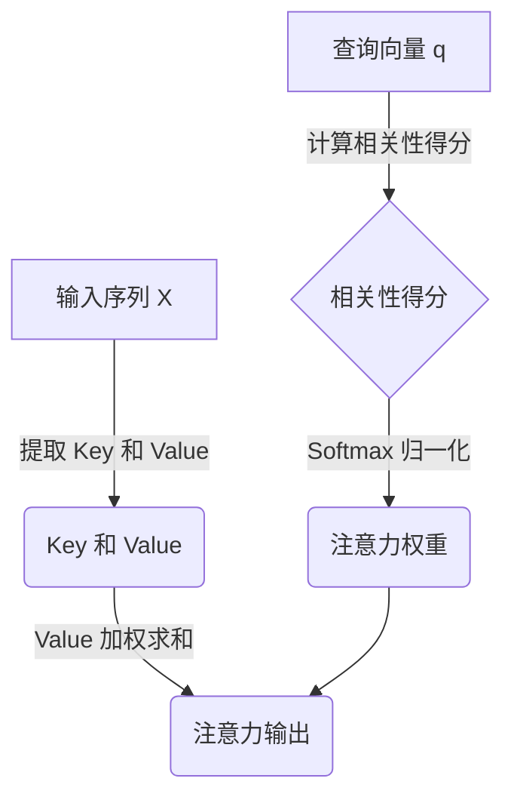

# 注意力机制 原理与代码实例讲解

## 1. 背景介绍

### 1.1 序列建模问题

在自然语言处理、语音识别、机器翻译等领域中,我们经常会遇到序列建模问题。序列建模是指对一个序列数据进行处理和预测,例如给定一个句子序列,预测下一个单词是什么。传统的序列建模方法包括隐马尔可夫模型(HMM)和循环神经网络(RNN)。

HMM能够有效地对线性序列数据建模,但对于并行数据则效果不佳。RNN理论上能够对任意长度的序列数据进行建模,但在实践中,由于梯度消失和梯度爆炸问题,RNN难以对长序列进行有效建模。

### 1.2 注意力机制的提出

为了解决RNN在长序列建模中的问题,2014年,注意力机制(Attention Mechanism)被提出并应用于机器翻译任务中。注意力机制允许模型关注输入序列中的一小部分数据,而不是整个序列,从而降低了对长期依赖的需求,有效缓解了梯度消失和梯度爆炸问题。

注意力机制的核心思想是,在对序列数据进行编码时,对于每一个目标,只关注源序列中与其相关的部分,而不是等权重地关注整个源序列。这种机制允许模型对输入序列中的不同位置给予不同的权重,从而更好地捕捉输入和输出之间的长距离依赖关系。

## 2. 核心概念与联系

### 2.1 注意力机制的核心概念

注意力机制由以下三个核心概念组成:

1. **Query(查询)**: 表示当前需要处理的对象,如需要生成的下一个词或者需要关注的部分。
2. **Key(键值)**: 表示输入序列的不同表示,注意力机制需要根据Query和Key之间的相关性分配权重。
3. **Value(值)**: 表示输入序列的实际数据值,注意力机制将根据分配的权重从Value中选取数据。

注意力机制的计算过程可以概括为:

1. 计算Query和Key之间的相关性得分
2. 对相关性得分进行归一化得到权重
3. 将权重与Value相乘得到加权和作为注意力机制的输出

### 2.2 注意力机制与其他模型的联系

注意力机制与其他序列建模模型有着密切的联系:

- **RNN**: 注意力机制常与RNN结合使用,RNN用于编码输入序列,注意力机制则捕捉输入和输出之间的长距离依赖关系。
- **Transformer**: Transformer是第一个完全基于注意力机制的模型,不再使用RNN或CNN,完全依赖注意力机制对输入序列进行编码和解码。
- **CNN**: 注意力机制也可以与CNN结合使用,例如在图像分类任务中,注意力机制可以关注图像中的关键区域。

## 3. 核心算法原理具体操作步骤

### 3.1 注意力机制的计算过程

假设我们有一个输入序列 $X = (x_1, x_2, \dots, x_n)$,以及一个查询向量 $q$。注意力机制的计算过程如下:

1. **计算Query和Key的相关性得分**

   对于每个输入向量 $x_i$,计算它与查询向量 $q$ 的相关性得分:

   $$\text{score}(q, x_i) = q^\top W_k x_i$$

   其中 $W_k$ 是一个可学习的权重矩阵,用于将输入向量 $x_i$ 映射到 key 空间。

2. **对相关性得分进行归一化**

   使用 softmax 函数对相关性得分进行归一化,得到注意力权重:

   $$\alpha_i = \frac{\exp(\text{score}(q, x_i))}{\sum_{j=1}^n \exp(\text{score}(q, x_j))}$$

3. **计算加权和作为注意力机制的输出**

   将注意力权重与输入序列的 value 向量相乘,得到加权和作为注意力机制的输出:

   $$\text{attn}(q, X) = \sum_{i=1}^n \alpha_i W_v x_i$$

   其中 $W_v$ 是另一个可学习的权重矩阵,用于将输入向量 $x_i$ 映射到 value 空间。

注意力机制的计算过程可以用以下 Mermaid 流程图表示:



### 3.2 注意力机制的变体

基于上述基本注意力机制,研究者提出了多种变体,以满足不同任务的需求:

- **多头注意力(Multi-Head Attention)**: 将注意力机制分成多个子空间,每个子空间学习不同的注意力表示,最后将这些表示进行拼接或加权求和。
- **自注意力(Self-Attention)**: 查询向量、键值和值向量都来自同一个序列,用于捕捉序列内部的依赖关系。
- **加性注意力(Additive Attention)**: 使用一个前馈神经网络来计算相关性得分,而不是简单的向量点乘。
- **缩放点积注意力(Scaled Dot-Product Attention)**: 在点积注意力的基础上,对相关性得分进行缩放,以防止较深层次的注意力机制出现梯度饱和问题。

## 4. 数学模型和公式详细讲解举例说明

### 4.1 缩放点积注意力

缩放点积注意力是 Transformer 模型中使用的注意力机制变体。它的计算过程如下:

1. **计算 Query、Key 和 Value 向量**

   给定一个输入序列 $X = (x_1, x_2, \dots, x_n)$,将其线性映射到 Query、Key 和 Value 空间:

   $$\begin{aligned}
   Q &= XW_Q \\
   K &= XW_K \\
   V &= XW_V
   \end{aligned}$$

   其中 $W_Q$、$W_K$ 和 $W_V$ 是可学习的权重矩阵。

2. **计算缩放点积注意力**

   计算 Query 和 Key 的点积,对点积结果进行缩放,然后使用 softmax 函数归一化:

   $$\text{Attention}(Q, K, V) = \text{softmax}\left(\frac{QK^\top}{\sqrt{d_k}}\right)V$$

   其中 $d_k$ 是 Key 向量的维度,用于防止较深层次的注意力机制出现梯度饱和问题。

3. **多头注意力**

   多头注意力是将注意力机制分成多个子空间,每个子空间学习不同的注意力表示,最后将这些表示进行拼接或加权求和。具体计算过程如下:

   $$\begin{aligned}
   \text{MultiHead}(Q, K, V) &= \text{Concat}(head_1, \dots, head_h)W^O \\
   \text{where } head_i &= \text{Attention}(QW_i^Q, KW_i^K, VW_i^V)
   \end{aligned}$$

   其中 $W_i^Q$、$W_i^K$、$W_i^V$ 和 $W^O$ 都是可学习的权重矩阵。

### 4.2 注意力机制在机器翻译中的应用举例

假设我们要将一个英文句子 "I am a student" 翻译成中文。我们可以使用注意力机制来捕捉源语言和目标语言之间的对应关系。

1. **编码器**

   将英文句子 "I am a student" 编码为一系列向量表示 $X = (x_1, x_2, x_3, x_4)$,分别对应单词 "I"、"am"、"a"、"student"。

2. **解码器**

   在生成第一个中文词时,解码器的查询向量 $q_1$ 与编码器输出 $X$ 进行注意力计算,得到注意力权重 $\alpha_1$:

   $$\alpha_1 = \text{softmax}(q_1^\top W_k X)$$

   然后将注意力权重与编码器输出进行加权求和,得到上下文向量表示 $c_1$:

   $$c_1 = \sum_{i=1}^4 \alpha_{1i} W_v x_i$$

   解码器将查询向量 $q_1$ 和上下文向量 $c_1$ 作为输入,生成第一个中文词 "我"。

3. **循环注意力计算**

   在生成第二个中文词时,解码器的新查询向量 $q_2$ 与编码器输出 $X$ 进行注意力计算,得到新的注意力权重 $\alpha_2$和上下文向量 $c_2$。解码器将 $q_2$ 和 $c_2$ 作为输入,生成第二个中文词 "是"。

   这个过程一直循环,直到生成完整的中文翻译 "我是一个学生"。

通过这个例子,我们可以看到注意力机制如何捕捉源语言和目标语言之间的对应关系,并且在每个时间步都关注源序列的不同部分。

## 5. 项目实践: 代码实例和详细解释说明

在这一部分,我们将通过一个基于 PyTorch 的代码示例,来实现缩放点积注意力机制。

### 5.1 导入所需的库

```python
import math
import torch
import torch.nn as nn
```

### 5.2 实现缩放点积注意力

```python
class ScaledDotProductAttention(nn.Module):
    def __init__(self, d_k):
        super(ScaledDotProductAttention, self).__init__()
        self.d_k = d_k

    def forward(self, Q, K, V):
        # 计算 Query 和 Key 的点积
        scores = torch.matmul(Q, K.transpose(-2, -1)) / math.sqrt(self.d_k)

        # 对点积结果进行 softmax 归一化
        attn_weights = nn.Softmax(dim=-1)(scores)

        # 将注意力权重与 Value 相乘
        output = torch.matmul(attn_weights, V)

        return output, attn_weights
```

这个类实现了缩放点积注意力的核心计算过程。具体解释如下:

1. `__init__` 方法接受一个参数 `d_k`，表示 Key 向量的维度。
2. `forward` 方法接受三个输入张量 `Q`、`K` 和 `V`，分别表示 Query、Key 和 Value。
3. 首先计算 Query 和 Key 的点积,并对点积结果进行缩放,防止较深层次的注意力机制出现梯度饱和问题。
4. 使用 `nn.Softmax` 函数对点积结果进行 softmax 归一化,得到注意力权重 `attn_weights`。
5. 将注意力权重与 Value 相乘,得到注意力机制的输出 `output`。
6. 返回注意力机制的输出 `output` 和注意力权重 `attn_weights`。

### 5.3 实现多头注意力

```python
class MultiHeadAttention(nn.Module):
    def __init__(self, d_model, num_heads):
        super(MultiHeadAttention, self).__init__()
        self.num_heads = num_heads
        self.d_model = d_model

        self.d_k = d_model // num_heads
        self.d_v = d_model // num_heads

        self.W_Q = nn.Linear(d_model, d_model)
        self.W_K = nn.Linear(d_model, d_model)
        self.W_V = nn.Linear(d_model, d_model)

        self.attention = ScaledDotProductAttention(self.d_k)

        self.fc = nn.Linear(d_model, d_model)

    def forward(self, Q, K, V):
        batch_size = Q.size(0)

        # 线性映射到 Query、Key 和 Value 空间
        q = self.W_Q(Q).view(batch_size, -1, self.num_heads, self.d_k).transpose(1, 2)
        k = self.W_K(K).view(batch_size, -1, self.num_heads, self.d_k).transpose(1, 2)
        v = self.W_V(V).view(batch_size, -1, self.num_heads, self.d_v).transpose(1, 2)

        # 计算缩放点积注意力
        attn_output, attn_weights = self.attention(q, k, v)

        # 将多头注意力的输出拼接
        attn_output = attn_