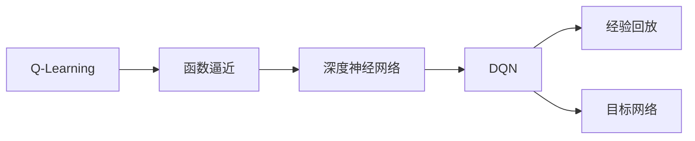
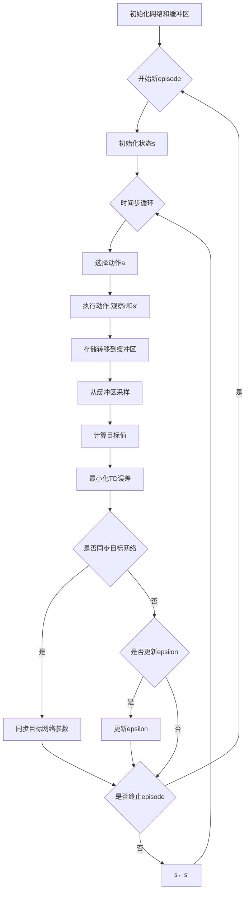

# 深度Q网络 (DQN)

## 1.背景介绍
### 1.1 强化学习概述
强化学习(Reinforcement Learning, RL)是机器学习的一个重要分支,它通过智能体(Agent)与环境(Environment)的交互来学习最优策略,以获得最大的累积奖励。与监督学习和非监督学习不同,强化学习不需要预先标注的数据,而是通过试错的方式来学习。

### 1.2 Q-Learning算法
Q-Learning是强化学习中的一种重要算法,它通过学习状态-动作值函数Q(s,a)来评估在状态s下采取动作a的长期回报。Q-Learning的更新规则为:
$$Q(s_t,a_t) \leftarrow Q(s_t,a_t)+\alpha[r_{t+1}+\gamma \max_{a}Q(s_{t+1},a)-Q(s_t,a_t)]$$
其中$\alpha$是学习率,$\gamma$是折扣因子。

### 1.3 DQN的提出
传统的Q-Learning在状态和动作空间较大时会变得低效,难以收敛。为了解决这个问题,DeepMind在2015年提出了深度Q网络(Deep Q-Network, DQN)[1],将深度神经网络与Q-Learning相结合,大大提升了Q-Learning的性能和泛化能力。DQN在Atari 2600游戏上取得了超越人类的成绩,掀起了深度强化学习的研究热潮。

## 2.核心概念与联系
### 2.1 MDP与Q函数
马尔可夫决策过程(Markov Decision Process, MDP)是强化学习的基础。一个MDP由状态集合S、动作集合A、转移概率P、奖励函数R和折扣因子$\gamma$组成。在MDP中,最优策略$\pi^*$满足贝尔曼最优方程:
$$V^*(s)=\max_{a}\sum_{s',r}p(s',r|s,a)[r+\gamma V^*(s')]$$
而最优动作值函数Q满足:
$$Q^*(s,a)=\sum_{s',r}p(s',r|s,a)[r+\gamma \max_{a'}Q^*(s',a')]$$

### 2.2 函数逼近与深度学习
当状态和动作空间很大时,直接存储Q表变得不现实。函数逼近(Function Approximation)可以用参数化的函数来近似Q函数,如线性函数、神经网络等。深度学习以其强大的表示能力和泛化能力,成为DQN的核心组件。

### 2.3 DQN的创新点  
DQN在传统Q-Learning的基础上主要有以下创新:

1. 使用深度卷积神经网络(CNN)来逼近Q函数。
2. 使用经验回放(Experience Replay)来打破数据的相关性,提高样本利用效率。
3. 使用目标网络(Target Network)来提高训练稳定性。

它们的关系如下图所示:



## 3.核心算法原理具体操作步骤
DQN算法主要分为以下几个步骤:

1. 初始化Q网络参数$\theta$和目标网络参数$\theta^-$
2. 初始化经验回放缓冲区D
3. 对每个episode循环:
   1. 初始化初始状态s
   2. 对每个时间步t循环:
      1. 根据$\epsilon-greedy$策略选择动作a
      2. 执行动作a,观察奖励r和下一状态s'
      3. 将转移(s,a,r,s')存入D 
      4. 从D中随机采样一个批次的转移样本
      5. 对每个样本,计算目标值:
         $$y=\begin{cases}
         r & \text{if episode terminates at }t+1\\
         r+\gamma \max_{a'}Q(s',a';\theta^-) & \text{otherwise}
         \end{cases}$$
      6. 最小化损失:
         $$L(\theta)=\mathbb{E}_{(s,a,r,s')\sim D}[(y-Q(s,a;\theta))^2]$$
      7. 每C步同步目标网络参数:$\theta^-\leftarrow\theta$
      8. s←s'
   3. 如果满足更新条件,更新$\epsilon$

算法流程图如下:



## 4.数学模型和公式详细讲解举例说明
在DQN中,Q函数由一个深度神经网络来逼近,即:
$$Q(s,a;\theta)\approx Q^*(s,a)$$
其中$\theta$为网络参数。给定一个转移样本(s,a,r,s'),DQN的目标值为:
$$y=r+\gamma \max_{a'}Q(s',a';\theta^-)$$
这里使用了目标网络来计算下一状态的最大Q值,以提高稳定性。DQN的损失函数为均方误差:
$$L(\theta)=\mathbb{E}_{(s,a,r,s')\sim D}[(y-Q(s,a;\theta))^2]$$
通过最小化损失函数,网络可以逐步逼近最优Q函数。

举个例子,假设我们要用DQN玩一个简单的迷宫游戏。迷宫有4个房间和4个动作(上下左右),奖励为走到终点的步数的负值。我们可以设计一个包含2个隐藏层的MLP来逼近Q函数,输入为one-hot编码的状态,输出为每个动作的Q值。假设在训练过程中,我们采样到一个转移样本(s,a,r,s'),其中:
- s为[1,0,0,0](第1个房间)
- a为向右
- r为-1
- s'为[0,1,0,0](第2个房间)

我们首先用目标网络计算下一状态的最大Q值:
$$\max_{a'}Q(s',a';\theta^-)=\max(Q(s',\text{上}),Q(s',\text{下}),Q(s',\text{左}),Q(s',\text{右}))$$
假设结果为-0.8,则目标值为:
$$y=r+\gamma \max_{a'}Q(s',a';\theta^-)=-1+0.9*(-0.8)=-1.72$$
然后我们用Q网络计算状态动作对(s,a)的Q值$Q(s,a;\theta)$,假设为-1.5,则TD误差为:
$$\delta=y-Q(s,a;\theta)=-1.72-(-1.5)=-0.22$$
我们将TD误差反向传播,更新网络参数$\theta$,使得$Q(s,a;\theta)$向目标值-1.72移动。重复这个过程,网络就可以逐步学习到最优Q函数。

## 5.项目实践：代码实例和详细解释说明
下面是一个用PyTorch实现DQN玩CartPole游戏的简单例子:

```python
import gym
import math
import random
import numpy as np
import matplotlib.pyplot as plt
from collections import namedtuple, deque
from itertools import count

import torch
import torch.nn as nn
import torch.optim as optim
import torch.nn.functional as F

env = gym.make('CartPole-v0').unwrapped

# 定义超参数
BATCH_SIZE = 128
GAMMA = 0.99
EPS_START = 0.9
EPS_END = 0.05
EPS_DECAY = 200
TARGET_UPDATE = 10

# 定义转移元组
Transition = namedtuple('Transition', ('state', 'action', 'next_state', 'reward'))

# 定义经验回放缓冲区
class ReplayMemory(object):
    def __init__(self, capacity):
        self.memory = deque([], maxlen=capacity)

    def push(self, *args):
        self.memory.append(Transition(*args))

    def sample(self, batch_size):
        return random.sample(self.memory, batch_size)

    def __len__(self):
        return len(self.memory)

# 定义DQN网络
class DQN(nn.Module):
    def __init__(self, h, w, outputs):
        super(DQN, self).__init__()
        self.fc1 = nn.Linear(4, 64)  
        self.fc2 = nn.Linear(64, 64)
        self.fc3 = nn.Linear(64, outputs)

    def forward(self, x):
        x = F.relu(self.fc1(x))
        x = F.relu(self.fc2(x))
        return self.fc3(x)

# 初始化网络和缓冲区    
policy_net = DQN(4, 2)
target_net = DQN(4, 2)
target_net.load_state_dict(policy_net.state_dict())
target_net.eval()

optimizer = optim.RMSprop(policy_net.parameters())
memory = ReplayMemory(10000)

steps_done = 0

# 定义epsilon-greedy策略
def select_action(state):
    global steps_done
    sample = random.random()
    eps_threshold = EPS_END + (EPS_START - EPS_END) * \
        math.exp(-1. * steps_done / EPS_DECAY)
    steps_done += 1
    if sample > eps_threshold:
        with torch.no_grad():
            return policy_net(state).max(1)[1].view(1, 1)
    else:
        return torch.tensor([[random.randrange(2)]], dtype=torch.long)

# 定义单步训练函数
def optimize_model():
    if len(memory) < BATCH_SIZE:
        return
    transitions = memory.sample(BATCH_SIZE)
    batch = Transition(*zip(*transitions))

    non_final_mask = torch.tensor(tuple(map(lambda s: s is not None,
                                          batch.next_state)), dtype=torch.bool)
    non_final_next_states = torch.cat([s for s in batch.next_state
                                                if s is not None])
    state_batch = torch.cat(batch.state)
    action_batch = torch.cat(batch.action)
    reward_batch = torch.cat(batch.reward)

    state_action_values = policy_net(state_batch).gather(1, action_batch)

    next_state_values = torch.zeros(BATCH_SIZE)
    next_state_values[non_final_mask] = target_net(non_final_next_states).max(1)[0].detach()
    expected_state_action_values = (next_state_values * GAMMA) + reward_batch

    criterion = nn.SmoothL1Loss()
    loss = criterion(state_action_values, expected_state_action_values.unsqueeze(1))

    optimizer.zero_grad()
    loss.backward()
    for param in policy_net.parameters():
        param.grad.data.clamp_(-1, 1)
    optimizer.step()

# 训练主循环    
num_episodes = 400
for i_episode in range(num_episodes):
    state = env.reset()
    state = torch.from_numpy(state).float().unsqueeze(0)
    for t in count():
        action = select_action(state)
        next_state, reward, done, _ = env.step(action.item())
        reward = torch.tensor([reward])

        if not done:
            next_state = torch.from_numpy(next_state).float().unsqueeze(0)
        else:
            next_state = None

        memory.push(state, action, next_state, reward)

        state = next_state

        optimize_model()
        if done:
            break
    if i_episode % TARGET_UPDATE == 0:
        target_net.load_state_dict(policy_net.state_dict())

print('Complete')
env.close()
```

主要步骤说明:

1. 定义超参数,如批大小、折扣因子、epsilon衰减率等
2. 定义转移元组Transition和经验回放缓冲区ReplayMemory
3. 定义DQN网络,包括3个全连接层
4. 初始化Q网络和目标网络,以及优化器和缓冲区
5. 定义epsilon-greedy动作选择策略
6. 定义单步训练函数optimize_model,从缓冲区采样一个批次的转移,计算TD误差并更新网络参数
7. 训练主循环,每个episode重置环境,执行动作并存储转移,定期同步目标网络

通过不断与环境交互并最小化TD误差,DQN可以在CartPole游戏中学习到一个不错的策略。

## 6.实际应用场景
DQN及其变体在许多领域得到了广泛应用,包括:

1. 游戏AI:DQN在Atari游戏、星际争霸II、Dota 2等游戏中取得了超越人类的表现。
2. 机器人控制:DQN可以用于机器人的运动规划、导航、抓取等任务。
3. 推荐系统:DQN可