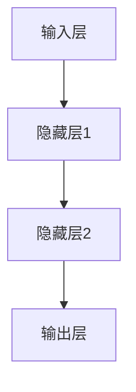
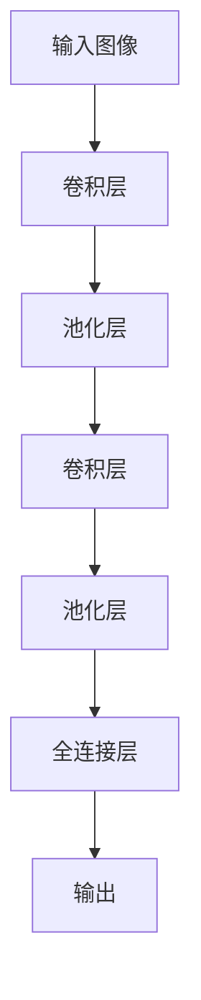
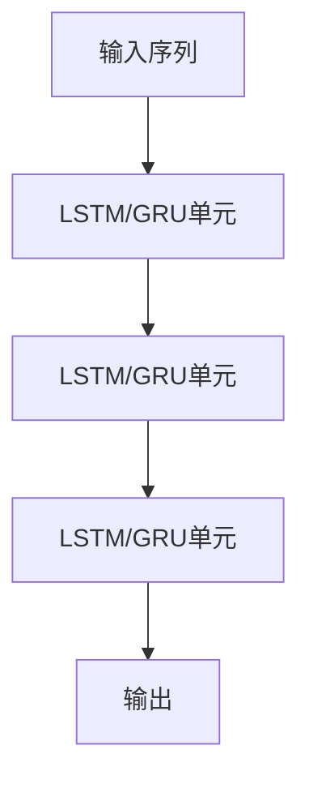
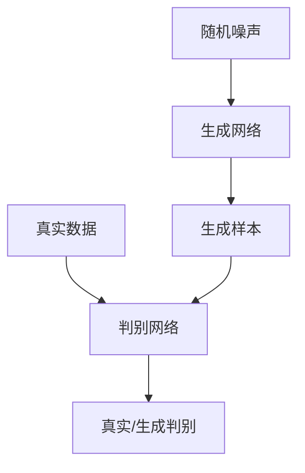
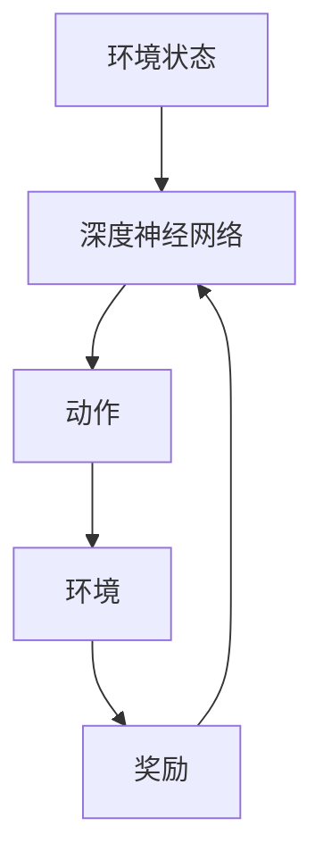

# 深度学习基础原理与代码实战案例讲解

## 1.背景介绍

深度学习是机器学习的一个新的研究热点领域,它源于对人脑神经网络的模拟,近年来在语音识别、图像识别、自然语言处理等领域取得了突破性的进展。作为一种有监督或无监督的算法模型,深度学习能够对大量数据进行高效建模,并从中自动学习数据特征模式,获取决策函数。

与传统的机器学习算法相比,深度学习的优势在于其强大的特征学习能力。传统机器学习算法需要人工设计特征提取器,而深度学习则可以直接从原始数据中自动学习数据的特征表示,从而极大地降低了特征工程的工作量。此外,深度学习模型具有端到端的优势,可以直接从原始输入到最终输出,不需要分多个步骤处理。

深度学习的发展经历了一个漫长而曲折的过程,最早可以追溯到20世纪60年代的神经网络理论。近年来,benefiting from大数据、高性能计算和一些新的训练技术(如dropout、残差网络等),深度学习取得了令人瞩目的成就,成为了人工智能领域最有前景的技术之一。

## 2.核心概念与联系

### 2.1 神经网络

神经网络是深度学习的核心基础,它是一种模拟生物神经网络进行信息处理的数学模型。神经网络由大量的节点(神经元)和连接它们的权重组成。每个节点接收来自前一层的输入信号,并通过激活函数计算输出值,再传递给下一层节点。

神经网络的基本单元是感知器(Perceptron),它对输入进行加权求和,并通过激活函数(如Sigmoid函数)产生输出。多层感知器(Multilayer Perceptron, MLP)由多个感知器层组成,具有强大的非线性映射能力。

### 2.2 卷积神经网络

卷积神经网络(Convolutional Neural Network, CNN)是一种专门用于处理网格结构数据(如图像)的神经网络。CNN由卷积层、池化层和全连接层组成,能够自动学习输入数据的空间局部相关特征。

卷积层通过滑动卷积核在输入数据上进行卷积操作,提取局部特征;池化层则用于降低数据维度,提高模型的泛化能力。全连接层将前面层的特征进行综合,得到最终的分类或回归输出。

### 2.3 循环神经网络

循环神经网络(Recurrent Neural Network, RNN)是一种专门用于处理序列数据(如文本、语音)的神经网络。与前馈神经网络不同,RNN在隐藏层之间存在循环连接,能够很好地捕获序列数据中的长期依赖关系。

长短期记忆网络(Long Short-Term Memory, LSTM)和门控循环单元(Gated Recurrent Unit, GRU)是RNN的两种常用变体,通过引入门控机制来解决长期依赖问题。

### 2.4 生成对抗网络

生成对抗网络(Generative Adversarial Network, GAN)是一种全新的深度学习模型,由生成网络和判别网络组成。生成网络从随机噪声中生成样本,而判别网络则判断样本是真实数据还是生成数据。两个网络相互对抗、相互学习,最终使生成网络能够生成逼真的样本。

GAN在图像生成、语音合成、数据增强等领域有着广泛的应用前景。

### 2.5 深度强化学习

深度强化学习是将深度学习与强化学习相结合的技术,可以自主学习如何在复杂环境中采取行动以获得最大回报。深度神经网络被用作强化学习智能体的策略或值函数的近似器。

深度强化学习在游戏AI、机器人控制、自动驾驶等领域有着广泛的应用前景。

## 3.核心算法原理具体操作步骤

### 3.1 前向传播

前向传播是深度学习模型的基本运算过程,它将输入数据通过网络层层传递,最终得到输出结果。具体步骤如下:

1. 初始化网络权重参数
2. 输入层接收输入数据
3. 隐藏层进行特征提取和非线性映射
4. 输出层产生最终输出
5. 计算输出与标签之间的损失函数值

在前向传播过程中,每个神经元根据上一层的输出和权重进行加权求和,再通过激活函数(如ReLU、Sigmoid等)进行非线性变换,产生该层的输出。

### 3.2 反向传播

反向传播是深度学习模型的核心训练算法,它根据损失函数的梯度,通过链式法则计算每个权重参数的梯度,并使用优化算法(如梯度下降)来更新权重参数,从而减小损失函数值。具体步骤如下:

1. 前向传播计算输出和损失函数值
2. 对于输出层,计算输出层神经元的误差项
3. 对于隐藏层,根据上一层的误差项,计算该层神经元的误差项
4. 根据每个神经元的误差项,计算该层每个权重参数的梯度
5. 使用优化算法(如SGD、Adam等)更新权重参数

在反向传播过程中,误差项从输出层向前逐层传播,每层根据上一层的误差项计算自身的误差项,并累积计算每个权重参数的梯度。通过不断迭代训练,网络可以学习到最优的权重参数,使得损失函数值最小化。

### 3.3 批量归一化

批量归一化(Batch Normalization)是一种常用的正则化技术,它通过对每一层的输入数据进行归一化处理,使数据分布保持在一个合理的范围内,从而加快模型收敛速度、提高模型泛化能力。具体步骤如下:

1. 计算当前批次数据的均值和方差
2. 对输入数据进行归一化:$(x - \mu)/\sqrt{\sigma^2 + \epsilon}$
3. 引入两个可学习的缩放和平移参数$\gamma$和$\beta$
4. 输出归一化后的数据:$\gamma \hat{x} + \beta$

批量归一化通过减小内部协变量偏移的影响,使得每一层的输入数据分布保持相对稳定,从而有效缓解了梯度消失和梯度爆炸的问题,提高了深度网络的训练效率。

### 3.4 残差网络

残差网络(Residual Network, ResNet)是一种特殊设计的卷积神经网络,它通过引入残差连接(shortcut connection)来解决深度网络的梯度消失问题,使得网络可以训练到更深的层数。具体步骤如下:

1. 输入数据经过一系列卷积、归一化和激活操作,得到$F(x)$
2. 将输入$x$直接传递到下一层,得到$x$
3. 将$F(x)$和$x$相加,得到最终输出:$F(x) + x$

残差连接使得网络的输出不仅包含非线性映射$F(x)$,还包含了原始输入$x$,这样可以很好地缓解梯度消失问题,使得网络可以更容易地学习到恒等映射。ResNet在ImageNet等视觉任务中取得了卓越的成绩,成为了当前最流行的卷积网络之一。

### 3.5 注意力机制

注意力机制(Attention Mechanism)是一种用于加强神经网络对关键信息关注的技术,它根据输入数据的不同部分,动态地分配不同的权重,使得模型能够更好地关注重要的特征。具体步骤如下:

1. 计算查询(Query)与键(Key)之间的相似性得分
2. 对相似性得分进行softmax归一化,得到注意力权重
3. 将注意力权重与值(Value)进行加权求和,得到注意力输出

注意力机制广泛应用于自然语言处理、计算机视觉等领域,如Transformer模型、视觉注意力模型等。通过动态分配注意力权重,模型可以更好地捕获输入数据的长期依赖关系和空间关系,从而提高模型性能。

## 4.数学模型和公式详细讲解举例说明

### 4.1 损失函数

损失函数(Loss Function)是深度学习模型的核心组成部分,它用于衡量模型预测输出与真实标签之间的差异程度。常用的损失函数包括:

1. 均方误差(Mean Squared Error, MSE):

$$
\mathrm{MSE}(y, \hat{y}) = \frac{1}{n}\sum_{i=1}^{n}(y_i - \hat{y}_i)^2
$$

2. 交叉熵(Cross Entropy):

$$
\mathrm{CE}(y, \hat{y}) = -\sum_{i=1}^{n}y_i\log(\hat{y}_i)
$$

3. 焦点损失(Focal Loss):

$$
\mathrm{FL}(y, \hat{y}) = -\alpha_t(1 - \hat{y}_t)^\gamma \log(\hat{y}_t)
$$

其中$y$表示真实标签,$\hat{y}$表示模型预测输出,$n$表示样本数量,$\alpha$和$\gamma$是超参数。

不同的任务场景下,需要选择合适的损失函数。例如,对于回归任务通常使用MSE,而对于分类任务则使用交叉熵或焦点损失。合理选择损失函数对于提高模型性能至关重要。

### 4.2 优化算法

优化算法(Optimization Algorithm)用于根据损失函数的梯度,更新深度学习模型的权重参数,从而使损失函数值最小化。常用的优化算法包括:

1. 随机梯度下降(Stochastic Gradient Descent, SGD):

$$
\theta_{t+1} = \theta_t - \eta \nabla_\theta J(\theta_t)
$$

2. 动量SGD(Momentum SGD):

$$
v_{t+1} = \beta v_t + \nabla_\theta J(\theta_t) \\
\theta_{t+1} = \theta_t - \eta v_{t+1}
$$

3. AdaGrad:

$$
g_{t+1} = g_t + \nabla_\theta J(\theta_t)^2 \\
\theta_{t+1} = \theta_t - \frac{\eta}{\sqrt{g_{t+1} + \epsilon}}\nabla_\theta J(\theta_t)
$$

4. RMSProp:

$$
E[g^2]_{t+1} = \beta E[g^2]_t + (1 - \beta)(\nabla_\theta J(\theta_t))^2 \\
\theta_{t+1} = \theta_t - \frac{\eta}{\sqrt{E[g^2]_{t+1} + \epsilon}}\nabla_\theta J(\theta_t)
$$

5. Adam:

$$
m_{t+1} = \beta_1 m_t + (1 - \beta_1)\nabla_\theta J(\theta_t) \\
v_{t+1} = \beta_2 v_t + (1 - \beta_2)(\nabla_\theta J(\theta_t))^2 \\
\hat{m}_{t+1} = \frac{m_{t+1}}{1 - \beta_1^{t+1}} \\
\hat{v}_{t+1} = \frac{v_{t+1}}{1 - \beta_2^{t+1}} \\
\theta_{t+1} = \theta_t - \frac{\eta}{\sqrt{\hat{v}_{t+1}} + \epsilon}\hat{m}_{t+1}
$$

其中$\theta$表示模型权重参数,$\eta$表示学习率,$\beta$、$\beta_