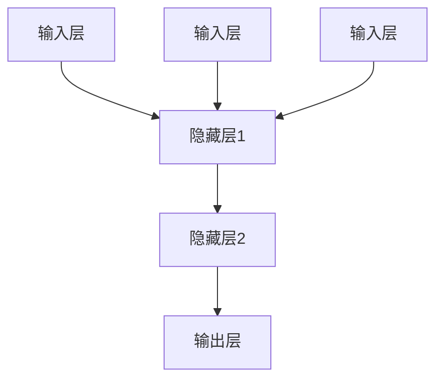
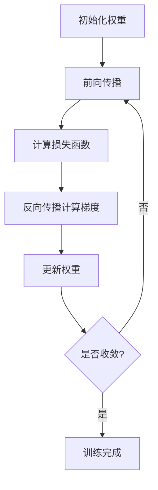
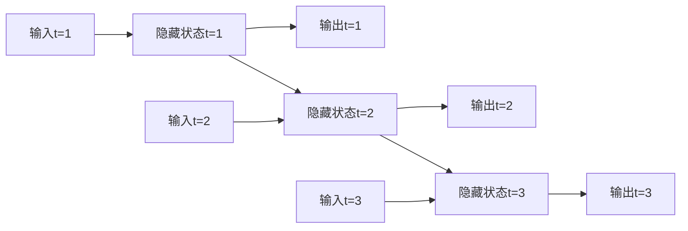

# 神经网络原理与代码实例讲解

## 1.背景介绍

### 1.1 神经网络的起源与发展

神经网络(Neural Network)是一种受生物神经系统启发而产生的计算模型,旨在模拟人脑神经元之间的工作原理。早在20世纪40年代,神经网络的概念就已经被提出,但直到近年来,随着计算能力的飞速提升和大数据时代的到来,神经网络才真正展现出了强大的潜力。

神经网络的发展经历了三个主要阶段:

1. 早期阶段(1940s-1960s):神经网络概念的提出,最早的神经网络模型包括感知器(Perceptron)和Adaline。
2. 停滞阶段(1970s-1980s):由于神经网络存在一些局限性,研究进展受到阻碍。
3. 复兴阶段(1990s-至今):受益于算力提升、大数据和新算法(如反向传播算法),神经网络研究重新兴起并取得了巨大成功。

### 1.2 神经网络的应用领域

神经网络在诸多领域展现出了强大的能力,包括但不限于:

- 计算机视觉:图像分类、目标检测、语义分割等
- 自然语言处理:机器翻译、文本生成、情感分析等
- 语音识别:语音转文本、语音合成等
- 推荐系统:个性化推荐、协同过滤等
- 金融:股票预测、信用评分等
- 医疗:疾病诊断、药物发现等

## 2.核心概念与联系

### 2.1 神经网络的基本结构

神经网络由三种基本组成部分构成:

1. 输入层(Input Layer):接收外部数据
2. 隐藏层(Hidden Layer):执行特征提取和模式识别
3. 输出层(Output Layer):产生最终输出结果

每一层由多个神经元(节点)组成,神经元之间通过加权连接进行信息传递。



### 2.2 前馈神经网络与反向传播算法

前馈神经网络(Feedforward Neural Network)是最基本的神经网络结构,信息只从输入层单向传递到输出层。反向传播算法(Backpropagation)是训练这种网络的核心算法,它通过计算误差梯度并反向传播来调整权重,从而最小化损失函数。

### 2.3 卷积神经网络

卷积神经网络(Convolutional Neural Network, CNN)是一种专门用于处理网格数据(如图像)的神经网络。它引入了卷积层和池化层,能够有效地捕获局部模式和空间层次结构。CNN在计算机视觉领域取得了巨大成功。

### 2.4 循环神经网络

循环神经网络(Recurrent Neural Network, RNN)是一种专门设计用于处理序列数据(如文本、语音)的神经网络。它允许信息在神经元之间循环传递,从而捕获序列中的长期依赖关系。长短期记忆网络(LSTM)和门控循环单元(GRU)是RNN的两种常见变体。

### 2.5 深度学习与神经网络

深度学习(Deep Learning)是机器学习的一个子领域,它利用具有多个隐藏层的深度神经网络来学习数据的层次表示。深度学习的核心思想是通过组合低级特征来构建更高级的特征表示,从而捕获数据的复杂结构。

## 3.核心算法原理具体操作步骤

### 3.1 神经元模型

神经元是神经网络的基本计算单元,它接收来自其他神经元的加权输入,并通过激活函数产生输出。一个简单的神经元模型可以表示为:

$$
y = f\left(\sum_{i=1}^{n}w_ix_i + b\right)
$$

其中:
- $x_i$是第$i$个输入
- $w_i$是与第$i$个输入相关的权重
- $b$是偏置项
- $f$是激活函数,如sigmoid、ReLU等

### 3.2 前馈神经网络训练

前馈神经网络的训练过程包括以下步骤:

1. 初始化网络权重
2. 前向传播:输入数据通过网络层层传递,计算输出
3. 计算损失函数:比较实际输出与期望输出的差异
4. 反向传播:根据损失函数的梯度,计算每个权重的梯度
5. 权重更新:使用优化算法(如梯度下降)更新权重
6. 重复步骤2-5,直到收敛或达到最大迭代次数



### 3.3 卷积神经网络操作

卷积神经网络包含以下关键操作:

1. 卷积(Convolution):使用滤波器(kernel)在输入上滑动,提取局部特征
2. 池化(Pooling):对特征图进行下采样,减小维度和计算量
3. 全连接层(Fully Connected Layer):将特征映射到最终输出


### 3.4 循环神经网络操作

循环神经网络通过以下方式处理序列数据:

1. 展开(Unrolling):将序列展开为多个时间步
2. 前向传播:在每个时间步,计算当前隐藏状态和输出
3. 反向传播通过时间(Backpropagation Through Time, BPTT):计算每个时间步的梯度



## 4.数学模型和公式详细讲解举例说明

### 4.1 损失函数

损失函数(Loss Function)用于衡量模型输出与真实值之间的差异,是训练神经网络的核心。常见的损失函数包括:

- 均方误差(Mean Squared Error, MSE):
  $$\text{MSE}(y, \hat{y}) = \frac{1}{n}\sum_{i=1}^{n}(y_i - \hat{y}_i)^2$$

- 交叉熵损失(Cross-Entropy Loss):
  $$\text{CE}(y, \hat{y}) = -\sum_{i=1}^{n}y_i\log(\hat{y}_i)$$

其中$y$是真实值,$\hat{y}$是模型预测值。

### 4.2 优化算法

优化算法用于更新神经网络的权重,最小化损失函数。常见的优化算法包括:

- 梯度下降(Gradient Descent):
  $$w_{t+1} = w_t - \eta \frac{\partial L}{\partial w_t}$$

- 动量梯度下降(Momentum Gradient Descent):
  $$v_{t+1} = \gamma v_t + \eta \frac{\partial L}{\partial w_t}$$
  $$w_{t+1} = w_t - v_{t+1}$$

- Adam优化器(Adaptive Moment Estimation):
  $$m_{t+1} = \beta_1 m_t + (1 - \beta_1)\frac{\partial L}{\partial w_t}$$
  $$v_{t+1} = \beta_2 v_t + (1 - \beta_2)\left(\frac{\partial L}{\partial w_t}\right)^2$$
  $$w_{t+1} = w_t - \frac{\eta}{\sqrt{v_{t+1}} + \epsilon}m_{t+1}$$

其中$\eta$是学习率,$\gamma$、$\beta_1$和$\beta_2$是超参数。

### 4.3 激活函数

激活函数(Activation Function)引入非线性,使神经网络能够学习复杂的映射关系。常见的激活函数包括:

- Sigmoid函数:
  $$\sigma(x) = \frac{1}{1 + e^{-x}}$$

- Tanh函数:
  $$\tanh(x) = \frac{e^x - e^{-x}}{e^x + e^{-x}}$$

- ReLU(Rectified Linear Unit):
  $$\text{ReLU}(x) = \max(0, x)$$

激活函数的选择对神经网络的性能有重要影响。

### 4.4 正则化

正则化(Regularization)是一种防止过拟合的技术,它通过在损失函数中添加惩罚项来限制模型的复杂度。常见的正则化方法包括:

- L1正则化(Lasso Regularization):
  $$\Omega(w) = \lambda\sum_{i=1}^{n}|w_i|$$

- L2正则化(Ridge Regularization):
  $$\Omega(w) = \lambda\sum_{i=1}^{n}w_i^2$$

其中$\lambda$是正则化强度的超参数。

## 5.项目实践:代码实例和详细解释说明

在这一部分,我们将通过一个实际案例来演示如何使用Python和流行的深度学习框架(如PyTorch或TensorFlow)构建和训练一个神经网络模型。

### 5.1 数据准备

首先,我们需要准备训练和测试数据。在这个示例中,我们将使用MNIST手写数字数据集。MNIST数据集包含60,000个训练样本和10,000个测试样本,每个样本是一个28x28像素的手写数字图像,标签是0到9之间的数字。

```python
import torch
from torchvision import datasets, transforms

# 定义数据转换
transform = transforms.Compose([
    transforms.ToTensor(),
    transforms.Normalize((0.1307,), (0.3081,))
])

# 加载MNIST训练数据
train_dataset = datasets.MNIST(root='./data', train=True, download=True, transform=transform)
train_loader = torch.utils.data.DataLoader(train_dataset, batch_size=64, shuffle=True)

# 加载MNIST测试数据
test_dataset = datasets.MNIST(root='./data', train=False, download=True, transform=transform)
test_loader = torch.utils.data.DataLoader(test_dataset, batch_size=64, shuffle=False)
```

### 5.2 构建神经网络模型

接下来,我们定义一个简单的前馈神经网络模型,它包含一个输入层、一个隐藏层和一个输出层。

```python
import torch.nn as nn

class MNISTNet(nn.Module):
    def __init__(self):
        super(MNISTNet, self).__init__()
        self.fc1 = nn.Linear(28 * 28, 512)
        self.fc2 = nn.Linear(512, 10)

    def forward(self, x):
        x = x.view(-1, 28 * 28)
        x = torch.relu(self.fc1(x))
        x = self.fc2(x)
        return x

model = MNISTNet()
```

### 5.3 训练模型

现在,我们可以开始训练模型了。我们将使用交叉熵损失函数和Adam优化器。

```python
import torch.optim as optim

# 定义损失函数和优化器
criterion = nn.CrossEntropyLoss()
optimizer = optim.Adam(model.parameters(), lr=0.001)

# 训练循环
for epoch in range(10):
    running_loss = 0.0
    for i, data in enumerate(train_loader, 0):
        inputs, labels = data
        optimizer.zero_grad()

        outputs = model(inputs)
        loss = criterion(outputs, labels)
        loss.backward()
        optimizer.step()

        running_loss += loss.item()
        if i % 100 == 99:
            print('[%d, %5d] loss: %.3f' % (epoch + 1, i + 1, running_loss / 100))
            running_loss = 0.0

print('Finished Training')
```

### 5.4 评估模型

最后,我们可以在测试数据集上评估训练好的模型的性能。

```python
correct = 0
total = 0
with torch.no_grad():
    for data in test_loader:
        images, labels = data
        outputs = model(images)
        _, predicted = torch.max(outputs.data, 1)
        total += labels.size(0)
        correct += (predicted == labels).sum().item