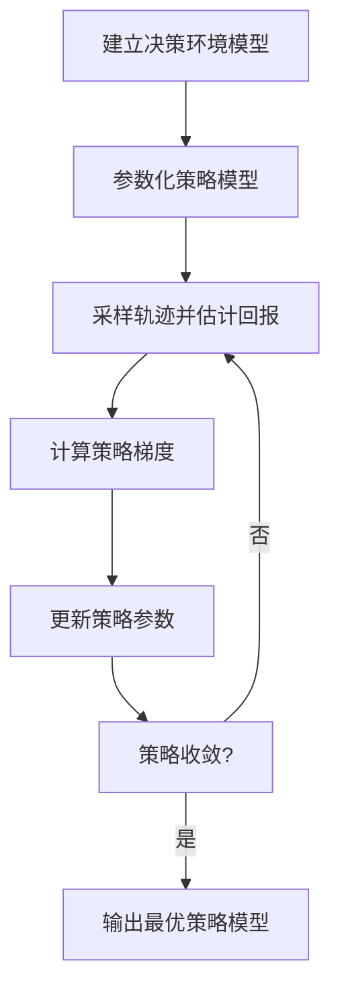

# 策略梯度在企业内部管理政策制定领域的应用

## 1.背景介绍

在当今快节奏的商业环境中,企业面临着不断变化的市场需求和激烈的竞争。为了保持竞争优势,企业需要制定有效的内部管理政策,涵盖从人力资源管理、财务管理到营销策略等多个方面。然而,制定高效的内部管理政策并非易事,需要权衡各种复杂因素并做出明智决策。

在这种背景下,策略梯度(Policy Gradient)作为一种强化学习算法,为企业内部管理政策的制定提供了新的解决方案。策略梯度通过模拟不同决策情景,学习最优策略,从而为企业提供数据驱动的决策支持,提高管理效率。

## 2.核心概念与联系

### 2.1 强化学习概述

强化学习是机器学习的一个重要分支,它关注智能体(Agent)如何通过与环境(Environment)的交互,学习采取最优行为策略(Policy),以最大化累积回报(Cumulative Reward)。

强化学习的核心要素包括:

- 智能体(Agent)
- 环境(Environment)
- 状态(State)
- 行为(Action)
- 奖励(Reward)
- 策略(Policy)

强化学习的目标是找到一个最优策略,使得在给定环境下,智能体可以获得最大的累积奖励。

### 2.2 策略梯度算法

策略梯度算法是解决强化学习问题的一种重要方法,它直接对策略进行参数化,并通过梯度上升的方式优化策略参数,从而找到最优策略。

策略梯度算法的核心思想是:对于一个给定的策略,计算其梯度,并沿着梯度的方向更新策略参数,使得策略的期望回报最大化。

策略梯度算法的一般流程如下:

1. 初始化策略参数
2. 采样若干轨迹(Trajectory)
3. 估计每个轨迹的回报
4. 计算策略梯度
5. 更新策略参数
6. 重复步骤2-5,直到收敛

### 2.3 企业内部管理政策制定

企业内部管理政策是指企业为实现其目标而制定的一系列规则和准则,用于指导和规范企业内部各项运营活动。企业内部管理政策涵盖了人力资源管理、财务管理、营销策略、风险管理等多个方面。

制定高效的内部管理政策对于企业的可持续发展至关重要,但同时也面临着诸多挑战,例如:

- 需要权衡多个目标(如利润、员工满意度、风险控制等)
- 决策环境复杂,存在许多不确定因素
- 缺乏有效的决策支持工具

## 3.核心算法原理具体操作步骤

策略梯度算法在企业内部管理政策制定领域的应用,可以概括为以下几个关键步骤:

### 3.1 建立决策环境模型

首先需要建立企业内部管理决策的环境模型,包括:

- 确定状态空间(State Space),即描述企业当前状态的各个维度,如财务状况、人力资源情况、市场环境等。
- 确定行为空间(Action Space),即企业可以采取的各种管理决策行为,如调整员工薪酬、改变营销策略、调整产品定价等。
- 设计奖励函数(Reward Function),根据企业的目标,定义不同状态和行为组合下的奖励值,如利润、员工满意度等。

### 3.2 参数化策略模型

接下来,需要构建一个参数化的策略模型,用于表示企业在不同状态下采取不同行为的概率分布。

常用的策略模型包括:

- 高斯策略(Gaussian Policy)
- 分类策略(Categorical Policy)

策略模型的参数通常使用神经网络来拟合,其输入为当前状态,输出为不同行为的概率分布。

### 3.3 采样轨迹并估计回报

根据当前的策略模型,采样一定数量的轨迹(即一系列的状态-行为-奖励序列)。对于每个轨迹,计算其累积奖励,作为该轨迹的回报估计值。

### 3.4 计算策略梯度

利用采样得到的轨迹和回报估计值,计算当前策略模型参数的梯度。

常用的策略梯度估计方法包括:

- REINFORCE算法
- 优势actor-critic算法

### 3.5 更新策略参数

根据计算得到的策略梯度,使用优化算法(如随机梯度下降)更新策略模型参数,使得策略的期望回报最大化。

### 3.6 迭代优化

重复步骤3.3-3.5,直到策略收敛或达到预设的迭代次数,得到最终的优化策略模型。



## 4.数学模型和公式详细讲解举例说明

### 4.1 策略梯度定理

策略梯度算法的核心是基于策略梯度定理,用于估计策略参数的梯度。

策略梯度定理可以表示为:

$$\nabla_\theta J(\theta) = \mathbb{E}_{\tau \sim p_\theta(\tau)}\left[\sum_{t=0}^{T} \nabla_\theta \log \pi_\theta(a_t|s_t)Q^{\pi_\theta}(s_t, a_t)\right]$$

其中:

- $\theta$是策略参数
- $J(\theta)$是策略的期望回报
- $\tau$是一个轨迹序列$(s_0, a_0, r_0, s_1, a_1, r_1, \dots, s_T)$
- $p_\theta(\tau)$是在策略$\pi_\theta$下采样轨迹$\tau$的概率
- $\pi_\theta(a_t|s_t)$是在状态$s_t$下选择行为$a_t$的概率
- $Q^{\pi_\theta}(s_t, a_t)$是在策略$\pi_\theta$下,从状态$s_t$采取行为$a_t$的期望回报

策略梯度定理表明,我们可以通过采样轨迹,估计策略参数的梯度,并沿着梯度的方向更新策略参数,从而最大化策略的期望回报。

### 4.2 REINFORCE算法

REINFORCE算法是一种基于策略梯度定理的蒙特卡罗策略梯度估计方法。

在REINFORCE算法中,我们采样一批轨迹$\{\tau_i\}_{i=1}^N$,并使用以下公式估计策略梯度:

$$\nabla_\theta J(\theta) \approx \frac{1}{N}\sum_{i=1}^{N}\left[\sum_{t=0}^{T} \nabla_\theta \log \pi_\theta(a_t^{(i)}|s_t^{(i)})R_t^{(i)}\right]$$

其中$R_t^{(i)}$是第$i$条轨迹从时间步$t$开始的累积奖励。

REINFORCE算法的优点是简单直观,缺点是方差较大,收敛较慢。

### 4.3 优势actor-critic算法

为了减小策略梯度估计的方差,我们可以使用基线(Baseline)函数$b(s_t)$,将$Q^{\pi_\theta}(s_t, a_t)$替换为优势函数(Advantage Function)$A^{\pi_\theta}(s_t, a_t) = Q^{\pi_\theta}(s_t, a_t) - b(s_t)$。

常用的基线函数包括状态值函数$V^{\pi_\theta}(s_t)$,这种方法被称为actor-critic算法。

优势actor-critic算法的策略梯度估计公式为:

$$\nabla_\theta J(\theta) \approx \frac{1}{N}\sum_{i=1}^{N}\left[\sum_{t=0}^{T} \nabla_\theta \log \pi_\theta(a_t^{(i)}|s_t^{(i)})A_t^{(i)}\right]$$

其中$A_t^{(i)} = \sum_{t'=t}^{T} \gamma^{t'-t}r_{t'}^{(i)} - V^{\pi_\theta}(s_t^{(i)})$是第$i$条轨迹从时间步$t$开始的优势估计值,而$V^{\pi_\theta}(s_t^{(i)})$是状态值函数的估计值。

优势actor-critic算法通过减小方差,可以提高策略梯度估计的精度和算法的收敛速度。

### 4.4 示例:员工薪酬政策优化

假设一家企业希望优化其员工薪酬政策,以最大化利润和员工满意度。我们可以将这个问题建模为一个强化学习环境:

- 状态空间包括当前利润、员工满意度等指标
- 行为空间包括调整不同岗位的薪酬水平
- 奖励函数为利润和员工满意度的加权和

我们可以使用策略梯度算法,通过采样不同的薪酬政策,估计其对利润和员工满意度的影响,并优化策略参数,得到最优的薪酬政策。

在这个示例中,我们可以使用优势actor-critic算法,其中actor网络输出不同薪酬政策的概率分布,而critic网络估计当前状态的值函数,用于减小策略梯度估计的方差。

通过不断迭代优化,我们可以得到一个平衡利润和员工满意度的最优薪酬政策。

## 5.项目实践:代码实例和详细解释说明

为了更好地理解策略梯度算法在企业内部管理政策制定领域的应用,我们提供了一个基于PyTorch实现的示例项目。

### 5.1 环境模型

我们首先定义一个简化的企业管理环境模型,包括以下要素:

- 状态空间:当前利润、员工满意度
- 行为空间:调整不同岗位的薪酬水平
- 奖励函数:利润和员工满意度的加权和

```python
import numpy as np

class CorpEnv:
    def __init__(self):
        self.profit = 100  # 初始利润
        self.satisfaction = 50  # 初始员工满意度
        self.salary_levels = [10, 15, 20]  # 三个岗位的薪酬水平

    def reset(self):
        self.profit = 100
        self.satisfaction = 50
        return self.get_state()

    def step(self, action):
        # 根据行为调整薪酬水平
        self.salary_levels[action] += 1
        
        # 计算新的利润和员工满意度
        new_profit = self.profit - sum(self.salary_levels)
        new_satisfaction = np.mean(self.salary_levels)
        
        # 计算奖励
        reward = new_profit + 0.5 * new_satisfaction
        
        # 更新状态
        self.profit = new_profit
        self.satisfaction = new_satisfaction
        
        return self.get_state(), reward, False, {}

    def get_state(self):
        return np.array([self.profit, self.satisfaction])
```

### 5.2 策略网络

我们使用一个简单的全连接神经网络作为策略网络,输出每个行为的概率分布。

```python
import torch
import torch.nn as nn
import torch.nn.functional as F

class PolicyNet(nn.Module):
    def __init__(self, state_dim, action_dim):
        super(PolicyNet, self).__init__()
        self.fc1 = nn.Linear(state_dim, 64)
        self.fc2 = nn.Linear(64, action_dim)

    def forward(self, x):
        x = F.relu(self.fc1(x))
        x = self.fc2(x)
        return F.softmax(x, dim=-1)
```

### 5.3 优势actor-critic算法实现

我们实现了一个优势actor-critic算法,用于优化策略网络的参数。

```python
import torch
import torch.optim as optim

def reinforce(env, policy_net, num_episodes=1000, gamma=0.99):
    optimizer = optim.Adam(policy_net.parameters(), lr=0.01)
    
    for episode in range(num_episodes):
        state = env.reset()
        log_probs = []
        rewards = []
        
        while True:
            state_tensor = torch.from_numpy(state).float().unsqueeze(0)
            action_probs = policy_net(state_tensor)
            action_dist = torch.distributions.Categorical(action_probs)
            action = action_dist.sample()
            
            next_state, reward, done, _ = env.step(action.item())
            log_prob