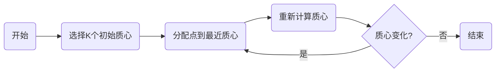

# 聚类分析在物流领域的应用

## 1. 背景介绍

随着全球化贸易的不断扩展和电子商务的迅猛发展，物流行业正面临着前所未有的挑战和机遇。物流企业需要处理的数据量日益增加，如何从海量数据中提取有价值的信息，优化物流路径，提高配送效率，降低运营成本，成为了行业发展的关键。聚类分析作为一种无监督学习的方法，能够在未知标签的数据中发现内在的结构，因此在物流领域具有广泛的应用前景。

## 2. 核心概念与联系

聚类分析是一种将数据集中的样本划分为多个类别的方法，使得同一类别中的样本相似度高，不同类别间的样本相似度低。在物流领域，聚类可以用于客户分群、仓库布局优化、配送路线规划等多个方面。例如，通过对客户地址进行聚类，可以优化配送路线，减少运输成本。

## 3. 核心算法原理具体操作步骤

聚类算法有多种，包括K-Means、层次聚类、DBSCAN等。以K-Means为例，其操作步骤如下：

1. 选择K个点作为初始质心。
2. 将每个点分配到最近的质心，形成K个簇。
3. 重新计算每个簇的质心。
4. 重复步骤2和3，直到质心不再变化。



## 4. 数学模型和公式详细讲解举例说明

K-Means算法的目标是最小化簇内样本与质心之间的距离总和，即最小化目标函数：

$$
J = \sum_{i=1}^{k}\sum_{x \in S_i}||x - \mu_i||^2
$$

其中，$k$ 是簇的数量，$S_i$ 是第$i$个簇中的样本集合，$\mu_i$ 是第$i$个簇的质心，$||x - \mu_i||^2$ 是样本$x$到质心$\mu_i$的欧氏距离的平方。

## 5. 项目实践：代码实例和详细解释说明

以Python中的`sklearn`库为例，以下是一个简单的K-Means聚类代码实例：

```python
from sklearn.cluster import KMeans
import numpy as np

# 假设有一组物流配送点的二维坐标数据
data = np.array([[1, 2], [1, 4], [1, 0],
                 [10, 2], [10, 4], [10, 0]])

# 使用K-Means算法进行聚类，这里假设聚成两类
kmeans = KMeans(n_clusters=2, random_state=0).fit(data)

# 输出聚类结果
print(kmeans.labels_)
# 输出质心坐标
print(kmeans.cluster_centers_)
```

## 6. 实际应用场景

聚类分析在物流领域的应用场景包括：

- 客户分群：根据客户的地理位置、订单频率等特征进行聚类，以实现个性化的物流服务。
- 仓库布局：通过聚类分析商品的共同购买模式，优化仓库内商品的摆放，提高拣选效率。
- 配送路线规划：对配送点进行聚类，合理规划配送路线，减少配送时间和成本。

## 7. 工具和资源推荐

- `sklearn`：一个强大的Python机器学习库，提供了多种聚类算法的实现。
- `RapidMiner`：一个数据科学平台，提供了丰富的数据分析工具，包括聚类分析。
- `Tableau`：一个数据可视化工具，可以帮助理解聚类结果。

## 8. 总结：未来发展趋势与挑战

聚类分析在物流领域的应用前景广阔，但也面临着数据质量、算法选择、实时性等挑战。未来的发展趋势可能包括结合深度学习进行特征学习，提高聚类的准确性和效率；以及实时聚类分析，以适应动态变化的物流需求。

## 9. 附录：常见问题与解答

Q1: 聚类分析在物流领域有哪些具体的应用？
A1: 聚类分析可用于客户分群、仓库布局优化、配送路线规划等。

Q2: 如何选择合适的聚类算法？
A2: 需要根据数据的特点和分析的目标来选择，例如，对于大规模数据集，可以选择Mini-Batch K-Means；对于有噪声的数据，可以选择DBSCAN。

作者：禅与计算机程序设计艺术 / Zen and the Art of Computer Programming