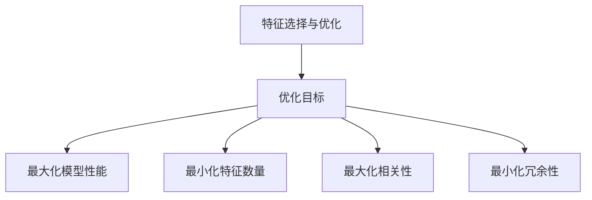
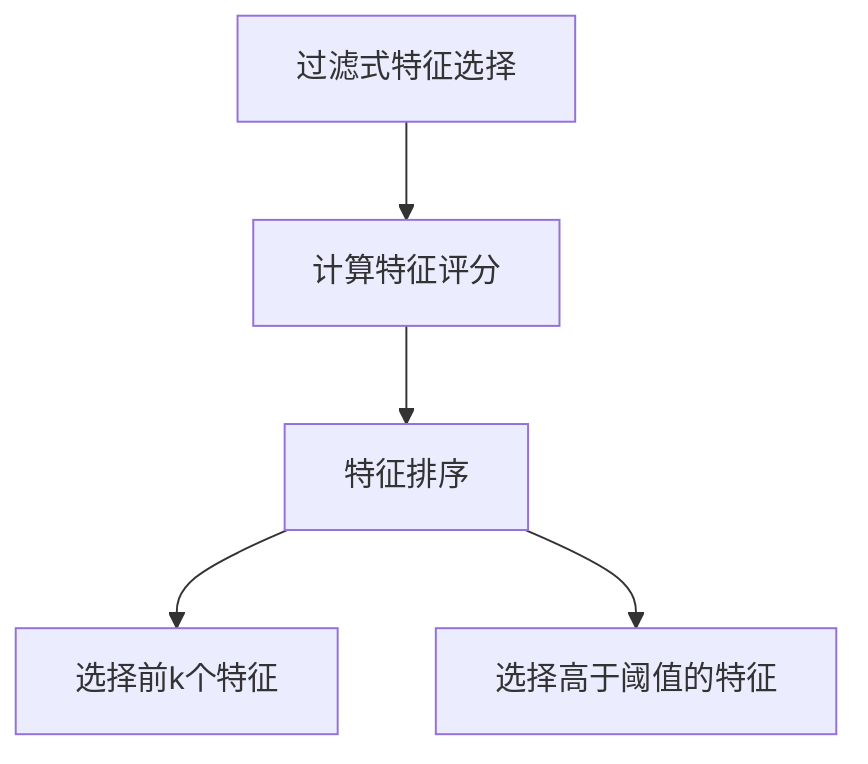
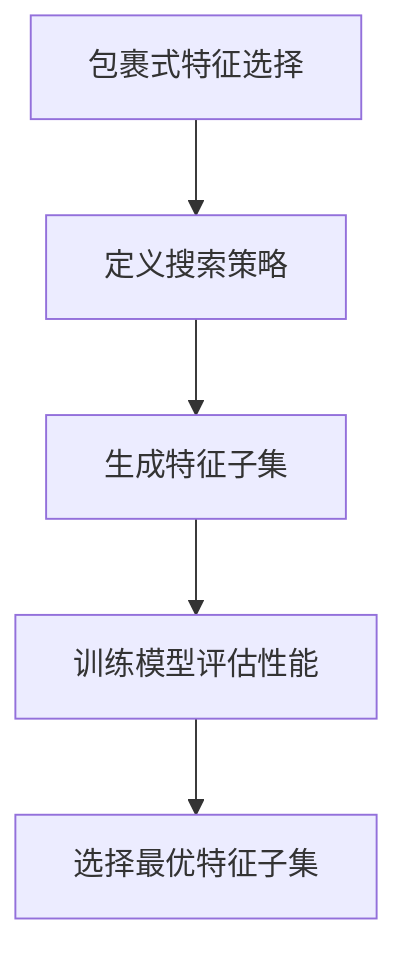
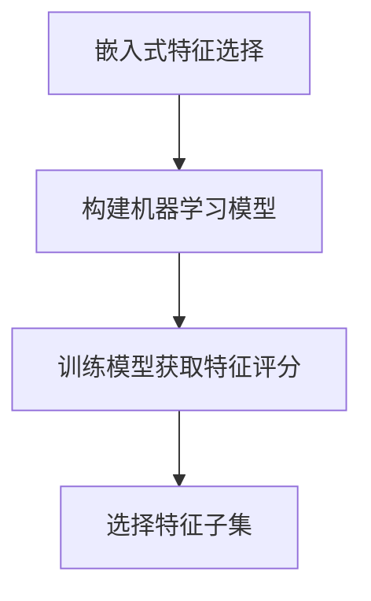

# 自动化特征工程:特征选择与优化方法

## 1.背景介绍

在机器学习和数据挖掘领域中,特征工程是一个至关重要的步骤。特征是指描述原始数据的属性或特性,通常是一个向量,其中每个元素代表数据的一个属性。特征工程的目的是从原始数据中提取有意义的特征,以供机器学习算法使用。

传统的特征工程过程通常是手工完成的,需要大量的领域知识和经验。这种方法不仅耗时耗力,而且难以获得最优特征集。随着数据量和维度的不断增加,手工特征工程已经变得越来越困难。因此,自动化特征工程成为了一个热门的研究方向。

自动化特征工程包括两个主要任务:特征选择和特征构造。特征选择旨在从原始特征集中选择最相关的子集,而特征构造则是通过组合或转换现有特征来创建新的特征。本文将重点介绍特征选择与优化方法。

## 2.核心概念与联系

### 2.1 特征选择的重要性

在机器学习任务中,往往存在大量的特征,但并非所有特征都对预测目标有贡献。包含无关特征不仅会增加计算复杂度,还可能导致过拟合和降低模型的泛化能力。因此,特征选择旨在从原始特征集中选择最相关的子集,以提高模型的性能和可解释性。

### 2.2 特征选择与优化的关系

特征选择可以看作是一个优化问题,目标是找到一个最优的特征子集,使得在保留预测性能的同时,尽可能减少特征数量。这个优化问题通常是 NP 难的组合优化问题,需要使用启发式或近似算法来解决。

优化目标通常包括以下几个方面:

1. 最大化模型的预测性能(如准确率、F1分数等)
2. 最小化特征子集的大小
3. 最大化特征子集的相关性
4. 最小化特征子集的冗余性

在实践中,我们需要权衡这些目标,找到一个合适的特征子集。



## 3.核心算法原理具体操作步骤

特征选择算法可以分为三大类:过滤式(Filter)、包裹式(Wrapper)和嵌入式(Embedded)。

### 3.1 过滤式算法

过滤式算法根据特征与目标变量之间的相关性评分,选择得分最高的特征子集。这种方法计算简单、高效,且独立于机器学习算法,但可能会忽略特征之间的相互影响。

常见的过滤式算法包括:

1. **单变量统计检验**,如卡方检验、互信息等。
2. **相关系数衡量**,如皮尔逊相关系数、斯皮尔曼相关系数等。

过滤式算法的一般步骤如下:

1. 计算每个特征与目标变量的相关性评分
2. 根据评分对特征排序
3. 选择前 k 个特征或选择评分高于阈值的特征



### 3.2 包裹式算法

包裹式算法将特征选择过程与机器学习算法相结合,通过训练和评估不同的特征子集来选择最优的一个。这种方法能够充分考虑特征与模型之间的相互影响,但计算代价较高。

常见的包裹式算法包括:

1. **递归特征消除(RFE)**,基于模型权重iteratively删除最不重要的特征。
2. **序列后向选择(SBS)**和**序列前向选择(SFS)**,分别从全集和空集出发,逐步删除或添加特征。

包裹式算法的一般步骤如下:

1. 定义搜索策略(如启发式、随机等)
2. 生成特征子集
3. 训练机器学习模型并评估性能
4. 选择最优的特征子集



### 3.3 嵌入式算法

嵌入式算法在机器学习模型训练的同时自动进行特征选择。这种方法能够充分利用模型的内部结构,但往往依赖于特定的机器学习算法。

常见的嵌入式算法包括:

1. **Lasso回归**,通过L1正则化实现自动特征选择。
2. **决策树算法**,可以根据特征的重要性对特征进行选择。

嵌入式算法的一般步骤如下:

1. 构建机器学习模型
2. 训练模型,同时获得特征重要性评分
3. 根据评分选择特征子集



## 4.数学模型和公式详细讲解举例说明

### 4.1 过滤式算法:互信息

互信息(Mutual Information)是衡量两个随机变量之间相关性的一种度量。在特征选择中,我们可以计算每个特征与目标变量之间的互信息,并选择互信息最大的特征子集。

对于离散随机变量 $X$ 和 $Y$,互信息定义为:

$$I(X;Y) = \sum_{x \in X} \sum_{y \in Y} p(x,y) \log \frac{p(x,y)}{p(x)p(y)}$$

其中 $p(x,y)$ 是 $X$ 和 $Y$ 的联合概率分布, $p(x)$ 和 $p(y)$ 分别是 $X$ 和 $Y$ 的边缘概率分布。

对于连续随机变量,互信息可以通过估计概率密度函数来计算。

互信息具有以下性质:

- 非负性: $I(X;Y) \geq 0$
- 对称性: $I(X;Y) = I(Y;X)$
- 当且仅当 $X$ 和 $Y$ 相互独立时,互信息等于 0

互信息可以有效地捕捉特征与目标变量之间的线性和非线性关系。

### 4.2 包裹式算法:递归特征消除(RFE)

递归特征消除(Recursive Feature Elimination, RFE)是一种常用的包裹式特征选择算法。它基于机器学习模型的特征重要性,iteratively删除最不重要的特征,直到达到期望的特征数量或性能。

RFE 算法的步骤如下:

1. 训练机器学习模型(如线性模型、树模型等)
2. 计算每个特征的重要性评分(如模型权重的绝对值)
3. 删除重要性评分最低的特征
4. 重复步骤 1-3,直到达到期望的特征数量或性能

对于线性模型,特征重要性可以直接由模型权重的绝对值来衡量。对于树模型,特征重要性可以通过计算每个特征对于降低杂质或基尼系数的贡献来衡量。

RFE 算法的优点是能够充分利用机器学习模型的内部结构,并且可以适用于各种类型的模型。但是,它的计算代价较高,尤其是在特征数量很大的情况下。

## 5.项目实践:代码实例和详细解释说明

以下是使用 Python 和 scikit-learn 库实现特征选择的代码示例:

### 5.1 过滤式算法:互信息

```python
from sklearn.feature_selection import mutual_info_classif
import numpy as np

# 样本数据
X = np.array([[1, 2], [3, 4], [5, 6], [7, 8]])
y = np.array([0, 1, 0, 1])

# 计算每个特征与目标变量的互信息
mutual_info = mutual_info_classif(X, y)

# 根据互信息排序并选择前 k 个特征
k = 1
selected_features = np.argsort(mutual_info)[-k:]

print("Selected features:", selected_features)
```

输出:

```
Selected features: [1]
```

在这个示例中,我们首先计算每个特征与目标变量的互信息。然后,我们根据互信息值对特征进行排序,并选择互信息最大的一个特征。

### 5.2 包裹式算法:递归特征消除(RFE)

```python
from sklearn.linear_model import LogisticRegression
from sklearn.feature_selection import RFE
import numpy as np

# 样本数据
X = np.array([[1, 2], [3, 4], [5, 6], [7, 8]])
y = np.array([0, 1, 0, 1])

# 创建 RFE 对象
estimator = LogisticRegression()
selector = RFE(estimator, n_features_to_select=1, step=1)

# 执行特征选择
selector = selector.fit(X, y)

# 获取选择的特征索引
selected_features = np.where(selector.support_ == True)[0]

print("Selected features:", selected_features)
```

输出:

```
Selected features: [1]
```

在这个示例中,我们首先创建一个 `LogisticRegression` 模型作为 RFE 的估计器。然后,我们创建一个 RFE 对象,指定要选择的特征数量为 1,并设置每次删除一个特征。接下来,我们在训练数据上拟合 RFE 对象,并获取选择的特征索引。

## 6.实际应用场景

自动化特征工程在各种领域都有广泛的应用,包括但不限于:

1. **计算机视觉**: 从图像或视频中提取有意义的特征,用于目标检测、图像分类等任务。
2. **自然语言处理**: 从文本数据中提取特征,用于文本分类、情感分析、机器翻译等任务。
3. **生物信息学**: 从基因组序列、蛋白质结构等数据中提取特征,用于疾病预测、药物设计等任务。
4. **金融**: 从金融数据中提取特征,用于股票预测、欺诈检测等任务。
5. **推荐系统**: 从用户行为数据中提取特征,用于个性化推荐。

自动化特征工程不仅能够提高机器学习模型的性能,还能够减少人工特征工程的工作量,加快模型开发的速度。

## 7.工具和资源推荐

以下是一些常用的特征选择工具和资源:

1. **scikit-learn**: Python 中流行的机器学习库,提供了多种特征选择算法的实现。
2. **mlxtend**: Python 中的机器学习扩展库,包含了一些额外的特征选择算法。
3. **MATLAB Statistics and Machine Learning Toolbox**: MATLAB 中的统计和机器学习工具箱,提供了特征选择功能。
4. **R**: 统计编程语言,有多个专门用于特征选择的包,如 `caret`、`Boruta` 等。
5. **WEKA**: 一个集成了多种机器学习算法的开源工具,包括特征选择功能。
6. **Feature Selection Repository**: 一个专门收集特征选择算法和数据集的在线资源库。

此外,还有一些专门的特征选择竞赛和挑战,如 Coil 2000 特征选择竞赛、NIPS 特征选择挑战等,可以用于测试和比较不同的特征选择算法。

## 8.总结:未来发展趋势与挑战

自动化特征工程是一个活跃的研究领域,未来可能会有以下一些发展趋势和挑战:

1. **端到端特征学习**: 目前的特征工程方法通常是将特征选择和构造作为机器学习模型的预处理步骤。未来,端到端的特征学习可能会成为一种趋势,将特征工程与模型训练无缝集成。
2. **深度特征学习**: 随着深度学习技术的发展,基于深度神经网络的特征学习方法可能会变得更加普遍。
3. **在线特征选择**: 当前的特征选择算法通常是在离线数据上进行的。对于在线学习和流数据场