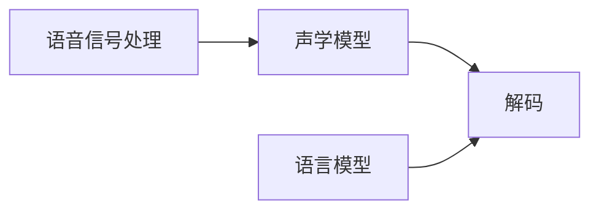

## 1.背景介绍

语音识别，即Speech Recognition，是一种将人类的语音信号转换为文字或命令的技术。随着科技的发展，语音识别在我们的生活中扮演着越来越重要的角色，如智能手机、智能家居、车载系统等都广泛应用了这项技术。

## 2.核心概念与联系

语音识别的核心概念主要包括以下几个部分：

- 语音信号处理：通过傅立叶变换、滤波器组等技术对语音信号进行预处理，提取出语音的特征参数。
- 语音模型：包括声学模型和语言模型两部分。声学模型描述了语音信号和音素之间的关系，语言模型则描述了音素序列的概率分布。
- 解码：通过搜索算法在语音模型中找到最可能的音素序列，然后转换为文字或命令。

这些概念之间的关系可以通过下图来表示：



## 3.核心算法原理具体操作步骤

语音识别的核心算法主要包括以下几个步骤：

1. **语音信号处理**：首先，对输入的语音信号进行预处理，包括预加重、分帧、窗函数处理、快速傅立叶变换等，提取出语音的特征参数。

2. **声学模型训练**：使用隐马尔科夫模型（HMM）或深度神经网络（DNN）等算法对语音特征和音素之间的关系进行建模。

3. **语言模型训练**：使用n-gram模型或神经网络语言模型（NNLM）等算法对音素序列的概率分布进行建模。

4. **解码**：使用Viterbi算法或束搜索算法在声学模型和语言模型中找到最可能的音素序列，然后通过字典查找将音素序列转换为文字或命令。

## 4.数学模型和公式详细讲解举例说明

在语音识别中，我们常常使用隐马尔科夫模型（HMM）来进行声学模型的训练。HMM是一种统计模型，可以描述一个含有未知参数的马尔科夫过程。其状态序列是隐藏的，我们只能观察到与状态序列相关的一系列观察值。

HMM的参数包括状态转移概率矩阵$A$、观察概率矩阵$B$和初始状态概率向量$π$。给定观察序列$O$和模型参数$λ=(A,B,π)$，我们的目标是找到最可能的状态序列$Q$。这可以通过Viterbi算法来实现，其公式如下：

$$
\delta_t(i) = \max_{1 \leq j \leq N}[\delta_{t-1}(j)a_{ji}]b_i(o_t)
$$

其中，$a_{ji}$是状态$j$转移到状态$i$的概率，$b_i(o_t)$是在状态$i$下观察到$o_t$的概率，$N$是状态的总数。

## 5.项目实践：代码实例和详细解释说明

以下是一个使用Python和librosa库进行语音信号处理的简单示例：

```python
import librosa

# 读取语音文件
y, sr = librosa.load('example.wav')

# 提取MFCC特征
mfccs = librosa.feature.mfcc(y=y, sr=sr)

print(mfccs)
```

在这个示例中，我们首先使用librosa的load函数读取语音文件，然后使用mfcc函数提取语音的MFCC特征。

## 6.实际应用场景

语音识别技术在许多场景中都有广泛的应用，例如：

- **智能手机**：如Siri、Google Assistant等都使用了语音识别技术，用户可以通过语音命令进行搜索、设置提醒、发送信息等操作。
- **智能家居**：如Amazon Echo、Google Home等设备可以通过语音识别技术控制家居设备，如开关灯光、调节温度等。
- **车载系统**：如Apple CarPlay、Android Auto等系统可以通过语音识别技术进行导航、播放音乐、接听电话等操作。

## 7.工具和资源推荐

以下是一些语音识别相关的工具和资源推荐：

- **Kaldi**：一个开源的语音识别工具包，包含了许多语音识别相关的算法和模型。
- **CMU Sphinx**：一个开源的语音识别系统，可以进行实时的语音识别。
- **TensorFlow Speech Recognition Challenge**：Kaggle上的一个语音识别比赛，可以找到许多相关的代码和数据集。

## 8.总结：未来发展趋势与挑战

随着深度学习等技术的发展，语音识别的准确率已经有了很大的提高。然而，语音识别仍然面临一些挑战，如噪声干扰、方言识别、连续语音识别等。未来，我们期待通过更深层次的研究和更强大的算法，能够解决这些问题，使语音识别技术更加完善。

## 9.附录：常见问题与解答

1. **问：语音识别和语音合成有什么区别？**

   答：语音识别是将语音信号转换为文字或命令，而语音合成则是将文字转换为语音信号。

2. **问：语音识别的准确率如何？**

   答：目前，最先进的语音识别系统在特定的任务上的准确率已经超过了95%。

3. **问：语音识别可以应用在哪些场景？**

   答：语音识别可以应用在许多场景，如智能手机、智能家居、车载系统等。

作者：禅与计算机程序设计艺术 / Zen and the Art of Computer Programming