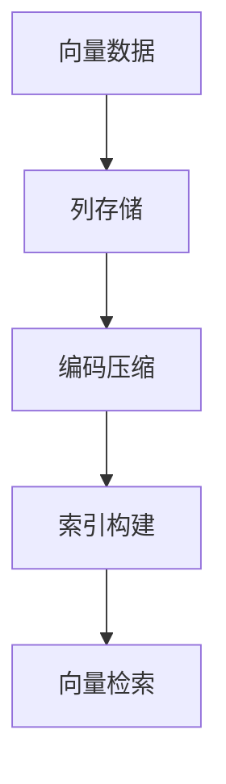
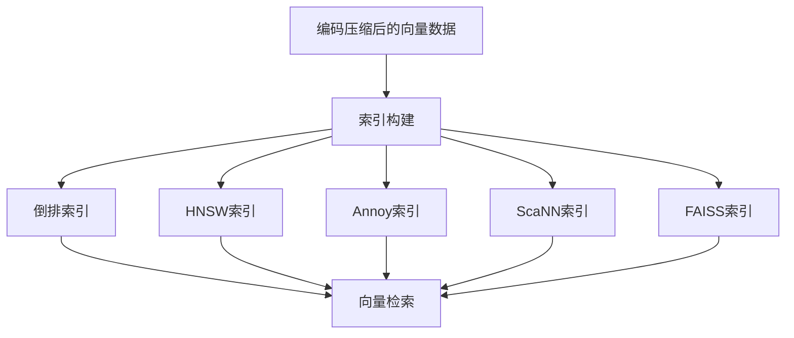
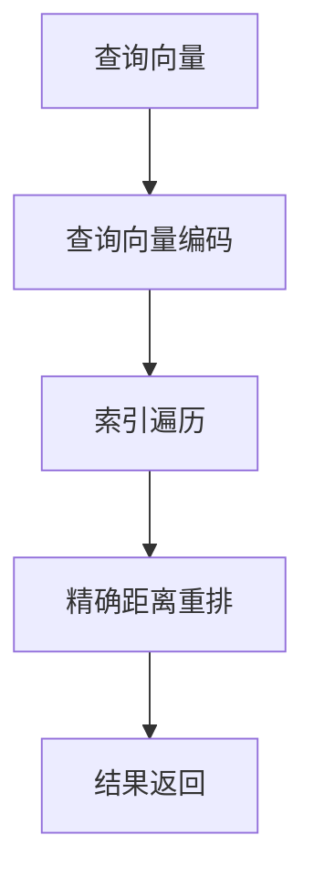

# 高性能向量数据库在科学研究中的角色

## 1.背景介绍

### 1.1 数据驱动科学研究的重要性

在当今时代,数据已经成为推动科学研究和创新的核心动力。无论是基础研究还是应用研究,都离不开对大量数据的收集、存储、处理和分析。随着科学仪器的不断升级和实验规模的扩大,科研领域产生的数据量正呈现出爆炸式增长。有效利用这些海量数据,将是科学研究取得突破性进展的关键所在。

### 1.2 传统数据库在科研数据管理中的挑战

传统的关系型数据库和NoSQL数据库在处理科研数据时面临着诸多挑战:

1. **数据量大且增长迅速**:科研数据的规模往往达到PB甚至EB级别,远超传统数据库的处理能力。
2. **数据类型复杂多样**:科研数据包括结构化数据、半结构化数据和非结构化数据,如图像、视频、基因序列等,难以用单一数据模型高效表示。
3. **数据操作需求多样**:科研过程中需要进行数据存储、查询、分析、可视化等多种操作,对数据库的灵活性和性能要求很高。
4. **实时性和可扩展性要求**:科研工作对数据的实时处理和分析能力有较高要求,同时需要数据库具备良好的可扩展性以应对不断增长的数据量。

因此,传统数据库在满足科研数据管理需求方面存在明显不足,迫切需要新型数据库技术的支持。

### 1.3 向量数据库的兴起

近年来,随着机器学习和深度学习技术的迅速发展,向量数据库(Vector Database)作为一种新型数据库解决方案应运而生。向量数据库专门为处理向量数据而设计,能够高效地存储、检索和计算海量向量数据,为科研领域提供了强大的数据管理能力。

向量数据库的核心思想是将高维数据(如图像、视频、文本等)映射为向量,并基于向量相似性进行快速检索和分析操作。与传统数据库相比,向量数据库具有以下优势:

1. **高效的相似性搜索**:基于向量相似度计算,可以快速找到相似的数据样本,支持科研中的模式识别、聚类分析等任务。
2. **优秀的查询性能**:通过索引和近似最近邻搜索算法,可以在海量向量数据中快速检索目标向量。
3. **灵活的数据模型**:可以存储任意维度的向量数据,支持多种非结构化数据类型。
4. **可扩展的架构设计**:采用分布式架构,具备良好的水平扩展能力,可以轻松应对数据量的持续增长。

由于这些独特优势,向量数据库在科学研究领域得到了广泛应用,为数据驱动的科研工作提供了高效、灵活的数据管理支持。

## 2.核心概念与联系

### 2.1 向量数据及其在科研中的应用

在科学研究中,向量数据无处不在。任何可以用数值向量表示的数据,都可以存储和处理于向量数据库之中。以下是一些典型的向量数据类型及其在科研中的应用场景:

1. **图像数据**:在计算机视觉、医学影像等领域,图像数据通常被表示为像素向量,用于图像识别、分类、检测等任务。
2. **文本数据**:通过词嵌入(Word Embedding)技术,文本可以被映射为向量表示,广泛应用于自然语言处理、文本分类、情感分析等领域。
3. **基因序列数据**:在生物信息学研究中,基因序列可以编码为数值向量,用于基因分析、蛋白质结构预测等任务。
4. **传感器数据**:来自各种科学仪器的传感器数据,如天文观测数据、地质勘探数据等,都可以用向量表示并存储于向量数据库中。

除了上述数据类型,任何可以数值化的科研数据都可以转化为向量形式,存储和处理于向量数据库之中。向量数据库为各个科研领域提供了统一的数据管理和分析平台。

### 2.2 向量相似性计算

向量相似性计算是向量数据库的核心概念之一。由于向量数据库中存储的是高维向量,因此需要通过相似性计算来判断两个向量之间的接近程度。常用的向量相似性度量方法包括:

1. **欧几里得距离**($L_2$范数):
   $$\operatorname{dist}(\vec{x}, \vec{y})=\sqrt{\sum_{i=1}^{n}\left(x_{i}-y_{i}\right)^{2}}$$

2. **曼哈顿距离**($L_1$范数):
   $$\operatorname{dist}(\vec{x}, \vec{y})=\sum_{i=1}^{n}\left|x_{i}-y_{i}\right|$$

3. **余弦相似度**:
   $$\operatorname{sim}(\vec{x}, \vec{y})=\frac{\vec{x} \cdot \vec{y}}{\|\vec{x}\|\|\vec{y}\|}=\frac{\sum_{i=1}^{n} x_{i} y_{i}}{\sqrt{\sum_{i=1}^{n} x_{i}^{2}} \sqrt{\sum_{i=1}^{n} y_{i}^{2}}}$$

其中,欧几里得距离和曼哈顿距离越小,表示两个向量越相似;余弦相似度越接近1,表示两个向量越相似。

通过高效的相似性计算,向量数据库可以快速找到与目标向量最相似的数据样本,支持科研中的模式识别、聚类分析、相似检索等常见任务。

### 2.3 近似最近邻搜索算法

为了在海量向量数据中快速检索相似向量,向量数据库通常采用近似最近邻搜索(Approximate Nearest Neighbor Search, ANNS)算法。与精确最近邻搜索相比,ANNS算法牺牲了一定的精度,但极大地提高了查询效率,能够在可接受的时间内返回近似结果。

常用的ANNS算法包括:

1. **局部敏感哈希**(Locality Sensitive Hashing, LSH)
2. **hierarchical navigable small world graphs**(HNSW)
3. **Annoy**(Approximate Nearest Neighbors Oh Yeah)
4. **ScaNN**(Scalar Quantized Neural Networks)
5. **FAISS**(Facebook AI Similarity Search)

这些算法通过不同的索引和搜索策略,实现了在高维向量空间中的快速近似最近邻查询。其中,FAISS和ScaNN是Meta(Facebook)提出的两种高性能ANNS算法,被广泛应用于工业界和科研领域。

通过ANNS算法,向量数据库可以在亿级或更大规模的向量数据集中,快速检索与目标向量最相似的数据样本,为科研工作提供高效的数据分析能力。

### 2.4 向量数据库与机器学习的联系

向量数据库与机器学习技术有着天然的联系。机器学习模型通常会将输入数据映射为向量表示,并基于向量数据进行训练和推理。同时,机器学习技术也为向量数据库提供了强大的支持:

1. **向量嵌入**:通过词嵌入(Word Embedding)、图像嵌入等技术,可以将非结构化数据转换为向量表示,从而存储于向量数据库中。
2. **相似性度量学习**:通过机器学习算法,可以自动学习出更合适的向量相似性度量方式,提高向量检索的准确性。
3. **索引优化**:利用深度学习技术,可以对向量数据进行高效编码和索引,提升向量查询的性能。
4. **数据增强**:通过生成对抗网络(GAN)等技术,可以基于现有向量数据生成新的合成数据,扩充科研数据集。

机器学习和向量数据库的紧密结合,为科研数据的存储、检索和分析提供了全新的解决方案,推动了数据驱动科学研究的发展。

## 3.核心算法原理具体操作步骤

### 3.1 向量数据存储

向量数据库通常采用列存储(Column-Oriented Storage)的方式来存储向量数据,以提高查询性能。每个向量被拆分为多个维度,每个维度作为一列进行存储。这种存储方式具有以下优势:

1. **高效的向量检索**:由于相似向量在每个维度上的值也相近,因此可以通过扫描少量列就能快速找到相似向量。
2. **优化的内存利用**:列存储可以有效压缩重复值,节省内存空间。
3. **并行计算友好**:不同列可以并行处理,提高计算效率。

为了进一步优化存储和查询性能,向量数据库通常会对向量数据进行编码和压缩。常用的编码方式包括:

1. **标量量化**(Scalar Quantization)
2. **产品量化**(Product Quantization)
3. **残差量化**(Residual Quantization)

通过这些编码技术,可以将高维向量数据压缩为紧凑的二进制码,从而减小存储空间占用,并加速向量检索过程。

### 3.2 索引构建

为了加速向量检索过程,向量数据库需要为存储的向量数据构建高效的索引结构。常用的索引技术包括:

1. **倒排索引**(Inverted Index)
2. **hierarchical navigable small world graphs**(HNSW)
3. **Annoy**(Approximate Nearest Neighbors Oh Yeah)
4. **ScaNN**(Scalar Quantized Neural Networks)
5. **FAISS**(Facebook AI Similarity Search)

其中,HNSW、Annoy、ScaNN和FAISS是基于近似最近邻搜索算法构建的高维向量索引结构,能够在牺牲少量精度的情况下,极大提升向量查询的效率。

以HNSW为例,它构建了一个分层的导航小世界图(Hierarchical Navigable Small World Graph),将高维向量空间划分为多个层级。在查询时,从顶层开始遍历,逐层缩小搜索范围,最终找到与目标向量最近似的候选向量。HNSW索引具有优秀的查询性能,并且可以通过增加层数来提高查询精度。

### 3.3 向量检索

在构建好索引之后,向量数据库就可以高效地执行向量检索操作。向量检索的基本流程如下:

1. **查询向量编码**:将查询向量按照相同的编码方式进行编码,得到紧凑的二进制码表示。
2. **索引遍历**:根据构建的索引结构(如HNSW、Annoy等),快速遍历索引,找到与查询向量最相似的候选向量集合。
3. **精确距离重排**:对候选向量集合进行精确距离计算(如欧几里得距离、余弦相似度等),按相似度从高到低排序。
4. **结果返回**:返回排序后的前N个最相似向量及其对应的原始数据。

通过索引加速和近似最近邻搜索算法,向量数据库可以在亿级或更大规模的向量数据集中,快速检索与目标向量最相似的数据样本,为科研工作提供高效的数据分析支持。

## 4.数学模型和公式详细讲解举例说明

### 4.1 向量空间模型

向量空间模型(Vector Space Model)是向量数据库的数学基础。在这个模型中,每个数据样本(如文本、图像等)被表示为一个高维向量,所有向量构成了一个向量空间。

设有$n$个数据样本$\{x_