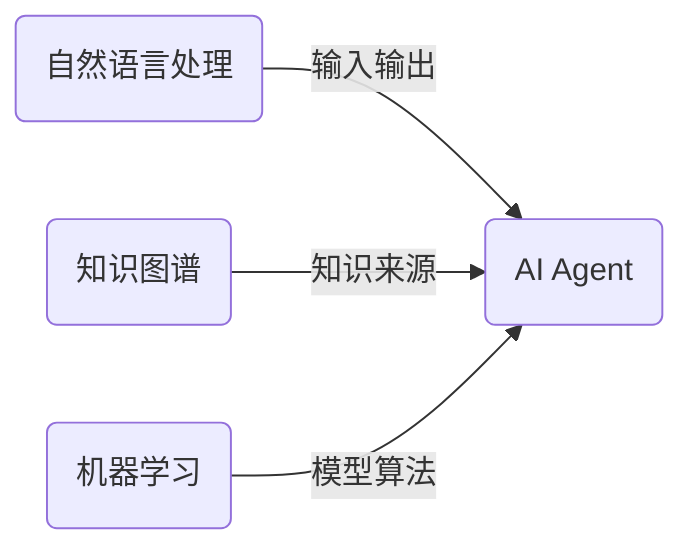
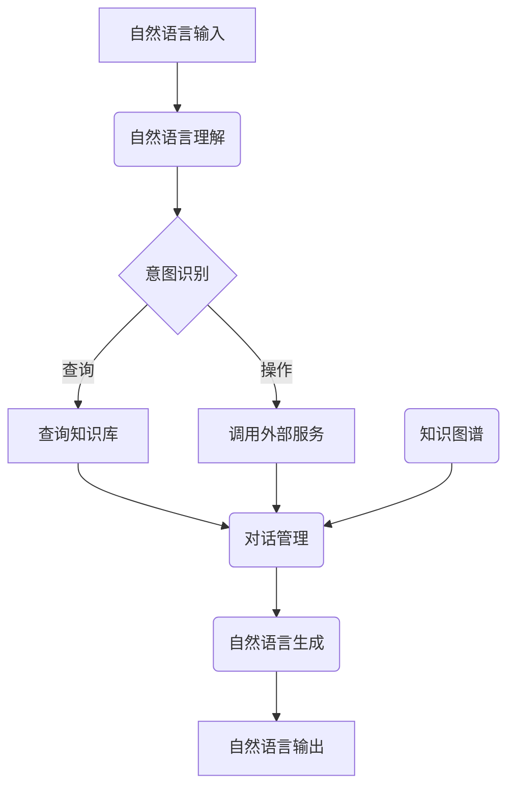

# AI Agent: AI的下一个风口 从图形用户界面到自然语言的进化

## 1.背景介绍

### 1.1 人机交互的演进历程

人机交互一直是人工智能领域的核心研究课题之一。在过去几十年中,人机交互方式经历了从命令行界面、图形用户界面(GUI)到现在的自然语言交互等多个阶段的演进。每一次演进都极大地提升了人机交互的效率和体验。

### 1.2 自然语言交互的兴起

近年来,受益于深度学习、大数据等技术的飞速发展,自然语言处理(NLP)技术取得了突破性进展。智能语音助手、智能问答系统、机器翻译等应用逐渐走进了我们的生活。自然语言交互无疑正在成为人机交互的新趋势和新风口。

### 1.3 AI Agent的概念

AI Agent(人工智能代理)是指能够理解和生成自然语言、与人自然对话的智能系统。它综合运用了自然语言处理、知识图谱、机器学习等多种人工智能技术,旨在为用户提供智能化的问答、办事等服务。AI Agent有望成为未来人机交互的主导形式。

## 2.核心概念与联系

### 2.1 自然语言处理(NLP)

自然语言处理是AI Agent的核心技术基础,包括自然语言理解(NLU)和自然语言生成(NLG)两个方面:

- 自然语言理解(NLU):将人类自然语言输入转换为计算机可以理解和处理的形式,如词法分析、句法分析、语义分析等。
- 自然语言生成(NLG):根据系统内部表示,生成自然语言的文本或语音输出。

### 2.2 知识图谱

知识图谱是指将结构化知识以图的形式表示和存储,是AI Agent理解自然语言和生成上下文相关响应的知识来源。知识图谱通常包含实体(entity)、概念(concept)、关系(relation)等要素。

### 2.3 机器学习

机器学习算法在AI Agent中发挥着重要作用,如:

- 深度学习模型(如Transformer)用于NLP任务
- 强化学习用于对话策略优化
- 知识图谱补全和推理

### 2.4 核心概念关系

自然语言处理、知识图谱和机器学习三者相互关联、相辅相成,共同构建了AI Agent的核心技术架构:



## 3.核心算法原理具体操作步骤

AI Agent的核心算法主要包括以下几个步骤:

### 3.1 自然语言理解

1. **词法分析**:将自然语言输入分割为词元(token)序列
2. **句法分析**:构建语法树,确定词元之间的句法关系
3. **语义分析**:提取语义角色、意图等语义信息
4. **上下文理解**:结合对话历史和知识图谱,理解语句的上下文语义

### 3.2 对话管理

1. **意图识别**:根据NLU结果,确定用户的对话意图
2. **状态跟踪**:跟踪和更新对话状态
3. **策略学习**:根据对话状态,采用强化学习等方法,选择最优的对话行为
4. **行为执行**:执行选定的对话行为,如查询知识库、调用外部服务等

### 3.3 自然语言生成

1. **内容选择**:根据对话状态和策略,选择响应的内容要素
2. **句子规划**:确定语句结构和修辞手段
3. **实现**:将内容实现为自然语言文本或语音输出

### 3.4 核心算法流程图



## 4.数学模型和公式详细讲解举例说明

### 4.1 Transformer模型

Transformer是NLP领域广泛使用的一种基于注意力机制的序列到序列模型,在机器翻译、文本生成等任务中表现出色。其核心思想是使用Self-Attention代替RNN和CNN,避免了长期依赖问题。

Transformer的Self-Attention公式如下:

$$Attention(Q, K, V) = softmax(\frac{QK^T}{\sqrt{d_k}})V$$

其中 $Q$ 为查询(Query)向量, $K$ 为键(Key)向量, $V$ 为值(Value)向量, $d_k$ 为缩放因子。

### 4.2 BERT模型

BERT(Bidirectional Encoder Representations from Transformers)是一种基于Transformer的双向编码器模型,在自然语言理解任务中表现卓越。它引入了Masked Language Model(MLM)和Next Sentence Prediction(NSP)两个预训练任务。

BERT的MLM目标函数为:

$$\log P(x_{mask}|x_{context}) = \sum_{i\in mask} \log P(x_i|x_{context\backslash i}; \theta)$$

其中 $x_{mask}$ 表示被mask的词, $x_{context}$ 表示上下文词序列, $\theta$ 为模型参数。

### 4.3 知识图谱嵌入

知识图谱嵌入是将实体和关系映射到低维连续向量空间的技术,可提高知识表示和推理的效率。TransE是一种经典的知识图谱嵌入模型,其目标函数为:

$$L = \sum_{(h,r,t)\in S} \sum_{(h',r',t')\in S'} [\gamma + d(h + r, t) - d(h' + r', t')]_+$$

其中 $S$ 为正例三元组集合, $S'$ 为负例三元组集合, $\gamma$ 为边距超参数, $d$ 为距离函数(如L1或L2范数)。

## 5.项目实践:代码实例和详细解释说明

以下是一个基于Python和Hugging Face Transformers库的AI Agent示例代码:

```python
from transformers import AutoTokenizer, AutoModelForSeq2SeqLM

# 加载预训练模型和tokenizer
tokenizer = AutoTokenizer.from_pretrained("facebook/blenderbot-400M-distill")
model = AutoModelForSeq2SeqLM.from_pretrained("facebook/blenderbot-400M-distill")

# 对话函数
def chat(input_text):
    input_ids = tokenizer.encode(input_text, return_tensors="pt")
    output_ids = model.generate(input_ids, max_length=1024, num_beams=5, early_stopping=True)
    output_text = tokenizer.decode(output_ids[0], skip_special_tokens=True)
    return output_text

# 测试对话
print("Human: 你好,能介绍一下自己吗?")
response = chat("你好,能介绍一下自己吗?")
print(f"AI: {response}")

print("Human: 我想查询一下北京的天气情况")
response = chat("我想查询一下北京的天气情况")
print(f"AI: {response}")
```

上述代码加载了Facebook AI Research实验室开发的BlenderBot对话模型,并提供了一个简单的chat函数,用于输入自然语言并获取模型生成的响应。

在实际应用中,我们还需要集成自然语言理解、知识库查询、对话管理等模块,并针对特定领域进行模型微调,以提高AI Agent的性能和服务质量。

## 6.实际应用场景

AI Agent可以应用于多个领域,为用户提供智能化的问答、办事等服务:

- **智能助手**: 如Siri、Alexa等,可以通过自然语言和用户进行多轮对话,完成查询、控制家电等任务。
- **智能客服**: 代替人工客服,7x24小时在线解答用户的产品咨询、订单查询等需求。
- **智能教育**: 作为智能辅导员,根据学生的知识水平有针对性地解答问题、推荐学习资源。
- **智能健康**: 收集用户的症状信息,为其提供初步的疾病诊断和就医建议。
- **智能办公**: 作为智能助理,帮助用户撰写文档、安排日程、处理邮件等工作。

## 7.工具和资源推荐

对于AI Agent的开发者和爱好者,以下是一些推荐的工具和资源:

- **预训练模型**:Hugging Face、PaddleNLP、OpenAI等提供多种预训练的NLP模型
- **开源框架**:PyTorch、TensorFlow、PaddlePaddle等深度学习框架
- **知识库**:开放知识图谱如DBpedia、Wikidata、CN-DBpedia等
- **NLP工具包**:NLTK、SpaCy、HanLP等常用NLP库
- **数据集**:SQuAD、DSTC、MultiWOZ等对话数据集
- **在线社区**:GitHub、Stack Overflow、AI研习社等交流学习平台

## 8.总结:未来发展趋势与挑战

### 8.1 发展趋势

- **多模态交互**:除了自然语言,还将融合视觉、声音等多种模态信息,实现人机交互的多模态化。
- **持续学习**:AI Agent将具备持续学习的能力,不断从人机交互中获取新知识,持续提升自身能力。  
- **情感计算**:AI Agent将能够感知和理解人类的情感,并做出相应的情感反馈,提升交互的人性化体验。
- **决策辅助**:AI Agent不仅是信息查询的助手,还将发展为复杂决策的智能助理,为人类决策提供建议。

### 8.2 面临挑战

- **鲁棒性**:提高AI Agent对噪声输入、对话中断等异常情况的鲁棒性。
- **知识库构建**:构建高质量、全面的知识库是AI Agent取得好的理解和生成能力的关键。
- **隐私与安全**:保护用户隐私,防止AI Agent被用于违法犯罪或传播不实信息。
- **人机信任**:增强人机之间的互信,避免AI Agent给人以"过度人性化"的错觉。

## 9.附录:常见问题与解答

**Q: AI Agent与传统的问答系统有何不同?**

A: 传统问答系统通常是基于检索的,只能回答已有知识库中的问题。而AI Agent则是基于自然语言理解和生成的,能够像人一样参与多轮对话,理解上下文语义,给出针对性的回复。

**Q: AI Agent的响应是基于规则还是学习得到的?**

A: AI Agent的响应主要是基于机器学习模型生成的。但在特定场景下,也可以引入一些规则来约束和优化模型输出。

**Q: AI Agent是否能完全取代人工服务?**

A: AI Agent旨在辅助而非完全取代人工服务。对于一些复杂的、需要创造力的任务,人工服务仍然不可或缺。AI Agent可以分担重复性工作,释放人力资源。

**Q: AI Agent的发展是否会带来就业冲击?**

A: AI Agent的兴起必将对部分传统服务岗位产生一定冲击。但同时,AI技术的发展也将孕育新的就业机会。我们需要制定相应的教育培训政策,帮助劳动者适应新形势。

**Q: AI Agent是否存在潜在的伦理和安全风险?**

A: AI Agent确实存在一些潜在风险,如隐私泄露、被利用传播不实信息等。我们需要建立相关法律法规和伦理准则,加强AI系统的安全性和可解释性,促进AI的可信赖和可控发展。

> 作者: 禅与计算机程序设计艺术 / Zen and the Art of Computer Programming