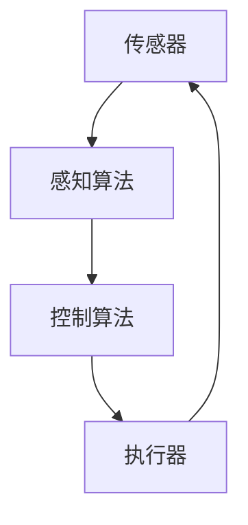

# AI Agent: AI的下一个风口 具身智能的商业潜力与市场前景

## 1.背景介绍

### 1.1 人工智能的发展历程
人工智能（AI）自20世纪50年代诞生以来，经历了多次技术革新和应用扩展。从最初的符号主义AI到后来的机器学习和深度学习，AI技术不断进步，逐渐渗透到各行各业。近年来，随着计算能力的提升和大数据的普及，AI在图像识别、自然语言处理、自动驾驶等领域取得了显著成果。

### 1.2 具身智能的概念
具身智能（Embodied Intelligence）是指AI系统不仅具备认知能力，还能够通过物理实体与环境进行交互。具身智能强调AI的物理存在和感知能力，使其能够在真实世界中执行任务。与传统的AI系统相比，具身智能更接近人类的智能表现，具有更广泛的应用潜力。

### 1.3 具身智能的商业潜力
具身智能的商业潜力巨大，涵盖了从制造业到服务业的多个领域。例如，具身智能机器人可以在工厂中执行复杂的装配任务，智能家居设备可以通过感知用户行为提供个性化服务，医疗机器人可以辅助医生进行手术操作。具身智能的应用不仅提高了生产效率，还改善了用户体验，具有广阔的市场前景。

## 2.核心概念与联系

### 2.1 具身智能与传统AI的区别
传统AI主要依赖于数据和算法进行决策，而具身智能则强调物理交互和感知能力。具身智能系统通常包括传感器、执行器和控制算法，使其能够在动态环境中执行任务。与传统AI相比，具身智能更具灵活性和适应性。

### 2.2 具身智能的组成部分
具身智能系统通常由以下几个部分组成：
- **传感器**：用于感知环境信息，如摄像头、激光雷达、触觉传感器等。
- **执行器**：用于执行物理动作，如电机、液压系统等。
- **控制算法**：用于处理传感器数据并生成控制信号，如路径规划算法、运动控制算法等。

### 2.3 具身智能与物联网的联系
具身智能与物联网（IoT）有着密切的联系。物联网通过连接各种设备，实现数据的采集和传输，而具身智能则利用这些数据进行决策和执行任务。两者的结合可以实现更加智能化的系统，如智能工厂、智能交通等。

## 3.核心算法原理具体操作步骤

### 3.1 感知算法
感知算法是具身智能系统的基础，用于处理传感器数据并提取有用信息。常见的感知算法包括图像处理、激光雷达点云处理、触觉感知等。

#### 3.1.1 图像处理
图像处理算法用于从摄像头获取的图像中提取特征信息，如物体识别、姿态估计等。常用的图像处理算法包括卷积神经网络（CNN）、YOLO等。

#### 3.1.2 激光雷达点云处理
激光雷达点云处理算法用于从激光雷达获取的点云数据中提取环境信息，如障碍物检测、地图构建等。常用的点云处理算法包括ICP、RANSAC等。

#### 3.1.3 触觉感知
触觉感知算法用于处理触觉传感器数据，感知物体的形状、硬度等信息。常用的触觉感知算法包括力传感器数据处理、触觉图像处理等。

### 3.2 控制算法
控制算法用于根据感知数据生成控制信号，驱动执行器完成任务。常见的控制算法包括运动控制、路径规划、强化学习等。

#### 3.2.1 运动控制
运动控制算法用于控制执行器的运动，如机器人手臂的关节控制、移动机器人的轨迹跟踪等。常用的运动控制算法包括PID控制、模型预测控制（MPC）等。

#### 3.2.2 路径规划
路径规划算法用于在复杂环境中规划最优路径，避开障碍物到达目标位置。常用的路径规划算法包括A*算法、Dijkstra算法等。

#### 3.2.3 强化学习
强化学习算法通过与环境的交互学习最优策略，适用于复杂动态环境中的决策问题。常用的强化学习算法包括Q-learning、深度强化学习（DRL）等。

### 3.3 系统集成
具身智能系统的实现需要将感知算法和控制算法进行集成，形成一个完整的闭环系统。系统集成的关键在于数据的实时处理和多传感器数据的融合。



## 4.数学模型和公式详细讲解举例说明

### 4.1 感知算法的数学模型

#### 4.1.1 图像处理中的卷积神经网络
卷积神经网络（CNN）是图像处理中的常用算法，其核心在于卷积操作。卷积操作可以表示为：

$$
y_{i,j} = \sum_{m=0}^{M-1} \sum_{n=0}^{N-1} x_{i+m,j+n} \cdot w_{m,n}
$$

其中，$x$ 是输入图像，$w$ 是卷积核，$y$ 是输出特征图。

#### 4.1.2 激光雷达点云处理中的ICP算法
ICP（Iterative Closest Point）算法用于点云配准，其目标是通过迭代优化，使两个点云的对应点对之间的距离最小。优化目标可以表示为：

$$
E(R, t) = \sum_{i=1}^{N} \| R \cdot p_i + t - q_i \|^2
$$

其中，$R$ 是旋转矩阵，$t$ 是平移向量，$p_i$ 和 $q_i$ 是对应点对。

### 4.2 控制算法的数学模型

#### 4.2.1 运动控制中的PID控制
PID控制器的输出可以表示为：

$$
u(t) = K_p e(t) + K_i \int_{0}^{t} e(\tau) d\tau + K_d \frac{de(t)}{dt}
$$

其中，$e(t)$ 是误差，$K_p$、$K_i$ 和 $K_d$ 分别是比例、积分和微分增益。

#### 4.2.2 路径规划中的A*算法
A*算法通过启发式函数 $h(n)$ 估计从当前节点 $n$ 到目标节点的代价，其总代价可以表示为：

$$
f(n) = g(n) + h(n)
$$

其中，$g(n)$ 是从起始节点到当前节点的实际代价，$h(n)$ 是启发式估计代价。

### 4.3 强化学习的数学模型

#### 4.3.1 Q-learning算法
Q-learning算法通过更新状态-动作值函数 $Q(s, a)$ 来学习最优策略，其更新公式为：

$$
Q(s, a) \leftarrow Q(s, a) + \alpha \left[ r + \gamma \max_{a'} Q(s', a') - Q(s, a) \right]
$$

其中，$\alpha$ 是学习率，$\gamma$ 是折扣因子，$r$ 是即时奖励，$s'$ 是下一状态，$a'$ 是下一动作。

## 5.项目实践：代码实例和详细解释说明

### 5.1 图像处理实例：物体识别

以下是一个使用YOLO算法进行物体识别的代码示例：

```python
import cv2
import numpy as np

# 加载YOLO模型
net = cv2.dnn.readNet("yolov3.weights", "yolov3.cfg")
layer_names = net.getLayerNames()
output_layers = [layer_names[i[0] - 1] for i in net.getUnconnectedOutLayers()]

# 加载图像
img = cv2.imread("image.jpg")
height, width, channels = img.shape

# 预处理图像
blob = cv2.dnn.blobFromImage(img, 0.00392, (416, 416), (0, 0, 0), True, crop=False)
net.setInput(blob)
outs = net.forward(output_layers)

# 解析检测结果
class_ids = []
confidences = []
boxes = []
for out in outs:
    for detection in out:
        scores = detection[5:]
        class_id = np.argmax(scores)
        confidence = scores[class_id]
        if confidence > 0.5:
            center_x = int(detection[0] * width)
            center_y = int(detection[1] * height)
            w = int(detection[2] * width)
            h = int(detection[3] * height)
            x = int(center_x - w / 2)
            y = int(center_y - h / 2)
            boxes.append([x, y, w, h])
            confidences.append(float(confidence))
            class_ids.append(class_id)

# 绘制检测结果
for i in range(len(boxes)):
    x, y, w, h = boxes[i]
    label = str(class_ids[i])
    cv2.rectangle(img, (x, y), (x + w, y + h), (0, 255, 0), 2)
    cv2.putText(img, label, (x, y - 10), cv2.FONT_HERSHEY_SIMPLEX, 0.5, (0, 255, 0), 2)

# 显示图像
cv2.imshow("Image", img)
cv2.waitKey(0)
cv2.destroyAllWindows()
```

### 5.2 路径规划实例：A*算法

以下是一个使用A*算法进行路径规划的代码示例：

```python
import heapq

def a_star(grid, start, goal):
    open_list = []
    heapq.heappush(open_list, (0, start))
    came_from = {}
    g_score = {start: 0}
    f_score = {start: heuristic(start, goal)}

    while open_list:
        current = heapq.heappop(open_list)[1]

        if current == goal:
            return reconstruct_path(came_from, current)

        for neighbor in get_neighbors(grid, current):
            tentative_g_score = g_score[current] + 1

            if neighbor not in g_score or tentative_g_score < g_score[neighbor]:
                came_from[neighbor] = current
                g_score[neighbor] = tentative_g_score
                f_score[neighbor] = g_score[neighbor] + heuristic(neighbor, goal)
                heapq.heappush(open_list, (f_score[neighbor], neighbor))

    return None

def heuristic(a, b):
    return abs(a[0] - b[0]) + abs(a[1] - b[1])

def get_neighbors(grid, node):
    neighbors = []
    for dx, dy in [(-1, 0), (1, 0), (0, -1), (0, 1)]:
        x, y = node[0] + dx, node[1] + dy
        if 0 <= x < len(grid) and 0 <= y < len(grid[0]) and grid[x][y] == 0:
            neighbors.append((x, y))
    return neighbors

def reconstruct_path(came_from, current):
    path = [current]
    while current in came_from:
        current = came_from[current]
        path.append(current)
    path.reverse()
    return path

# 示例网格
grid = [
    [0, 1, 0, 0, 0],
    [0, 1, 0, 1, 0],
    [0, 0, 0, 1, 0],
    [0, 1, 0, 0, 0],
    [0, 0, 0, 1, 0]
]

start = (0, 0)
goal = (4, 4)
path = a_star(grid, start, goal)
print("Path:", path)
```

## 6.实际应用场景

### 6.1 制造业
具身智能在制造业中有广泛的应用，如智能机器人可以执行复杂的装配任务，提高生产效率和产品质量。例如，特斯拉的生产线中使用了大量的智能机器人进行汽车的组装和焊接。

### 6.2 医疗领域
具身智能在医疗领域的应用包括手术机器人、康复机器人等。手术机器人可以辅助医生进行精细的手术操作，减少手术创伤和恢复时间。康复机器人可以帮助患者进行康复训练，提高康复效果。

### 6.3 智能家居
具身智能在智能家居中的应用包括智能扫地机器人、智能音箱等。智能扫地机器人可以自动清扫房间，智能音箱可以通过语音交互提供个性化服务，提升用户的生活质量。

### 6.4 自动驾驶
具身智能在自动驾驶中的应用包括自动驾驶汽车、无人机等。自动驾驶汽车可以通过感知环境信息，自动规划路径和控制车辆，提高交通安全和效率。无人机可以用于物流配送、环境监测等领域。

## 7.工具和资源推荐

### 7.1 开发工具
- **TensorFlow**：一个开源的机器学习框架，适用于深度学习模型的开发和训练。
- **PyTorch**：另一个流行的深度学习框架，具有灵活的动态计算图和强大的调试功能。
- **ROS（Robot Operating System）**：一个开源的机器人操作系统，提供了丰富的工具和库，支持机器人应用的开发和部署。

### 7.2 数据集
- **ImageNet**：一个大规模的图像数据集，常用于图像分类和物体识别任务。
- **KITTI**：一个自动驾驶数据集，包含了丰富的传感器数据，如图像、激光雷达点云等。
- **COCO**：一个常用于物体检测、分割和关键点检测的图像数据集。

### 7.3 在线资源
- **arXiv**：一个开放的学术论文预印本平台，提供了大量的最新AI研究论文。
- **GitHub**：一个开源代码托管平台，许多AI项目和工具都在GitHub上开源，方便开发者学习和使用。
- **Coursera**：一个在线教育平台，提供了许多高质量的AI课程，适合初学者和进阶学习者。

## 8.总结：未来发展趋势与挑战

### 8.1 未来发展趋势
具身智能作为AI的下一个风口，未来有望在多个领域取得突破性进展。随着传感器技术、计算能力和算法的不断进步，具身智能系统将变得更加智能和高效。未来，具身智能有望在智能制造、医疗健康、智能家居、自动驾驶等领域实现大规模应用，带来巨大的商业价值和社会效益。

### 8.2 面临的挑战
尽管具身智能具有广阔的前景，但其发展也面临诸多挑战。首先，具身智能系统的开发和部署需要大量的技术积累和资源投入。其次，具身智能系统在复杂动态环境中的鲁棒性和安全性仍需进一步提升。此外，具身智能的广泛应用还需要解决伦理和法律问题，如隐私保护、责任归属等。

## 9.附录：常见问题与解答

### 9.1 具身智能与传统AI的主要区别是什么？
具身智能强调物理交互和感知能力，而传统AI主要依赖于数据和算法进行决策。具身智能系统通常包括传感器、执行器和控制算法，使其能够在动态环境中执行任务。

### 9.2 具身智能的应用领域有哪些？
具身智能的应用领域包括制造业、医疗领域、智能家居、自动驾驶等。例如，智能机器人可以在工厂中执行复杂的装配任务，手术机器人可以辅助医生进行手术操作，智能扫地机器人可以自动清扫房间，自动驾驶汽车可以自动规划路径和控制车辆。

### 9.3 具身智能的发展面临哪些挑战？
具身智能的发展面临的挑战包括技术积累和资源投入、系统的鲁棒性和安全性、伦理和法律问题等。具身智能系统的开发和部署需要大量的技术积累和资源投入，其在复杂动态环境中的鲁棒性和安全性仍需进一步提升。此外，具身智能的广泛应用还需要解决隐私保护、责任归属等伦理和法律问题。

### 9.4 如何学习具身智能相关技术？
学习具身智能相关技术可以从以下几个方面入手：首先，学习基础的机器学习和深度学习知识，掌握常用的算法和工具。其次，学习机器人学和控制理论，了解传感器、执行器和控制算法的基本原理。最后，通过实际项目实践，积累开发和调试经验。

---

作者：禅与计算机程序设计艺术 / Zen and the Art of Computer Programming