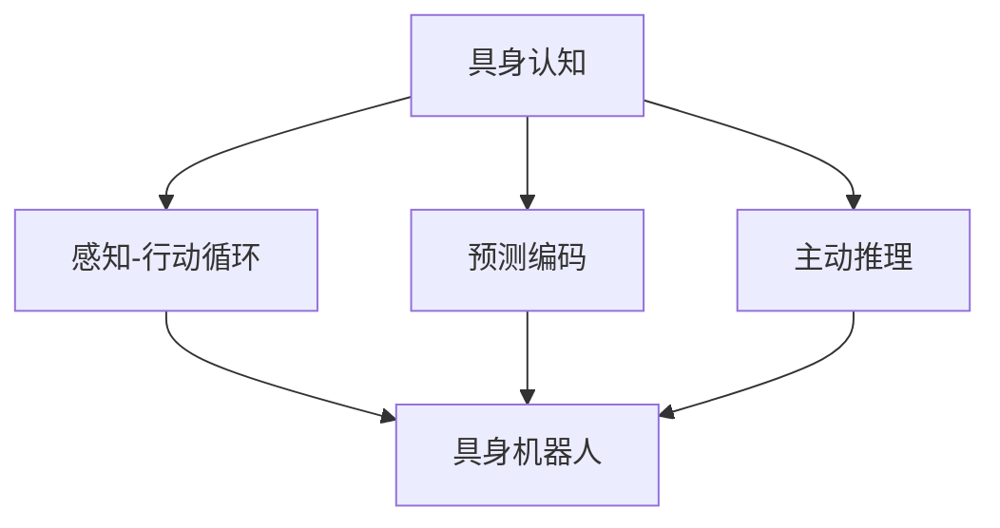

# AI Agent: AI的下一个风口 具身机器人的发展趋势

## 1. 背景介绍
### 1.1 人工智能的发展历程
#### 1.1.1 早期人工智能
#### 1.1.2 机器学习时代 
#### 1.1.3 深度学习的崛起

### 1.2 具身AI的概念出现
#### 1.2.1 具身认知的理论基础
#### 1.2.2 具身AI的定义和内涵
#### 1.2.3 具身AI与传统AI的区别

### 1.3 具身机器人的发展现状
#### 1.3.1 学术界的研究进展
#### 1.3.2 工业界的应用探索
#### 1.3.3 具身机器人的主要挑战

## 2. 核心概念与联系
### 2.1 具身认知 
#### 2.1.1 具身认知的哲学渊源
#### 2.1.2 具身认知的心理学基础
#### 2.1.3 具身认知与人工智能的结合

### 2.2 感知-行动循环
#### 2.2.1 感知-行动循环的概念
#### 2.2.2 感知-行动循环在具身AI中的重要性
#### 2.2.3 感知-行动循环的技术实现

### 2.3 预测编码
#### 2.3.1 预测编码的提出背景
#### 2.3.2 预测编码的核心思想
#### 2.3.3 预测编码在具身AI中的应用

### 2.4 主动推理
#### 2.4.1 主动推理的概念
#### 2.4.2 主动推理与传统推理的区别
#### 2.4.3 主动推理在具身AI中的价值



## 3. 核心算法原理具体操作步骤
### 3.1 深度强化学习
#### 3.1.1 强化学习基本原理
#### 3.1.2 深度强化学习的特点
#### 3.1.3 深度强化学习在具身机器人中的应用

### 3.2 仿真环境训练
#### 3.2.1 仿真环境的重要性
#### 3.2.2 主流仿真环境介绍
#### 3.2.3 仿真到实物迁移的挑战与对策

### 3.3 分层控制架构
#### 3.3.1 分层控制的思想
#### 3.3.2 反应层、规划层与推理层
#### 3.3.3 分层控制在具身机器人中的实现

### 3.4 多模态感知融合
#### 3.4.1 多模态感知的优势
#### 3.4.2 视觉、触觉、听觉等感知通道
#### 3.4.3 多模态感知信息的融合方法

## 4. 数学模型和公式详细讲解举例说明
### 4.1 马尔可夫决策过程
#### 4.1.1 马尔可夫决策过程的定义
$$
\begin{aligned}
\text{MDP} = (S, A, P, R, \gamma)
\end{aligned}
$$
其中，$S$为状态集，$A$为动作集，$P$为状态转移概率，$R$为奖励函数，$\gamma$为折扣因子。

#### 4.1.2 马尔可夫决策过程的求解
- 值迭代
- 策略迭代
- 蒙特卡洛方法
- 时序差分学习

#### 4.1.3 马尔可夫决策过程在具身机器人中的应用

### 4.2 贝叶斯滤波
#### 4.2.1 贝叶斯滤波的基本原理
贝叶斯滤波基于贝叶斯定理，通过先验概率和似然函数计算后验概率：

$$
P(x_t|z_{1:t}) = \frac{P(z_t|x_t)P(x_t|z_{1:t-1})}{P(z_t|z_{1:t-1})}
$$

其中，$x_t$为 $t$ 时刻的状态，$z_{1:t}$为 $1$ 到 $t$ 时刻的观测。

#### 4.2.2 卡尔曼滤波与粒子滤波
- 卡尔曼滤波适用于线性高斯系统
- 粒子滤波适用于非线性非高斯系统

#### 4.2.3 贝叶斯滤波在具身机器人中的应用

### 4.3 运动规划算法
#### 4.3.1 采样式运动规划
- 快速扩展随机树（RRT）
- 概率路线图（PRM）

#### 4.3.2 优化式运动规划
- 梯度下降法
- 牛顿法与拟牛顿法
- 共轭梯度法

#### 4.3.3 运动规划在具身机器人中的应用

## 5. 项目实践：代码实例和详细解释说明
### 5.1 ROS机器人操作系统
#### 5.1.1 ROS的基本概念和架构
#### 5.1.2 ROS的通信机制：话题、服务、动作
#### 5.1.3 ROS的常用工具和库

### 5.2 具身机器人仿真环境搭建
#### 5.2.1 Gazebo仿真环境介绍
#### 5.2.2 URDF机器人模型描述格式
#### 5.2.3 在Gazebo中搭建具身机器人仿真环境

### 5.3 深度强化学习算法实现
#### 5.3.1 OpenAI Gym环境介绍
#### 5.3.2 DQN算法的Python实现
```python
class DQN(object):
    def __init__(self, state_dim, action_dim, learning_rate, gamma, epsilon, memory_size, batch_size):
        self.state_dim = state_dim
        self.action_dim = action_dim
        self.learning_rate = learning_rate
        self.gamma = gamma
        self.epsilon = epsilon
        self.memory_size = memory_size
        self.batch_size = batch_size
        
        self.memory = deque(maxlen=self.memory_size)
        
        self.model = self.build_model()
        self.target_model = self.build_model()
        self.update_target_model()
    
    def build_model(self):
        model = Sequential()
        model.add(Dense(64, input_dim=self.state_dim, activation='relu'))
        model.add(Dense(64, activation='relu'))
        model.add(Dense(self.action_dim, activation='linear'))
        model.compile(loss='mse', optimizer=Adam(lr=self.learning_rate))
        return model
    
    def update_target_model(self):
        self.target_model.set_weights(self.model.get_weights())
        
    def remember(self, state, action, reward, next_state, done):
        self.memory.append((state, action, reward, next_state, done))
        
    def act(self, state):
        if np.random.rand() <= self.epsilon:
            return random.randrange(self.action_dim)
        act_values = self.model.predict(state)
        return np.argmax(act_values[0])
    
    def replay(self):
        if len(self.memory) < self.batch_size:
            return
        
        minibatch = random.sample(self.memory, self.batch_size)
        states, actions, rewards, next_states, dones = zip(*minibatch)
        
        states = np.concatenate(states)
        next_states = np.concatenate(next_states)
        
        q_values = self.model.predict(states)
        next_q_values = self.target_model.predict(next_states)
        
        for i in range(self.batch_size):
            if dones[i]:
                q_values[i][actions[i]] = rewards[i]
            else:
                q_values[i][actions[i]] = rewards[i] + self.gamma * np.amax(next_q_values[i])
                
        self.model.fit(states, q_values, epochs=1, verbose=0)
```

#### 5.3.3 在仿真环境中训练具身机器人

### 5.4 分层控制架构设计
#### 5.4.1 反应层控制器设计
#### 5.4.2 规划层控制器设计 
#### 5.4.3 推理层控制器设计
#### 5.4.4 分层控制器的集成与协调

## 6. 实际应用场景
### 6.1 家庭服务机器人
#### 6.1.1 家庭环境感知与建模
#### 6.1.2 家庭服务任务分解与规划
#### 6.1.3 人机交互与协作

### 6.2 仓储物流机器人
#### 6.2.1 仓储环境感知与建模
#### 6.2.2 货物搬运路径规划
#### 6.2.3 多机器人协同作业

### 6.3 灾难救援机器人
#### 6.3.1 灾难环境感知与建模
#### 6.3.2 救援任务规划与分配
#### 6.3.3 极端环境下的适应性控制

## 7. 工具和资源推荐
### 7.1 机器人操作系统
- ROS (Robot Operating System)
- ROS 2

### 7.2 机器人仿真环境
- Gazebo
- V-REP
- Webots

### 7.3 深度学习框架
- TensorFlow
- PyTorch
- Keras

### 7.4 强化学习平台
- OpenAI Gym
- DeepMind Lab
- Unity ML-Agents

## 8. 总结：未来发展趋势与挑战
### 8.1 具身AI的研究前沿
#### 8.1.1 持续学习与迁移学习
#### 8.1.2 认知发展机器人学
#### 8.1.3 神经符号人工智能

### 8.2 具身机器人的应用前景
#### 8.2.1 个人助理机器人
#### 8.2.2 医疗康复机器人
#### 8.2.3 太空探索机器人

### 8.3 亟待解决的关键挑战
#### 8.3.1 安全性与鲁棒性
#### 8.3.2 伦理与法律问题
#### 8.3.3 成本与可及性

## 9. 附录：常见问题与解答
### 9.1 具身AI与类人机器人是否等同？
具身AI强调智能体通过身体与环境的交互来感知、学习和推理，而不局限于类人形态。类人机器人可视为具身AI的一种特例。

### 9.2 具身机器人是否必须采用生物学结构？
具身机器人的设计可以借鉴但不拘泥于生物学结构。关键在于通过感知-行动循环来实现智能行为，形态可以是多样的。

### 9.3 具身机器人能否拥有自主意识？ 
具身机器人通过不断与环境交互，形成了内在的世界模型，但是否能产生类似人类的自主意识，目前还没有定论，需要在认知科学、神经科学等领域进一步研究。

作者：禅与计算机程序设计艺术 / Zen and the Art of Computer Programming