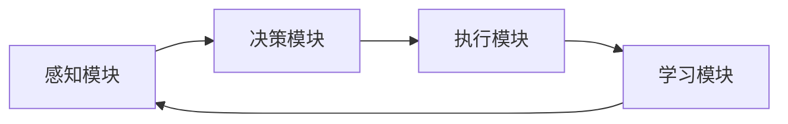

# AI Agent: AI的下一个风口 典型案例和商业应用

## 1. 背景介绍
### 1.1 人工智能的发展历程
#### 1.1.1 人工智能的起源与概念
#### 1.1.2 人工智能的发展阶段
#### 1.1.3 人工智能的现状与挑战

### 1.2 AI Agent的兴起
#### 1.2.1 AI Agent的定义与特点  
#### 1.2.2 AI Agent的发展历程
#### 1.2.3 AI Agent的应用现状

### 1.3 AI Agent的商业价值
#### 1.3.1 AI Agent在各行业的应用前景
#### 1.3.2 AI Agent对商业模式的变革
#### 1.3.3 AI Agent的市场规模与增长潜力

## 2. 核心概念与联系
### 2.1 AI Agent的核心概念
#### 2.1.1 自主性
#### 2.1.2 交互性
#### 2.1.3 适应性
#### 2.1.4 持续学习能力

### 2.2 AI Agent与其他AI技术的联系
#### 2.2.1 机器学习
#### 2.2.2 自然语言处理
#### 2.2.3 计算机视觉
#### 2.2.4 知识图谱

### 2.3 AI Agent的架构设计
#### 2.3.1 感知模块
#### 2.3.2 决策模块
#### 2.3.3 执行模块
#### 2.3.4 学习模块



## 3. 核心算法原理具体操作步骤
### 3.1 强化学习算法
#### 3.1.1 马尔可夫决策过程
#### 3.1.2 Q-learning算法
#### 3.1.3 策略梯度算法
#### 3.1.4 Actor-Critic算法

### 3.2 深度学习算法
#### 3.2.1 卷积神经网络CNN
#### 3.2.2 循环神经网络RNN
#### 3.2.3 长短期记忆网络LSTM
#### 3.2.4 注意力机制

### 3.3 自然语言处理算法 
#### 3.3.1 词向量表示
#### 3.3.2 序列到序列模型
#### 3.3.3 Transformer模型
#### 3.3.4 BERT模型

### 3.4 多智能体协作算法
#### 3.4.1 博弈论基础
#### 3.4.2 多智能体强化学习
#### 3.4.3 群体智能优化
#### 3.4.4 智能体通信协议

## 4. 数学模型和公式详细讲解举例说明
### 4.1 马尔可夫决策过程MDP
一个MDP由一个四元组 $(S,A,P,R)$ 组成：
- $S$ 是有限的状态集合
- $A$ 是有限的动作集合  
- $P$ 是状态转移概率矩阵，$P_{ss'}^a=P[S_{t+1}=s'|S_t=s,A_t=a]$ 
- $R$ 是奖励函数，$R_s^a=E[R_{t+1}|S_t=s,A_t=a]$

求解MDP的目标是找到一个最优策略 $\pi^*$，使得期望累积奖励最大化：

$$\pi^* = \arg\max_{\pi} E\left[\sum_{t=0}^{\infty} \gamma^t R_{t+1} | \pi \right]$$

其中，$\gamma \in [0,1]$ 是折扣因子，用于平衡当前奖励和未来奖励。

### 4.2 Q-learning算法
Q-learning是一种值迭代的时间差分学习算法，用于估计动作值函数 $Q(s,a)$。算法的更新规则为：

$$Q(S_t,A_t) \leftarrow Q(S_t,A_t) + \alpha [R_{t+1} + \gamma \max_a Q(S_{t+1},a) - Q(S_t,A_t)]$$

其中，$\alpha \in (0,1]$ 是学习率，控制每次更新的步长。

### 4.3 策略梯度算法
策略梯度算法直接对策略函数 $\pi_{\theta}(a|s)$ 进行优化，其中 $\theta$ 是策略函数的参数。优化目标是最大化期望累积奖励：

$$J(\theta) = E_{\tau \sim \pi_{\theta}}[R(\tau)]$$

其中，$\tau$ 表示一条轨迹 $(s_0,a_0,r_1,s_1,a_1,...)$，$R(\tau)$ 表示轨迹的累积奖励。根据策略梯度定理，梯度可以表示为：

$$\nabla_{\theta} J(\theta) = E_{\tau \sim \pi_{\theta}}[\sum_{t=0}^{T} \nabla_{\theta} \log \pi_{\theta}(a_t|s_t) R(\tau)]$$

### 4.4 Actor-Critic算法
Actor-Critic算法结合了值函数和策略函数，同时学习两个函数：
- Actor：策略函数 $\pi_{\theta}(a|s)$，用于生成动作
- Critic：值函数 $V^{\pi}(s)$ 或 $Q^{\pi}(s,a)$，用于评估状态或动作的价值

Critic的更新类似于Q-learning或时间差分学习，Actor的更新采用策略梯度方法，梯度为：

$$\nabla_{\theta} J(\theta) = E_{\tau \sim \pi_{\theta}}[\sum_{t=0}^{T} \nabla_{\theta} \log \pi_{\theta}(a_t|s_t) A^{\pi}(s_t,a_t)]$$

其中，$A^{\pi}(s,a)$ 是优势函数，表示在状态 $s$ 下采取动作 $a$ 相对于平均水平的优势。

## 5. 项目实践：代码实例和详细解释说明
### 5.1 强化学习应用：自动驾驶
```python
import numpy as np
import gym

# 创建环境
env = gym.make('CarRacing-v0')

# 定义Q-learning算法
def q_learning(env, num_episodes, alpha, gamma, epsilon):
    Q = np.zeros((env.observation_space.n, env.action_space.n))
    
    for i in range(num_episodes):
        state = env.reset()
        done = False
        
        while not done:
            if np.random.uniform(0, 1) < epsilon:
                action = env.action_space.sample() # 探索：随机选择动作
            else:
                action = np.argmax(Q[state]) # 利用：选择Q值最大的动作
                
            next_state, reward, done, _ = env.step(action)
            
            # 更新Q值
            Q[state, action] += alpha * (reward + gamma * np.max(Q[next_state]) - Q[state, action])
            
            state = next_state
        
    return Q

# 设置超参数
num_episodes = 1000
alpha = 0.5
gamma = 0.99
epsilon = 0.1

# 训练模型
Q = q_learning(env, num_episodes, alpha, gamma, epsilon)

# 测试模型
state = env.reset()
done = False

while not done:
    action = np.argmax(Q[state])
    state, reward, done, _ = env.step(action)
    env.render()

env.close()
```

上述代码使用OpenAI Gym提供的CarRacing环境，实现了一个简单的Q-learning算法，用于训练自动驾驶智能体。主要步骤如下：

1. 创建CarRacing环境
2. 定义Q-learning算法，包括初始化Q表，选择动作（探索与利用），更新Q值
3. 设置超参数，如学习率、折扣因子、探索概率等
4. 训练模型，迭代一定次数，更新Q表
5. 测试模型，根据学习到的Q表选择动作，观察智能体的表现

### 5.2 自然语言处理应用：聊天机器人
```python
import torch
import torch.nn as nn
import torch.optim as optim

# 定义Seq2Seq模型
class Seq2Seq(nn.Module):
    def __init__(self, input_size, hidden_size, output_size):
        super(Seq2Seq, self).__init__()
        self.encoder = nn.LSTM(input_size, hidden_size)
        self.decoder = nn.LSTM(hidden_size, hidden_size)
        self.out = nn.Linear(hidden_size, output_size)
        
    def forward(self, input_seq, target_seq):
        _, encoder_hidden = self.encoder(input_seq)
        decoder_hidden = encoder_hidden
        decoder_input = torch.zeros(1, 1, self.decoder.hidden_size)
        
        outputs = []
        for t in range(target_seq.size(0)):
            output, decoder_hidden = self.decoder(decoder_input, decoder_hidden)
            output = self.out(output[0])
            outputs.append(output)
            decoder_input = output.unsqueeze(0)
            
        return torch.stack(outputs)

# 设置超参数
input_size = 100
hidden_size = 256
output_size = 100
learning_rate = 0.001
num_epochs = 10

# 加载数据集
input_seqs = ...
target_seqs = ...

# 创建模型和优化器
model = Seq2Seq(input_size, hidden_size, output_size)
optimizer = optim.Adam(model.parameters(), lr=learning_rate)
criterion = nn.CrossEntropyLoss()

# 训练模型
for epoch in range(num_epochs):
    for input_seq, target_seq in zip(input_seqs, target_seqs):
        optimizer.zero_grad()
        output_seq = model(input_seq, target_seq)
        loss = criterion(output_seq.view(-1, output_size), target_seq.view(-1))
        loss.backward()
        optimizer.step()
        
    print(f'Epoch [{epoch+1}/{num_epochs}], Loss: {loss.item():.4f}')

# 测试模型
input_seq = ...
output_seq = model(input_seq, torch.zeros(1, 1, hidden_size))
predicted_seq = torch.argmax(output_seq, dim=-1)
print(predicted_seq)
```

上述代码实现了一个基于Seq2Seq模型的聊天机器人。主要步骤如下：

1. 定义Seq2Seq模型，包括编码器（Encoder）和解码器（Decoder）
2. 设置超参数，如输入/输出尺寸、隐藏层尺寸、学习率、训练轮数等
3. 加载对话数据集，包括输入序列和目标序列
4. 创建模型和优化器，定义损失函数
5. 训练模型，迭代一定轮数，优化模型参数
6. 测试模型，给定输入序列，生成相应的输出序列

## 6. 实际应用场景
### 6.1 智能客服
AI Agent可以应用于智能客服系统，通过自然语言交互为用户提供24/7全天候的服务。典型案例包括：
- 阿里小蜜：基于知识图谱和深度学习技术，为用户提供智能问答和任务处理服务
- 微软小冰：基于海量数据和多模态交互技术，实现了情感化、个性化的对话体验

### 6.2 智能助理
AI Agent可以作为智能助理，协助用户完成日常任务和信息查询。典型案例包括：
- 苹果Siri：通过语音交互，帮助用户打电话、发短信、设置提醒等
- 谷歌Assistant：集成了谷歌搜索、地图、翻译等服务，提供个性化的信息和建议

### 6.3 智能推荐
AI Agent可以应用于智能推荐系统，根据用户的行为和偏好，提供个性化的内容和服务。典型案例包括：
- 抖音：基于用户的观看历史和互动行为，实时推荐相关视频内容
- 网易云音乐：通过协同过滤和深度学习技术，为用户推荐音乐、歌单和电台

### 6.4 智能投顾
AI Agent可以应用于智能投资顾问领域，为用户提供个性化的投资组合和策略。典型案例包括：
- 蚂蚁财富：基于AI算法和海量数据，为用户提供智能资产配置和风险管理服务
- Betterment：通过问卷评估用户的风险偏好，自动生成和优化投资组合

## 7. 工具和资源推荐
### 7.1 开发框架
- TensorFlow：谷歌开源的端到端机器学习平台，支持多种模型和部署方式
- PyTorch：Facebook开源的深度学习框架，具有动态计算图和易用性的特点
- OpenAI Gym：强化学习算法的训练和测试环境，包含多个标准化的任务

### 7.2 预训练模型
- BERT：谷歌提出的预训练语言模型，可用于各种NLP任务的微调
- GPT-3：OpenAI提出的大规模语言模型，具有强大的语言生成和理解能力
- ResNet：微软提出的残差网络，在图像分类任务上取得了突破性的性能

### 7.3 数据集
- ImageNet：大规模图像分类数