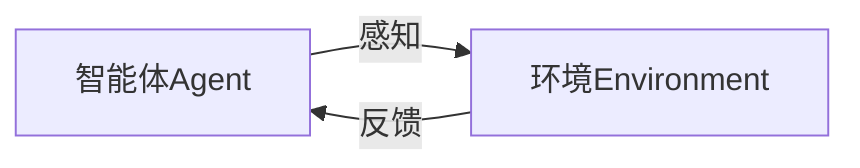

## 1.背景介绍

在过去的十年里，人工智能（AI）已经引领了科技领域的一场革命。从自动驾驶汽车到语音助手，再到智能家居系统，AI已经渗透到我们生活的方方面面。然而，尽管AI已经取得了显著的进步，但我们仍然处于这个领域的早期阶段。在未来的十年里，AI Agent将会成为AI的下一个风口。

AI Agent是一种自主的、可以在环境中进行决策和行动的实体。它们可以是物理的（例如机器人）或者虚拟的（例如在电脑游戏中的角色）。AI Agent的目标是通过与环境的互动来实现预定的目标。这种互动可以是简单的（例如在棋盘游戏中移动棋子）或者复杂的（例如在复杂的环境中导航）。

## 2.核心概念与联系

AI Agent的核心概念是智能体（Agent）和环境（Environment）。智能体是一个可以感知环境并根据其感知进行行动的实体。环境是智能体可以感知和行动的领域。

智能体和环境之间的关系可以用以下的Mermaid流程图来表示：



智能体通过感知器官接收来自环境的信息，然后根据这些信息做出决策，并通过执行器官对环境进行操作。环境则根据智能体的操作给出反馈，这个反馈又会被智能体感知，形成一个闭环。

## 3.核心算法原理具体操作步骤

AI Agent的核心算法是强化学习（Reinforcement Learning）。强化学习是一种机器学习的方法，它让智能体通过试错（trial-and-error）来学习如何在环境中实现目标。强化学习的目标是找到一个策略，使得智能体能够最大化累积的奖励。

强化学习的操作步骤如下：

1. 初始化：智能体随机选择一个动作，并执行这个动作。
2. 交互：环境根据智能体的动作给出一个反馈和一个奖励。
3. 学习：智能体根据反馈和奖励更新其策略。
4. 重复：智能体根据更新后的策略选择下一个动作，并执行这个动作。然后环境再次给出反馈和奖励，智能体再次更新其策略。这个过程一直重复，直到达到预定的目标或者满足停止条件。

## 4.数学模型和公式详细讲解举例说明

在强化学习中，我们使用马尔可夫决策过程（Markov Decision Process，MDP）来描述环境。MDP是一个五元组 $(S,A,P,R,\gamma)$，其中：

- $S$ 是状态的集合。
- $A$ 是动作的集合。
- $P$ 是状态转移概率函数，$P(s'|s,a)$ 表示在状态 $s$ 下执行动作 $a$ 后转移到状态 $s'$ 的概率。
- $R$ 是奖励函数，$R(s,a,s')$ 表示在状态 $s$ 下执行动作 $a$ 并转移到状态 $s'$ 后获得的奖励。
- $\gamma$ 是折扣因子，它决定了未来奖励的重要性。

强化学习的目标是找到一个策略 $\pi$，使得执行该策略后获得的累积奖励的期望值最大，即：

$$
\pi^* = \arg\max_\pi E\left[\sum_{t=0}^\infty \gamma^t R(s_t,a_t,s_{t+1})\right]
$$

其中，$s_t$ 是时刻 $t$ 的状态，$a_t$ 是时刻 $t$ 的动作，$s_{t+1}$ 是时刻 $t+1$ 的状态，$E$ 是期望值。

## 5.项目实践：代码实例和详细解释说明

以下是一个使用Python和OpenAI Gym库实现的简单AI Agent的示例。这个AI Agent的任务是学习在CartPole环境中如何平衡杆子。

```python
import gym
import numpy as np

# 创建环境
env = gym.make('CartPole-v0')

# 初始化策略
policy = np.random.rand(env.observation_space.shape[0], env.action_space.n)

# 定义策略函数
def choose_action(state):
    return np.argmax(policy @ state)

# 定义学习函数
def learn(state, action, reward, next_state):
    policy[:, action] += 0.1 * (reward + np.max(policy @ next_state) - policy @ state) * state

# 进行1000个回合的训练
for i_episode in range(1000):
    state = env.reset()
    for t in range(100):
        action = choose_action(state)
        next_state, reward, done, info = env.step(action)
        learn(state, action, reward, next_state)
        state = next_state
        if done:
            break
```

在这个示例中，我们首先创建了一个CartPole环境，然后初始化了一个随机策略。我们定义了一个策略函数来根据当前状态选择动作，定义了一个学习函数来根据反馈和奖励更新策略。最后，我们进行了1000个回合的训练，每个回合中我们都选择一个动作，执行这个动作，然后更新策略。

## 6.实际应用场景

AI Agent有许多实际的应用场景。例如，在游戏领域，AI Agent可以用于创建智能的游戏角色；在机器人领域，AI Agent可以用于控制机器人的行动；在自动驾驶领域，AI Agent可以用于驾驶汽车；在金融领域，AI Agent可以用于做股票交易。

## 7.工具和资源推荐

如果你对AI Agent感兴趣，以下是一些可以帮助你深入学习的工具和资源：

- OpenAI Gym：一个用于开发和比较强化学习算法的工具包。
- TensorFlow Agents：一个基于TensorFlow的强化学习库。
- Reinforcement Learning: An Introduction：Richard S. Sutton和Andrew G. Barto的经典教科书。

## 8.总结：未来发展趋势与挑战

AI Agent是AI的下一个风口。然而，尽管AI Agent有很大的潜力，但也面临着许多挑战。例如，如何设计有效的奖励函数？如何处理部分可观察的环境？如何处理连续的状态和动作空间？如何提高学习的效率？这些都是我们需要解决的问题。

尽管有这些挑战，但我相信，随着技术的发展，我们将会看到更多的、更强大的AI Agent。它们将会在游戏、机器人、自动驾驶、金融等许多领域发挥重要的作用。

## 9.附录：常见问题与解答

1. 问题：AI Agent和传统的AI有什么区别？
   答：传统的AI通常是被动的，它们只能对给定的输入进行处理。而AI Agent则是主动的，它们可以在环境中进行决策和行动。

2. 问题：AI Agent如何学习？
   答：AI Agent通常通过强化学习来学习。强化学习是一种机器学习的方法，它让AI Agent通过试错来学习如何在环境中实现目标。

3. 问题：我可以在哪里学习更多关于AI Agent的知识？
   答：你可以阅读Richard S. Sutton和Andrew G. Barto的《Reinforcement Learning: An Introduction》。你也可以使用OpenAI Gym和TensorFlow Agents这样的工具来实践你的知识。

4. 问题：AI Agent有哪些应用？
   答：AI Agent有许多应用，例如在游戏、机器人、自动驾驶、金融等领域。

作者：禅与计算机程序设计艺术 / Zen and the Art of Computer Programming