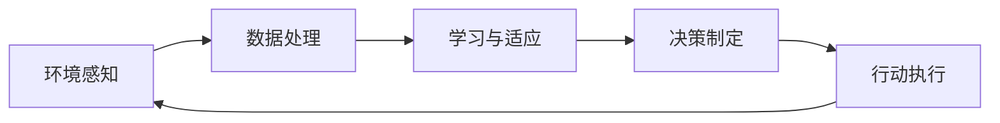

## 1. 背景介绍

随着人工智能技术的飞速发展，AI Agent已经成为了新一轮技术革命的前沿。从简单的聊天机器人到复杂的自适应系统，AI Agent的概念正在不断扩展，其应用领域也在不断深化。在这个过程中，技术的边界被不断推进，未来的可能性也在无限扩展。

## 2. 核心概念与联系

AI Agent指的是能够自主行动、做出决策并执行任务的智能系统。它们可以是软件形式，如虚拟个人助理，也可以是硬件形式，如自动驾驶汽车。AI Agent的核心在于其自主性、适应性和智能性，这些特性使得它们能够在没有人类直接指导的情况下操作。

### 2.1 自主性
自主性是指AI Agent能够根据环境变化和内部状态自我调整行为的能力。

### 2.2 适应性
适应性是指AI Agent能够学习和适应新环境或情况的能力。

### 2.3 智能性
智能性是指AI Agent能够理解复杂情况并做出合理决策的能力。

## 3. 核心算法原理具体操作步骤

AI Agent的核心算法原理包括机器学习、深度学习、强化学习等。以下是一个简化的AI Agent操作步骤流程图：



## 4. 数学模型和公式详细讲解举例说明

以强化学习为例，其核心数学模型是马尔可夫决策过程（MDP）。MDP可以用以下公式表示：

$$
MDP = (S, A, P, R, \gamma)
$$

其中：
- $S$ 是状态空间
- $A$ 是动作空间
- $P$ 是状态转移概率
- $R$ 是奖励函数
- $\gamma$ 是折扣因子

一个AI Agent在状态$s$下选择动作$a$，根据转移概率$P(s'|s,a)$转移到新状态$s'$，并获得奖励$R(s,a)$。AI Agent的目标是最大化累积奖励。

## 5. 项目实践：代码实例和详细解释说明

以Python编写的简单强化学习Agent代码示例：

```python
import numpy as np

class SimpleRLAgent:
    def __init__(self, states, actions):
        self.q_table = np.zeros((states, actions))
    
    def choose_action(self, state):
        return np.argmax(self.q_table[state, :])
    
    def learn(self, state, action, reward, next_state):
        predict = self.q_table[state, action]
        target = reward + 0.9 * np.max(self.q_table[next_state, :])
        self.q_table[state, action] += 0.1 * (target - predict)

# 示例代码的使用
agent = SimpleRLAgent(states=10, actions=2)
current_state = 0
action = agent.choose_action(current_state)
next_state, reward = env.step(action)  # 假设env是环境对象
agent.learn(current_state, action, reward, next_state)
```

## 6. 实际应用场景

AI Agent在多个领域都有广泛应用，包括但不限于：

### 6.1 智能家居
AI Agent可以控制家居设备，实现智能化管理。

### 6.2 自动驾驶
AI Agent能够处理复杂的交通情况，实现自动驾驶。

### 6.3 个性化推荐
AI Agent通过用户行为学习个性化推荐内容。

## 7. 工具和资源推荐

- TensorFlow
- PyTorch
- OpenAI Gym
- Scikit-learn

## 8. 总结：未来发展趋势与挑战

AI Agent的未来发展趋势是向更高级的自主性、适应性和智能性发展。挑战包括算法的复杂性、计算资源的需求、以及伦理和隐私问题。

## 9. 附录：常见问题与解答

Q1: AI Agent和传统软件有什么区别？
A1: AI Agent具有自主性、适应性和智能性，能够在没有人类直接指导的情况下操作。

Q2: 如何评估AI Agent的性能？
A2: 通常通过其在特定任务上的表现和效率来评估。

作者：禅与计算机程序设计艺术 / Zen and the Art of Computer Programming