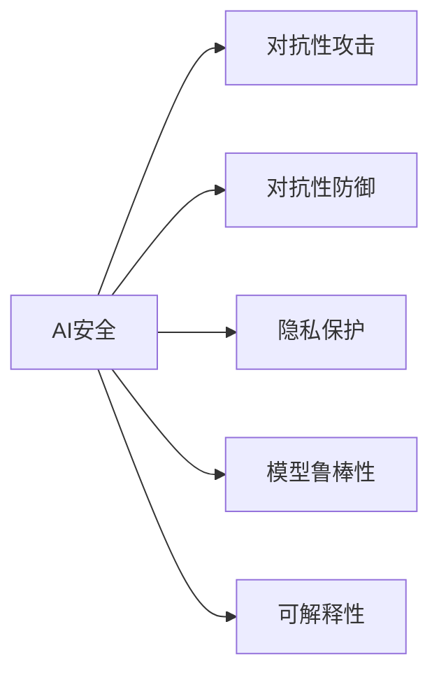

# AI Security原理与代码实例讲解

## 1. 背景介绍
随着人工智能技术的飞速发展，AI系统已广泛应用于各行各业，从金融风控到智能监控，从医疗诊断到自动驾驶。然而，这些系统的安全性问题也日益凸显，如何确保AI系统的安全、可靠和公正，已成为业界和学术界共同关注的焦点。AI安全不仅涉及数据和模型的安全性，还包括系统的鲁棒性、透明度和可解释性。本文将深入探讨AI安全的核心原理，并通过代码实例详细讲解如何构建和评估安全的AI系统。

## 2. 核心概念与联系
AI安全领域涉及的核心概念包括但不限于对抗性攻击、对抗性防御、隐私保护、模型鲁棒性和可解释性。对抗性攻击是指通过精心设计的输入来欺骗AI模型，而对抗性防御则是指采取措施减轻这些攻击的影响。隐私保护关注于在数据分析和模型训练过程中保护个人隐私。模型鲁棒性是指模型对输入扰动的抵抗能力，而可解释性则是指对AI模型的决策过程进行解释和理解。



## 3. 核心算法原理具体操作步骤
在AI安全中，核心算法原理包括对抗性样本生成、防御机制设计、差分隐私、同态加密等。对抗性样本生成的操作步骤通常包括选择目标模型、定义攻击算法（如FGSM、PGD等）、生成对抗性样本、评估攻击效果。防御机制设计则包括数据增强、模型正则化、对抗性训练等步骤。

## 4. 数学模型和公式详细讲解举例说明
以对抗性样本生成为例，我们可以使用快速梯度符号方法（FGSM）来生成对抗性样本。给定一个模型 $f$，输入 $x$ 和对应的标签 $y$，FGSM的目标是生成一个对抗性样本 $x'$，使得 $f(x') \neq y$。数学公式如下：

$$
x' = x + \epsilon \cdot \text{sign}(\nabla_x J(\theta, x, y))
$$

其中，$\epsilon$ 是一个小常数，$\nabla_x J(\theta, x, y)$ 是损失函数 $J$ 关于输入 $x$ 的梯度，$\text{sign}()$ 函数返回梯度的符号。

## 5. 项目实践：代码实例和详细解释说明
以TensorFlow为例，我们可以实现一个简单的FGSM攻击：

```python
import tensorflow as tf

def fgsm_attack(model, x, y, epsilon=0.01):
    with tf.GradientTape() as tape:
        tape.watch(x)
        prediction = model(x)
        loss = tf.keras.losses.sparse_categorical_crossentropy(y, prediction)
    gradient = tape.gradient(loss, x)
    signed_grad = tf.sign(gradient)
    x_adv = x + epsilon * signed_grad
    return x_adv
```

这段代码首先定义了一个攻击函数`fgsm_attack`，它接受一个模型`model`、输入数据`x`、标签`y`和攻击强度`epsilon`。函数使用`tf.GradientTape`来计算损失函数关于输入的梯度，然后生成对抗性样本并返回。

## 6. 实际应用场景
AI安全技术在金融欺诈检测、生物识别系统、自动驾驶车辆等领域有着广泛的应用。例如，在金融欺诈检测中，可以通过对抗性训练提高模型的鲁棒性，以抵御恶意攻击；在生物识别系统中，可以采用隐私保护技术来保护用户的生物特征数据。

## 7. 工具和资源推荐
为了更好地进行AI安全研究和实践，以下是一些推荐的工具和资源：
- TensorFlow和PyTorch：两个流行的深度学习框架，支持对抗性攻击和防御的实现。
- CleverHans：一个专注于对抗性机器学习的开源库。
- OpenAI Gym：一个用于开发和比较强化学习算法的工具包，也可用于对抗性攻击的研究。

## 8. 总结：未来发展趋势与挑战
AI安全领域仍然面临许多挑战，如对抗性攻击的不断进化、隐私保护与数据效用的平衡、模型可解释性的提高等。未来的发展趋势可能包括更加智能的防御机制、隐私保护技术的进步以及可解释AI的标准化。

## 9. 附录：常见问题与解答
Q1: 对抗性攻击是否只针对深度学习模型？
A1: 不是，对抗性攻击可以针对任何机器学习模型，但深度学习模型由于其复杂性，更容易受到此类攻击的影响。

Q2: 如何评估AI安全性？
A2: 可以通过多种方式评估AI安全性，包括对抗性样本检测、模型鲁棒性测试、隐私泄露风险评估等。

Q3: AI安全研究的主要困难是什么？
A3: 主要困难包括对抗性攻击的多样性和复杂性、有效防御机制的缺乏、以及隐私保护与模型性能之间的权衡。

作者：禅与计算机程序设计艺术 / Zen and the Art of Computer Programming