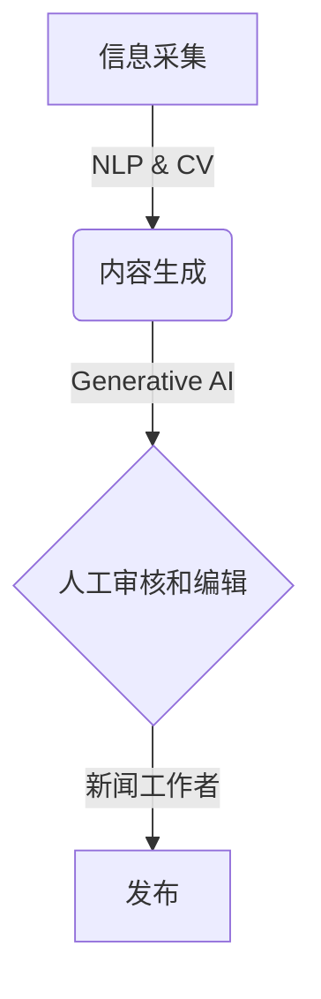

# AIGC从入门到实战：AI 赋能新闻创作，提升新闻资讯的时效性

## 1. 背景介绍

### 1.1 新闻行业的挑战

在当今快节奏的信息时代，新闻行业面临着巨大的挑战。读者期望获得及时、准确和深入的报道,但传统的新闻创作流程往往效率低下,无法满足这一需求。新闻工作者不仅需要快速采集和处理大量信息,还需要在有限的时间内撰写高质量的报道。

### 1.2 人工智能在新闻创作中的作用

人工智能(AI)技术的发展为新闻创作带来了新的机遇。通过利用自然语言处理(NLP)、计算机视觉(CV)和生成式人工智能(Generative AI)等技术,可以显著提高新闻创作的效率和质量。AI可以自动化部分繁重的任务,如信息采集、内容生成和编辑,从而为新闻工作者腾出更多时间专注于深度报道和分析。

### 1.3 AIGC(AI Generated Content)概念

AIGC(AI Generated Content)是指利用人工智能技术自动生成的内容,包括文本、图像、视频等多种形式。在新闻创作领域,AIGC可以用于生成新闻标题、摘要、报道初稿等,大大缩短了内容创作的时间。

## 2. 核心概念与联系

### 2.1 自然语言处理(NLP)

自然语言处理(NLP)是人工智能的一个重要分支,旨在使计算机能够理解和生成人类语言。在新闻创作中,NLP技术可以用于以下任务:

- 信息抽取:从大量文本数据中提取关键信息,如人物、地点、事件等。
- 文本摘要:自动生成文章的摘要,帮助读者快速了解核心内容。
- 文本生成:根据给定的主题或outline,自动生成新闻报道的初稿。

### 2.2 计算机视觉(CV)

计算机视觉(CV)是人工智能的另一个重要分支,旨在使计算机能够理解和处理图像和视频数据。在新闻创作中,CV技术可以用于以下任务:

- 图像识别:识别图像中的人物、场景、物体等信息。
- 视频分析:从视频中提取关键帧、识别事件等。
- 图像/视频生成:根据文本描述生成相应的图像或视频。

### 2.3 生成式人工智能(Generative AI)

生成式人工智能(Generative AI)是一种能够生成新的、原创性的内容的人工智能技术。在新闻创作中,Generative AI可以用于以下任务:

- 文本生成:根据给定的主题或outline,生成新闻报道的初稿。
- 图像/视频生成:根据文本描述生成相应的图像或视频。
- 创意辅助:为新闻工作者提供创意灵感和内容建议。

### 2.4 AIGC工作流程

将上述技术结合起来,AIGC在新闻创作中的工作流程可以概括为:

1. 信息采集:利用NLP和CV技术从各种来源采集相关信息。
2. 内容生成:利用Generative AI技术根据采集的信息生成新闻报道的初稿。
3. 人工审核和编辑:新闻工作者审核和编辑AI生成的内容,确保质量和准确性。
4. 发布:将最终的新闻报道发布到各个渠道。

## 3. 核心算法原理具体操作步骤

### 3.1 自然语言处理(NLP)算法

#### 3.1.1 信息抽取

信息抽取是NLP的一个核心任务,旨在从非结构化的文本数据中提取出结构化的信息。常用的信息抽取算法包括:

1. **基于规则的方法**:根据预定义的模式和规则来识别和提取信息。
2. **基于统计的方法**:利用大量标注数据训练统计模型,从而自动学习提取规则。
3. **基于深度学习的方法**:利用神经网络模型,如BERT、GPT等,直接从文本中提取信息。

信息抽取的具体操作步骤如下:

1. 数据预处理:对原始文本进行分词、词性标注、命名实体识别等预处理。
2. 特征提取:根据任务需求,从预处理后的文本中提取相关的特征,如词袋(Bag of Words)、N-gram等。
3. 模型训练:利用标注数据,训练信息抽取模型。
4. 模型预测:将训练好的模型应用于新的文本数据,提取出所需的信息。

#### 3.1.2 文本摘要

文本摘要是将长文本压缩为简短的摘要,保留文本的核心内容。常用的文本摘要算法包括:

1. **提取式摘要**:从原文中提取出一些重要的句子或段落作为摘要。
2. **生成式摘要**:利用NLP技术,根据原文生成全新的摘要语句。

文本摘要的具体操作步骤如下:

1. 数据预处理:对原始文本进行分词、词性标注等预处理。
2. 特征提取:提取文本的关键词、句子重要性等特征。
3. 摘要生成:
   - 提取式摘要:根据特征选取重要的句子或段落作为摘要。
   - 生成式摘要:利用序列到序列(Seq2Seq)模型,将原文编码为向量,再解码生成摘要语句。
4. 摘要优化:对生成的摘要进行长度控制、去重、语言流畅性优化等处理。

#### 3.1.3 文本生成

文本生成是指根据给定的主题或outline,自动生成相关的文本内容。常用的文本生成算法包括:

1. **基于模板的方法**:根据预定义的模板和规则生成文本。
2. **基于统计的方法**:利用N-gram、马尔可夫链等统计模型生成文本。
3. **基于深度学习的方法**:利用序列到序列(Seq2Seq)模型、生成式对抗网络(GAN)等深度学习模型生成文本。

文本生成的具体操作步骤如下:

1. 数据预处理:对训练数据进行分词、词性标注等预处理。
2. 模型训练:
   - 基于模板的方法:定义模板和规则。
   - 基于统计的方法:基于训练数据估计N-gram概率或马尔可夫链转移概率。
   - 基于深度学习的方法:利用编码器-解码器(Encoder-Decoder)架构,将输入编码为向量,再解码生成输出文本。
3. 文本生成:将训练好的模型应用于新的输入,生成相应的文本内容。
4. 文本优化:对生成的文本进行语法纠错、语义优化等处理,提高文本质量。

### 3.2 计算机视觉(CV)算法

#### 3.2.1 图像识别

图像识别是CV的一个核心任务,旨在从图像中识别出物体、场景、人物等信息。常用的图像识别算法包括:

1. **基于特征的方法**:提取图像的特征描述子(如SIFT、HOG等),然后进行匹配和分类。
2. **基于深度学习的方法**:利用卷积神经网络(CNN)等深度学习模型,直接从图像像素数据中学习特征并进行分类。

图像识别的具体操作步骤如下:

1. 数据预处理:对图像进行归一化、数据增强等预处理。
2. 模型训练:
   - 基于特征的方法:提取图像特征描述子,训练分类器(如SVM、随机森林等)。
   - 基于深度学习的方法:利用标注数据,训练CNN等深度神经网络模型。
3. 模型预测:将训练好的模型应用于新的图像数据,识别出物体、场景等信息。

#### 3.2.2 视频分析

视频分析是从视频数据中提取有用信息的过程,包括运动目标检测、行为识别等任务。常用的视频分析算法包括:

1. **基于背景建模的方法**:建立背景模型,检测与背景不同的前景运动目标。
2. **基于光流的方法**:利用光流估计运动轨迹,进行目标跟踪和行为识别。
3. **基于深度学习的方法**:利用3D卷积神经网络(3D CNN)或长短期记忆网络(LSTM)等模型,直接从视频数据中学习特征并进行分析。

视频