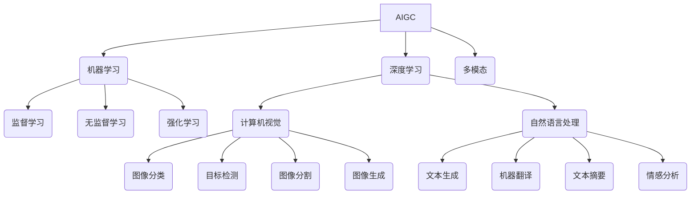

# AIGC从入门到实战：AIGC的发展历程

## 1.背景介绍

### 1.1 什么是AIGC?

AIGC(Artificial Intelligence Generated Content)是人工智能生成内容的简称,指通过人工智能技术自动生成文本、图像、音频、视频等多种形式的内容。近年来,AIGC技术取得了长足进步,在各行业得到了广泛应用,正在改变人类创作和交流的方式。

### 1.2 AIGC的重要性

AIGC技术可以大幅提高内容生产效率,降低成本,让普通用户也能创作出高质量内容。它在营销、教育、娱乐、客户服务等领域发挥着重要作用。随着技术进步,AIGC将对社会产生深远影响。

## 2.核心概念与联系

### 2.1 机器学习

机器学习是AIGC的核心技术,通过对大量数据的训练,让计算机具备自动学习和建模的能力。常用算法包括:

- 监督学习(Supervised Learning)
- 无监督学习(Unsupervised Learning)  
- 强化学习(Reinforcement Learning)

### 2.2 深度学习

深度学习是机器学习的一个分支,它通过构建深层神经网络模型,从大量数据中自动学习特征表示,在计算机视觉、自然语言处理等领域表现出色。

### 2.3 自然语言处理(NLP)

NLP是AIGC中生成文本内容的关键技术,包括文本生成、机器翻译、文本摘要、情感分析等任务。主要模型有:

- 循环神经网络(RNN)
- transformer
- GPT
- BERT

### 2.4 计算机视觉(CV)

CV技术用于生成和处理图像、视频等视觉内容,主要包括图像分类、目标检测、图像分割、图像生成等任务。

### 2.5 多模态

多模态技术整合文本、图像、音频等不同模态的信息,实现跨模态的内容理解和生成,是AIGC发展的重要方向。



## 3.核心算法原理具体操作步骤

### 3.1 自然语言生成

自然语言生成是AIGC中最常见的任务,通过语言模型生成自然流畅的文本内容。主要分为以下步骤:

1. **数据预处理**: 对训练语料进行清洗、分词、构建词表等预处理。

2. **模型训练**: 使用神经网络模型(如RNN、Transformer等)对语料进行训练,学习文本的语义和语法规则。

3. **文本生成**: 给定起始词或主题,模型根据上下文信息逐字生成新的文本。

4. **后处理**: 对生成结果进行长度控制、重复过滤、拼写检查等处理,提高质量。

5. **人工审核**: 人工审阅生成内容,对低质量内容进行修改或过滤。

### 3.2 图像生成

图像生成技术可以根据文本描述或样本图像,生成新的高质量图像。主要步骤包括:

1. **数据准备**: 收集大量高质量的图像-文本配对数据集。

2. **模型训练**: 使用生成对抗网络(GAN)、变分自编码器(VAE)等模型,学习图像和文本的映射关系。

3. **图像生成**: 给定文本描述或样本图像,模型生成符合要求的新图像。

4. **优化细节**: 通过损失函数设计、模型结构改进等方法,提高生成图像的质量和多样性。

### 3.3 多模态生成

多模态生成技术可以同时生成多种形式(文本、图像、音频等)的内容,实现跨模态的内容创作。主要步骤为:

1. **多模态编码**: 将不同模态的输入数据编码为共享的语义空间表示。

2. **跨模态关联建模**: 学习不同模态之间的语义关联,构建统一的多模态表示。

3. **条件生成**: 给定一种模态的输入,根据学习到的跨模态关联,生成其他模态的内容。

4. **模态融合**: 将生成的多模态内容进行融合,形成多模态输出。

## 4.数学模型和公式详细讲解举例说明

### 4.1 自然语言生成模型

自然语言生成常用的是基于序列的生成模型,核心是根据上下文信息预测下一个词的概率分布。给定词序列$S=(x_1,x_2,...,x_T)$,目标是最大化生成序列的条件概率:

$$P(S)=\prod_{t=1}^{T}P(x_t|x_1,...,x_{t-1})$$

其中$P(x_t|x_1,...,x_{t-1})$可以由神经网络模型计算得到。

以Transformer为例,其基于Self-Attention机制对输入序列编码,生成过程如下:

$$\begin{align*}
h_0 &= \text{SourceEmbeddings} \\
h_l &= \text{TransformerBlock}(h_{l-1}), \quad \text{for } l=1...N \\
P(x_t|x_1...x_{t-1}) &= \text{SoftMax}(h_N)
\end{align*}$$

其中$h_0$为源数据的embedding表示,$h_l$为第$l$层Transformer的输出,通过$N$层的计算得到最终的概率分布。

### 4.2 生成对抗网络(GAN)

GAN是一种用于生成式建模的框架,包括生成器(Generator)和判别器(Discriminator)两个对抗模型:

- 生成器G: 将噪声$z$映射到数据空间,生成假数据$G(z)$
- 判别器D: 判断输入数据是真实数据还是生成数据

生成器和判别器相互对抗,目标是找到一个Nash均衡,使得生成数据$G(z)$无法被判别器D识别为假数据。

对于生成器和判别器的损失函数,可以定义为:

$$\begin{align*}
\min\limits_G \max\limits_D V(D,G) &= \mathbb{E}_{x\sim p_\text{data}(x)}[\log D(x)] + \mathbb{E}_{z\sim p_z(z)}[\log(1-D(G(z)))] \\
&= \mathbb{E}_{x\sim p_\text{data}(x)}[\log D(x)] + \mathbb{E}_{x\sim p_g}[\log(1-D(x))]
\end{align*}$$

其中$p_\text{data}$为真实数据分布,$p_g$为生成数据分布,$p_z$为噪声先验分布。

通过交替优化生成器G和判别器D,可以逐步提高生成数据的质量,最终达到无法被判别的效果。

### 4.3 变分自编码器(VAE)

VAE是一种基于深度学习的生成模型,可以学习数据的潜在表示并生成新的样本。它的基本思想是:

1. 将高维观测数据$x$编码为低维潜在变量$z$的分布$q_\phi(z|x)$
2. 从潜在变量$z$的分布$p_\theta(z)$中采样,解码生成新数据$\hat{x}=p_\theta(x|z)$

VAE的损失函数由两部分组成:

$$\mathcal{L}(\theta,\phi;x) = -\mathbb{E}_{q_\phi(z|x)}[\log p_\theta(x|z)] + D_\text{KL}(q_\phi(z|x)||p(z))$$

第一项是重构损失,第二项是KL散度,作为正则化约束潜在分布$q_\phi(z|x)$接近先验分布$p(z)$。

通过优化损失函数,VAE可以学习数据的紧凑表示,并生成新的样本。

## 5.项目实践:代码实例和详细解释说明

这里给出一个使用Transformer进行文本生成的PyTorch实现示例:

```python
import torch
import torch.nn as nn

class TransformerEncoder(nn.Module):
    # Transformer Encoder模块实现
    ...

class TransformerDecoder(nn.Module):
    # Transformer Decoder模块实现  
    ...

class Transformer(nn.Module):
    def __init__(self, src_vocab_size, tgt_vocab_size, ...):
        super().__init__()
        self.encoder = TransformerEncoder(...)
        self.decoder = TransformerDecoder(...)
        
    def forward(self, src, tgt, ...):
        enc_output = self.encoder(src, ...)
        dec_output = self.decoder(tgt, enc_output, ...)
        return dec_output
        
# 训练
model = Transformer(src_vocab_size, tgt_vocab_size, ...)
criterion = nn.CrossEntropyLoss()
optimizer = torch.optim.Adam(model.parameters(), ...)

for epoch in range(num_epochs):
    for src, tgt in data_loader:
        optimizer.zero_grad()
        output = model(src, tgt, ...)
        loss = criterion(output.view(-1, tgt_vocab_size), tgt.view(-1))
        loss.backward()
        optimizer.step()
        
# 生成
model.eval()
src = ... # 输入序列
output_ids = model.generate(src, max_length=100, ...)
output_text = tokenizer.decode(output_ids, skip_special_tokens=True)
```

上述代码实现了一个基本的Transformer模型用于序列到序列的任务,包括编码器(EncoderLayer)、解码器(DecoderLayer)和注意力机制(MultiHeadAttention)等核心模块。

在训练阶段,将源序列src和目标序列tgt输入模型,计算输出与目标序列的交叉熵损失,并通过反向传播优化模型参数。

在生成阶段,给定输入序列src,模型将自回归地生成输出序列,通过topk采样或beam search等策略来控制生成质量。

以上是一个简化的实现,实际应用中还需要考虑注意力掩码、位置编码、梯度裁剪等细节,并根据任务需求进行调整和优化。

## 6.实际应用场景

AIGC技术在诸多领域得到了广泛应用,下面列举一些典型场景:

### 6.1 内容创作

- 新闻自动撰写
- 营销文案生成
- 故事情节创作
- 产品描述生成

### 6.2 教育领域

- 自动问答系统
- 个性化学习资料生成
- 教育辅助chatbot
- 试题自动生成

### 6.3 客户服务

- 智能客服对话
- 个性化推荐系统
- 知识库问答

### 6.4 金融行业

- 财经新闻自动生成
- 投资报告自动撰写
- 量化交易策略生成

### 6.5 医疗健康

- 病例报告自动生成
- 个性化健康建议
- 药物说明书创作

### 6.6 娱乐媒体

- 游戏剧情创作
- 音乐作品生成
- 影视剧本创作
- 虚拟影像渲染

## 7.工具和资源推荐

### 7.1 开源框架

- TensorFlow/PyTorch: 主流深度学习框架
- Hugging Face Transformers: 提供多种预训练语言模型
- OpenAI Whisper: 领先的语音识别模型
- StableDiffusion: 开源的文本到图像生成模型

### 7.2 云服务

- OpenAI GPT-3: 大型语言模型服务
- Google Cloud AI: 提供多种AI服务
- AWS AI服务: 如Amazon Polly语音合成
- 百度文心大模型: 支持多模态生成

### 7.3 数据集

- CommonCrawl: 大规模网页文本数据
- Conceptual Captions: 图像描述数据集
- LibriSpeech: 语音识别数据集
- Multi-Modal datasets: 如LAION,COYO等

### 7.4 教程资源

- OpenAI Cookbook: GPT-3使用指南
- Coursera/Edx: 人工智能相关课程
- Papers With Code: 论文开源实现集锦
- Hugging Face Course: 自然语言处理教程

## 8.总结:未来发展趋势与挑战

### 8.1 发展趋势

- 模型规模持续增长,计算能力不断提高
- 多模态融合