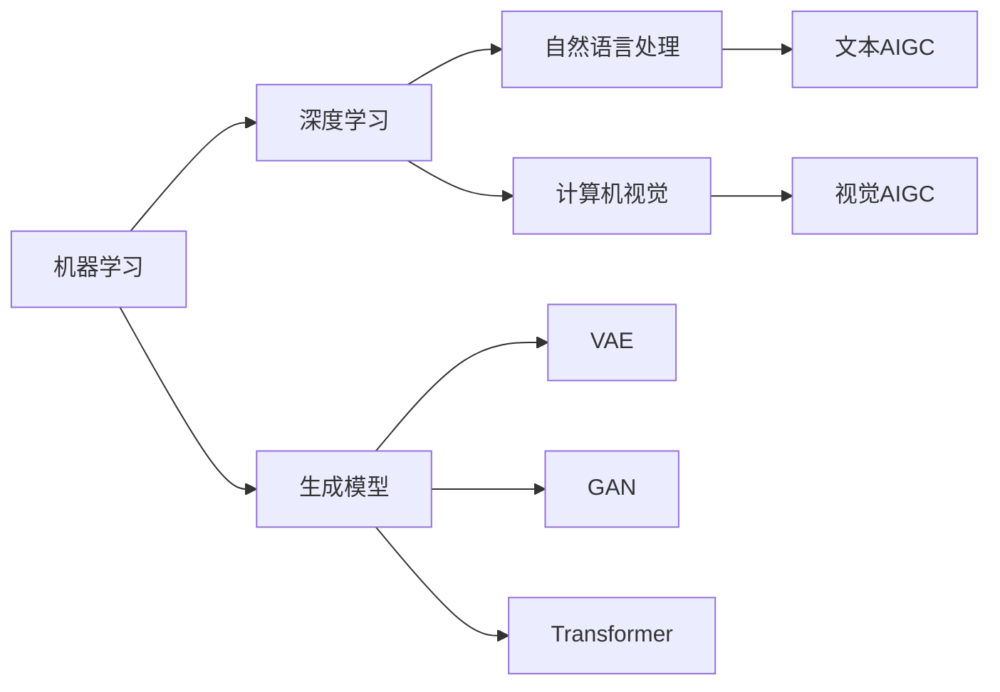

# AIGC从入门到实战：AIGC 相关资源推荐

## 1. 背景介绍
### 1.1 AIGC的定义与内涵
AIGC（AI-Generated Content，人工智能生成内容）是指利用人工智能技术自动生成各种类型内容的技术，包括文本、图像、音频、视频等。AIGC技术的核心是利用机器学习和深度学习算法，通过学习和分析大量的数据，自动生成高质量、个性化的内容。

### 1.2 AIGC的发展历程
AIGC技术的发展可以追溯到上世纪50年代的图灵测试，但真正的突破是在2014年，伊恩·古德费洛提出了生成对抗网络（GAN）的概念。近年来，随着深度学习技术的不断进步，以及计算能力和数据规模的大幅提升，AIGC技术取得了长足发展，涌现出了一大批优秀的AIGC应用，如GPT-3、DALL-E、Midjourney等。

### 1.3 AIGC的应用前景
AIGC技术具有广阔的应用前景，可以应用于内容创作、教育培训、游戏娱乐、智能客服等诸多领域。AIGC可以大幅提高内容生产效率，降低内容创作成本，同时提供更加个性化、多样化的内容体验。未来，AIGC技术将与虚拟现实、增强现实等技术深度融合，带来更加沉浸式、交互式的内容体验。

## 2. 核心概念与联系
### 2.1 机器学习与深度学习
AIGC技术的核心是机器学习和深度学习算法。机器学习是一种让计算机系统从数据中自主学习的方法，通过学习数据中的模式和规律，自动优化算法的性能。深度学习是机器学习的一个分支，利用多层神经网络模拟人脑的学习过程，可以自动学习数据的高层特征。

### 2.2 自然语言处理与计算机视觉
AIGC技术涉及两大核心技术领域：自然语言处理（NLP）和计算机视觉（CV）。NLP技术可以让计算机理解、分析和生成人类语言，是实现文本AIGC的关键。CV技术可以让计算机理解和分析视觉信息，如图像和视频，是实现视觉AIGC的基础。

### 2.3 生成模型与判别模型  
AIGC技术的核心是生成模型，与之相对的是判别模型。判别模型主要用于分类和预测任务，如图像分类、情感分析等；而生成模型则主要用于生成任务，如文本生成、图像生成等。常见的生成模型包括VAE、GAN、Transformer等。



## 3. 核心算法原理与操作步骤
### 3.1 生成对抗网络（GAN）
GAN由生成器和判别器两部分组成，生成器负责生成假样本，判别器负责判断样本的真假。两者在训练过程中不断博弈，最终达到纳什均衡，生成器可以生成以假乱真的样本。GAN的训练步骤如下：

1. 初始化生成器和判别器的参数
2. 固定生成器，训练判别器，最小化判别器的损失函数
3. 固定判别器，训练生成器，最小化生成器的损失函数
4. 重复步骤2-3，直到模型收敛

### 3.2 Transformer
Transformer是一种基于自注意力机制的神经网络架构，广泛应用于NLP任务。Transformer由编码器和解码器两部分组成，编码器负责对输入序列进行编码，解码器负责根据编码结果生成输出序列。Transformer的训练步骤如下：

1. 对输入序列进行嵌入（Embedding）和位置编码（Positional Encoding）
2. 将嵌入后的序列输入编码器，经过多层自注意力和前馈神经网络，得到编码结果
3. 将编码结果输入解码器，经过多层自注意力、编码-解码注意力和前馈神经网络，得到输出序列
4. 计算损失函数，反向传播更新模型参数

### 3.3 扩散模型（Diffusion Model）
扩散模型是一种基于马尔可夫链的生成模型，通过逐步向数据分布添加噪声，然后学习逆转这个过程来生成数据。扩散模型的训练步骤如下：

1. 定义前向扩散过程，即数据分布逐步添加高斯噪声的过程
2. 定义反向扩散过程，即从纯高斯噪声开始，逐步去除噪声并生成数据的过程
3. 训练一个神经网络来估计每一步去噪过程中的噪声，使其与真实噪声尽可能接近
4. 在推理阶段，从纯高斯噪声开始，使用训练好的神经网络逐步去噪，最终生成数据样本

## 4. 数学模型与公式详解
### 4.1 GAN的数学模型
GAN的目标是学习数据分布 $p_{data}(x)$，生成器 $G$ 将随机噪声 $z$ 映射为生成样本 $G(z)$，判别器 $D$ 判断样本的真假。GAN的目标函数可以表示为：

$$\min_G \max_D V(D,G) = \mathbb{E}_{x \sim p_{data}(x)}[\log D(x)] + \mathbb{E}_{z \sim p_z(z)}[\log (1-D(G(z)))]$$

其中，$p_z(z)$ 是随机噪声的分布，通常为高斯分布或均匀分布。

### 4.2 Transformer的数学模型 
Transformer的核心是自注意力机制（Self-Attention），可以捕捉序列中任意两个位置之间的依赖关系。自注意力的计算公式为：

$$Attention(Q,K,V) = softmax(\frac{QK^T}{\sqrt{d_k}})V$$

其中，$Q$、$K$、$V$ 分别表示查询（Query）、键（Key）、值（Value），$d_k$ 是键的维度。

Transformer中还使用了多头注意力（Multi-Head Attention），将 $Q$、$K$、$V$ 通过线性变换映射到多个子空间，并行计算多个注意力头，然后拼接并再次线性变换：

$$MultiHead(Q,K,V) = Concat(head_1,...,head_h)W^O$$
$$head_i = Attention(QW_i^Q, KW_i^K, VW_i^V)$$

其中，$W_i^Q$、$W_i^K$、$W_i^V$、$W^O$ 是可学习的参数矩阵。

### 4.3 扩散模型的数学模型
扩散模型定义了一个前向扩散过程，将数据分布 $q(x_0)$ 通过 $T$ 步高斯噪声逐步破坏：

$$q(x_t|x_{t-1}) = \mathcal{N}(x_t; \sqrt{1-\beta_t} x_{t-1}, \beta_t \mathbf{I})$$

其中，$\beta_t$ 是噪声系数，控制每一步添加的噪声量。

反向扩散过程从纯高斯噪声 $p(x_T) = \mathcal{N}(0,\mathbf{I})$ 开始，逐步去噪并生成数据：

$$p_\theta(x_{t-1}|x_t) = \mathcal{N}(x_{t-1}; \mu_\theta(x_t, t), \Sigma_\theta(x_t, t))$$

其中，$\mu_\theta$、$\Sigma_\theta$ 是神经网络估计的均值和方差。

训练的目标是最小化前向扩散过程和反向扩散过程的KL散度：

$$L_{diffusion} = \mathbb{E}_{q(x_0)}\mathbb{E}_{q(x_1,...,x_T|x_0)} [\sum_{t=1}^T D_{KL}(q(x_{t-1}|x_t,x_0)||p_\theta(x_{t-1}|x_t))]$$

## 5. 项目实践：代码实例与详解
下面以PyTorch为例，给出GAN、Transformer和扩散模型的简要代码实现。

### 5.1 GAN的代码实例
```python
import torch
import torch.nn as nn

class Generator(nn.Module):
    def __init__(self):
        super(Generator, self).__init__()
        self.main = nn.Sequential(
            nn.Linear(100, 256), 
            nn.ReLU(),
            nn.Linear(256, 512),
            nn.ReLU(), 
            nn.Linear(512, 784),
            nn.Tanh()
        )

    def forward(self, z):
        return self.main(z)

class Discriminator(nn.Module):
    def __init__(self):
        super(Discriminator, self).__init__()
        self.main = nn.Sequential(
            nn.Linear(784, 512),
            nn.ReLU(),
            nn.Linear(512, 256),
            nn.ReLU(),
            nn.Linear(256, 1),
            nn.Sigmoid()
        )

    def forward(self, x):
        return self.main(x)

# 初始化生成器和判别器
generator = Generator()
discriminator = Discriminator()

# 定义优化器
g_optimizer = torch.optim.Adam(generator.parameters(), lr=0.0002)
d_optimizer = torch.optim.Adam(discriminator.parameters(), lr=0.0002)

# 训练循环
for epoch in range(num_epochs):
    for i, (imgs, _) in enumerate(dataloader):
        # 训练判别器
        real_imgs = imgs.view(imgs.size(0), -1)
        z = torch.randn(imgs.shape[0], 100)
        fake_imgs = generator(z)
        real_outputs = discriminator(real_imgs)
        fake_outputs = discriminator(fake_imgs)
        d_loss = -torch.mean(torch.log(real_outputs) + torch.log(1 - fake_outputs))
        d_optimizer.zero_grad()
        d_loss.backward()
        d_optimizer.step()

        # 训练生成器
        z = torch.randn(imgs.shape[0], 100)
        fake_imgs = generator(z)
        fake_outputs = discriminator(fake_imgs)
        g_loss = -torch.mean(torch.log(fake_outputs))
        g_optimizer.zero_grad()
        g_loss.backward()
        g_optimizer.step()
```

### 5.2 Transformer的代码实例
```python
import torch
import torch.nn as nn

class SelfAttention(nn.Module):
    def __init__(self, embed_size, heads):
        super(SelfAttention, self).__init__()
        self.embed_size = embed_size
        self.heads = heads
        self.head_dim = embed_size // heads
        
        self.values = nn.Linear(self.head_dim, self.head_dim, bias=False)
        self.keys = nn.Linear(self.head_dim, self.head_dim, bias=False)
        self.queries = nn.Linear(self.head_dim, self.head_dim, bias=False)
        self.fc_out = nn.Linear(heads * self.head_dim, embed_size)
    
    def forward(self, values, keys, query):
        N = query.shape[0]
        value_len, key_len, query_len = values.shape[1], keys.shape[1], query.shape[1]
        
        values = values.reshape(N, value_len, self.heads, self.head_dim)
        keys = keys.reshape(N, key_len, self.heads, self.head_dim)
        queries = query.reshape(N, query_len, self.heads, self.head_dim)
        
        values = self.values(values)
        keys = self.keys(keys)        
        queries = self.queries(queries)
        
        energy = torch.einsum("nqhd,nkhd->nhqk", [queries, keys])
        attention = torch.softmax(energy / (self.embed_size ** (1/2)), dim=3) 
        
        out = torch.einsum("nhql,nlhd->nqhd", [attention, values]).reshape(
            N, query_len, self.heads * self.head_dim
        )
        
        out = self.fc_out(out)
        return out

class TransformerBlock(nn.Module):
    def __init__(self, embed_size, heads, dropout, forward_expansion):
        super(TransformerBlock, self).__init__()
        self.attention = SelfAttention(embed_size, heads)
        self.norm1 = nn.LayerNorm(embed_size)
        self.norm2 = nn.LayerNorm(embed_size)

        self.feed_forward = nn.Sequential(
            nn.Linear(embed_size, forward_expansion * embed_size),
            nn.ReLU(),
            nn.Linear(forward_expansion * embed_size, embed_size),
        )
        self.dropout = nn.Dropout(dropout)

    def forward(self, value, key, query):
        attention = self.attention(value, key, query)

        x = self.dropout(self.norm1(attention + query))
        forward = self.feed_forward(x)
        out = self.dropout(self.norm2(forward +